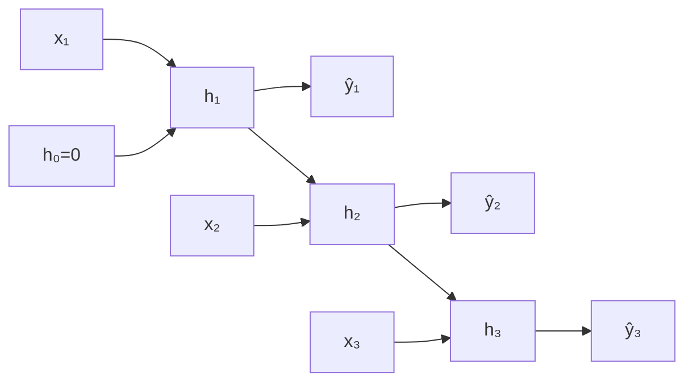
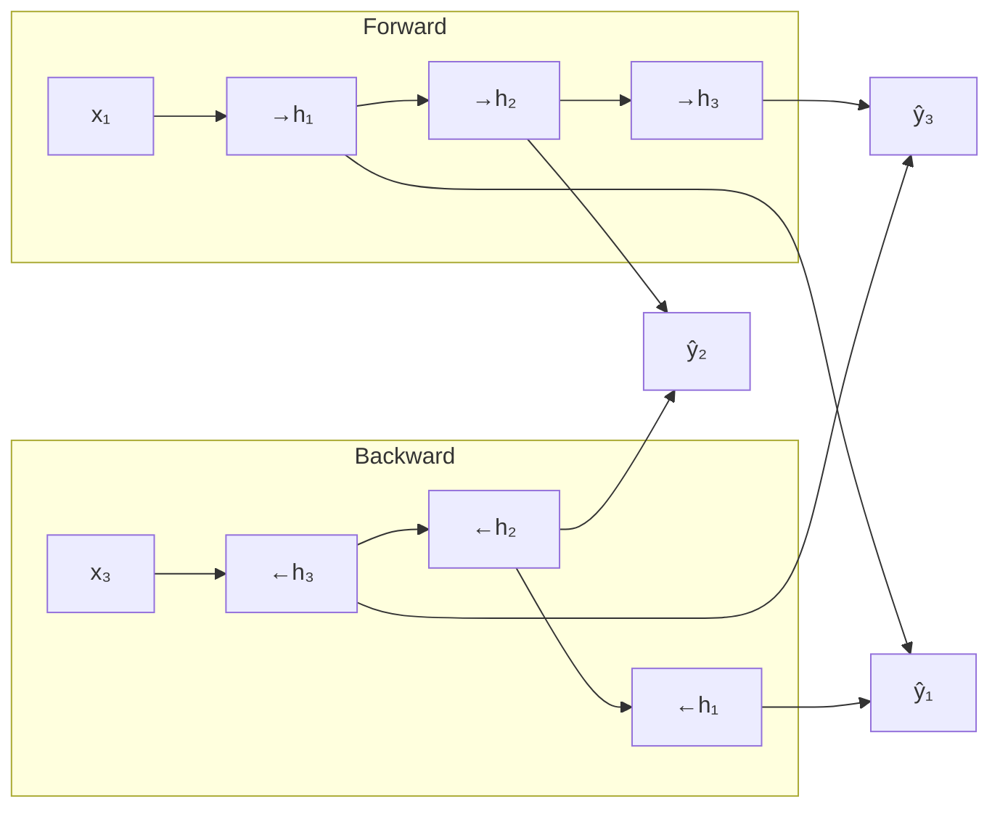
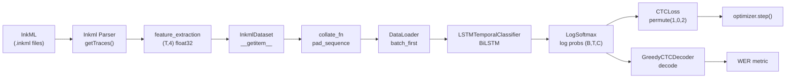

# 🧠 AI Final Exam — Complete Cheatsheet
> 50 MCQ, Open Book. This note covers everything from zero to ace.

---

## 📦 PART 1: NumPy

### 1.1 Shape & Axis

```python
import numpy as np

a = np.array([[1, 2, 3],
              [4, 5, 6]])      # shape (2, 3)

a.shape    # → (2, 3)   — (rows, cols) = (axis0, axis1)
a.ndim     # → 2
a.size     # → 6
```

> [!tip] Axis = "which dimension to collapse"
> - `axis=0` → collapse **rows** (operate **down** columns)
> - `axis=1` → collapse **cols** (operate **across** rows)

```python
a.sum(axis=0)   # → [5, 7, 9]   — sum each column
a.sum(axis=1)   # → [6, 15]     — sum each row
a.sum()         # → 21          — sum everything
```

---

### 1.2 Reshape

```python
a = np.arange(12)          # [0,1,...,11]
a.reshape(3, 4)            # 3 rows × 4 cols
a.reshape(2, 6)
a.reshape(2, 2, 3)         # 3D: shape (2,2,3)
a.reshape(-1)              # flatten to 1D
a.reshape(3, -1)           # 3 rows, auto cols → (3,4)
a.flatten()                # always returns copy
a.ravel()                  # returns view when possible
```

> [!warning] Rule: total number of elements must stay the same!
> `(12,)` → can reshape to `(3,4)`, `(2,6)`, `(2,2,3)` — all have 12 elements.

---

### 1.3 Transpose

```python
a = np.array([[1,2,3],[4,5,6]])   # shape (2,3)
a.T               # shape (3,2) — rows become cols
a.transpose()     # same as .T for 2D

# 3D example
b = np.zeros((2, 3, 4))
b.transpose(2, 0, 1)   # shape → (4, 2, 3)  — reorder axes
```

> [!note] `.T` swaps all axis order. For 2D: (rows, cols) → (cols, rows).

---

### 1.4 Element-wise Operations

```python
a = np.array([1, 2, 3])
b = np.array([10, 20, 30])

a + b    # [11, 22, 33]
a * b    # [10, 40, 90]
a ** 2   # [1, 4, 9]
a / b    # [0.1, 0.1, 0.1]
np.sqrt(a)           # [1.0, 1.414, 1.732]
np.exp(a)            # e^1, e^2, e^3
np.log(a)            # natural log
```

> [!tip] "Element-wise" = same-position elements pair up. Shape must match (or be broadcastable).

---

### 1.5 Indexing

#### Basic Indexing
```python
a = np.array([[10, 20, 30],
              [40, 50, 60]])

a[0]        # [10, 20, 30]  — first row
a[1, 2]     # 60            — row 1, col 2
a[:, 1]     # [20, 50]      — all rows, col 1
a[0:2, 1:]  # [[20,30],[50,60]]
```

#### Index by Array (Fancy Indexing)
```python
a = np.array([100, 200, 300, 400, 500])
idx = np.array([0, 2, 4])
a[idx]       # [100, 300, 500]  — pick elements at positions 0,2,4

# 2D fancy indexing
mat = np.arange(12).reshape(3, 4)
rows = [0, 2]
cols = [1, 3]
mat[rows, cols]   # [mat[0,1], mat[2,3]] = [1, 11]
```

#### `np.where`
```python
a = np.array([1, -2, 3, -4, 5])

# np.where(condition) — returns indices where True
np.where(a > 0)      # (array([0, 2, 4]),)
np.where(a > 0)[0]   # [0, 2, 4]

# np.where(condition, x, y) — like ternary: if cond then x else y
np.where(a > 0, a, 0)    # [1, 0, 3, 0, 5]
np.where(a > 0, 1, -1)   # [1,-1, 1,-1, 1]
```

---

### 1.6 Aggregation Functions

```python
a = np.array([[3, 1, 4],
              [1, 5, 9]])

np.max(a)          # 9  — global max
np.min(a)          # 1
np.sum(a)          # 23
np.mean(a)         # 3.833...

np.max(a, axis=0)  # [3, 5, 9]  — max per column
np.max(a, axis=1)  # [4, 9]     — max per row

np.argmax(a)       # 5  — flat index of global max (9 is at flat index 5)
np.argmin(a)       # 1  — flat index of global min

np.argmax(a, axis=0)  # [0, 1, 1]  — row index of max in each col
np.argmax(a, axis=1)  # [2, 2]     — col index of max in each row
```

> [!tip] `argmax`/`argmin` returns the **index**, not the value!
> - `np.max(a)` → value `9`
> - `np.argmax(a)` → flat index `5`

---

### 1.7 Sorting

```python
a = np.array([3, 1, 4, 1, 5, 9, 2])

np.sort(a)           # [1, 1, 2, 3, 4, 5, 9]  — sorted values
np.argsort(a)        # [1, 3, 6, 0, 2, 4, 5]  — indices that would sort a

# 2D sorting
mat = np.array([[3,1],[2,4]])
np.sort(mat, axis=0)   # sort each column: [[2,1],[3,4]]
np.sort(mat, axis=1)   # sort each row:    [[1,3],[2,4]]

# argsort use case: get top-k values
a = np.array([10, 50, 20, 40, 30])
idx = np.argsort(a)[::-1]   # descending order indices: [1,3,4,2,0]
a[idx[:2]]                  # top-2 values: [50, 40]
```

> [!tip] `argsort` returns **positions** that would sort the array.
> Use `[::-1]` to reverse (descending).

---

### 1.8 Concatenation

```python
a = np.array([[1, 2], [3, 4]])   # shape (2,2)
b = np.array([[5, 6], [7, 8]])   # shape (2,2)

np.concatenate([a, b], axis=0)   # stack vertically, shape (4,2)
np.concatenate([a, b], axis=1)   # stack horizontally, shape (2,4)

np.vstack([a, b])   # same as axis=0 → (4,2)
np.hstack([a, b])   # same as axis=1 → (2,4)

# 1D
np.concatenate([np.array([1,2]), np.array([3,4])])  # [1,2,3,4]
```

---

### 1.9 Broadcasting & `np.newaxis`

**Broadcasting rule**: arrays with different shapes can operate together if their shapes are compatible from the **right side**.

```
Shape (3, 4) and (4,)    → compatible: (4,) treated as (1,4) → broadcasts to (3,4)
Shape (3, 1) and (1, 4)  → compatible: result shape (3, 4)
Shape (3,)   and (3,)    → same shape, fine
Shape (3,)   and (4,)    → INCOMPATIBLE — error!
```

```python
a = np.array([1, 2, 3])        # shape (3,)
b = np.array([[10], [20]])     # shape (2,1)
a + b
# a broadcasts to (2,3), b broadcasts to (2,3)
# → [[11, 12, 13],
#    [21, 22, 23]]
```

#### `np.newaxis` — add a dimension

```python
a = np.array([1, 2, 3])    # shape (3,)
a[np.newaxis, :]           # shape (1, 3) — row vector
a[:, np.newaxis]           # shape (3, 1) — column vector

# Practical: make (3,) and (4,) broadcastable
row = np.array([1, 2, 3])[:, np.newaxis]    # (3,1)
col = np.array([10, 20, 20, 40])[np.newaxis, :]  # (1,4)
row + col   # (3,4)
```

> [!note] `np.newaxis` is literally `None`. `a[None, :]` == `a[np.newaxis, :]`.

---

## 🐼 PART 2: Pandas

### 2.1 Rows & Columns

```python
import pandas as pd

df = pd.DataFrame({
    'name': ['Alice', 'Bob', 'Charlie'],
    'age':  [25, 30, 35],
    'score':[90, 85, 92]
})

df.shape          # (3, 3) — (rows, cols)
df.columns        # Index(['name', 'age', 'score'])
df.index          # RangeIndex(start=0, stop=3, step=1)

# Access column
df['age']         # Series
df[['age', 'score']]  # DataFrame

# Access row by integer position
df.iloc[0]        # first row as Series

# Access row by label/boolean
df.loc[0]         # row where index == 0
```

---

### 2.2 Indexing: `loc` vs `iloc`

> [!important] Key difference
> - **`iloc`** → integer-based (like Python list: 0, 1, 2, ...)
> - **`loc`** → label-based (uses index labels and column names)

```python
df = pd.DataFrame({'A':[10,20,30], 'B':[40,50,60]},
                   index=['x','y','z'])

# iloc — use INTEGER positions
df.iloc[0]          # row 0 → x: A=10, B=40
df.iloc[0, 1]       # row 0, col 1 → 40
df.iloc[0:2]        # rows 0 and 1 (NOT including 2)
df.iloc[:, 0]       # all rows, col 0 → [10,20,30]
df.iloc[[0,2], 1]   # rows 0 & 2, col 1 → [40, 60]

# loc — use LABELS
df.loc['x']         # row labeled 'x' → A=10, B=40
df.loc['x', 'B']    # 40
df.loc['x':'y']     # rows x to y INCLUSIVE (both ends included!)
df.loc[:, 'A']      # all rows, column A
df.loc[df['A'] > 10]   # boolean indexing
```

> [!warning] `iloc` slicing: end is EXCLUSIVE (like Python)
> `loc` slicing: end is INCLUSIVE

---

### 2.3 Concatenate

```python
df1 = pd.DataFrame({'A':[1,2], 'B':[3,4]})
df2 = pd.DataFrame({'A':[5,6], 'B':[7,8]})
df3 = pd.DataFrame({'C':[9,10],'D':[11,12]})

# Stack rows (default axis=0)
pd.concat([df1, df2])              # (4,2) — stacks vertically
pd.concat([df1, df2], ignore_index=True)  # resets index to 0,1,2,3

# Stack columns (axis=1)
pd.concat([df1, df3], axis=1)     # (2,4) — side by side
```

---

## 🤖 PART 3: Machine Learning Fundamentals

### 3.1 Types of ML

```
┌─────────────────────────────────────────────────────┐
│                  Machine Learning                    │
├───────────────────────┬─────────────────────────────┤
│   Supervised Learning │   Unsupervised Learning     │
│   (has labels)        │   (no labels)               │
├───────────────────────┼─────────────────────────────┤
│ Classification        │ Clustering                  │
│ Regression            │ Dimensionality Reduction    │
└───────────────────────┴─────────────────────────────┘
```

| Type | Goal | Output | Example |
|------|------|--------|---------|
| **Classification** | Assign a **category** | Discrete class label | Spam/Not-spam, digit recognition |
| **Regression** | Predict a **number** | Continuous value | House price, temperature |
| **Clustering** | **Group** similar data (unsupervised) | Cluster IDs | Customer segmentation |

### 3.2 Supervised vs Unsupervised

| | Supervised | Unsupervised |
|--|-----------|--------------|
| **Training data** | Has labels (X, y) | No labels (X only) |
| **Goal** | Learn X → y mapping | Find patterns/structure |
| **Examples** | Classification, Regression | Clustering, PCA |
| **Evaluation** | Accuracy, MSE, WER | Silhouette score, reconstruction error |

### 3.3 Applications (MCQ favorites)

| Problem | Type | Algorithm |
|---------|------|-----------|
| Email spam detection | Classification | Logistic Regression, SVM |
| House price prediction | Regression | Linear Regression, NN |
| Customer grouping | Clustering | K-Means |
| Image recognition | Classification | CNN |
| Stock price prediction | Regression + Time-series | RNN, LSTM |
| Handwriting recognition | Sequence classification | BiLSTM + CTC ✅ |

---

## 🧠 PART 4: Neural Networks

### 4.1 Layers

```
Input Layer → Hidden Layer(s) → Output Layer

  x₁ ──┐
  x₂ ──┼─→ [Hidden 1] → [Hidden 2] → [Output] → ŷ
  x₃ ──┘
```

- **Input layer**: receives raw features (no computation)
- **Hidden layers**: transform features; depth = "deep" learning
- **Output layer**: produces prediction (class probabilities or value)

### 4.2 Weights & Bias

For one neuron:
$$z = w_1 x_1 + w_2 x_2 + \dots + w_n x_n + b = \mathbf{w}^T \mathbf{x} + b$$
$$\hat{y} = \text{activation}(z)$$

- **Weight** $w_i$: how much feature $x_i$ matters
- **Bias** $b$: shift the activation threshold (learned too)
- Both are updated during training via backprop

```python
# PyTorch example
layer = nn.Linear(in_features=4, out_features=8)
# layer.weight: shape (8, 4)
# layer.bias:   shape (8,)
```

### 4.3 Activation Functions

| Function | Formula | Range | Use When |
|----------|---------|-------|----------|
| **ReLU** | $\max(0, x)$ | $[0, \infty)$ | Hidden layers (most common) |
| **Sigmoid** | $\frac{1}{1+e^{-x}}$ | $(0, 1)$ | Binary output (0 or 1) |
| **Tanh** | $\frac{e^x - e^{-x}}{e^x + e^{-x}}$ | $(-1, 1)$ | Hidden layers in RNN |
| **Softmax** | $\frac{e^{x_i}}{\sum_j e^{x_j}}$ | $(0,1)$, sums to 1 | Multi-class output |
| **LogSoftmax** | $\log(\text{Softmax})$ | $(-\infty, 0)$ | CTC loss input ✅ |

> [!tip] Why LogSoftmax for CTC?
> `nn.CTCLoss` expects **log-probabilities** — use `LogSoftmax` as final layer.

### 4.4 Gradient Vector

The **gradient** of loss $L$ w.r.t. all parameters = vector of partial derivatives:
$$\nabla_\theta L = \left[\frac{\partial L}{\partial w_1}, \frac{\partial L}{\partial w_2}, \dots, \frac{\partial L}{\partial b}\right]$$

- Gradient points in the direction of **steepest increase** in loss
- We go the **opposite** direction to minimize loss

### 4.5 Gradient for Each Weight (Chain Rule)

For a network: $\hat{y} = f(z) = f(wx + b)$, loss $L$:

$$\frac{\partial L}{\partial w} = \frac{\partial L}{\partial \hat{y}} \cdot \frac{\partial \hat{y}}{\partial z} \cdot \frac{\partial z}{\partial w}$$

The **chain rule** decomposes the gradient through each layer. This is **backpropagation**.

```
Forward pass:  x → z → ŷ → L
Backward pass: ∂L/∂ŷ → ∂L/∂z → ∂L/∂w  (chain rule applied backwards)
```

### 4.6 Update Weights (Gradient Descent)

$$w_{\text{new}} = w_{\text{old}} - \eta \cdot \frac{\partial L}{\partial w}$$

where $\eta$ = **learning rate** (controls step size)

```python
optimizer = torch.optim.Adam(model.parameters(), lr=1e-3)

# Training step:
optimizer.zero_grad()   # clear old gradients
loss.backward()         # compute new gradients (backprop)
optimizer.step()        # update weights
```

> [!warning] ALWAYS call `zero_grad()` before `backward()`, or gradients accumulate!

---

## 🏋️ PART 5: Training

### 5.1 Batch, Epoch, Dataset Splits

| Concept | Definition | Example |
|---------|-----------|---------|
| **Sample** | One data point | 1 ink expression |
| **Batch** | Group of samples processed together | 32 expressions |
| **Epoch** | One full pass through ALL training data | 1000 samples / batch 32 = ~31 steps |
| **Iteration/Step** | One gradient update = one batch | 31 per epoch |

```
Dataset (1000 samples) → Batch size 32 → ~31 batches per epoch
Epoch 1: step 1, step 2, ..., step 31
Epoch 2: step 1, step 2, ..., step 31  (data re-shuffled)
```

### 5.2 Dataset Splits

```
All Data
├── Train Set (70-80%)    → model learns from this
├── Validation Set (10-15%) → tune hyperparams, check overfitting
└── Test Set (10-15%)     → final evaluation ONLY (never used during training)
```

> [!important] Never use test data during training or hyperparameter tuning!

### 5.3 Overfitting

```
              Overfitting Zone
Training Loss: ↓↓↓↓↓↓↓↓↓↓↓↓
Val Loss:      ↓↓↓↓ then ↑↑↑↑  ← starts going UP = overfitting
```

- Model **memorizes** training data instead of learning general patterns
- **Signs**: training loss ↓ but validation loss ↑
- **Fixes**: dropout, regularization, early stopping, more data

### 5.4 Training Loop with Early Stopping

```python
best_val_loss = float('inf')
patience = 5       # stop after 5 epochs with no improvement
wait = 0

for epoch in range(num_epochs):
    # --- Train ---
    model.train()
    for batch in train_loader:
        optimizer.zero_grad()
        loss, _ = compute_ctc_loss(model, criterion, batch, device)
        loss.backward()
        optimizer.step()
    
    # --- Validate ---
    model.eval()
    with torch.no_grad():
        val_metrics = evaluate_model(...)
    val_loss = val_metrics['loss']
    
    # --- Early Stopping Logic ---
    if val_loss < best_val_loss - min_delta:
        best_val_loss = val_loss
        wait = 0
        torch.save(model.state_dict(), 'best_model.pt')  # checkpoint
    else:
        wait += 1
        if wait >= patience:
            print("Early stopping triggered!")
            break
```

**Early stopping**: stop training when validation loss stops improving → prevents overfitting, saves best model.

---

## 🔄 PART 6: Recurrent Neural Networks (RNN)

### 6.1 Time Series Dataset

- Data where **order matters** (sequence data)
- Each input is a sequence: $x_1, x_2, \dots, x_T$
- Examples: stock prices, speech, handwriting strokes (CROHME project!)
- Feature shape for one sample: `(T, features)` e.g. `(614, 4)` in CROHME

### 6.2 Left-to-Right Context

Standard RNN processes **one timestep at a time**, left-to-right:

```
x₁ → h₁ → x₂ → h₂ → x₃ → h₃ → ... → xT → hT → output
```

- Hidden state $h_t$ carries "memory" from previous steps
- $h_t = f(W_h h_{t-1} + W_x x_t + b)$
- Can only see **past** context, not future

### 6.3 Unfolded RNN



**Unfolding**: "unroll" the RNN through time — same weights $W$ reused at every step (weight sharing).

### 6.4 Backpropagation Through Time (BPTT)

- To train an RNN, we **unroll** it through all T timesteps, then apply backprop
- Gradients flow backward through time: $\frac{\partial L}{\partial h_t}$ depends on future gradients
- **Vanishing gradient problem**: gradients shrink exponentially over long sequences → LSTM/GRU fix this with gates

$$\frac{\partial L}{\partial W} = \sum_{t=1}^{T} \frac{\partial L_t}{\partial W}$$

### 6.5 Bidirectional RNN



- **Forward RNN**: reads left-to-right, sees past context
- **Backward RNN**: reads right-to-left, sees future context
- **Output**: concatenate both hidden states at each step → 2× hidden size
- **Used in project**: `bidirectional=True` → output size = `hidden_size * 2`

```python
self.lstm = nn.LSTM(input_size=4, hidden_size=256,
                    num_layers=2, batch_first=True,
                    bidirectional=True)
# Output shape: (B, T, 512)  ← 256*2
self.linear = nn.Linear(512, num_classes)
```

### 6.6 CTC (Connectionist Temporal Classification)

> [!important] CTC is the key topic from the self-guided project!

**Problem CTC solves**: sequence input of length T, sequence output of length U, where **T >> U** and alignment is unknown.

In CROHME: 600+ timesteps of pen strokes → maybe 5-10 math tokens.

#### CTC Concepts

```
Input sequence:  x₁, x₂, ..., xT    (T timesteps, e.g. 614)
Target sequence: y₁, y₂, ..., yU    (U tokens, e.g. 5)
T >> U  (many more input frames than output tokens)
```

**Blank token (ε)**: special class (index 0) representing "no output here"

**CTC path**: a sequence of length T over {tokens ∪ blank}

**CTC collapsing rule** (decoding):
1. Collapse consecutive **repeats**
2. Remove all **blanks**
3. What remains = output sequence

```
CTC path:  [a, a, blank, b, blank, blank, a]
Step 1 (collapse repeats): [a, blank, b, blank, a]
Step 2 (remove blanks):    [a, b, a]
→ Output: "aba"
```

#### CTC Loss Formula

$$L_{CTC}(x, y) = -\log \sum_{\pi \in \mathcal{B}^{-1}(y)} \prod_{t=1}^{T} p(\pi_t \mid x)$$

- Sum over **all valid alignments** that collapse to target $y$
- $\mathcal{B}^{-1}(y)$ = all CTC paths that decode to $y$
- Computed efficiently with forward-backward algorithm

```python
criterion = nn.CTCLoss(blank=0, zero_infinity=True)

# IMPORTANT: CTCLoss expects (T, B, C) not (B, T, C)!
log_probs = model(features)             # shape: (B, T, C)
loss = criterion(
    log_probs.permute(1, 0, 2),         # → (T, B, C)  ← permute!
    targets,                            # shape: (B, U)
    input_lens,                         # shape: (B,) — actual T per sample
    target_lens                         # shape: (B,) — actual U per sample
)
```

#### Greedy CTC Decoding

```python
# For one emission (T, C):
argmax_ids = emission.argmax(dim=-1)    # shape (T,) — best class at each step

# Step 1: collapse consecutive repeats
collapsed = []
prev = None
for idx in argmax_ids:
    if idx != prev:
        collapsed.append(idx)
    prev = idx

# Step 2: remove blank (index 0)
result = [vocab.idx2char[i] for i in collapsed if i != blank]
```

#### CTC Path Visualization

```
Timestep: 1   2   3   4   5   6   7
Output:   ε   a   a   ε   b   ε   ε
                         ↓ collapse + remove blank
                        "ab"
```

---

## 🔥 PART 7: PyTorch (Project-Based)

### 7.1 Core PyTorch Concepts

```python
import torch
import torch.nn as nn

# Tensor basics
t = torch.tensor([1.0, 2.0, 3.0])
t.shape     # torch.Size([3])
t.dtype     # torch.float32
t.device    # cpu

# Move to GPU if available
device = torch.device("cuda" if torch.cuda.is_available() else "cpu")
t = t.to(device)

# Tensor creation
torch.zeros(3, 4)
torch.ones(2, 3)
torch.randn(5, 4)      # random normal
torch.arange(10)
```

### 7.2 Dataset & DataLoader

```python
from torch.utils.data import Dataset, DataLoader

class MyDataset(Dataset):
    def __init__(self, ...):
        self.samples = [...]   # list of (path, label) pairs
    
    def __len__(self):
        return len(self.samples)   # total number of samples
    
    def __getitem__(self, idx):
        # return ONE sample as tensors
        return features_tensor, targets_tensor, input_len, target_len

# DataLoader wraps Dataset for batching
loader = DataLoader(
    dataset,
    batch_size=32,
    shuffle=True,     # True for train, False for val/test
    collate_fn=collate_fn,  # custom batching for variable-length seqs
    num_workers=0     # 0 = no multiprocessing (safe in notebook)
)

# Iterate
for batch in loader:
    features, targets, input_lens, target_lens = batch
```

### 7.3 Variable-Length Sequences: `pad_sequence`

```python
from torch.nn.utils.rnn import pad_sequence

# Sequences of different lengths
seq1 = torch.tensor([1.0, 2.0, 3.0])       # length 3
seq2 = torch.tensor([4.0, 5.0])             # length 2
seq3 = torch.tensor([6.0, 7.0, 8.0, 9.0])  # length 4

# Pad to max length
padded = pad_sequence([seq1, seq2, seq3], batch_first=True, padding_value=0)
# Shape: (3, 4)
# [[1, 2, 3, 0],
#  [4, 5, 0, 0],
#  [6, 7, 8, 9]]
```

### 7.4 `collate_fn` for CTC (from project)

```python
def collate_fn(batch):
    # batch = list of (features, targets, input_len, target_len)
    features_list, targets_list, input_lens_list, target_lens_list = zip(*batch)
    
    # Pad variable-length sequences
    features_padded = pad_sequence(list(features_list), batch_first=True)
    # shape: (B, T_max, 4)
    
    targets_padded = pad_sequence(list(targets_list), batch_first=True)
    # shape: (B, U_max)
    
    input_lens  = torch.tensor(input_lens_list,  dtype=torch.long)  # (B,)
    target_lens = torch.tensor(target_lens_list, dtype=torch.long)  # (B,)
    
    return features_padded, targets_padded, input_lens, target_lens
```

### 7.5 Model Definition (BiLSTM from project)

```python
class LSTMTemporalClassifier(nn.Module):
    def __init__(self, input_size=4, hidden_size=256, num_layers=2, num_classes=109):
        super().__init__()
        self.lstm = nn.LSTM(
            input_size=input_size,
            hidden_size=hidden_size,
            num_layers=num_layers,
            batch_first=True,
            bidirectional=True       # ← BiLSTM!
        )
        self.linear = nn.Linear(hidden_size * 2, num_classes)  # *2 for bidir
        self.log_softmax = nn.LogSoftmax(dim=-1)    # for CTCLoss
    
    def forward(self, x):
        # x: (B, T, 4)
        x, _ = self.lstm(x)          # x: (B, T, 512)
        x = self.linear(x)           # x: (B, T, 109)
        return self.log_softmax(x)   # x: (B, T, 109) — log probs
```

### 7.6 Full Training Loop Pattern

```python
model = LSTMTemporalClassifier(...).to(device)
optimizer = torch.optim.Adam(model.parameters(), lr=1e-3)
criterion = nn.CTCLoss(blank=0, zero_infinity=True)

for epoch in range(num_epochs):
    # ===== TRAIN =====
    model.train()   # enables dropout, batch norm updates
    for features, targets, input_lens, target_lens in train_loader:
        features    = features.to(device)
        targets     = targets.to(device)
        input_lens  = input_lens.to(device)
        target_lens = target_lens.to(device)
        
        log_probs = model(features)            # (B, T, C)
        loss = criterion(
            log_probs.permute(1, 0, 2),        # (T, B, C) ← required!
            targets,
            input_lens,
            target_lens
        )
        
        optimizer.zero_grad()
        loss.backward()
        torch.nn.utils.clip_grad_norm_(model.parameters(), max_norm=5.0)  # gradient clipping
        optimizer.step()
    
    # ===== EVALUATE =====
    model.eval()   # disables dropout
    with torch.no_grad():   # no gradient computation → saves memory
        for batch in val_loader:
            ...
```

### 7.7 Saving & Loading Checkpoints

```python
# Save
torch.save({
    'epoch': epoch,
    'model_state_dict': model.state_dict(),
    'optimizer_state_dict': optimizer.state_dict(),
    'val_loss': val_loss,
}, 'checkpoint.pt')

# Load
checkpoint = torch.load('checkpoint.pt', map_location=device)
model.load_state_dict(checkpoint['model_state_dict'])
optimizer.load_state_dict(checkpoint['optimizer_state_dict'])
```

### 7.8 Key Tensor Operations in PyTorch

```python
# Permute (reorder axes)
x = torch.randn(2, 10, 5)   # (B, T, C)
x.permute(1, 0, 2)           # (T, B, C)

# Argmax
emission = torch.randn(10, 109)   # (T, C) log probs
best_class = emission.argmax(dim=-1)   # (T,) — best class per timestep

# Unsqueeze / squeeze
x = torch.randn(3, 4)
x.unsqueeze(0)     # (1, 3, 4)
x.unsqueeze(-1)    # (3, 4, 1)

# .exp() on log-softmax output → probabilities
log_probs.exp().sum(dim=-1)   # should be all 1.0

# Check finite
torch.isfinite(loss)   # True if not nan/inf
```

### 7.9 WandB Logging (from project)

```python
import wandb

wandb.login(key=api_key)
run = wandb.init(
    entity="course-entity",
    project="project-name",
    name=f"{student_id}_run",
    config={"lr": 1e-3, "batch_size": 32, ...}
)

# Log metrics each epoch
run.log({
    "epoch": epoch,
    "train_loss": train_loss,
    "val_loss": val_loss,
    "val_wer": val_wer,
})

run.finish()
```

---

## 📐 PART 8: Project Deep Dive (CROHME-CTC)

### 8.1 Full Pipeline



### 8.2 Feature Extraction

**Input**: list of strokes (each stroke = list of (x, y) points)

**Output**: `(T, 4)` float32 array — each row = one timestep

Feature at timestep $i$ (between consecutive points):
$$\mathbf{x}_i = \left[\frac{\Delta x}{d}, \frac{\Delta y}{d}, d, \text{pen\_up}\right]$$

where:
- $\Delta x = x_{i+1} - x_i$, $\Delta y = y_{i+1} - y_i$
- $d = \sqrt{\Delta x^2 + \Delta y^2}$ (Euclidean distance)
- `pen_up = 1` when crossing **between strokes**, `0` otherwise
- Skip points where $d = 0$ (avoid division by zero)

```python
# Pen-up marking logic:
cum_lengths = np.cumsum([len(stroke) for stroke in strokes])
for i in range(len(strokes) - 1):
    pen_up[cum_lengths[i] - 1] = 1.0   # last point of each stroke
```

### 8.3 Vocabulary

```
Blank token ""  → index 0  (MUST be 0 for CTC!)
All tokens: sorted(unique_tokens ∪ {""})

Total: 108 unique label tokens + 1 blank = 109 classes
```

```python
vocab.char2idx[""]       # → 0
vocab.char2idx["-"]      # → 5
vocab.char2idx["2"]      # → 10
vocab.char2idx["Inside"] # → 30
vocab.char2idx["Right"]  # → 37
vocab.char2idx["|"]      # → 108

vocab.encode(["Right", "\\sqrt", "2"])  # → [37, 74, 10]
vocab.decode([37, 74, 10])              # → ["Right", "\\sqrt", "2"]
```

### 8.4 Tensor Shapes Summary

| Variable | Shape | dtype | Description |
|----------|-------|-------|-------------|
| `features` (1 sample) | `(T, 4)` | float32 | Ink features |
| `targets` (1 sample) | `(U,)` | long | Token IDs |
| `features_padded` (batch) | `(B, T_max, 4)` | float32 | Padded batch |
| `targets_padded` (batch) | `(B, U_max)` | long | Padded targets |
| `input_lens` | `(B,)` | long | Actual T per sample |
| `target_lens` | `(B,)` | long | Actual U per sample |
| `log_probs` | `(B, T, C)` | float32 | Model output |
| `log_probs.permute(1,0,2)` | `(T, B, C)` | float32 | CTCLoss input |
| `emission` (1 sample) | `(T, C)` | float32 | For decoding |

### 8.5 Word Error Rate (WER)

$$WER = \frac{\sum_i \text{EditDistance}(\hat{y}_i, y_i)}{\sum_i |y_i|}$$

- Numerator: sum of edit distances (insertions + deletions + substitutions)
- Denominator: total tokens in all references
- `WER = 1.0` → model predicts empty sequence for everything (common early in CTC training — blank dominates!)

```python
def edit_distance(pred, ref):
    # Dynamic programming: Levenshtein distance
    # dp[i][j] = edit dist between pred[:i] and ref[:j]
    m, n = len(pred), len(ref)
    dp = [[0]*(n+1) for _ in range(m+1)]
    for i in range(m+1): dp[i][0] = i
    for j in range(n+1): dp[0][j] = j
    for i in range(1, m+1):
        for j in range(1, n+1):
            if pred[i-1] == ref[j-1]:
                dp[i][j] = dp[i-1][j-1]
            else:
                dp[i][j] = 1 + min(dp[i-1][j], dp[i][j-1], dp[i-1][j-1])
    return dp[m][n]
```

### 8.6 Relation Tokens in CROHME

Label example: `- Right \sqrt Inside 2`

This encodes: `2` is **Inside** `\sqrt`, which is to the **Right** of `-`

Relation tokens: `{Above, Below, Inside, NoRel, Right, Sub, Sup}`

These describe **spatial relations** between math symbols in the expression tree.

---

## 🃏 PART 9: Quick-Reference MCQ Traps

### NumPy Traps

| Question | Correct Answer |
|----------|---------------|
| `a.shape` for `np.array([[1,2],[3,4]])` | `(2, 2)` |
| `a.sum(axis=0)` for `[[1,2],[3,4]]` | `[4, 6]` (sum down rows) |
| `np.argmax([10, 30, 20])` | `1` (index of max value 30) |
| `np.where(a > 0)` returns | **tuple of arrays** (indices) |
| `np.sort` vs `np.argsort` | sort → values, argsort → indices |
| `a.reshape(3, -1)` on shape `(12,)` | `(3, 4)` |
| `a[:, np.newaxis]` on shape `(3,)` | `(3, 1)` |
| `loc` slice `df.loc['a':'c']` includes `'c'`? | **YES** (inclusive!) |
| `iloc` slice `df.iloc[0:3]` includes index 3? | **NO** (exclusive) |

### Neural Network Traps

| Question | Correct Answer |
|----------|---------------|
| Activation for multi-class output | Softmax |
| Activation for binary output | Sigmoid |
| `nn.CTCLoss` input shape | `(T, B, C)` ← must permute! |
| Blank token index in CTC | **0** |
| BiLSTM output size for `hidden=256` | `512` (256 × 2) |
| `model.eval()` does what | Disables dropout, freezes BN |
| `torch.no_grad()` does what | No gradient tracking (saves memory) |
| Early stopping triggers on | **Validation** loss, not training |
| WER = 1.0 at start means | Model outputs empty sequences (blank-dominant) |

### CTC Decoding Trap

```
Emission argmax: [1, 1, 0, 2, 0, 1]  (vocab: 0=blank, 1=a, 2=b)

After collapse repeats: [1, 0, 2, 0, 1]
After remove blank (0): [1, 2, 1]
Decoded: ["a", "b", "a"]  ← NOT ["a", "a"] or ["a", "b"]
```

> Note: `a, blank, a` → two separate `a`'s! Blank separates identical repeats.

---

## 📋 PART 10: Formula Reference Card

### Key Formulas

$$\text{Feature: } \mathbf{x}_i = \left[\frac{\Delta x}{d}, \frac{\Delta y}{d}, d, \text{pen\_up}\right], \quad d = \sqrt{\Delta x^2 + \Delta y^2}$$

$$\text{Neuron: } z = \mathbf{w}^T\mathbf{x} + b, \quad \hat{y} = \sigma(z)$$

$$\text{SGD Update: } w \leftarrow w - \eta \nabla_w L$$

$$\text{CTC Loss: } L = -\log\sum_{\pi \in \mathcal{B}^{-1}(y)} \prod_t p(\pi_t | x)$$

$$\text{WER: } \frac{\sum_i \text{ED}(\hat{y}_i, y_i)}{\sum_i |y_i|}$$

$$\text{Softmax: } p_i = \frac{e^{x_i}}{\sum_j e^{x_j}}, \quad \text{LogSoftmax: } \log p_i$$

### Shape Cheat Sheet

```
Input:        (B, T, 4)
After BiLSTM: (B, T, 512)    [256 * 2]
After Linear: (B, T, 109)    [num_classes]
LogSoftmax:   (B, T, 109)    [same, values in (-∞, 0)]
For CTCLoss:  (T, B, 109)    [permute!]
```

---

## 🔑 PART 11: Key Code Snippets to Memorize

```python
# 1. NumPy where + fancy indexing
mask = np.where(a > threshold)[0]   # indices
filtered = a[mask]                   # values

# 2. Pandas loc vs iloc
df.loc[label, 'col']    # by name
df.iloc[0, 1]           # by position

# 3. Reshape & broadcast
a[:, np.newaxis] + b[np.newaxis, :]   # outer sum

# 4. PyTorch training step
optimizer.zero_grad()
loss = criterion(log_probs.permute(1,0,2), targets, input_lens, target_lens)
loss.backward()
optimizer.step()

# 5. CTC decode one emission
argmax = emission.argmax(dim=-1).tolist()
collapsed = [v for i,v in enumerate(argmax) if i==0 or v != argmax[i-1]]
decoded = [vocab.idx2char[i] for i in collapsed if i != blank_id]

# 6. DataLoader for variable-length
loader = DataLoader(dataset, batch_size=32, shuffle=True,
                    collate_fn=collate_fn)  # collate_fn handles padding

# 7. Model eval mode
model.eval()
with torch.no_grad():
    output = model(x)

# 8. pad_sequence
from torch.nn.utils.rnn import pad_sequence
padded = pad_sequence(list_of_tensors, batch_first=True)
```

---

> [!success] Exam Strategy
> 1. For NumPy/Pandas: focus on **axis direction**, **loc vs iloc inclusive/exclusive**, **argmax returns index not value**
> 2. For NN: remember the **chain rule for backprop**, **activation function choices**, **weight update formula**
> 3. For CTC: understand **blank token at index 0**, **permute before CTCLoss**, **collapse-then-remove decoding**
> 4. For RNN: **BiLSTM doubles hidden size**, **BPTT = backprop unrolled through time**, **Bidirectional = sees both past & future**
