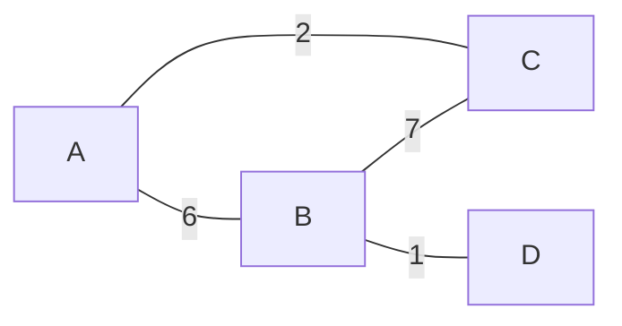
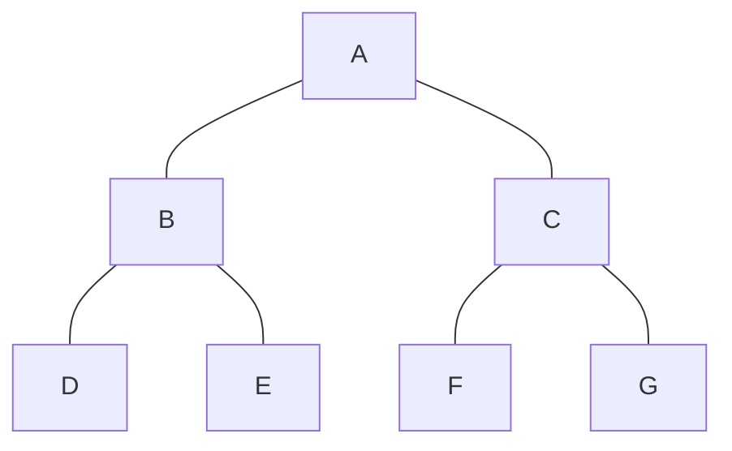
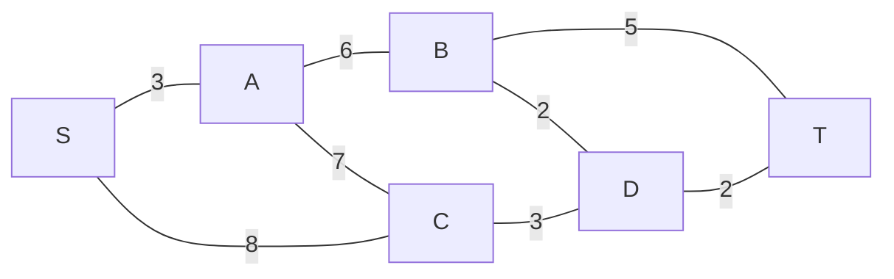
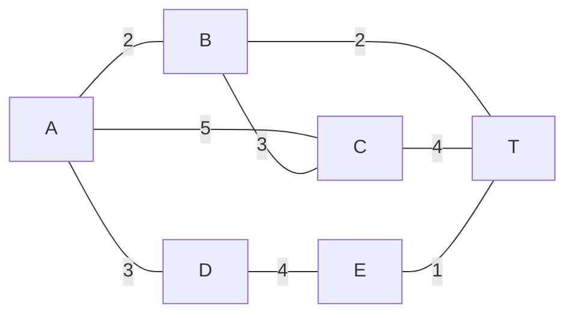

## 1. Euler Circuit / Euler Trail

### 🔑 Decision Procedure

Given a graph G, follow these steps:

1. **Check connectivity:** Ensure G is connected (ignoring isolated vertices of degree 0). If it is not connected, stop immediately; no Euler circuit or trail exists.
2. **Count degrees:** Determine the degree for every vertex.
3. **Count odd vertices:** Tally how many vertices have an odd degree and check the table below.

| Odd-Degree Count | Result |
| :--- | :--- |
| **0** | Euler CIRCUIT exists |
| **2** | Euler TRAIL exists (starts at one odd vertex, ends at the other) |
| **Any other number** | Neither exists |

> [!important] The Theorem
> **Euler Circuit** exists if and only if the graph is connected AND every vertex has an **even** degree.  
> **Euler Trail** exists from vertex v to w if and only if the graph is connected AND exactly v and w have **odd** degrees, while all others are even.

### Worked Example — Does an Euler trail exist?

```mermaid
graph LR
  A["A (deg 2)"] --- B["B (deg 2)"]
  B --- C["C (deg 3)"]
  C --- A
  C --- D["D (deg 1)"]
````

|**Vertex**|**Degree**|**Odd?**|
|---|---|---|
|**A**|2|No|
|**B**|2|No|
|**C**|3|**Yes**|
|**D**|1|**Yes**|

**Conclusion:** Because there are exactly 2 odd-degree vertices (C and D), an **Euler Trail** exists from C to D. It is NOT a circuit.

## 2. Hierholzer's Algorithm (Finding the Euler Circuit)

### Procedure

Input: A graph G confirmed to have an Euler circuit.

1. Pick any starting vertex `s`. Find a circuit $R_1$ from `s` back to `s` (walk any edges, no repeats). Mark all edges used in $R_1$.
    
2. If $R_1$ uses all edges, you are done. $R_1$ is the Euler circuit.
    
3. Otherwise, find any vertex `v` on $R_1$ that still has unmarked edges connected to it.
    
4. Starting at `v`, find a new circuit $Q$ using only unmarked edges. Mark them.
    
5. Splice $Q$ into $R_1$ at `v` to form $R_2$.
    
6. Repeat from Step 2 until all edges are used.
    

> [!tip] Key Insight
> 
> You are building larger circuits by "inserting" new loops wherever unused edges remain.

### Worked Example

```mermaid
graph LR
  A --- B
  B --- C
  C --- A
  C --- D
  D --- E
  E --- C
```

All vertices have even degrees (A=2, B=2, C=4, D=2, E=2), meaning an Euler circuit exists. Apply Hierholzer's:

- **Step 1:** $R_1$ = A → B → C → A (initial circuit, mark these 3 edges).
    
- **Step 2:** Vertex C still has unused edges.
    
- **Step 3:** $Q_1$ = C → D → E → C (new circuit from C, mark last 3 edges).
    
- **Step 4:** $R_2$ = A → B → C → D → E → C → A (splice $Q_1$ into $R_1$ at C).
    

All edges are now used. $R_2$ is the final Euler circuit.

**Complexity:** $O(V + E)$

## 3. Hamiltonian Circuit

### Key Facts for Exam Problems

A **Hamiltonian circuit** visits every **vertex** exactly once (unlike Euler which visits every **edge**).

> [!warning] No Efficient Algorithm
> 
> There is no known efficient algorithm to find Hamiltonian circuits. Exam questions will ask you to either **find one** (by inspection) or **prove one doesn't exist**.

### How to Prove No Hamiltonian Circuit Exists

**Proposition:** If G has a Hamiltonian circuit, then G has a subgraph H where all the following are true:

- H contains every vertex of G.
    
- H is connected.
    
- H has the exact same number of edges as vertices.
    
- Every vertex of H has a degree of exactly 2.
    

**Strategy:** Try to construct such an H. If it's impossible (for example, if a vertex of degree 1 in the main graph would magically need 2 edges in H), then no Hamiltonian circuit exists.

### Worked Example — Travelling Salesman (small case)

Four cities A, B, C, D with distances: AB=20, AC=42, AD=35, BC=30, BD=34, CD=12.

Enumerate all Hamiltonian circuits starting at A:

- A → B → C → D → A: 20 + 30 + 12 + 35 = **97**
    
- A → B → D → C → A: 20 + 34 + 12 + 42 = 108
    
- A → C → B → D → A: 42 + 30 + 34 + 35 = 141
    

**Minimum Cost:** 97 via route ABCDA (or reverse ADCBA).

## 4. Graph Representations

### Adjacency Matrix

For `n` vertices, create an `n × n` matrix A.

- Set `A[i][j]` = weight of edge (i,j) (or 1 for unweighted).
    
- Set `A[i][j]` = 0 (or $\infty$) if no edge exists.
    
- **Undirected:** Matrix is SYMMETRIC (`A[i][j]` = `A[j][i]`).
    
- **Directed:** Matrix may be ASYMMETRIC.
    
- **Space Complexity:** $O(V^2)$
    

### Adjacency List

For each vertex, maintain a list of neighbors (with weights).

- Better for sparse graphs.
    
- **Space Complexity:** $O(V + E)$
    

### Worked Example — Build both representations



**Adjacency Matrix (undirected):**

| **A** | **B** | **C** | **D** |     |
| ----- | ----- | ----- | ----- | --- |
| **A** | 0     | 6     | 2     | 0   |
| **B** | 6     | 0     | 7     | 1   |
| **C** | 2     | 7     | 0     | 0   |
| **D** | 0     | 1     | 0     | 0   |

**Adjacency List:**

- A → [B:6, C:2]
    
- B → [A:6, C:7, D:1]
    
- C → [A:2, B:7]
    
- D → [B:1]
    

### Counting Walks of Length N

> [!note] Matrix Power Trick
> 
> The `(i,j)` entry of matrix $A^n$ equals the number of distinct walks of length `n` from vertex `i` to vertex `j`.

## 5. Graph Isomorphism

### Procedure to Check Isomorphism

**Step 1: Check invariants (quick disqualifiers)**
 >[!Theorem] 📌 Isomorphism Invariants
> The following are all isomorphism invariants ($n, m, k$ non-negative integers):
> **1.** Has $n$ vertices.
> **2.** Has a vertex of degree $k$.
> **3.** Has a circuit of length $k$.
> **4.** Has $m$ simple circuits of length $k$.
> **5.** Has an Euler circuit.
> **6.** Has $m$ edges.
> **7.** Has $m$ vertices of degree $k$.
> **8.** Has a simple circuit of length $k$.
> **9.** Is connected.
> **10.** Has a Hamiltonian circuit.

**Step 2: Construct a bijection**

If all invariants match, try to construct a bijection `g: V(G) → V(G')` such that `{u,v}` is an edge in G if and only if `{g(u), g(v)}` is an edge in G'.

**Step 3: Conclusion**

If you find such a mapping `g`, they are **ISOMORPHIC**. If no such mapping exists, they are not.

> [!tip] Exam Shortcut
> 
> To **disprove** isomorphism, you only need to find one invariant that differs. Once you find a mismatch, you are done.

### Worked Example — Not Isomorphic

- **Graph G degrees:** {1, 2, 3, 3, 3}
    
- **Graph G' degrees:** {2, 2, 2, 3, 3}
    

The degree sequences differ, therefore they are **not isomorphic**.

## 6. BFS (Breadth-First Search)

### Procedure
```
BFS(G, start):
  dist[all] = ∞
  dist[start] = 0
  colour[start] = gray
  Queue Q = [start]

  while Q not empty:
    u = Q.dequeue()
    for each neighbor v of u:
      if colour[v] = white:
        dist[v] = dist[u] + 1
        colour[v] = gray
        Q.enqueue(v)
    colour[u] = black
```

**Complexity:** $O(V + E)$

### What BFS Gives You

|**Application**|**How to find it**|
|---|---|
|**Shortest path (unweighted)**|The `dist[]` array gives the hop-count distance from the source.|
|**Check connectivity**|If any node has `dist = ∞` after a full BFS run, the graph is disconnected.|
|**Find connected components**|Run BFS from each unvisited node; label each component uniquely.|
|**Detect cycle (Undirected)**|Encountering a visited node **that is not the immediate parent** indicates a cycle.|

### Worked Example — BFS vs DFS on the same graph



|**Algorithm**|**Data structure**|**Visit order from A**|
|---|---|---|
|**BFS**|Queue|A, B, C, D, E, F, G|
|**DFS**|Stack / recursion|A, B, D, E, C, F, G|

BFS goes **level by level** (all nodes at distance 1, then distance 2). DFS goes **as deep as possible** on one branch before backtracking.

## 7. DFS (Depth-First Search)

### Procedure (Recursive)
```
DFS(v):
  mark v as visited
  for each unvisited neighbor u of v:
    DFS(u)
```

### Procedure (Stack-based)
```
DFS(v):
  push v onto stack S
  mark v as visited
  while S not empty:
    if top of S has an unvisited neighbor u:
      push u; mark u as visited
    else:
      pop from S
```

**Complexity:** $O(V + E)$

### BFS vs DFS Comparison

|**Property**|**BFS**|**DFS**|
|---|---|---|
|**Data structure**|Queue|Stack (or recursion)|
|**Paths found**|Shortest (fewest edges)|Not necessarily shortest|
|**Best used for**|Shortest path, level-order traversal|Cycle detection, topological sorting|

## 8. Prim's Algorithm (MST)

### What is a Minimum Spanning Tree (MST)?

- **Spanning:** Includes all vertices.
    
- **Tree:** No cycles, exactly $V-1$ edges.
    
- **Minimum:** Lowest total edge weight.
    

> [!note] MST requires exactly $|V|-1$ edges and exists only for connected graphs.

### Procedure
```
PrimMST(G, start r):
  T = {r}           (vertices in MST)
  L = {}            (edges in MST)

  while |T| < |V|:
    Find the minimum-weight edge (u, v) where u ∈ T and v ∉ T
    Add v to T
    Add (u, v) to L
```

**Complexity:** $O((V + E) \log V)$ with a min-heap.

### Worked Example



Start at S. At each step, pick the cheapest edge crossing from T to the outside:

|**Step**|**Vertices in Tree (T)**|**Minimum edge crossing**|**Vertex Added**|
|---|---|---|---|
|**1**|{S}|S-A=3, S-C=8 → **S-A(3)**|A|
|**2**|{S,A}|S-C=8, A-B=6, A-C=7 → **A-B(6)**|B|
|**3**|{S,A,B}|S-C=8, A-C=7, B-T=5, B-D=2 → **B-D(2)**|D|
|**4**|{S,A,B,D}|S-C=8, A-C=7, B-T=5, D-C=3, D-T=2 → **D-T(2)**|T|
|**5**|{S,A,B,D,T}|S-C=8, A-C=7, D-C=3 → **D-C(3)**|C|

**Result:** MST edges are S-A, A-B, B-D, D-T, D-C. Total cost = 3 + 6 + 2 + 2 + 3 = **16**.

> [!tip] Exam Tip
> 
> Always scan ALL edges from **all** vertices in T, not just the last added vertex.

## 9. Kruskal's Algorithm (MST)

### Procedure

```
KruskalMST(G):
  Sort all edges by weight (ascending)
  T = {}  (empty MST)

  for each edge (u, v) in sorted order:
    if adding (u, v) does NOT create a cycle in T:
      add (u, v) to T
    if |T| = |V| - 1:
      stop
```

**Cycle check:** An edge `(u, v)` creates a cycle if `u` and `v` are **already in the same component** of T.

**Complexity:** $O(E \log E) = O(E \log V)$

### Worked Example

Using the same graph as Prim's above. Sort all edges first:

|**Edge**|**Weight**|**Both ends already connected?**|**Add to MST?**|
|---|---|---|---|
|**B-D**|2|No|✓ Yes|
|**D-T**|2|No|✓ Yes|
|**S-A**|3|No|✓ Yes|
|**D-C**|3|No|✓ Yes|
|**B-T**|5|**Yes** (B-D-T already linked)|✗ Skip|
|**A-B**|6|No|✓ Yes (5 edges reached, stop)|

**Result:** MST edges are B-D, D-T, S-A, D-C, A-B. Total cost = 2 + 2 + 3 + 3 + 6 = **16**. (Matches Prim's).

### Prim's vs Kruskal's

|**Feature**|**Kruskal's**|**Prim's**|
|---|---|---|
|**Approach**|Sort edges globally, add cheapest safe edge|Grow tree outward from one vertex|
|**Best for**|Sparse graphs|Dense graphs|
|**Data structure**|Union-Find|Priority Queue|
|**Complexity**|$O(E \log E)$|$O((V+E) \log V)$|

## 10. Dijkstra's Algorithm (Shortest Path)

### Procedure
```
Dijkstra(G, source s):
  c[all vertices] = ∞
  c[s] = 0
  prev[all] = undefined
  T = {}  (shortest path tree)
  F = {s}  (fringe)

  while target not in T:
    x = vertex in F with minimum c[x]
    add x to T

    for each neighbor u of x not in T:
      if c[x] + w(x, u) < c[u]:
        c[u] = c[x] + w(x, u)
        prev[u] = x
```

> [!warning] Dijkstra only works with **non-negative** edge weights.

**Complexity:** $O(V^2)$ naive; $O((V+E) \log V)$ with min-heap.

### Worked Example



Run Dijkstra from A to T. The table shows costs after each vertex is locked into the tree (✓):

|**Step**|**Vertex Added**|**A**|**B**|**C**|**D**|**E**|**T**|
|---|---|---|---|---|---|---|---|
|**0**|—|**0**|$\infty$|$\infty$|$\infty$|$\infty$|$\infty$|
|**1**|A|0✓|2|5|3|$\infty$|$\infty$|
|**2**|B (min=2)|0✓|2✓|5|3|$\infty$|**4**|
|**3**|D (min=3)|0✓|2✓|5|3✓|7|4|
|**4**|**T (min=4)**|0✓|2✓|5|3✓|7|**4✓**|

**Result:** Shortest path A→T = **cost 4**, via A→B→T.

To reconstruct the path, trace the `prev[]` array backwards from T: T ← B ← A.

> [!tip] Exam Technique
> 
> Show your work as a table. Update costs immediately after adding each vertex to T.

## 11. Quick Reference: Algorithm Selection

Use this table to map exam questions to the correct algorithm.

|**If the problem asks...**|**You should use...**|
|---|---|
|**Does an Euler circuit/trail exist?**|Count degrees (0 odd = circuit, 2 odd = trail).|
|**Find the specific Euler circuit**|Hierholzer's Algorithm.|
|**Shortest path (unweighted graph)**|BFS (Breadth-First Search).|
|**Shortest path (non-negative weights)**|Dijkstra's Algorithm.|
|**Minimum spanning tree (Dense graph)**|Prim's Algorithm.|
|**Minimum spanning tree (Sparse graph)**|Kruskal's Algorithm.|
|**Are these two graphs isomorphic?**|Check invariants first, then attempt a bijection mapping.|
|**Traverse level-by-level / Check connectivity**|BFS (Breadth-First Search).|
|**Deep exploration / Cycle detection**|DFS (Depth-First Search).|

## 12. Common Exam Pitfalls

> [!warning] Watch Out For These Common Mistakes

1. **Euler vs Hamiltonian confusion:** Euler requires visiting every **edge** once; Hamiltonian requires visiting every **vertex** once.
    
2. **Disconnected graphs:** All algorithms (except finding components) require connectivity. Always check this first.
    
3. **Prim's global minimum error:** Always scan all edges extending from **all** vertices currently in T, not just the single vertex you added last.
    
4. **Kruskal's cycle detection:** If an edge connects two vertices that are already in the same tree component, skip it entirely.
    
5. **Dijkstra's initialization:** The starting source gets a cost of 0; all other nodes must start at $\infty$.
    
6. **Degree counting for loops:** A loop counts **twice** toward the total degree of its connected endpoint.
    
7. **MST edge counts:** A valid MST will always contain exactly $|V| - 1$ edges.