# 🧠 61CSE108 — Ultimate Exam Procedure Guide

> **Format:** Step-by-step procedures only. Each section: algorithm → cases → worked example → traps.
> No proofs. No theory. Just what you need to solve every exercise type on paper.

---

## 📌 Table of Contents

| # | Topic | Key Exercise Types |
|---|---|---|
| 1 | [[#Asymptotic Notation — Classifying Functions]] | Limit rule, Big-O proof, code counting |
| 2 | [[#Counting Operations in Loops]] | Nested loops, doubling outer loop |
| 3 | [[#Linear Search]] | Trace, sentinel |
| 4 | [[#Binary Search]] | Ascending/descending, step count, "most steps" |
| 5 | [[#Selection Sort]] | Full trace, operation count |
| 6 | [[#Insertion Sort]] | Full trace, best/worst case identification |
| 7 | [[#Merge Sort]] | Divide/merge trace, recurrence |
| 8 | [[#Quick Sort]] | Median-of-three pivot, partition trace |
| 9 | [[#Heap Sort]] | Build heap, extraction steps |
| 10 | [[#Radix Sort]] | Digit-pass trace |
| 11 | [[#Stack Operations]] | push/pop trace, bracket matching |
| 12 | [[#Infix ↔ Postfix Conversion + Evaluation]] | Shunting-yard, RPN eval |
| 13 | [[#Queue Operations]] | enqueue/dequeue trace |
| 14 | [[#Linked List Operations]] | Insert/delete/traverse/sort |
| 15 | [[#Hashing]] | Linear/quadratic/double, probe count, tombstone |
| 16 | [[#BST — Operations]] | Insert, search, delete (3 cases), traversals |
| 17 | [[#AVL Tree — Insert + Rotation]] | 4 rotation cases |
| 18 | [[#AVL Tree — Delete]] | BST delete + rebalance |
| 19 | [[#Graph — Degree Sequences & Properties]] | Odd-sum test, Euler, Handshake |
| 20 | [[#Graph — BFS and DFS Traversal]] | Level-order BFS, DFS stack trace |
| 21 | [[#Graph — Prim's MST]] | Greedy edge expansion |
| 22 | [[#Graph — Kruskal's MST]] | Sorted edge + cycle check |
| 23 | [[#Graph — Dijkstra's Shortest Paths]] | Distance table update |
| 24 | [[#Dynamic Programming — Matrix Chain]] | m/s table fill, parenthesization |
| 25 | [[#Dynamic Programming — 0-1 Knapsack]] | V table fill, backtracking |
| 26 | [[#Dynamic Programming — LCS]] | L table fill, backtracking |

---

## 1. Asymptotic Notation — Classifying Functions

### Limit Rule (use this on every classify/prove question)

Compute $L = \lim_{n \to \infty} \dfrac{f(n)}{g(n)}$, then:

| $L$ | Conclusion |
|---|---|
| $0$ | $f = O(g)$, $f = o(g)$ |
| finite $c > 0$ | $f = \Theta(g)$, $f = O(g)$, $f = \Omega(g)$ |
| $\infty$ | $f = \Omega(g)$, $f = \omega(g)$ |

### Growth Order Hierarchy (slow → fast)

$$O(1) \subset O(\log n) \subset O(\sqrt{n}) \subset O(n) \subset O(n \log n) \subset O(n^2) \subset O(n^c) \subset O(c^n) \subset O(n!)$$

> [!tip] Any degree-$d$ polynomial $= \Theta(n^d)$. $\log n = O(n^c)$ for any $c > 0$.

### Proving $f = O(g)$ directly

Find $c > 0$ and $n_0 > 0$ such that $f(n) \leq c \cdot g(n)$ for all $n \geq n_0$.

**Procedure:** bound each lower-order term by the dominant term; sum the coefficients to get $c$.

### Worked Examples

**Show $n^2 + 2n + 5 = O(n^2)$:**
- For $n \geq 1$: $2n \leq 2n^2$, $5 \leq 5n^2$.
- So $n^2 + 2n + 5 \leq 8n^2$. Take $c=8$, $n_0=1$. ✓

**Show $n^2 + 2n + 5 = \Theta(n^2)$:**
- Lower: $n^2 + 2n + 5 \geq n^2$ → $c_1 = 1$.
- Upper: $c_2 = 8$ from above.
- Triple $(c_1, c_2, n_0) = (1, 8, 1)$. ✓

**Show $n^2 + 2n + 5 = o(n^3)$:**
- $\lim_{n \to \infty} \dfrac{n^2+2n+5}{n^3} = 0$. ✓

---

## 2. Counting Operations in Loops

### Key Identities

$$\sum_{i=1}^{n} i = \frac{n(n+1)}{2} \qquad \sum_{i=0}^{k-1} 2^i = 2^k - 1 \qquad \sum_{i=0}^{n-1} n = n^2$$

### Cases Reference

| Outer loop | Inner loop | Count | Big-O |
|---|---|---|---|
| `i++` (0 to n) | `j < n` (fixed) | $n \times n$ | $\Theta(n^2)$ |
| `i++` (0 to n) | `j < i` (varies) | $n(n-1)/2$ | $\Theta(n^2)$ |
| `i *= 2` | `j < n` (fixed) | $n \cdot \lfloor\log n\rfloor$ | $\Theta(n \log n)$ |
| `i *= 2` | `j < i` (varies) | $2^{\log n}-1 \approx n$ | $\Theta(n)$ |
| `i /= 2` | `j < i` (varies) | $n + n/2 + \ldots \approx 2n$ | $\Theta(n)$ |

### Worked Example — Fast Power

```c
while (y) { result *= x; x *= x; y /= 2; }
```
$y$ halves each iteration → $\lfloor \log_2 n \rfloor$ iterations → **O(log n)**

---

## 3. Linear Search

### Procedure

```
for i=0 to n-1:
    if A[i] == k: return i
return -1
```

| Case | Cost | When |
|---|---|---|
| Best | O(1) | k is first element |
| Worst | O(n) | k is last or absent |
| Average | O(n) | — |

**Sentinel variant:** place $k$ at $A[n]$ before the loop; eliminates boundary check; ~25% faster in practice; same asymptotic complexity.

---

## 4. Binary Search

### Standard (Ascending) Procedure

```
left=0, right=n-1
while left <= right:
    mid = (left+right)/2
    if A[mid] == k: return mid
    if k > A[mid]: left = mid+1
    else: right = mid-1
return -1
```

> [!warning] **Descending array** (exam trap): direction is REVERSED.
> - `A[mid] > k` → go RIGHT (`left = mid+1`)
> - `A[mid] < k` → go LEFT (`right = mid-1`)

### "Which element takes most steps?" — Search Tree

Elements at the deepest level require the most comparisons. Max depth = $\lceil \log_2 n \rceil$.

For the descending array `95 83 77 74 63 51 40 32 11 5` (n=10):

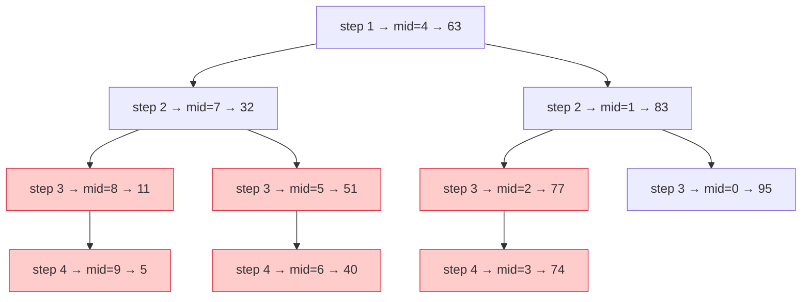
```mermaid
graph TD
    A["step 1 → mid=4 → 63"] --> B["step 2 → mid=7 → 32"]
    A --> C["step 2 → mid=1 → 83"]
    B --> D["step 3 → mid=8 → 11"]
    B --> E["step 3 → mid=5 → 51"]
    C --> F["step 3 → mid=2 → 77"]
    C --> G["step 3 → mid=0 → 95"]
    D --> H["step 4 → mid=9 → 5"]
    E --> I["step 4 → mid=6 → 40"]
    F --> J["step 4 → mid=3 → 74"]

    style D fill:#ffcccc,stroke:#dc3545
    style E fill:#ffcccc,stroke:#dc3545
    style F fill:#ffcccc,stroke:#dc3545
    style H fill:#ffcccc,stroke:#dc3545
    style I fill:#ffcccc,stroke:#dc3545
    style J fill:#ffcccc,stroke:#dc3545
```

**Red = depth 4 = most steps:** 11, 51, 77, 5, 40, 74.

### Worked Example — Find 38

| Step | left | right | mid | A[mid] | Decision |
|---|---|---|---|---|---|
| 1 | 0 | 9 | 4 | 63 | 63>38 → right: left=5 |
| 2 | 5 | 9 | 7 | 32 | 32<38 → left: right=6 |
| 3 | 5 | 6 | 5 | 51 | 51>38 → right: left=6 |
| 4 | 6 | 6 | 6 | 40 | 40>38 → right: left=7 |
| left>right | | | | | **Not found — 4 iterations** |

---

## 5. Selection Sort

### Procedure

```
for i=0 to n-1:
    min = FindMin(A, i, n-1)
    Swap(A[i], A[min])
```

- **Always** $\Theta(n^2)$. In-place. Not stable.

### Worked Example — `[13, 4, 2, 7, 34, 1]`

| i | Scan range | Min found | After swap |
|---|---|---|---|
| 0 | [0..5] | 1 at idx 5 | `[1, 4, 2, 7, 34, 13]` |
| 1 | [1..5] | 2 at idx 2 | `[1, 2, 4, 7, 34, 13]` |
| 2 | [2..5] | 4 at idx 2 | `[1, 2, 4, 7, 34, 13]` |
| 3 | [3..5] | 7 at idx 3 | `[1, 2, 4, 7, 34, 13]` |
| 4 | [4..5] | 13 at idx 5 | `[1, 2, 4, 7, 13, 34]` ✓ |

---

## 6. Insertion Sort

### Procedure

```
for i=1 to n-1:
    key = A[i]; j = i-1
    while j>=0 AND A[j] > key:
        A[j+1] = A[j]; j--
    A[j+1] = key
```

| Case | Cost | When |
|---|---|---|
| Best | O(n) | Already sorted — inner while never runs |
| Worst | O(n²) | Reverse-sorted |
| Average | O(n²) | — |

In-place. **Stable**.

### Worked Example — `[7, 2, 1, 5, 3]`

| i | key | Elements shifted right | Result |
|---|---|---|---|
| 1 | 2 | 7 | `[2, 7, 1, 5, 3]` |
| 2 | 1 | 7, 2 | `[1, 2, 7, 5, 3]` |
| 3 | 5 | 7 | `[1, 2, 5, 7, 3]` |
| 4 | 3 | 7, 5 | `[1, 2, 3, 5, 7]` ✓ |

---

## 7. Merge Sort

### Procedure

**Divide:** Split at mid until size 1. **Merge:** Two pointers `i`, `j`; pick the smaller; copy remainder.

- $\Theta(n \log n)$ **always**. Not in-place. **Stable**.
- Recurrence: $T(n) = 2T(n/2) + O(n)$ — each of $\log n$ levels does $O(n)$ merge work.

### Divide & Merge Tree — `[7,2,1,5,3,6,19,9]`

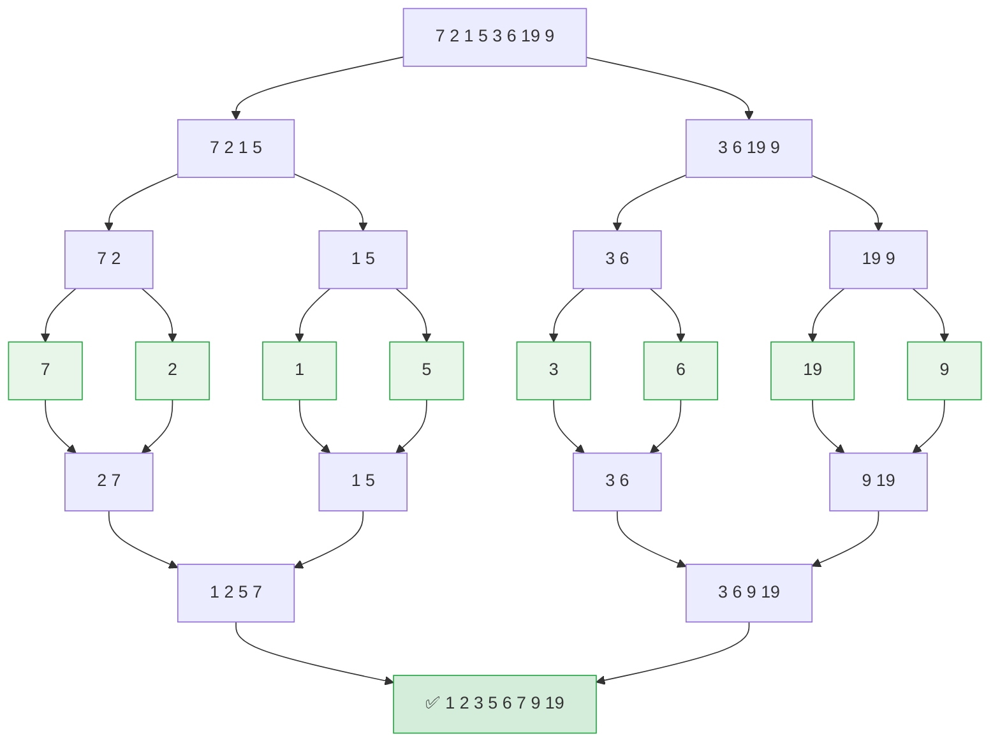
```mermaid
graph TD
    A["7 2 1 5 3 6 19 9"] --> B["7 2 1 5"]
    A --> C["3 6 19 9"]
    B --> D["7 2"]
    B --> E["1 5"]
    C --> F["3 6"]
    C --> G["19 9"]
    D --> H["7"]
    D --> I["2"]
    E --> J["1"]
    E --> K["5"]
    F --> L["3"]
    F --> M["6"]
    G --> N["19"]
    G --> O["9"]
    H --> D2["2 7"]
    I --> D2
    J --> E2["1 5"]
    K --> E2
    L --> F2["3 6"]
    M --> F2
    N --> G2["9 19"]
    O --> G2
    D2 --> B2["1 2 5 7"]
    E2 --> B2
    F2 --> C2["3 6 9 19"]
    G2 --> C2
    B2 --> A2["✅ 1 2 3 5 6 7 9 19"]
    C2 --> A2

    style H fill:#e8f5e9,stroke:#28a745
    style I fill:#e8f5e9,stroke:#28a745
    style J fill:#e8f5e9,stroke:#28a745
    style K fill:#e8f5e9,stroke:#28a745
    style L fill:#e8f5e9,stroke:#28a745
    style M fill:#e8f5e9,stroke:#28a745
    style N fill:#e8f5e9,stroke:#28a745
    style O fill:#e8f5e9,stroke:#28a745
    style A2 fill:#d4edda,stroke:#28a745
```

---

## 8. Quick Sort

### Median-of-Three Pivot

1. Take `A[0]`, `A[mid]`, `A[last]`. Sort them mentally → pick the **middle value** as pivot.

### Partition Procedure

```
Partition(A, low, high):
    pivot = A[high]
    i = low - 1
    for j = low to high-1:
        if A[j] < pivot: i++; Swap(A[i], A[j])
    Swap(A[i+1], A[high])
    return i+1
```

### Worked Example (Quiz 2 P4) — pivot=49

**Pivot selection:** A[0]=1, A[4]=53, A[9]=49 → sorted: 1,49,53 → **pivot=49**

**Partition result:**

```
Before:  [ 1  30   3  12  53  62  14  32  41 | 49 ]
                                 ↑ >49           ↑ pivot
After:   [ 1  30   3  12  14  32  41 | 49 | 53  62 ]
           ←——— < 49 ————→   pivot    ←>49→
```

Pivot placed at index 7. Recurse on `[1,30,3,12,14,32,41]` and `[53,62]`.

> [!warning] Worst case O(n²): sorted array + first-element pivot — all elements go to one side.

---

## 9. Heap Sort

### Array ↔ Tree Index Mapping

For 0-indexed array: **left child** of `i` = `2i+1`, **right child** = `2i+2`, **parent** = `(i-1)/2`.
**Last non-leaf** = index `floor(n/2) - 1`.

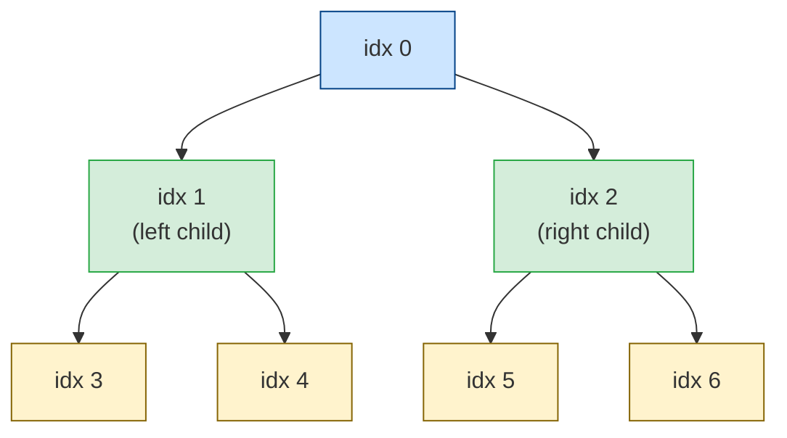
```mermaid
graph TD
    I0["idx 0"] --> I1["idx 1<br>(left child)"]
    I0 --> I2["idx 2<br>(right child)"]
    I1 --> I3["idx 3"]
    I1 --> I4["idx 4"]
    I2 --> I5["idx 5"]
    I2 --> I6["idx 6"]

    style I0 fill:#cce5ff,stroke:#004085
    style I1 fill:#d4edda,stroke:#28a745
    style I2 fill:#d4edda,stroke:#28a745
    style I3 fill:#fff3cd,stroke:#856404
    style I4 fill:#fff3cd,stroke:#856404
    style I5 fill:#fff3cd,stroke:#856404
    style I6 fill:#fff3cd,stroke:#856404
```

### Phase 1 — Build Max-Heap

```
for i = floor(n/2)-1 downto 0:
    Heapify(A, n, i)

Heapify(A, n, i):
    largest = i
    left = 2i+1;  right = 2i+2
    if left<n  AND A[left]>A[largest]:  largest = left
    if right<n AND A[right]>A[largest]: largest = right
    if largest != i:
        Swap(A[i], A[largest])
        Heapify(A, n, largest)
```

### Build Heap Trace — `[13, 4, 2, 7, 34, 1]` (n=6, last non-leaf=idx 2)

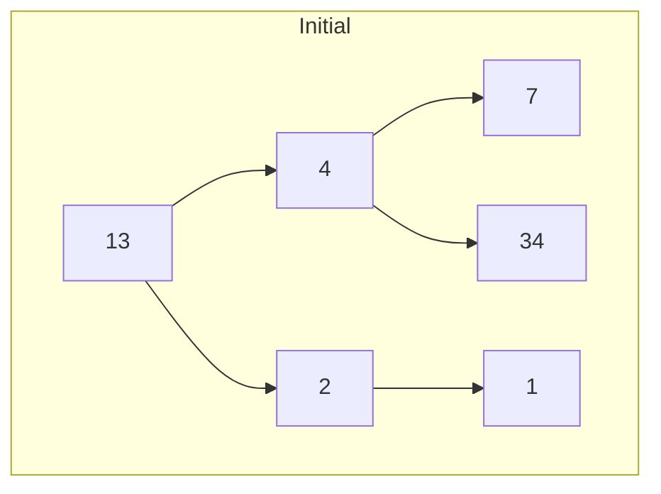
```mermaid
graph TD
    subgraph "Initial"
        R0["13"] --> L0["4"]
        R0 --> RR0["2"]
        L0 --> LL0["7"]
        L0 --> LR0["34"]
        RR0 --> RL0["1"]
    end
```
Heapify i=2: children are idx5=1. 2>1 → no swap
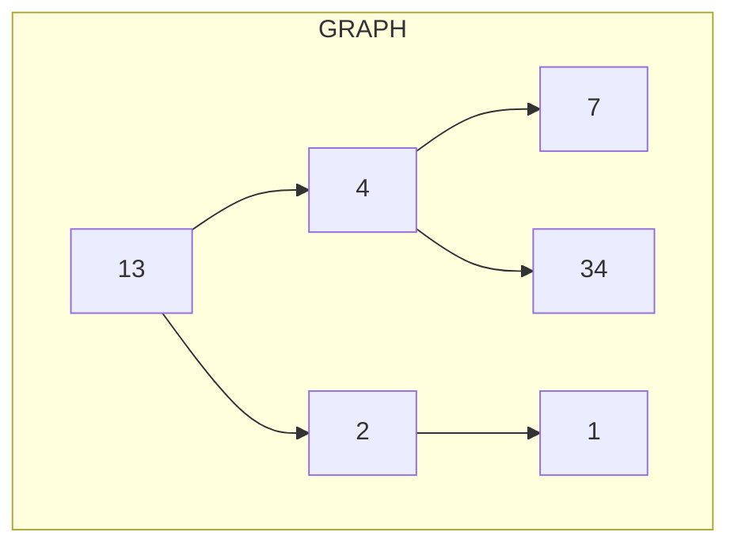
```mermaid
graph TD
    subgraph "GRAPH"
        R1["13"] --> L1["4"]
        R1 --> RR1["2"]
        L1 --> LL1["7"]
        L1 --> LR1["34"]
        RR1 --> RL1["1"]
    end
```
Heapify i=1: left=7 right=34. 34>4 → swap idx1↔idx4
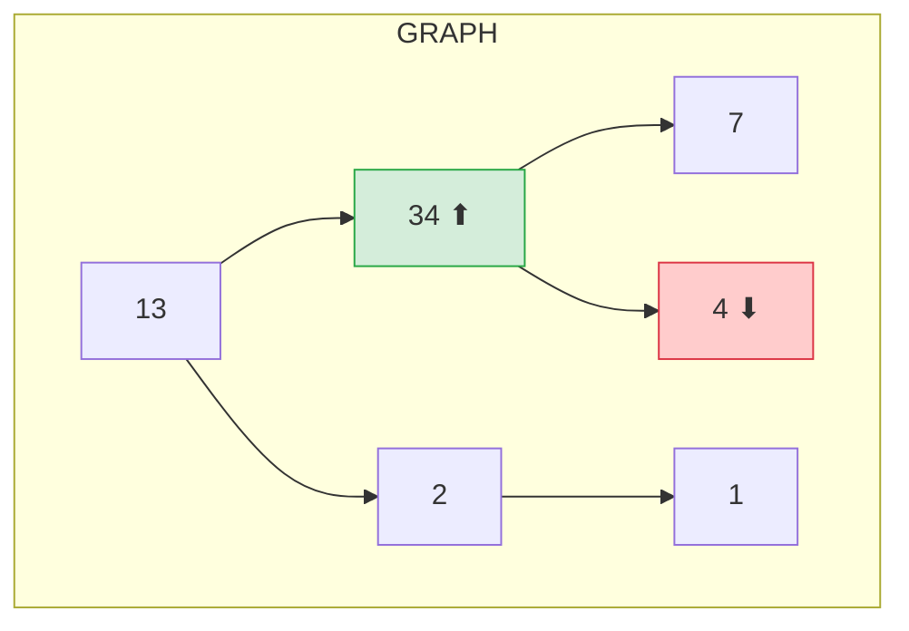
```mermaid
graph TD
    subgraph "GRAPH"
        R2["13"] --> L2["34 ⬆"]
        R2 --> RR2["2"]
        L2 --> LL2["7"]
        L2 --> LR2["4 ⬇"]
        RR2 --> RL2["1"]
        style L2 fill:#d4edda,stroke:#28a745
        style LR2 fill:#ffcccc,stroke:#dc3545
    end
```
Heapify i=0: left=34 right=2. 34>13 → swap idx0↔idx1. Recurse idx1: 13>7,4 → no swap
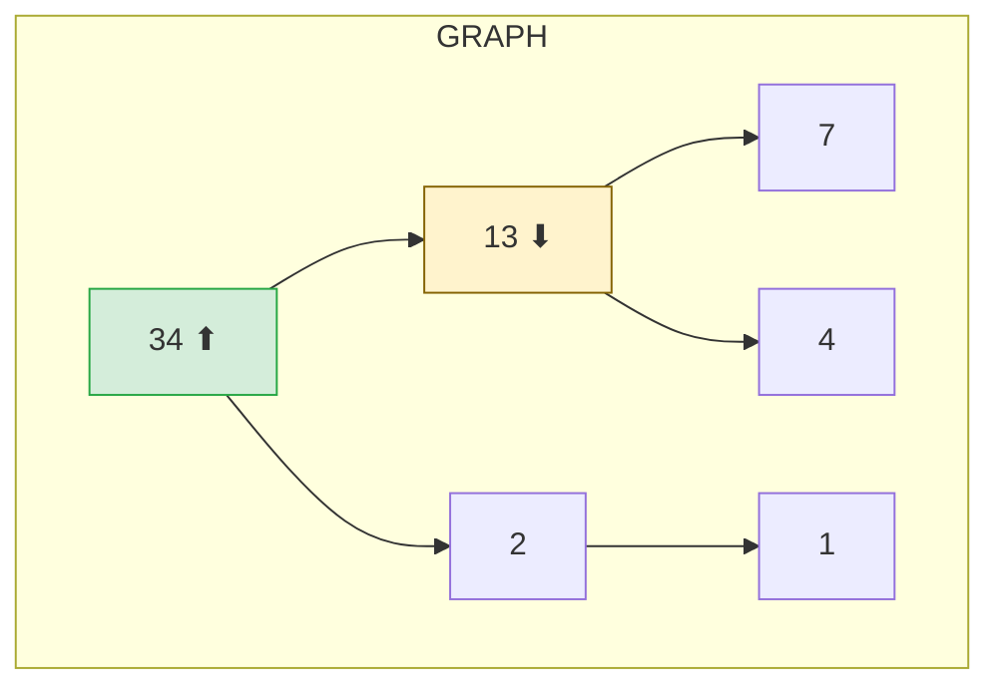
```mermaid
graph TD
    subgraph "GRAPH"
        R3["34 ⬆"] --> L3["13 ⬇"]
        R3 --> RR3["2"]
        L3 --> LL3["7"]
        L3 --> LR3["4"]
        RR3 --> RL3["1"]
        style R3 fill:#d4edda,stroke:#28a745
        style L3 fill:#fff3cd,stroke:#856404
    end
```

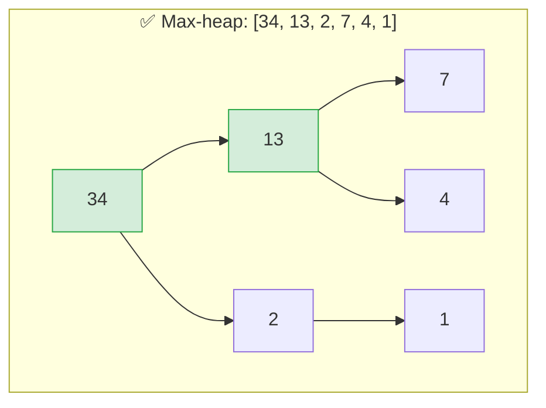
```mermaid
graph TD
    subgraph "✅ Max-heap: [34, 13, 2, 7, 4, 1]"
        RF["34"] --> LF["13"]
        RF --> RRF["2"]
        LF --> LLF["7"]
        LF --> LRF["4"]
        RRF --> RLF["1"]
        style RF fill:#d4edda,stroke:#28a745
        style LF fill:#d4edda,stroke:#28a745
    end
```

### Phase 2 — Extract Sort

```
for i = n-1 downto 1:
    Swap(A[0], A[i])      // move current max to sorted end
    Heapify(A, i, 0)      // restore heap on A[0..i-1]
```

O(n log n) all cases. In-place. Not stable.

### Extraction Trace — `[62,53,14,41,49,3,1,32,12,30]` (Quiz 2 P3c)

Goal: last 3 elements = 49, 53, 62.

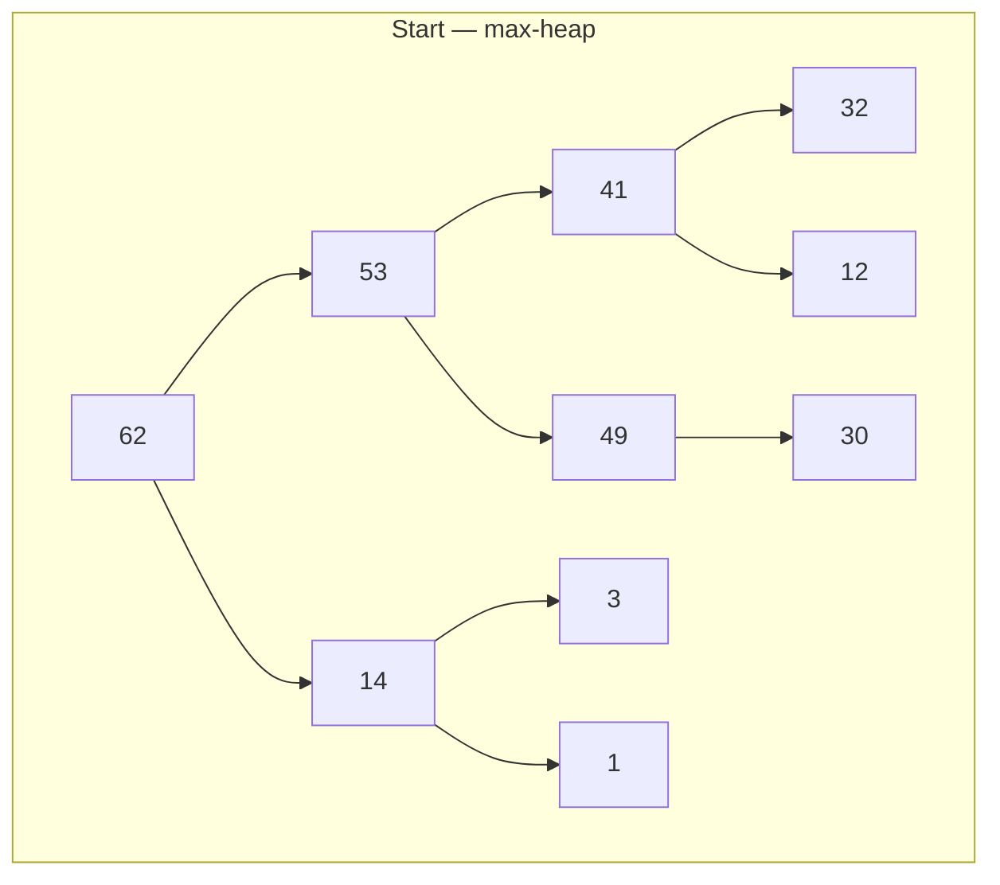
```mermaid
graph TD
    subgraph "Start — max-heap"
        H0["62"] --> H0L["53"]
        H0 --> H0R["14"]
        H0L --> H0LL["41"]
        H0L --> H0LR["49"]
        H0R --> H0RL["3"]
        H0R --> H0RR["1"]
        H0LL --> H0LLL["32"]
        H0LL --> H0LLR["12"]
        H0LR --> H0LRL["30"]
    end
```

Extract 62: swap A[0]↔A[9]=30, heapify → 53 rises to root
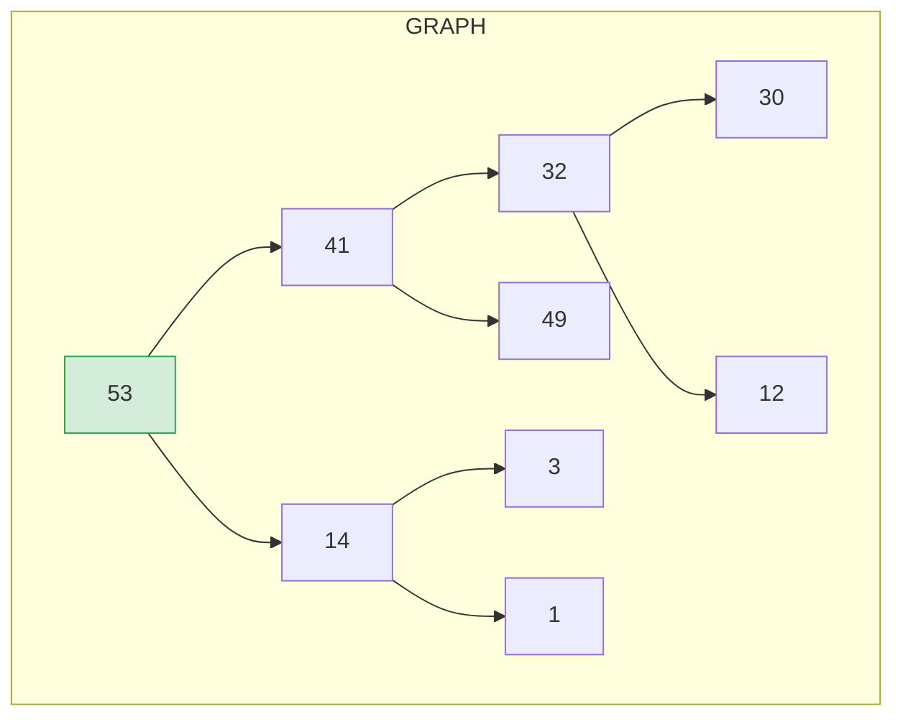
```mermaid
graph TD
    subgraph "GRAPH"
        H1["53"] --> H1L["41"]
        H1 --> H1R["14"]
        H1L --> H1LL["32"]
        H1L --> H1LR["49"]
        H1R --> H1RL["3"]
        H1R --> H1RR["1"]
        H1LL --> H1LLL["30"]
        H1LL --> H1LLR["12"]
        style H1 fill:#d4edda,stroke:#28a745
    end
```

Extract 53: swap A[0]↔A[8]=12, heapify → 49 rises
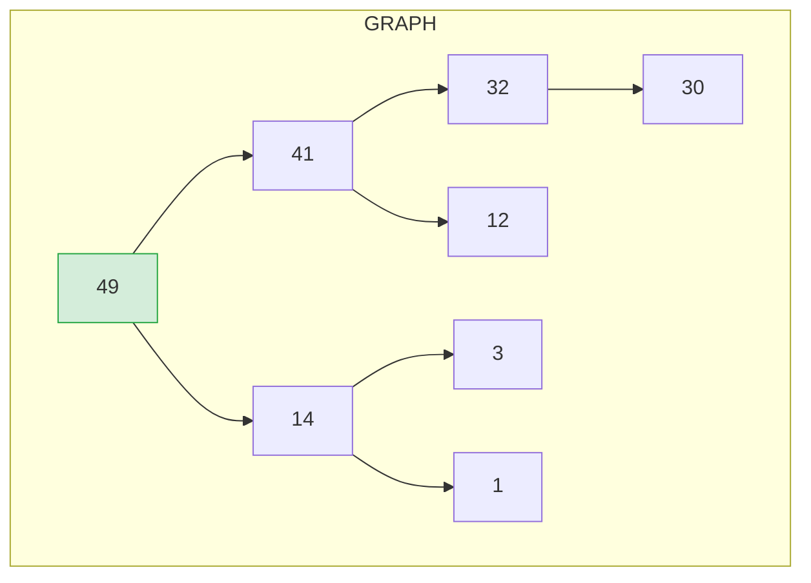
```mermaid
graph TD
    subgraph "GRAPH"
        H2["49"] --> H2L["41"]
        H2 --> H2R["14"]
        H2L --> H2LL["32"]
        H2L --> H2LR["12"]
        H2R --> H2RL["3"]
        H2R --> H2RR["1"]
        H2LL --> H2LLL["30"]
        style H2 fill:#d4edda,stroke:#28a745
    end
```

After extracting 49 in the next step: array ends with `... 49, 53, 62` ✓

### Check if Array is Max-Heap

For every $i$ from $0$ to $\lfloor n/2 \rfloor - 1$:
- check `A[i] >= A[2i+1]` (if left child exists)
- check `A[i] >= A[2i+2]` (if right child exists)

If all pass → max-heap. **O(n)**.

---

## 10. Radix Sort

### Procedure

```
for digit_position = units → tens → ... → highest:
    bucket[0..9] = []
    for each number x in A: append x to bucket[digit_of_x]
    A = flatten(bucket[0], bucket[1], ..., bucket[9])
```

- $O(d(n+k))$ where $d$ = digits, $k$ = base. Stable. Not in-place.

### Worked Example — `[07,02,01,05,03,06,19,09]`

**Pass 1 — sort by units digit:**

| Bucket | 0 | 1 | 2 | 3 | 5 | 6 | 7 | 9 |
|---|---|---|---|---|---|---|---|---|
| Values | — | 01 | 02 | 03 | 05 | 06 | 07 | 19, 09 |

After pass 1: `[01, 02, 03, 05, 06, 07, 19, 09]`

**Pass 2 — sort by tens digit:**

| Bucket | 0 | 1 |
|---|---|---|
| Values | 01,02,03,05,06,07,09 | 19 |

After pass 2: `[1, 2, 3, 5, 6, 7, 9, 19]` ✓

> [!warning] **LSD first** (units → tens → hundreds). Reversing the order gives wrong results.

---

## 11. Stack Operations

### Core Rules

| Operation | Array impl. | LL impl. |
|---|---|---|
| push | `arr[++top] = x` | prepend new node at head |
| pop | `return arr[top--]` | advance `top = top->next` |
| peek | `arr[top]` | `top->data` |
| empty | `top == -1` | `top == null` |

### Bracket Matching Procedure

```
for each char ch:
    if ch in {(, [, {}: push(ch)
    if ch in {), ], }}:
        if isEmpty() OR top doesn't match ch: ERROR
        else: pop()
if stack not empty: ERROR
```

**Match pairs:** `(` ↔ `)`, `[` ↔ `]`, `{` ↔ `}`

### Worked Example — `{a + (b + c[1]) * 2}`

| Char | Action | Stack state |
|---|---|---|
| `{` | push | `{` |
| `(` | push | `{ (` |
| `[` | push | `{ ( [` |
| `]` | pop `[` ✓ | `{ (` |
| `)` | pop `(` ✓ | `{` |
| `}` | pop `{` ✓ | empty |

Stack empty at end → **VALID** ✓

---

## 12. Infix ↔ Postfix Conversion + Evaluation

### Shunting-Yard: Infix → Postfix

**Precedence:** `^` > `*/` > `+-`

```
for each token t:
    operand        → output
    (              → push op-stack
    )              → pop to output until ( found; discard (
    operator op    → while top has prec ≥ op AND top ≠ (: pop to output
                   → push op
    END            → pop all remaining to output
```

### Postfix Evaluation

```
for each token t:
    operand → push(t)
    operator:
        b = pop()   ← SECOND operand
        a = pop()   ← FIRST operand
        push(a OP b)
```

> [!warning] Pop order: `b` first, `a` second. Compute `a OP b`. Critical for `/` and `−`.

### Worked Example — `18 3 / 7 5 2 + * + 4 6 * − 9 +`

| Token | Stack after |
|---|---|
| 18 | `[18]` |
| 3 | `[18, 3]` |
| / | b=3, a=18 → `[6]` |
| 7 | `[6, 7]` |
| 5 | `[6, 7, 5]` |
| 2 | `[6, 7, 5, 2]` |
| + | b=2, a=5 → `[6, 7, 7]` |
| * | b=7, a=7 → `[6, 49]` |
| + | b=49, a=6 → `[55]` |
| 4 | `[55, 4]` |
| 6 | `[55, 4, 6]` |
| * | b=6, a=4 → `[55, 24]` |
| − | b=24, a=55 → `[31]` |
| 9 | `[31, 9]` |
| + | b=9, a=31 → `[40]` |

**Result = 40** ✓

### Infix-to-Postfix Trace — `a + (b − c/d) * e`

| Token | Op Stack | Output |
|---|---|---|
| a | | `a` |
| + | `+` | `a` |
| ( | `+ (` | `a` |
| b | `+ (` | `a b` |
| − | `+ ( −` | `a b` |
| c | `+ ( −` | `a b c` |
| / | `+ ( − /` | `a b c` |
| d | `+ ( − /` | `a b c d` |
| ) | pop `/`, `−`; discard `(` | `a b c d / −` |
| * | `+ *` (prec `*` > `+`) | `a b c d / −` |
| e | `+ *` | `a b c d / − e` |
| END | pop `*`, `+` | `a b c d / − e * +` |

---

## 13. Queue Operations

### Core Rules

| Operation | Action |
|---|---|
| enqueue | insert at **rear** |
| dequeue | remove from **front** |
| peek | read front, no removal |

**LL:** front=head (dequeue), rear=tail (enqueue). Both O(1) with tail pointer.

### Worked Example

```
enqueue(10) → FRONT→ [10] ←REAR
enqueue(20) → FRONT→ [10, 20] ←REAR
enqueue(30) → FRONT→ [10, 20, 30] ←REAR
dequeue()   → returns 10;  FRONT→ [20, 30] ←REAR
peek()      → returns 20 (no change)
enqueue(40) → FRONT→ [20, 30, 40] ←REAR
```

---

## 14. Linked List Operations

### Insert Cases (SLL)

| Position | Key pointer ops |
|---|---|
| **Head** | `new->next = head; head = new;` (also update tail if list was empty) |
| **Tail** | `tail->next = new; tail = new;` |
| **After node q** | `new->next = q->next; q->next = new;` (update tail if q was tail) |
| **Before node q** | Traverse to find predecessor `p` where `p->next == q`, then insert after `p` |

### Delete Cases (SLL)

| Case | Key pointer ops |
|---|---|
| Delete head | `head = head->next;` |
| Delete node after `q` | `q->next = q->next->next;` (update tail if needed) |
| Delete by value K | Traverse with `p=head, q=null`; when `p->key==K` call `PickAfter(l, q)` |

> [!warning] `PickAfter` detaches only — does NOT free memory. Call `delete` separately.

### Traversal Pattern

```c
p = pHead;
while (p != NULL) {
    process(p);
    p = p->pNext;
}
```

### Worked Example — Remove All Even Nodes from `1→4→2→7→6`

| p | Value | Action | q (predecessor) | List state |
|---|---|---|---|---|
| node1 | 1 (odd) | keep; advance q | node1 | `1→4→2→7→6` |
| node4 | 4 (even) | PickAfter(q=node1); delete | node1 | `1→2→7→6` |
| node2 | 2 (even) | PickAfter(q=node1); delete | node1 | `1→7→6` |
| node7 | 7 (odd) | keep; advance q | node7 | `1→7→6` |
| node6 | 6 (even) | PickAfter(q=node7); delete | node7 | `1→7` |

Result: `1→7` ✓

### List Selection Sort

```
while input list not empty:
    find predecessor minprev of minimum node
    extract min via PickAfter(l, minprev)
    AddTail(result, min)
l = result
```
O(n²). No extra node allocations.

### List Quick Sort

```
if list has 0 or 1 nodes: return
pivot = PickHead(list)
partition rest into list1 (<=pivot) and list2 (>pivot)
ListQuickSort(list1); ListQuickSort(list2)
list = list1 + [pivot] + list2
```

---

## 15. Hashing

### Hash Functions

- **Division method:** `h(k) = k mod p`. Choose $p$ = prime.
- **Double hashing secondary:** `h2(k) = q − (k mod q)` for prime $q < p$. Never returns 0.

### Collision Methods

| Method | Probe sequence | Drawback |
|---|---|---|
| Linear | `(h(k) + i) mod p` | Primary clustering |
| Quadratic | `(h(k) + i²) mod p` | Secondary clustering |
| Double hashing | `(h(k) + i·h₂(k)) mod p` | None — best distribution |

### Three Slot States (Tombstone)

| State | Meaning | Search behaviour | Insert behaviour |
|---|---|---|---|
| EMPTY | Never used | **Stop** — key not in table | Insert here |
| OCCUPIED | Has a key | Check it; probe if mismatch | Skip |
| DELETED ☠️ | Tombstone | **Skip** — keep probing | Insert here (reuse) |

### Insert / Find Procedure

**Insert:**
```
probe = h(k), step = 0
while table[probe] == OCCUPIED:
    step++; probe = next_probe(k, step)
table[probe] = k        // EMPTY or DELETED slot
```

**Find:**
```
probe = h(k), step = 0
while table[probe] != EMPTY:
    if table[probe] == k: return found (step+1 probes)
    step++; probe = next_probe(k, step)
return not found
```

**Probe count = number of slots inspected, starting at 1.**

### Worked Example — Linear Probing (p=13, h(k)=k mod 13)

Insert: 40, 31, 53, 44, 66, 77, 17, 90, 30, 102

Base slots (before collision resolution): 40→1, 31→5, 53→1, 44→5, 66→1, 77→12, 17→4, 90→12, 30→4, 102→11

| Slot | 0 | 1 | 2 | 3 | 4 | 5 | 6 | 7 | 8 | 9 | 10 | 11 | 12 |
|---|---|---|---|---|---|---|---|---|---|---|---|---|---|
| Key | 90 | 40 | 53 | 66 | 17 | 31 | 44 | 30 | — | — | — | 102 | 77 |

**Probe count examples:**
- Find 17: h(17)=4 → slot 4 = 17 → **1 probe** ✓
- Find 28 (absent): h(28)=2 → probe 2,3,4,5,6,7 → slot 8=EMPTY → **not found, 7 probes**
- Insert 56 after deleting 44,77,18: h(56)=4 → probe through tombstones and occupied → **13 probes** ✓

---

## 16. BST — Operations

### BST Property

Left subtree: all keys **< node**. Right subtree: all keys **> node**. Holds recursively.

### Search / Insert Path (same logic)

```
if node == null: return null (Search) / create node (Insert)
if key == node.key: found / duplicate → stop
if key < node.key: go left
else: go right
```

### Delete — 3 Cases

| Case | Node has | Action |
|---|---|---|
| Leaf | 0 children | Simply remove |
| One child | 1 child | Replace node with its child |
| Two children | 2 children | Find **inorder successor** (leftmost of right subtree); copy its key; delete the successor (now Case 1 or 2) |

### Traversals

| Name | Visit order | Output on a BST |
|---|---|---|
| **Inorder** | Left → Root → Right | Sorted ascending |
| **Preorder** | Root → Left → Right | Tree structure copy |
| **Postorder** | Left → Right → Root | Free children before parent |
| **BFS/Level-order** | Level by level | Shortest hop distances |

### Worked Example — BST from Quiz 5 P1

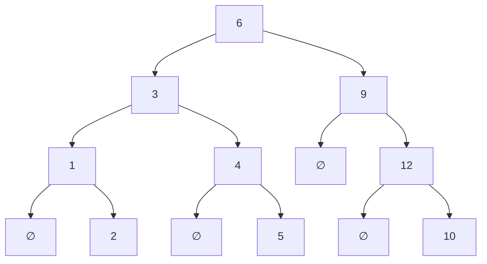
```mermaid
graph TD
    N6["6"] --> N3["3"]
    N6 --> N9["9"]
    N3 --> N1["1"]
    N3 --> N4["4"]
    N9 --> NNULL["∅"]
    N9 --> N12["12"]
    N1 --> NNULL2["∅"]
    N1 --> N2["2"]
    N4 --> NNULL3["∅"]
    N4 --> N5["5"]
    N12 --> NNULL4["∅"]
    N12 --> N10["10"]
```

- **Preorder:** 6, 3, 1, 2, 4, 5, 9, 12, 10 ✓
- **Inorder:** 1, 2, 3, 4, 5, 6, 9, 10, 12 (sorted!)
- **Postorder:** 2, 1, 5, 4, 3, 10, 12, 9, 6

### Recovering Unknown Nodes from Post-order (Quiz 5 P4)

Post-order: `15, 25, 20, 40, 35, 70, 60, 90, 85, 75, 50`

**Rule:** last element of post-order = root. Then split by BST property (values < root → left subtree, values > root → right subtree). Recurse on each sub-sequence.

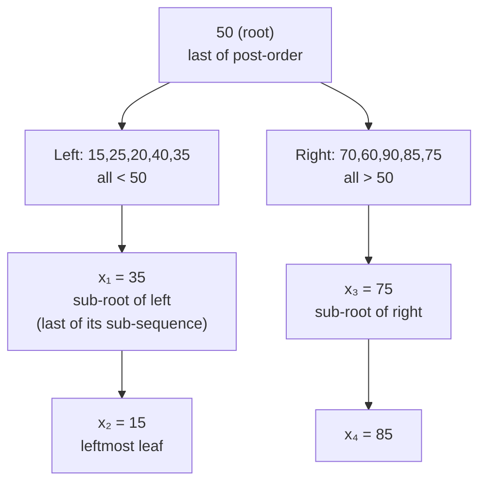
```mermaid
graph TD
    P50["50 (root)<br>last of post-order"] --> PL["Left: 15,25,20,40,35<br>all < 50"]
    P50 --> PR["Right: 70,60,90,85,75<br>all > 50"]
    PL --> PX1["x₁ = 35<br>sub-root of left<br>(last of its sub-sequence)"]
    PR --> PX3["x₃ = 75<br>sub-root of right"]
    PX1 --> PX2["x₂ = 15<br>leftmost leaf"]
    PX3 --> PX4["x₄ = 85"]
```

---

## 17. AVL Tree — Insert + Rotation

### Procedure

1. BST insert (find null position, add node).
2. Walk back up. Compute `BF = height(left) − height(right)` at each ancestor.
3. At first node where `|BF| > 1`: apply one rotation (or double rotation). Done.

### Rotation Case Identification

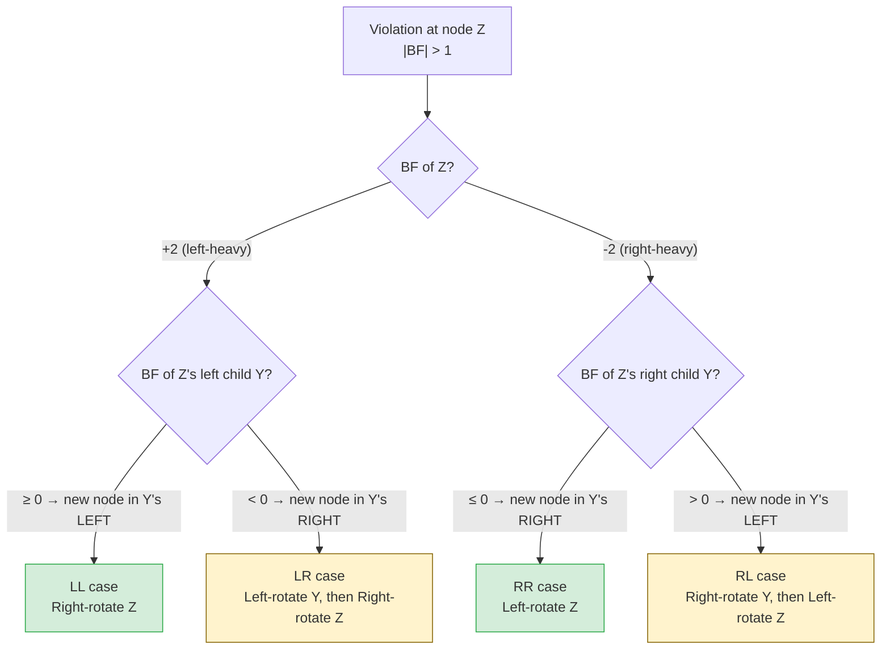
```mermaid
flowchart TD
    A["Violation at node Z<br>|BF| > 1"] --> B{BF of Z?}
    B -->|"+2 (left-heavy)"| C{BF of Z's left child Y?}
    B -->|"-2 (right-heavy)"| D{BF of Z's right child Y?}
    C -->|"≥ 0 → new node in Y's LEFT"| LL["LL case<br>Right-rotate Z"]
    C -->|"< 0 → new node in Y's RIGHT"| LR["LR case<br>Left-rotate Y, then Right-rotate Z"]
    D -->|"≤ 0 → new node in Y's RIGHT"| RR["RR case<br>Left-rotate Z"]
    D -->|"> 0 → new node in Y's LEFT"| RL["RL case<br>Right-rotate Y, then Left-rotate Z"]

    style LL fill:#d4edda,stroke:#28a745
    style RR fill:#d4edda,stroke:#28a745
    style LR fill:#fff3cd,stroke:#856404
    style RL fill:#fff3cd,stroke:#856404
```

### LL Case — Right Rotation at Z

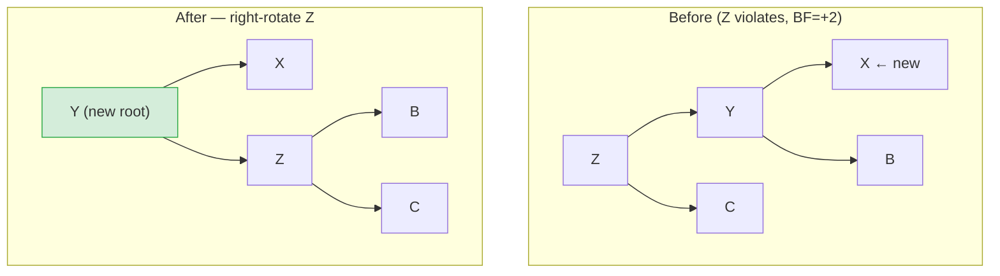
```mermaid
graph TD
    subgraph "Before (Z violates, BF=+2)"
        Z1["Z"] --> Y1["Y"]
        Z1 --> C1["C"]
        Y1 --> X1["X ← new"]
        Y1 --> B1["B"]
    end
    subgraph "After — right-rotate Z"
        Y2["Y (new root)"] --> X2["X"]
        Y2 --> Z2["Z"]
        Z2 --> B2["B"]
        Z2 --> C2["C"]
    end
    style Y2 fill:#d4edda,stroke:#28a745
```

### RR Case — Left Rotation at Z

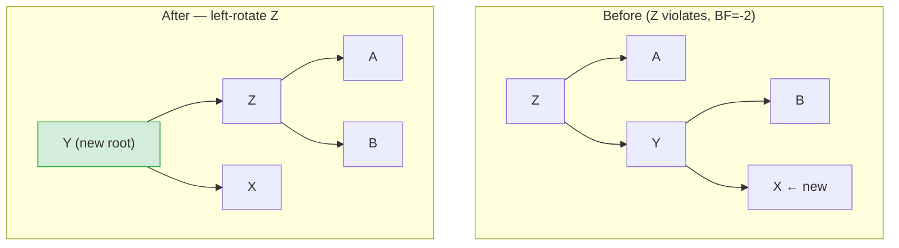
```mermaid
graph TD
    subgraph "Before (Z violates, BF=-2)"
        Z3["Z"] --> A3["A"]
        Z3 --> Y3["Y"]
        Y3 --> B3["B"]
        Y3 --> X3["X ← new"]
    end
    subgraph "After — left-rotate Z"
        Y4["Y (new root)"] --> Z4["Z"]
        Y4 --> X4["X"]
        Z4 --> A4["A"]
        Z4 --> B4["B"]
    end
    style Y4 fill:#d4edda,stroke:#28a745
```

### LR Case — Left-rotate Y, then Right-rotate Z

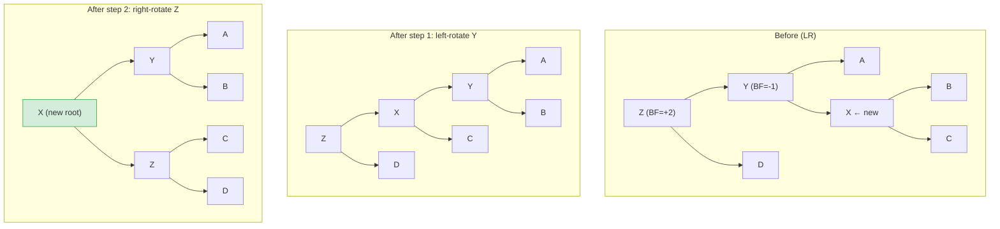
```mermaid
graph TD
    subgraph "Before (LR)"
        Z5["Z (BF=+2)"] --> Y5["Y (BF=-1)"]
        Z5 --> D5["D"]
        Y5 --> A5["A"]
        Y5 --> X5["X ← new"]
        X5 --> B5["B"]
        X5 --> C5["C"]
    end
    subgraph "After step 1: left-rotate Y"
        Z6["Z"] --> X6["X"]
        Z6 --> D6["D"]
        X6 --> Y6["Y"]
        X6 --> C6["C"]
        Y6 --> A6["A"]
        Y6 --> B6["B"]
    end
    subgraph "After step 2: right-rotate Z"
        X7["X (new root)"] --> Y7["Y"]
        X7 --> Z7["Z"]
        Y7 --> A7["A"]
        Y7 --> B7["B"]
        Z7 --> C7["C"]
        Z7 --> D7["D"]
    end
    style X7 fill:#d4edda,stroke:#28a745
```

### RL Case — Right-rotate Y, then Left-rotate Z

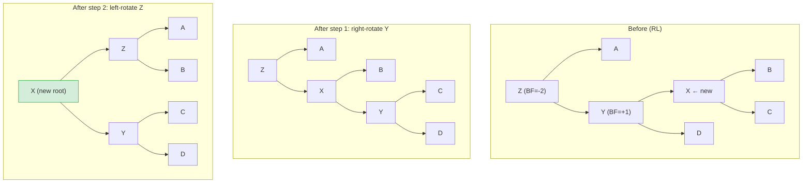
```mermaid
graph TD
    subgraph "Before (RL)"
        Z8["Z (BF=-2)"] --> A8["A"]
        Z8 --> Y8["Y (BF=+1)"]
        Y8 --> X8["X ← new"]
        Y8 --> D8["D"]
        X8 --> B8["B"]
        X8 --> C8["C"]
    end
    subgraph "After step 1: right-rotate Y"
        Z9["Z"] --> A9["A"]
        Z9 --> X9["X"]
        X9 --> B9["B"]
        X9 --> Y9["Y"]
        Y9 --> C9["C"]
        Y9 --> D9["D"]
    end
    subgraph "After step 2: left-rotate Z"
        X10["X (new root)"] --> Z10["Z"]
        X10 --> Y10["Y"]
        Z10 --> A10["A"]
        Z10 --> B10["B"]
        Y10 --> C10["C"]
        Y10 --> D10["D"]
    end
    style X10 fill:#d4edda,stroke:#28a745
```

---

## 18. AVL Tree — Delete

### Procedure

1. **BST delete** (3 cases: leaf / one child / two children with inorder successor).
2. **Walk up** from deletion point, updating heights.
3. At each node with `|BF| > 1`: apply appropriate rotation (same 4 cases as insert).
4. **Keep walking up** — unlike insert, deletion may require multiple rotations.

> [!warning] Insert needs at most **one** rotation. Delete may need **O(log n)** rotations propagating upward.

### Worked Example (Quiz 5 P3) — Delete 33

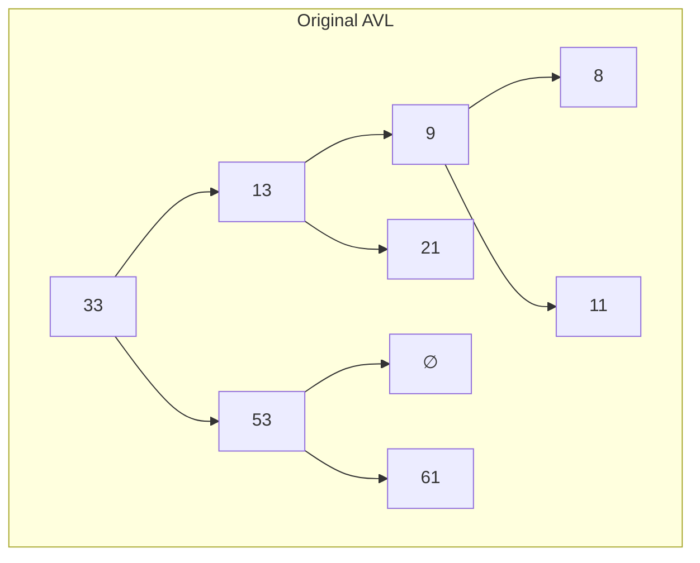
```mermaid
graph TD
    subgraph "Original AVL"
        O33["33"] --> O13["13"]
        O33 --> O53["53"]
        O13 --> O9["9"]
        O13 --> O21["21"]
        O53 --> ONULL["∅"]
        O53 --> O61["61"]
        O9 --> O8["8"]
        O9 --> O11["11"]
    end
```

After BST delete 33: inorder successor=53 replaces it; original 53 removed
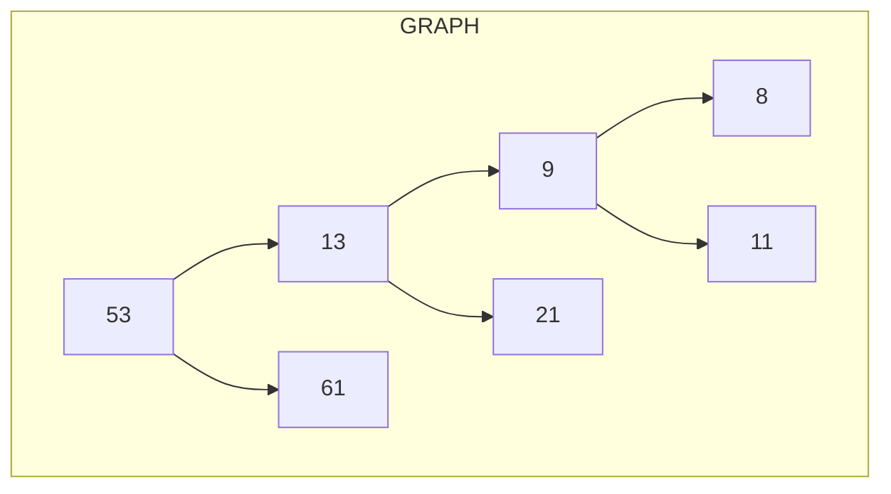
```mermaid
graph TD
    subgraph "GRAPH"
        S53["53"] --> S13["13"]
        S53 --> S61["61"]
        S13 --> S9["9"]
        S13 --> S21["21"]
        S9 --> S8["8"]
        S9 --> S11["11"]
    end
```

"Rebalance: BF at 53 = +2, left child 13 has BF=-1 → LR case<br>Left-rotate 13, then right-rotate 53
```mermaid
graph TD
    subgraph "GRAPH"
        R13["13 (new root)"] --> R9["9"]
        R13 --> R53["53"]
        R9 --> R8["8"]
        R9 --> R11["11"]
        R53 --> R21["21"]
        R53 --> R61["61"]
        style R13 fill:#d4edda,stroke:#28a745
    end
```

---

## 19. Graph — Degree Sequences & Properties

### Handshake Theorem

$$\sum_{v \in V} \deg(v) = 2|E| \quad \Rightarrow \quad \text{sum of all degrees must be EVEN}$$

If sum is odd → **instantly No**.

### Degree Sequence Validity

1. Sum all degrees. **Odd → No.**
2. If even → check if any degree ≥ n (impossible) → if clear, try to draw or apply Erdős–Gallai.

### Graph Property Reference

| Statement                     | How to verify                                   |
| ----------------------------- | ----------------------------------------------- |
| Is a tree                     | Connected AND $E=V-1$                           |
| Euler **circuit**             | Connected AND **all** degrees even              |
| Euler **trail** (not circuit) | Connected AND **exactly 2** odd-degree vertices |
| $K_n$ edges                   | $E= n(n-1)/2$                                   |
| BFS/DFS on adjacency list     | $O(V+E)$                                        |
| BFS/DFS on adjacency matrix   | $O(V^2)$                                        |

### Worked Example (Quiz 6 P2)

| Sequence | Sum | Verdict |
|---|---|---|
| 6,5,4,2,1,1,1,1 | **21** | ❌ odd |
| 7,6,5,4,3,2,1 | 28 | ✅ |
| 6,6,6,6,3,3,2,2 | 34 | ✅ |
| 7,6,6,4,4,3,2,2 | 34 | ✅ |
| 8,7,7,6,4,2,1,1 | 36 | ✅ |

---

## 20. Graph — BFS and DFS Traversal

### BFS — uses a Queue

```
enqueue(start); mark start visited
while queue not empty:
    v = dequeue()
    for each neighbor u of v:
        if u not visited: mark u; enqueue(u); parent[u]=v
```

- Visits level by level. Finds **shortest path** (fewest edges) from start.

### DFS — uses a Stack (or recursion)

```
push(start)
while stack not empty:
    v = pop()
    if v not visited:
        mark v visited
        push all unvisited neighbors of v
```

### BFS vs DFS Summary

| | BFS | DFS |
|---|---|---|
| Data structure | Queue (FIFO) | Stack / recursion |
| Visit order | Level by level | Depth first |
| Finds shortest path? | ✅ Yes (unweighted) | ❌ No |
| Complexity (adj. list) | O(V+E) | O(V+E) |

---

## 21. Graph — Prim's MST

### Procedure

```
visited = {start}; MST = {}
while visited != all vertices:
    pick min-weight edge (u,v): u ∈ visited, v ∉ visited
    add v to visited; add (u,v) to MST
```

After adding each vertex, add all its edges to unvisited vertices to your candidate list.

### Worked Example (Quiz 6, start=F, x=8)

| Step | Edge added | Weight | Visited set |
|---|---|---|---|
| 1 | (F,G) | 5 | {F,G} |
| 2 | (G,H) | 5 | {F,G,H} |
| 3 | (H,I) | 5 | {F,G,H,I} |
| 4 | (H,A) | 6 | {F,G,H,I,A} |
| 5 | (F,E) | 7 | {F,G,H,I,A,E} |
| 6 | (E,D) | 8 | {F,G,H,I,A,E,D} |
| 7 | (A,B) | 8 | {F,G,H,I,A,E,D,B} |
| 8 | (B,C) | 7 | all visited |

Total MST weight = 5+5+5+6+7+8+8+7 = **51** ✓

---

## 22. Graph — Kruskal's MST

### Procedure

```
Sort all edges by weight (ascending)
MST = {}
for each edge (u,v) in sorted order:
    if u and v are in DIFFERENT components:
        add (u,v) to MST; merge their components
    if |MST| == |V|-1: stop
```

**Cycle check:** if both endpoints already in the same component → skip.

### Kruskal vs Prim

| | Kruskal | Prim |
|---|---|---|
| Strategy | Sort all edges globally | Grow from one vertex greedily |
| Best for | Sparse graphs | Dense graphs |
| Data structure | Union-Find | Priority queue |
| Complexity | O(E log E) | O((V+E) log V) |

---

## 23. Graph — Dijkstra's Shortest Paths

### Procedure

```
dist[source]=0; dist[all others]=∞; visited={}
while unvisited vertices remain:
    u = unvisited vertex with min dist[u]
    mark u visited (distance is now FINAL)
    for each neighbor v of u:
        if dist[u] + w(u,v) < dist[v]:
            dist[v] = dist[u] + w(u,v); prev[v] = u
```

> [!warning] Once marked visited, a node's distance is **final** — never update it again. Requires non-negative edge weights.

### Exam Table Format (Quiz 6 style)

Draw one column per vertex, one row per iteration. Strike through a distance when that vertex is visited.

| Step | A | B | C | D | E | F | G | H | I | Visited |
|---|---|---|---|---|---|---|---|---|---|---|
| Init | **0** | ∞ | ∞ | ∞ | ∞ | ∞ | ∞ | ∞ | ∞ | — |
| Visit A | ~~0~~ | 8 | ∞ | ∞ | ∞ | ∞ | ∞ | 6 | ∞ | {A} |
| Visit H (6) | — | ~~8~~ | ∞ | ∞ | ∞ | ∞ | 11 | ~~6~~ | 11 | {A,H} |
| Visit B/I ... | — | — | ... | ... | ... | ... | ... | — | ... | ... |

**"Which vertices unaffected by x?"** — vertices whose shortest path from source doesn't use the edge with weight $x$. Quiz 6 answer: A,B,C,D,H,I,G unaffected; only F and E affected.

---

## 24. Dynamic Programming — Matrix Chain

### Setup

$n$ matrices, $M_i$ has size $p_{i-1} \times p_i$. Cost of multiplying $(p\times q)\cdot(q\times r) = p\cdot q\cdot r$.

### Recurrence

$$m(i,j) = \min_{i \leq k < j} \bigl[ m(i,k) + m(k+1,j) + p_{i-1} \cdot p_k \cdot p_j \bigr], \quad m(i,i)=0$$

$s(i,j)$ stores the optimal $k$ for reconstruction.

### Fill Order

Fill by **chain length** $\ell = 2, 3, \ldots, n$ (diagonal by diagonal). For each $\ell$, compute all $m(i,\, i+\ell-1)$.

### Worked Example — $p=[5,4,6,2,7]$

**m table:**

| | 1 | 2 | 3 | 4 |
|---|---|---|---|---|
| **1** | 0 | 120 | 88 | **158** |
| **2** | — | 0 | 48 | 104 |
| **3** | — | — | 0 | 84 |
| **4** | — | — | — | 0 |

**s table:**

| | 2 | 3 | 4 |
|---|---|---|---|
| **1** | 1 | 1 | **3** |
| **2** | — | 2 | 3 |
| **3** | — | — | 3 |

**Reconstruction from s:** $s(1,4)=3$ → split $(M_1 M_2 M_3)\cdot M_4$; $s(1,3)=1$ → $M_1\cdot(M_2 M_3)$; $s(2,3)=2$ → $M_2\cdot M_3$.
**Optimal parenthesization:** $((M_1(M_2 M_3))M_4)$, cost = **158** ✓

---

## 25. Dynamic Programming — 0-1 Knapsack

### Recurrence

$$V(k,w) = \begin{cases} V(k-1,w) & w_k > w \\ \max(V(k-1,w),\ v_k + V(k-1,w-w_k)) & w_k \leq w \end{cases}, \quad V(0,w)=0$$

### Fill Order: row by row ($k=0\ldots n$), left to right ($w=0\ldots W$).

### Worked Example ($n=4$, $W=5$, weights=[2,3,4,5], values=[3,4,5,6])

| k\w | 0 | 1 | 2 | 3 | 4 | 5 |
|---|---|---|---|---|---|---|
| 0 | 0 | 0 | 0 | 0 | 0 | 0 |
| 1 | 0 | 0 | **3** | 3 | 3 | 3 |
| 2 | 0 | 0 | 3 | 4 | 4 | **7** |
| 3 | 0 | 0 | 3 | 4 | 5 | 7 |
| 4 | 0 | 0 | 3 | 4 | 5 | 7 |

**Answer: V(4,5) = 7**

### Backtrack

Start at $(k=n, w=W)$. If $V(k,w) = V(k-1,w)$ → item $k$ **not** taken, move to $(k-1,w)$. Else → item $k$ **taken**, move to $(k-1,\, w-w_k)$.

| k | w | V(k,w) | V(k-1,w) | Decision |
|---|---|---|---|---|
| 4 | 5 | 7 | V(3,5)=7 | equal → **NOT taken** |
| 3 | 5 | 7 | V(2,5)=7 | equal → **NOT taken** |
| 2 | 5 | 7 | V(1,5)=3 | differs → **TAKEN**, w=5−3=2 |
| 1 | 2 | 3 | V(0,2)=0 | differs → **TAKEN** |

**Optimal: {item 1, item 2}**, weight=5, value=7 ✓

---

## 26. Dynamic Programming — LCS

### Recurrence

$$L(i,j) = \begin{cases} 0 & i=0 \text{ or } j=0 \\ 1 + L(i-1,j-1) & x_i = y_j \\ \max(L(i-1,j),\ L(i,j-1)) & x_i <br>eq y_j \end{cases}$$

### Fill Order: row by row, left to right.

### Backtrack

From cell $(m, n)$: if $x_i = y_j$ → add char, go to $(i-1,j-1)$ ↖. Else go to whichever of $(i-1,j)$ ↑ or $(i,j-1)$ ← is larger (either on tie).

### Worked Example — X=ABCB, Y=BDCAB

| i\j | ∅ | B | D | C | A | B |
|---|---|---|---|---|---|---|
| ∅ | 0 | 0 | 0 | 0 | 0 | 0 |
| A | 0 | 0 | 0 | 0 | **1** | 1 |
| B | 0 | **1** | 1 | 1 | 1 | **2** |
| C | 0 | 1 | 1 | **2** | 2 | 2 |
| B | 0 | 1 | 1 | 2 | 2 | **3** |

**LCS length = 3.** Backtrack:

| Cell | x vs y | Move | Collect |
|---|---|---|---|
| (4,5) | B=B ✅ | → (3,4) ↖ | B |
| (3,4) | C≠A; L(2,4)=1 < L(3,3)=2 | → (3,3) ← | — |
| (3,3) | C=C ✅ | → (2,2) ↖ | C |
| (2,2) | B≠D; L(1,2)=0 < L(2,1)=1 | → (2,1) ← | — |
| (2,1) | B=B ✅ | → (1,0) ↖ | B |

Reading collected chars in reverse: **LCS = BCB** ✓

---

## 🚨 Master Trap List

> [!warning] These mistakes cost the most exam points

1. **Descending binary search:** `A[mid] > target` → go RIGHT (not left).
2. **Postfix pop order:** `b = pop()` first, `a = pop()` second. Compute `a OP b`.
3. **Heap indices:** 0-indexed. left = `2i+1`, right = `2i+2`, parent = `(i-1)/2`.
4. **Heapify start:** index `floor(n/2) - 1`, NOT `n-1`.
5. **AVL rotation case:** determined by where NEW NODE is relative to VIOLATING ANCESTOR — not the direct parent.
6. **AVL delete:** may need multiple rotations upward. Insert needs at most one.
7. **Hashing probe count:** starts at 1 (the initial probe counts).
8. **Tombstone insert:** probe past DELETED slots but INSERT at first DELETED found (after confirming key absent).
9. **Degree sequence:** odd sum → instantly ❌ No.
10. **Dijkstra:** once visited, distance is final. Negative weights → don't use Dijkstra.
11. **Merge sort stability:** uses `A[i] <= A[j]` — ties go to left half (stable).
12. **QuickSort pivot:** median-of-three = A[0], A[mid], A[last] — NOT the first three elements.
13. **DP matrix chain:** cost = `p[i-1] * p[k] * p[j]` — outer dims of left block × right dim of right block.
14. **Knapsack backtrack:** `V(k,w) == V(k-1,w)` → item NOT included (equal means skip).
15. **LCS backtrack:** on tie between ↑ and ←, either direction is valid — be consistent.
16. **Radix sort:** LSD (units) first → MSD last. Opposite order = wrong.
17. **Linked list PickAfter:** detaches only, does NOT free memory.

---

*61CSE108 Data Structures and Algorithms — VGU | Lectures 2–10 + Quiz 1–6*
