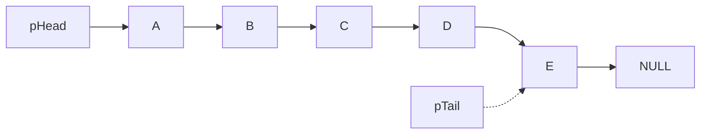
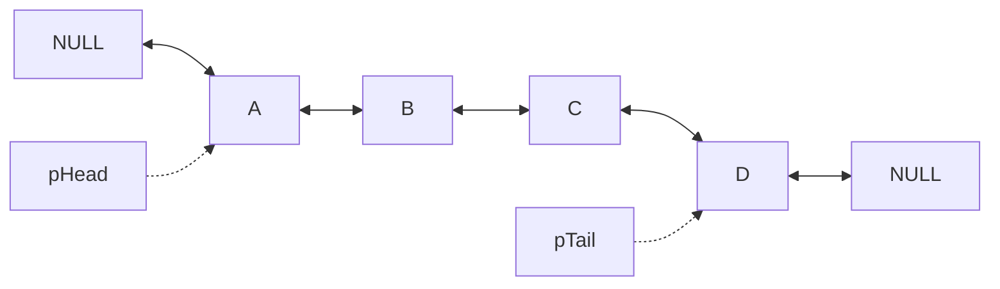
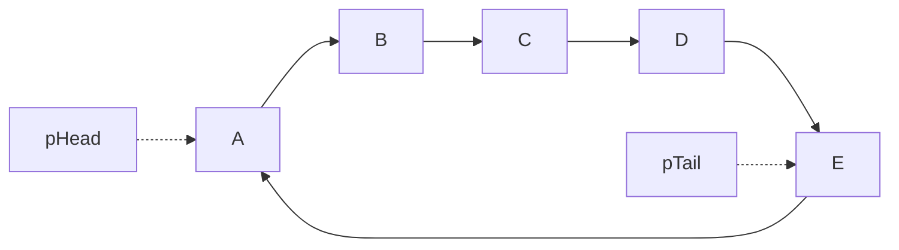
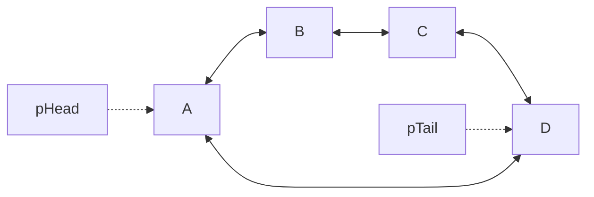
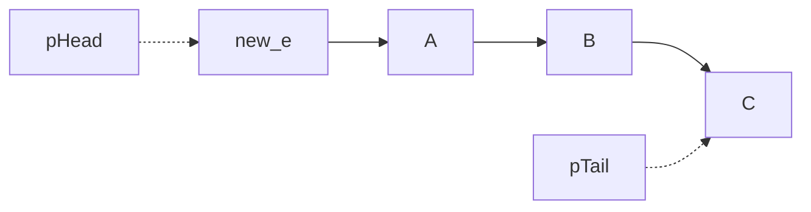

> [!Note] 💡 Notation Conventions
> - `NODE*` — pointer to a node in the list
> - `pHead` — pointer to the **first** (head) node of the list
> - `pTail` — pointer to the **last** (tail) node of the list
> - `pNext` — pointer inside a node to the **next** node
> - `pPrev` — pointer inside a node to the **previous** node (doubly linked only)
> - `Info` — the data payload stored inside a node
> - `NULL` — the null pointer, signifying "no node" (empty slot or end of list)
> - All code examples are in C++.

---

# Linked Lists

## 📖 Part 1 — Conceptual Section

### Why Linked Lists?

Arrays store elements **implicitly**: element $x_{i+1}$ is assumed to follow $x_i$ because they occupy adjacent memory. This gives $O(1)$ random access but forces contiguous allocation, a fixed (or pre-allocated) size, and $O(n)$ cost for insertions and deletions (due to element shifting).

Linked lists store elements **explicitly**: each element (called a **node**) holds its own data *and* a pointer to the next (or previous) node. Nodes can be scattered anywhere in memory.

> [!Property] ⚙️ Array vs Linked List Trade-offs
>
> | Criterion | Array | Linked List |
> |---|---|---|
> | Access time | $O(1)$ (index) | $O(n)$ (traverse) |
> | Insertion/Deletion | $O(n)$ (shift) | $O(1)$ (if position known) |
> | Memory | Contiguous block | Scattered, dynamic |
> | Resizing cost | $O(n)$ | $O(1)$ per node |
> | Best sorting algo | QuickSort, MergeSort | MergeSort, QuickSort |
> | Implementation | Simpler | More complex (pointers) |
> | Use case | Static, size-known data | Dynamic, frequently changing data |

> [!Property] ⚙️ Linked List Advantages and Disadvantages
>
> **Advantages:**
> - **No fixed size** — grows or shrinks dynamically; no wasted pre-allocated space.
> - **Efficient insertion/deletion** — no element shifting required.
> - **Flexible memory** — nodes can reside anywhere in memory; no need for contiguous blocks.
>
> **Disadvantages:**
> - **Memory overhead** — each node pays extra space for its pointer field(s).
> - **Slower random access** — reaching element $i$ requires traversing from `pHead`.
> - **Complex implementation** — pointer manipulation is error-prone.

---

### Types of Linked Lists

#### Singly Linked List (SLL)

Each node holds data and one pointer to the **next** node. The last node's `pNext` is `NULL`.

```cpp
typedef struct tagNode {
    Data Info;             // data payload
    struct tagNode *pNext; // pointer to the next node
} NODE;

typedef struct tagList {
    NODE *pHead;  // first element
    NODE *pTail;  // last element
} LIST;
```



> [!Definition] 📖 Singly Linked List
> A linear data structure where each node stores a data value (`Info`) and a single forward pointer (`pNext`). The list is accessed via `pHead`; the last node has `pNext = NULL`.

---

#### Doubly Linked List (DLL)

Each node holds data and **two** pointers: `pNext` (forward) and `pPrev` (backward). Both ends point outward to `NULL`.

```cpp
typedef struct tagDNode {
    Data Info;
    struct tagDNode *pNext, *pPrev;
} DNODE;

typedef struct tagDList {
    DNODE *pHead;
    DNODE *pTail;
} DLIST;
```



> [!Definition] 📖 Doubly Linked List
> Each node has both `pNext` (to successor) and `pPrev` (to predecessor), enabling $O(1)$ traversal in both directions.

---

#### Circular Singly Linked List (CSLL)

Same structure as SLL, but the last node's `pNext` wraps back to `pHead` instead of `NULL`.

```cpp
// Node structure identical to SLL (CNODE / tagCNode)
// Key invariant enforced after construction:
pTail->pNext = pHead;
```



---

#### Circular Doubly Linked List (CDLL)

Combines DLL and circular: both `pTail->pNext = pHead` and `pHead->pPrev = pTail`.

```cpp
pTail->pNext = pHead;
pHead->pPrev = pTail;
```



---

### Operations on Singly Linked Lists

#### Initialize and Check Empty

```cpp
void Init(LIST &l) {
    l.pHead = l.pTail = NULL;
}

bool isEmpty(LIST &l) {
    return l.pHead == NULL;
}
```

> [!Note] 💡 An empty list has both `pHead` and `pTail` set to `NULL`. Always initialize before use.

---

#### Create a Node

`GetNode(x)` — allocates a new node on the heap, writes `x` into `Info`, and sets `pNext = NULL`.

```cpp
NODE* GetNode(Data x) {
    NODE *p = new NODE;
    if (p == NULL) {
        cout << "Not enough memory" << endl;
        return NULL;
    }
    p->Info = x;
    p->pNext = NULL;
    return p;
}
```

> [!Definition] 📖 Node Allocation
> `GetNode(x)` is the factory function for all insertions. It returns a pointer to an isolated, heap-allocated node containing data `x`. Its `pNext` is `NULL` until linked into a list.

---

#### Add an Element

Four insertion positions are defined. All share the same preamble: call `GetNode(x)`, check for `NULL`, then delegate to the appropriate `Add*` helper.

**1. Add at the beginning — `AddFirst`**

```cpp
void AddFirst(LIST &l, NODE* new_e) {
    if (l.pHead == NULL)           // empty list
        l.pHead = l.pTail = new_e;
    else {
        new_e->pNext = l.pHead;    // new node points to old head
        l.pHead = new_e;           // head advances to new node
    }
}

NODE* InsertHead(LIST &l, Data x) {
    NODE* new_e = GetNode(x);
    if (new_e == NULL) return NULL;
    AddFirst(l, new_e);
    return new_e;
}
```



---

**2. Append at the end — `AddTail`**

```cpp
void AddTail(LIST &l, NODE* new_e) {
    if (l.pHead == NULL)
        l.pHead = l.pTail = new_e;
    else {
        l.pTail->pNext = new_e;    // old tail links forward to new node
        l.pTail = new_e;           // tail pointer advances
    }
}

NODE* InsertTail(LIST &l, Data x) {
    NODE* new_e = GetNode(x);
    if (new_e == NULL) return NULL;
    AddTail(l, new_e);
    return new_e;
}
```

> [!Warning] ⚠️ Possible Gap
> The slide's `AddTail` non-empty branch shows `new_e->pNext = l.pTail; l.pTail = new_e;` which is incorrect — it would make `new_e` point backward to the old tail, corrupting the list. The correct implementation is `l.pTail->pNext = new_e; l.pTail = new_e;` as shown above.

---

**3. Insert after node `q` — `AddAfter`**

`q` — the existing node after which `new_e` will be inserted.

```cpp
void AddAfter(LIST &l, NODE *q, NODE* new_e) {
    if (q != NULL) {
        new_e->pNext = q->pNext;   // new node inherits q's successor
        q->pNext = new_e;          // q now points forward to new node
        if (q == l.pTail)
            l.pTail = new_e;       // update tail if q was the last node
    } else
        AddFirst(l, new_e);        // q == NULL → insert at head
}
```

---

**4. Insert before node `q` — `AddBefore`**

Strategy: locate the predecessor `p` of `q` using `findBefore`, then call `AddAfter(l, p, new_e)`.

```cpp
void AddBefore(LIST &l, NODE *q, NODE* new_e) {
    if (q != NULL) {
        NODE* p = findBefore(l, q);  // traverse to find node before q
        AddAfter(l, p, new_e);
    } else
        AddFirst(l, new_e);
}
```

> [!Note] 💡 `findBefore(l, q)` scans from `pHead` until `p->pNext == q` and returns `p`. If `q == pHead`, it returns `NULL`, causing `AddAfter` to fall through to `AddFirst`.

---

#### Search

Linear scan from `pHead`; stops when `p->Info == K` (found) or `p == NULL` (not found).

```cpp
NODE* Search(LIST l, Data K) {
    NODE *p = l.pHead;
    while ((p != NULL) && (p->Info != K))
        p = p->pNext;
    return p;  // NULL if not found
}
```

> [!Property] ⚙️ Search Complexity
> Time: $O(n)$ — must traverse sequentially. No binary search is possible without random access.

---

#### Extract an Element

> [!Warning] ⚠️ Extract ≠ Delete
> `Pick*` functions **detach** a node from the list and return a pointer to it — they do NOT free memory. Call `delete p` explicitly afterward if the node is no longer needed.

Three extraction cases:

**Extract the head node — `PickHead`**

```cpp
NODE* PickHead(LIST &l) {
    NODE *p = NULL;
    if (l.pHead != NULL) {
        p = l.pHead;
        l.pHead = l.pHead->pNext;  // advance head
        p->pNext = NULL;            // isolate extracted node
        if (l.pHead == NULL)
            l.pTail = NULL;         // list is now empty
    }
    return p;
}
```

**Extract and delete the head — `RemoveHead`**

```cpp
Data RemoveHead(LIST &l) {
    if (l.pHead == NULL) return NULLDATA;
    NODE* p = PickHead(l);
    Data x = p->Info;
    delete p;
    return x;
}
```

---

**Extract the node after `q` — `PickAfter`**

`q` — predecessor of the node to be removed; pass `NULL` to extract the head.

```cpp
NODE* PickAfter(LIST &l, NODE *q) {
    NODE *p;
    if (q != NULL) {
        p = q->pNext;               // p is the node to remove
        if (p != NULL) {
            if (p == l.pTail)
                l.pTail = q;        // update tail if p was last
            q->pNext = p->pNext;    // bypass p
            p->pNext = NULL;
        }
    } else
        p = PickHead(l);
    return p;
}
```

**Extract and delete after `q` — `RemoveAfter`**

```cpp
Data RemoveAfter(LIST &l, NODE *q) {
    NODE *p = PickAfter(l, q);
    if (p == NULL) return NULLDATA;
    Data x = p->Info;
    delete p;
    return x;
}
```

---

**Extract the node with value `K` — `PickNode`**

Traverse simultaneously tracking the target `p` and its predecessor `q`, then call `PickAfter(l, q)`.

```cpp
NODE* PickNode(LIST &l, Data K) {
    NODE *p = l.pHead, *q = NULL;
    while ((p != NULL) && (p->Info != K)) {
        q = p;
        p = p->pNext;
    }
    if (p == NULL) return NULL;     // K not in list
    return PickAfter(l, q);
}
```

**Extract and delete by value — `RemoveNode`**

```cpp
Data RemoveNode(LIST &l, Data K) {
    NODE *p = PickNode(l, K);
    if (p == NULL) return NULLDATA;
    Data x = p->Info;
    delete p;
    return x;
}
```

---

#### Traverse the List

Walk every node from `pHead` to the last, applying `ProcessNode(p)` at each step.

```cpp
void ProcessList(LIST &l) {
    NODE *p = l.pHead;
    while (p != NULL) {
        ProcessNode(p);   // application-specific operation
        p = p->pNext;
    }
}
```

> [!Note] 💡 Traversal Use Cases
> Counting elements, printing values, finding all nodes satisfying a condition, computing aggregates (sum, min, max), and deleting the entire list are all implemented as traversals.

---

#### Delete the Entire List

Repeatedly extract and free the head node until the list is empty. Set `pTail = NULL` at the end.

```cpp
void RemoveList(LIST &l) {
    NODE *p;
    while (l.pHead != NULL) {
        p = l.pHead;
        l.pHead = p->pNext;
        delete p;
    }
    l.pTail = NULL;
}
```

---

### Sorting Singly Linked Lists

Two general strategies exist:

> [!Property] ⚙️ Sorting Approach Comparison
>
> | Criterion | Option 1: Swap Contents (Info) | Option 2: Change Links (pNext) |
> |---|---|---|
> | Mechanism | Swap data values between nodes | Rewire `pNext` pointers |
> | Data movement | Values only | Entire node references |
> | Complexity fit | BubbleSort, QuickSort | MergeSort, QuickSort |
> | Stability | Depends on implementation | Naturally stable |
> | Implementation | Simpler (array-like) | Complex (pointer-heavy) |
> | Use case | Simple data types | Large structs, objects |

**The lecture covers only Option 2 (changing links).**

---

#### List-Based Selection Sort

**Algorithm:**
**1.** Initialize an empty result list `lResult`.
**2.** While the input list `l` is non-empty: find the predecessor `minprev` of the minimum node, extract that minimum node via `PickAfter(l, minprev)`, and append it to `lResult`.
**3.** Assign `l = lResult`.

```cpp
NODE* FindMinprev(LIST l) {
    NODE *min, *minprev, *p, *q;
    minprev = q = NULL;
    min = p = l.pHead;
    while (p != NULL) {
        if (p->Info < min->Info) {
            min = p;
            minprev = q;
        }
        q = p;
        p = p->pNext;
    }
    return minprev;   // predecessor of the minimum node
}

void ListSelectionSort(LIST &l) {
    LIST lResult;
    NODE *min, *minprev;
    lResult.pHead = lResult.pTail = NULL;
    while (l.pHead != NULL) {
        minprev = FindMinprev(l);
        min = PickAfter(l, minprev);
        AddTail(lResult, min);
    }
    l = lResult;
}
```

> [!Property] ⚙️ Selection Sort Complexity
> Each of $n$ passes scans the remaining sublist: $O(n) + O(n-1) + \cdots + O(1) = O(n^2)$ comparisons. No extra heap allocations — only pointer rewiring.

---

#### List-Based Quick Sort

**Algorithm:**
**1.** Base case: if the list has 0 or 1 element (`pHead == pTail`), return immediately.
**2.** Extract the head node as pivot `X`.
**3.** Partition the remaining nodes: elements $\leq X$ go to `list1`, elements $> X$ go to `list2`.
**4.** Recursively sort `list1` and `list2`.
**5.** Concatenate: `list = list1 + [X] + list2` using `LISTAppend` and `AddTail`.

```cpp
void LISTAppend(LIST &list, LIST &list2) {
    if (list2.pHead == NULL) return;
    if (list.pHead == NULL)
        list = list2;
    else {
        list.pTail->pNext = list2.pHead;  // splice list2 onto tail
        list.pTail = list2.pTail;
    }
    Init(list2);   // reset list2 to empty
}

void ListQuickSort(LIST &list) {
    NODE *X, *p;
    LIST list1, list2;
    if (list.pHead == list.pTail) return;  // base case: 0 or 1 node
    Init(list1); Init(list2);
    X = PickHead(list);                    // pivot = detached head node
    while (list.pHead != NULL) {
        p = PickHead(list);
        if (p->Info <= X->Info) AddTail(list1, p);
        else                    AddTail(list2, p);
    }
    ListQuickSort(list1);
    ListQuickSort(list2);
    LISTAppend(list, list1);  // concatenate sorted left partition
    AddTail(list, X);          // place pivot
    LISTAppend(list, list2);  // concatenate sorted right partition
}
```

> [!Property] ⚙️ Quick Sort Complexity on Linked Lists
> Average case: $O(n \log n)$. Worst case (already-sorted input with first-element pivot): $O(n^2)$. `PickHead` and `AddTail` are both $O(1)$, so partitioning each level costs $O(n)$ — same asymptotic profile as array quicksort but without index arithmetic.

---

## 📘 Part 2 — Examples & Applications

### Struct Definition Example

> [!Example] 📘 Singly Linked List for Student Records
> **Using:** struct nesting, SLL structure definition
>
> ```cpp
> typedef struct Student {
>     char Name[30];
>     int  StudentID;
> } STUDENT;
>
> typedef struct StudentNode {
>     STUDENT Info;               // payload is a full STUDENT record
>     struct StudentNode *pNext;
> } StudentNODE;
>
> typedef struct studentList {
>     StudentNODE *pHead;
>     StudentNODE *pTail;
> } LIST;
> ```
>
> Each node's `Info` field holds an entire `STUDENT` struct. The list container exposes only `pHead` and `pTail`.

---

### Selection Sort Trace

> [!Example] 📘 Selection Sort on `[7, 2, 1, 5, 3, 6, 19, 9]`
> **Using:** `FindMinprev`, `PickAfter`, `AddTail`, link rewiring
>
> Initial: $7 \to 2 \to 1 \to 5 \to 3 \to 6 \to 19 \to 9$, `lResult` = empty.
>
> **Pass 1:** Scan all 8 nodes. Min = $1$, `minprev` = node(2). Extract node(1). Append to `lResult`.
> `lResult`: $1$
>
> **Pass 2:** Remaining: $7 \to 2 \to 5 \to 3 \to 6 \to 19 \to 9$. Min = $2$, `minprev` = node(7). Extract node(2).
> `lResult`: $1 \to 2$
>
> **Pass 3:** Min = $3$, extract.
> `lResult`: $1 \to 2 \to 3$
>
> Continuing: $5$, $6$, $7$, $9$, $19$ are extracted in order.
>
> **Final:** `l = lResult =` $1 \to 2 \to 3 \to 5 \to 6 \to 7 \to 9 \to 19$ ✓

---

### Quick Sort Full Trace

> [!Example] 📘 Quick Sort on `[7, 2, 1, 5, 3, 6, 19, 9]`
> **Using:** `PickHead`, `AddTail`, `LISTAppend`, recursion, first-element pivot
>
> **Level 0 call — `ListQuickSort([7,2,1,5,3,6,19,9])`**
>
> Pivot $X = 7$. Partition remaining $[2, 1, 5, 3, 6, 19, 9]$:
> $$\text{list1} = [2, 1, 5, 3, 6], \quad \text{list2} = [19, 9]$$
>
> ---
>
> **Level 1a — `ListQuickSort([2,1,5,3,6])`**
>
> Pivot $X = 2$. Partition $[1, 5, 3, 6]$:
> $$\text{list1} = [1], \quad \text{list2} = [5, 3, 6]$$
>
> **Level 2a — `ListQuickSort([1])`** → base case, return.
>
> **Level 2b — `ListQuickSort([5,3,6])`**
> Pivot $X = 5$. Partition $[3, 6]$:
> $$\text{list1} = [3], \quad \text{list2} = [6]$$
> Both are base cases. Concatenate: $[3] + [5] + [6] = [3, 5, 6]$.
>
> Back at Level 1a: concatenate $[1] + [2] + [3,5,6] = [1, 2, 3, 5, 6]$.
>
> ---
>
> **Level 1b — `ListQuickSort([19,9])`**
>
> Pivot $X = 19$. Partition $[9]$:
> $$\text{list1} = [9], \quad \text{list2} = []$$
> Concatenate: $[9] + [19] + [] = [9, 19]$.
>
> ---
>
> **Back at Level 0:** Concatenate:
> $$[1,2,3,5,6] + [7] + [9,19] = [1,2,3,5,6,7,9,19] \checkmark$$

---

### Exam-Style Combined Problem

> [!Example] 📘 Remove All Even-Valued Nodes
> **Using:** traversal, `PickAfter`, `delete`, predecessor tracking
>
> **Problem:** Remove and free all nodes whose `Info` is even from a singly linked list.
>
> **Solution:**
> ```cpp
> void RemoveEvens(LIST &l) {
>     NODE *p = l.pHead, *q = NULL;
>     while (p != NULL) {
>         NODE *next = p->pNext;        // save next before possible detach
>         if (p->Info % 2 == 0) {
>             NODE *ex = PickAfter(l, q); // detach p (q's successor, or head)
>             delete ex;
>             // q does NOT advance — its successor is already the new p
>         } else {
>             q = p;                    // advance predecessor only when keeping p
>         }
>         p = next;
>     }
> }
> ```
>
> **Trace on `[1, 4, 2, 7, 6]`:**
>
> **1.** $p = 1$ (odd): keep. $q =$ node(1). $p \to$ node(4).
> **2.** $p = 4$ (even): `PickAfter(l, q)` detaches node(4); `delete`. $q$ stays node(1). $p \to$ node(2).
> **3.** $p = 2$ (even): detach, delete. $q$ stays node(1). $p \to$ node(7).
> **4.** $p = 7$ (odd): keep. $q =$ node(7). $p \to$ node(6).
> **5.** $p = 6$ (even): detach, delete. $q$ stays node(7). $p \to$ NULL.
>
> **Result:** $1 \to 7$ ✓

---

## 🗂️ Part 3 — Summary

- A **linked list** uses explicit pointer links instead of contiguous memory, enabling $O(1)$ insertion/deletion at a known position but requiring $O(n)$ traversal for element access.
- Four types: **Singly** (one forward pointer per node), **Doubly** (forward + backward per node), **Circular Singly** (`pTail->pNext = pHead`), **Circular Doubly** (both circular constraints hold simultaneously).
- Core SLL structure: `NODE` holds `Info` (data) and `pNext` (forward pointer); `LIST` holds `pHead` and `pTail`.
- **Init:** `pHead = pTail = NULL`. **isEmpty:** `pHead == NULL`.
- **GetNode(x):** heap-allocates a node, sets `Info = x` and `pNext = NULL`; returns the pointer.
- **Insertion positions:** head (`AddFirst`), tail (`AddTail`), after node `q` (`AddAfter`), before node `q` (`AddBefore` — finds predecessor first via `findBefore`).
- **Search:** linear scan $O(n)$; returns `NODE*` or `NULL`.
- **Pick\* vs Remove\*:** `Pick*` detaches without freeing — you must call `delete` separately. `Remove*` calls `Pick*` then `delete` and returns the data value.
- **Traversal pattern:** `p = pHead; while(p != NULL) { process(p); p = p->pNext; }`.
- **Delete entire list:** loop `PickHead` + `delete`; set `pTail = NULL` at end.
- **Sorting strategy — Option 2 (link rewiring):**
  - **Selection Sort** $O(n^2)$: find minimum via `FindMinprev`, extract via `PickAfter`, append to result list; repeat.
  - **Quick Sort** $O(n \log n)$ avg: pivot = `PickHead`; partition into `list1` ($\leq$ pivot) and `list2` ($>$ pivot); recurse; concatenate with `LISTAppend` ($O(1)$) and `AddTail`.
- **`LISTAppend(list, list2)`:** splices `list2` onto the tail of `list` in $O(1)$ by linking `list.pTail->pNext = list2.pHead` and updating `list.pTail`.
- Array sorting prefers QuickSort/MergeSort (random access); linked list sorting prefers MergeSort/QuickSort (pointer updates efficient). MergeSort is stable on both structures.
