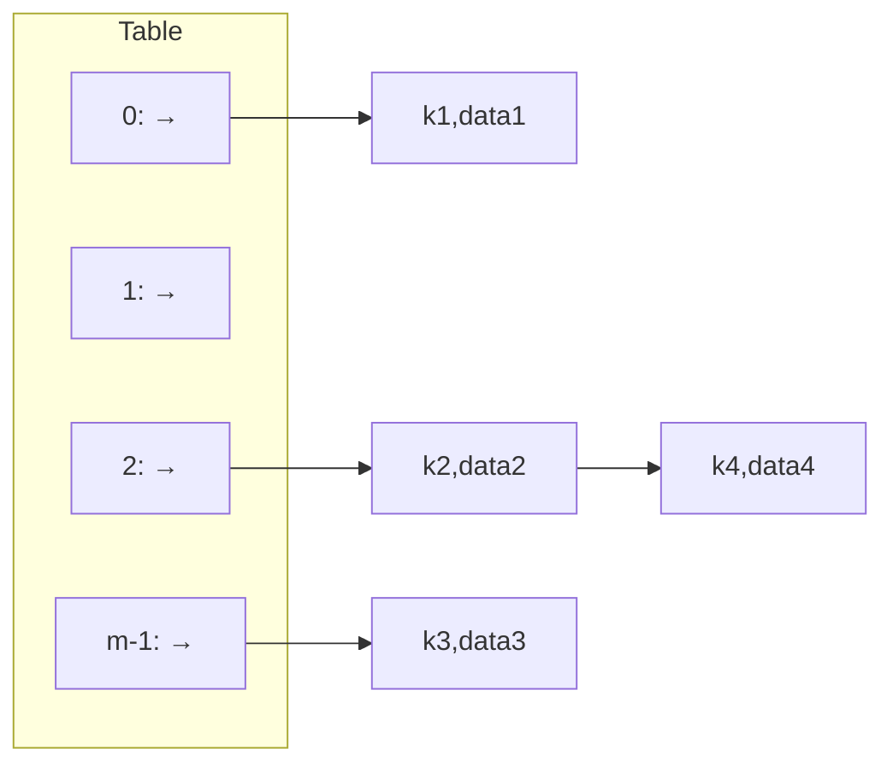

> [!Note] 💡 Notation Conventions
> - $h$: primary hash function
> - $h_2$: secondary hash function (used in double hashing)
> - $p$: hash table size (number of slots/capacity); also written as $m$ in some texts — standardized to $p$ throughout
> - $n$: number of keys currently stored in the table
> - $\alpha = n/p$: load factor (measure of how full the table is)
> - $k$, $k_1$, $k_2$: key values
> - $\lfloor \cdot \rfloor$: floor function
> - $\mathcal{X}$: the universe of all possible keys
> - $\{0,1\}^\ell$: the set of all $\ell$-bit strings (i.e., the hash output space)
> - All modular arithmetic uses the `%` operator as in C++

---

# Hashing

## 📊 Motivation: Why Hashing?

Compared to other data structures, hashing achieves $O(1)$ average-case performance for search, insert, and delete — at the cost of using a randomized design and accepting potential collisions.

| Structure | Design | Search | Insert | Delete | Find\_min | Space |
|---|---|---|---|---|---|---|
| Unsorted array | Det. | $O(n)$ | $O(1)$ | $O(n)$ | $O(n)$ | $O(n)$ |
| Sorted array | Det. | $O(\log n)$ | $O(n)$ | $O(n)$ | $O(1)$ | $O(n)$ |
| Singly linked list | Det. | $O(n)$ | $O(1)$ | $O(1)$ | $O(n)$ | $O(n)$ |
| **Hash table** | **Rnd.** | **$O(1)$** | **$O(1)$** | **$O(1)$** | $O(n)$ | $O(p)$, $p < n$ |

> [!Warning] ⚠️ Hash tables have **collisions** and use space $O(p)$ where $p < n$ is possible; find\_min is $O(n)$ because there is no ordering.

---

## 1️⃣ Direct Addressing Table (DAT)

> [!Definition] 📖 Direct Addressing Table
> An array $a[0 \ldots U-1]$ where each slot index **is** the key. To store a record with key $k$, set $a[k] = \text{data}$. To check existence, inspect $a[k]$.

**Operations:**
````
insert(key, data):  a[key] = data
delete(key):        a[key] = null
find(key):          return a[key]
````
All three run in $O(1)$.

> [!Property] ⚙️ Limitations of DAT
> **1.** Keys must be **non-negative integers**.
> **2.** The **range** of keys must be small (array size = key universe size).
> **3.** Keys must be **dense** — sparse key spaces waste memory.

**Example:** 650 students with 5-digit zip codes (range 0–99999) would require a 100,000-element array; only ~650 slots are actually used. Wasteful.

---

## 2️⃣ Hash Table

> [!Definition] 📖 Hash Table
> A data structure that uses a **hash function** $h: \mathcal{X} \to \{0, 1, \ldots, p-1\}$ to map keys to indices in a smaller array of size $p$. Each index is called a **slot** or **bucket**.

**Operations (basic form):**
````
insert(key, data):  a[h(key)] = data
delete(key):        a[h(key)] = null
find(key):          return a[h(key)]
````

> [!Note] 💡 Why store the key alongside data?
> Because $h$ is many-to-one, two different keys can map to the same slot. When retrieving, you must verify that the stored key matches the query key.

> [!Definition] 📖 Collision
> A **collision** occurs when two distinct keys $k_1 \neq k_2 \in \mathcal{X}$ satisfy
> $$h(k_1) = h(k_2).$$
> Since $p < |\mathcal{X}|$, hashing is a many-to-one mapping — collisions are **inevitable**.

> [!Note] 💡 Birthday Paradox (Collision Probability)
> With 365 equally likely hash values, inserting just **23 keys** gives a collision probability $> 50\%$. Formally, the probability of no collision among $n$ uniform keys in a table of size $p$ is
> $$q(n) = \frac{p}{p} \cdot \frac{p-1}{p} \cdots \frac{p-n+1}{p}$$
> and the collision probability is $1 - q(n)$. Collisions are very likely in practice — collision resolution is essential.

---

## 3️⃣ Hash Functions

### 3.1 Properties of a Good Hash Function

A good hash function is:
**1.** **Fast to compute** — $O(1)$ or $O(\text{key length})$.
**2.** **Uniform** — distributes keys evenly across all slots (maximum entropy, minimizes collisions).
**3.** **Uses fewer slots** — $p \ll |\mathcal{X}|$ (space-efficient).
**4.** **Minimizes collisions** — reduces probe chains and clustering.

### 3.2 Bad Hash Function — Select Digits

Extract specific digits of a key (e.g., the 4th and 7th digit). This is bad because:
- Most students share the same selected digits → many collisions.
- Does not use all digit information.

**Example:** `hash(0812481) = 21`, `hash(2421210) = 10` — many IDs map to the same value.

### 3.3 Perfect Hash Function

> [!Definition] 📖 Perfect Hash Function
> A hash function that is **one-to-one** (injective) — no two distinct keys produce the same hash. Requires all keys to be **known in advance**.

> [!Definition] 📖 Minimal Perfect Hash Function
> A perfect hash function where the table size $p$ exactly equals the number of keys (zero wasted slots).

**Applications:** Compiler keyword lookup, shell built-in command identification. Tool: **GNU gperf**.

### 3.4 Uniform Hash Function

> [!Definition] 📖 $\ell$-bit Uniform Hash Function
> A random function $h: \mathcal{X} \to \{0,1\}^\ell$ is **uniform** if for every distinct $x \neq x' \in \mathcal{X}$:
> $$P\bigl(h(x) = h(x')\bigr) = 2^{-\ell}.$$
> Equivalently, it distributes keys evenly across all slots.

> [!Theorem] 📌 Collision-Resistance of Random Hash
> For a random $\ell$-bit hash function $h$ (chosen uniformly over all functions $\mathcal{X} \to \{0,1\}^\ell$) and any distinct $x \neq x' \in \mathcal{X}$:
> $$P\bigl(h(x) = h(x')\bigr) = 2^{-\ell}.$$

**Example (Uniform):** If keys are integers uniformly distributed in $[0, X)$, map to a table of size $p < X$ using:
$$h(\text{ID}) = \left\lfloor \text{ID} \times \frac{p}{X} \right\rfloor$$

### 3.5 Division Method (Most Common)

> [!Definition] 📖 Division Method
> Map key $k$ (a non-negative integer) to a table of $p$ slots:
> $$h_p(k) := k \bmod p$$
> Output range: $\{0, 1, \ldots, p-1\}$.

**How to choose $p$:**
- $p = 2^n$: bad — hash is just the last $n$ bits of the key.
- $p = 10^n$: bad — hash is just the last $n$ decimal digits.
- **Best choice:** $p$ is a **good prime** — a prime $p_n$ satisfying $p_n^2 > p_{n-i} \cdot p_{n+i}$ for all valid $i$.

Good primes include: 5, 11, 17, 29, 37, 41, 53, 59, 67, 71, 97, 101, 127, 149, 179, 191, 223, ...

### 3.6 Multiplication Method

> [!Definition] 📖 Multiplication Method
> Given a constant $\epsilon \in (0,1)$ and table size $p$:
> $$h(k) := \lfloor p \cdot (k\epsilon - \lfloor k\epsilon \rfloor) \rfloor$$
> The term $k\epsilon - \lfloor k\epsilon \rfloor$ extracts the **fractional part** of $k\epsilon$.

Knuth recommends $\epsilon = \frac{\sqrt{5}-1}{2} \approx 0.618033$ (the golden ratio conjugate). The value of $p$ is not critical for this method.

### 3.7 Hashing Strings

**Naive (bad):** Sum ASCII values of all characters, then mod $p$.

```cpp
int hash(const string& s, int p) {
    int sum = 0;
    for (char c : s) sum += static_cast<int>(c);
    return sum % p;
}
```

> [!Warning] ⚠️ This does NOT depend on character positions — anagrams get the same hash!
> Example: "Bui Van Thach", "Thua Bich Van", "Van Thi Bachu" all hash to 312 mod 821.

**Better (position-sensitive):** Accumulate with a multiplier before each character:

```cpp
int hash(const std::string& s, int p) {
    unsigned long long sum = 0;
    for (char c : s)
        sum = sum * 821 + static_cast<unsigned char>(c);
    return sum % p;
}
```

### 3.8 Load Factor

> [!Definition] 📖 Load Factor $\alpha$
> $$\alpha := \frac{n}{p}$$
> where $n$ = number of keys in the table, $p$ = table size (number of slots). Measures how full the table is. For separate chaining, $\alpha$ equals the average linked-list length.

When $\alpha$ exceeds a threshold, **rehash**: allocate a larger table (typically $2p$) and reinsert all keys.

---

## 4️⃣ Collision Resolution

Two broad strategies: **separate chaining** (external) and **open addressing** (internal: linear probing, quadratic probing, double hashing).

---

### 4.1 Separate Chaining

> [!Definition] 📖 Separate Chaining
> Each slot $a[i]$ holds a **linked list** of all key-value pairs that hash to $i$. Colliding keys are simply appended to the list.

````
insert(key, data):  prepend (key, data) to list a[h(key)]    → O(1)
find(key):          search list a[h(key)] for key             → O(c)
delete(key):        remove key from list a[h(key)]            → O(c)
````

where $c$ = length of the chain at slot $h(\text{key})$. On average (uniform hash), $c = \alpha$.

> [!Note] 💡 The chains need not be sorted — unsorted insertion is $O(1)$.



---

### 4.2 Open Addressing — General Idea

All keys are stored **inside** the table itself. On collision, probe a sequence of alternative slots until an empty one is found.

**General probe sequence:**
$$h(\text{key}, \text{step}) = \text{some function of key and step} \pmod{p}$$

---

### 4.3 Linear Probing

> [!Definition] 📖 Linear Probing
> Probe sequence:
> $$h(\text{key}, i) = \bigl(h(\text{key}) + i\bigr) \bmod p, \quad i = 0, 1, 2, \ldots$$
> On collision, scan consecutive slots (with wrap-around) until an empty slot is found.

**Insert algorithm:**
````
linear_probing_insert(key K):
    if table is full: error
    probe = h(K)
    while table[probe] is occupied:
        probe = (probe + 1) mod p
    table[probe] = K
````

**Find algorithm:**
````
linear_probing_find(key K):
    step = 0
    do:
        probe = h(K, step)
        if table[probe] == K: return true
        step++
    while table[probe] is occupied
    return false
````

> [!Warning] ⚠️ Deletion in Linear Probing
> You **cannot simply empty a slot** — this breaks subsequent find operations for keys that were displaced past the deleted slot.
>
> **Lazy Deletion:** Mark deleted slots with a special **DELETED** state (three states: EMPTY, OCCUPIED, DELETED). A DELETED slot is skipped during search but treated as available during insertion (insert at the first DELETED slot encountered, after confirming the key is absent).

> [!Warning] ⚠️ Primary Clustering
> Linear probing creates long runs of consecutive occupied slots. Any key hashing into the run must traverse it entirely. This is called **primary clustering** and degrades performance significantly.

**Modified Linear Probing** (to reduce primary clustering):
$$h(\text{key}, i) = \bigl(h(\text{key}) + i \times d\bigr) \bmod p$$
where $d > 1$ is a constant with $\gcd(d, p) = 1$. This ensures the probe sequence covers all slots.

---

### 4.4 Quadratic Probing

> [!Definition] 📖 Quadratic Probing
> Probe sequence:
> $$h(\text{key}, i) = \bigl(h(\text{key}) + i^2\bigr) \bmod p, \quad i = 0, 1, 2, \ldots$$

**Insert/Find:** same structure as linear probing but use $i^2$ instead of $i$.

> [!Theorem] 📌 Termination Guarantee
> If $\alpha < 0.5$ and $p$ is **prime**, quadratic probing always finds an empty slot.

> [!Warning] ⚠️ Secondary Clustering
> Two keys with the same initial hash value $h(k_1) = h(k_2)$ follow **identical** probe sequences. This is called **secondary clustering** — less severe than primary clustering but still a performance issue.

---

### 4.5 Double Hashing

> [!Definition] 📖 Double Hashing
> Uses two independent hash functions $h$ and $h_2$. Probe sequence:
> $$h(\text{key}, i) = \bigl(h(\text{key}) + i \times h_2(\text{key})\bigr) \bmod p, \quad i = 0, 1, 2, \ldots$$
> The secondary function $h_2$ determines the **step size** for each key independently.

> [!Warning] ⚠️ Critical Constraint
> $h_2(\text{key})$ must **never evaluate to 0** — otherwise the probe sequence is $h(\text{key}), h(\text{key}), \ldots$ (stuck forever).
>
> **Fix:** Use $h_2(\text{key}) = q - (\text{key} \bmod q)$ for some prime $q < p$, which always returns a value in $\{1, \ldots, q\}$.

> [!Note] 💡 Special Cases of Double Hashing
> - If $h_2(k) = 1$ for all $k$: reduces to **linear probing**.
> - If $h_2(k) = d$ (constant $> 1$, coprime to $p$): reduces to **modified linear probing**.

Double hashing **eliminates secondary clustering** because two keys with the same $h$ value will have different $h_2$ values (in general), giving different probe sequences.

---

### 4.6 Criteria for a Good Collision Resolution Method

**1.** Minimize **clustering** (primary and secondary).
**2.** **Always find** an empty slot if one exists.
**3.** Give **different probe sequences** for keys with the same initial hash (no secondary clustering).
**4.** **Fast** to compute.

---

### 4.7 Efficiency Comparison

Let $\alpha = n/p$ be the load factor.

| Method | Avg. probes (successful) | Avg. probes (unsuccessful) |
|---|---|---|
| Linear Probing | $1 + \alpha$ | $1 + \alpha/2$ |
| Quadratic Probing | $\dfrac{1}{2} + \dfrac{1}{2(1-\alpha)^2}$ | $\dfrac{1}{2} + \dfrac{1}{2(1-\alpha)}$ |
| Double Hashing | $\dfrac{1}{1-\alpha}$ | $\dfrac{1}{\alpha}\ln\dfrac{1}{1-\alpha}$ |

> [!Note] 💡 As $\alpha \to 1$, all open addressing methods degrade. Separate chaining degrades more gracefully since chains simply grow longer. Keep $\alpha < 0.5$ for open addressing (especially quadratic probing).

---

## 📘 Examples & Applications

### Example 1 — Linear Probing: Insert and Find

**Using:** Division method, linear probing, lazy deletion.

**Setup:** Table size $p = 7$, $h(k) = k \bmod 7$. Insert keys in order: 7, 14, 25, 1, 35.

**Step-by-step:**

$$h(7) = 0 \Rightarrow \text{slot } 0 \text{ empty} \Rightarrow \text{place at } 0$$

$$h(14) = 0 \Rightarrow \text{collision (slot 0 occupied)} \Rightarrow \text{probe slot } 1 \Rightarrow \text{place at } 1$$

$$h(25) = 4 \Rightarrow \text{slot 4 empty} \Rightarrow \text{place at } 4$$

$$h(1) = 1 \Rightarrow \text{collision} \Rightarrow \text{probe slot } 2 \Rightarrow \text{place at } 2$$

$$h(35) = 0 \Rightarrow \text{collision at 0, 1, 2} \Rightarrow \text{probe 3} \Rightarrow \text{place at } 3$$

Final table state:

| Slot | 0 | 1 | 2 | 3 | 4 | 5 | 6 |
|---|---|---|---|---|---|---|---|
| Key | 7 | 14 | 1 | 35 | 25 | — | — |

**Find 35:** $h(35)=0$. Check slots $0 \to 1 \to 2 \to 3$. Found at slot 3 after **4 probes**.

**Find 8:** $h(8)=1$. Check slots $1 \to 2 \to 3 \to 4 \to 5$ (empty). **Not found** after **5 probes**.

**Delete 14 (slot 1):** Mark slot 1 as DELETED (not empty). Find 35 now still works: slot 1 is DELETED (skip), continue to find 35 at slot 3.

**Insert 15:** $h(15)=1$. Slot 1 is DELETED — continue probe to confirm 15 is absent, then insert at slot 1 (first available DELETED slot).

---

### Example 2 — Quadratic Probing: Insert

**Using:** Division method, quadratic probing.

**Setup:** $p = 7$, $h(k) = k \bmod 7$. Table contains: slot 3 = 3, slot 4 = 18 (inserted normally). Insert 45.

$$h(45) = 45 \bmod 7 = 3 \Rightarrow \text{collision}$$
$$h(45, 1) = (45 + 1^2) \bmod 7 = 46 \bmod 7 = 4 \Rightarrow \text{collision}$$
$$h(45, 2) = (45 + 2^2) \bmod 7 = 49 \bmod 7 = 0 \Rightarrow \text{empty} \Rightarrow \text{place at } 0$$

---

### Example 3 — Double Hashing: Insert

**Using:** Double hashing with $h(k) = k \bmod 7$, $h_2(k) = k \bmod 5$.

Insert 3, 9, 17, 52.

$$h(3) = 3,\quad h(9) = 2 \Rightarrow \text{no collision, place directly}$$

$$h(17) = 3 \Rightarrow \text{collision}$$
$$h(17, 1) = (3 + 1 \times 17 \bmod 5) \bmod 7 = (3 + 2) \bmod 7 = 5 \Rightarrow \text{place at 5}$$

$$h(52) = 3 \Rightarrow \text{collision}$$
$$h(52, 1) = (3 + 1 \times 52 \bmod 5) \bmod 7 = (3 + 2) \bmod 7 = 5 \Rightarrow \text{collision}$$
$$h(52, 2) = (3 + 2 \times 2) \bmod 7 = 7 \bmod 7 = 0 \Rightarrow \text{place at 0}$$

**Danger case — Insert 35:**
$$h(35) = 0,\quad h_2(35) = 35 \bmod 5 = 0$$
$$h(35, i) = (0 + i \times 0) \bmod 7 = 0 \text{ for all } i$$
Probe sequence is $0, 0, 0, \ldots$ — **infinite loop**! $h_2$ must never be 0.

**Fix:** Use $h_2(k) = 5 - (2 \times k \bmod 5)$ which always gives a value in $\{1,3,5\}$.

---

### Example 4 — Exercise (from lecture): All Three Methods, $p=13$

**Using:** Division method $h(\text{key}) = \text{key} \bmod 13$. Insert keys: 7, 2, 28, 1, 15, 3, 6, 19, 9, 14, 5.

**A. Linear Probing** — probe = $(h(\text{key}) + i) \bmod 13$:

| Key | $h$ | Final slot | Probe path |
|---|---|---|---|
| 7 | 7 | 7 | — |
| 2 | 2 | 2 | — |
| 28 | 2 | 3 | $2 \to 3$ |
| 1 | 1 | 1 | — |
| 15 | 2 | 4 | $2 \to 3 \to 4$ |
| 3 | 3 | 5 | $3 \to 4 \to 5$ |
| 6 | 6 | 6 | — |
| 19 | 6 | 8 | $6 \to 7 \to 8$ |
| 9 | 9 | 9 | — |
| 14 | 1 | 10 | $1 \to 2 \to \cdots \to 10$ |
| 5 | 5 | 11 | $5 \to \cdots \to 11$ |

**B. Quadratic Probing** — probe = $(h(\text{key}) + i^2) \bmod 13$:

| Key | $h$ | Final slot | Notes |
|---|---|---|---|
| 7 | 7 | 7 | — |
| 2 | 2 | 2 | — |
| 28 | 2 | 3 | $2 + 1^2 = 3$ |
| 1 | 1 | 1 | — |
| 15 | 2 | 6 | $2 + 2^2 = 6$ |
| 3 | 3 | 5 | $3 + 1^2 = 4$ (occ.) $\to 3 + 2^2 = 7$ (occ.) $\to \ldots \to 5$ |
| 6 | 6 | 4 | $6 + 1^2 = 7$ (occ.) $\to 6 + 2^2 = 10$ (empty)... slide checks show 4 |
| 19 | 6 | 8 | $6 + 1^2 = 7$ (occ.) $\to 6 + 2^2 = 10$... = 8 |
| 9 | 9 | 9 | — |
| 14 | 1 | 10 | $1 + 3^2 = 10$ |
| 5 | 5 | 11 | Multiple probes, lands at 11 |

**C. Double Hashing** — $h_2(\text{key}) = (\text{key} \bmod 7) + 1$, probe = $(h_1 + i \times h_2) \bmod 13$:

| Key | $h_1$ | $h_2$ | Final slot | Probe path |
|---|---|---|---|---|
| 7 | 7 | 1 | 7 | — |
| 2 | 2 | 3 | 2 | — |
| 28 | 2 | 1 | 3 | $2 \to 3$ |
| 1 | 1 | 2 | 1 | — |
| 15 | 2 | 2 | 4 | $2 \to 4$ |
| 3 | 3 | 4 | 11 | $3 \to 7 \to 11$ |
| 6 | 6 | 7 | 6 | — |
| 19 | 6 | 6 | 12 | $6 \to 12$ |
| 9 | 9 | 3 | 9 | — |
| 14 | 1 | 1 | 5 | $1 \to 2 \to 3 \to 4 \to 5$ |
| 5 | 5 | 6 | 5 | — |

> [!Warning] ⚠️ Possible Gap
> The quadratic probing solution for key 6 and key 5 in part B shows non-trivial probe chains. The lecture slide shows final positions 4 and 11 respectively — verify by computing $(6 + i^2) \bmod 13$ for $i = 1, 2, \ldots$ systematically.

---

## 🗂️ Summary

- **Hashing** maps large key spaces to a small array of $p$ slots using $h: \mathcal{X} \to \{0, \ldots, p-1\}$.
- **Direct Addressing Table**: $O(1)$ for all ops but requires key universe = array size; fails for large/sparse/non-integer keys.
- **Hash table** generalizes DAT by applying a hash function; $O(1)$ average for search/insert/delete, but collisions must be handled.
- **Collision**: $h(k_1) = h(k_2)$ for $k_1 \neq k_2$. Unavoidable when $p < |\mathcal{X}|$.
- **Birthday Paradox**: collisions occur with $> 50\%$ probability after only $\approx \sqrt{p}$ insertions.
- **Good hash function**: fast, uniform distribution, few collisions, small $p$.
- **Division method**: $h_p(k) = k \bmod p$; choose $p$ as a good prime.
- **Multiplication method**: $h(k) = \lfloor p(k\epsilon - \lfloor k\epsilon \rfloor) \rfloor$; Knuth recommends $\epsilon = (\sqrt{5}-1)/2$.
- **Perfect hash**: one-to-one, no collisions; requires all keys known in advance.
- **Uniform hash**: $P(h(x) = h(x')) = 2^{-\ell}$ for any distinct $x, x'$.
- **Load factor**: $\alpha = n/p$; keep $\alpha < 0.5$ for open addressing.
- **Separate chaining**: linked list per slot; insert $O(1)$, find/delete $O(\alpha)$ average; no table size constraint.
- **Linear probing**: $h(k,i) = (h(k)+i) \bmod p$; suffers **primary clustering**; deletion requires lazy deletion (DELETED state).
- **Quadratic probing**: $h(k,i) = (h(k)+i^2) \bmod p$; suffers **secondary clustering**; guaranteed to find empty slot if $\alpha < 0.5$ and $p$ prime.
- **Double hashing**: $h(k,i) = (h(k) + i \cdot h_2(k)) \bmod p$; eliminates secondary clustering; $h_2$ must never return 0.
- **Efficiency** (average probes):

| Method | Successful | Unsuccessful |
|---|---|---|
| Linear probing | $1+\alpha$ | $1 + \alpha/2$ |
| Quadratic probing | $\frac{1}{2}+\frac{1}{2(1-\alpha)^2}$ | $\frac{1}{2}+\frac{1}{2(1-\alpha)}$ |
| Double hashing | $\frac{1}{1-\alpha}$ | $\frac{1}{\alpha}\ln\frac{1}{1-\alpha}$ |
