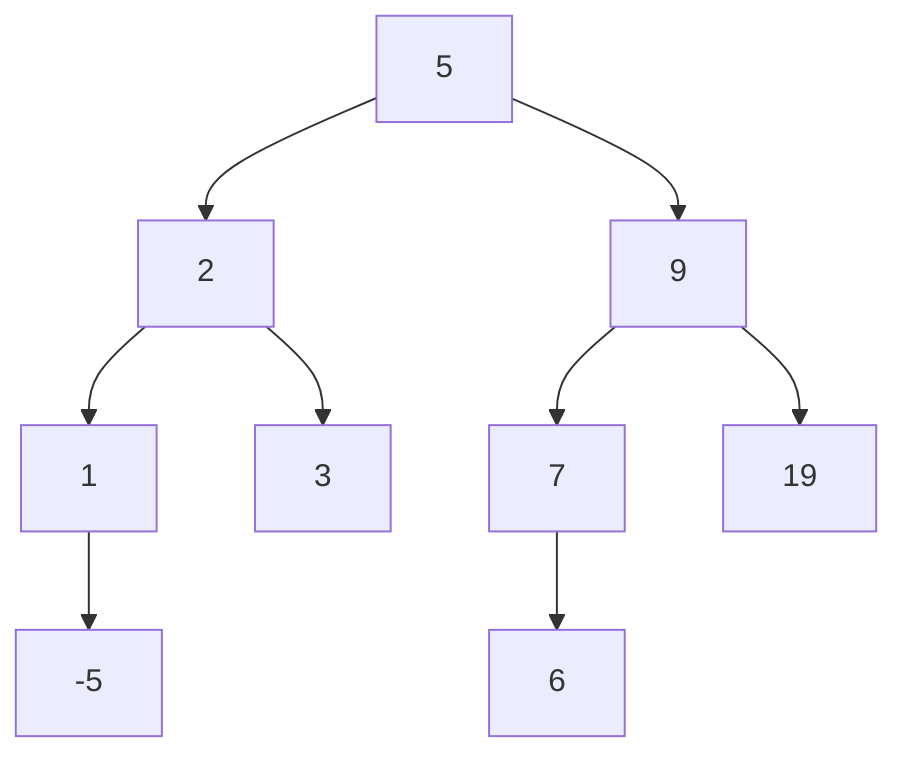
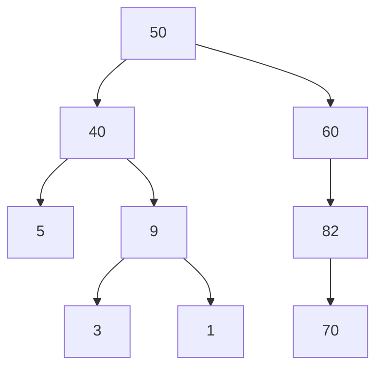
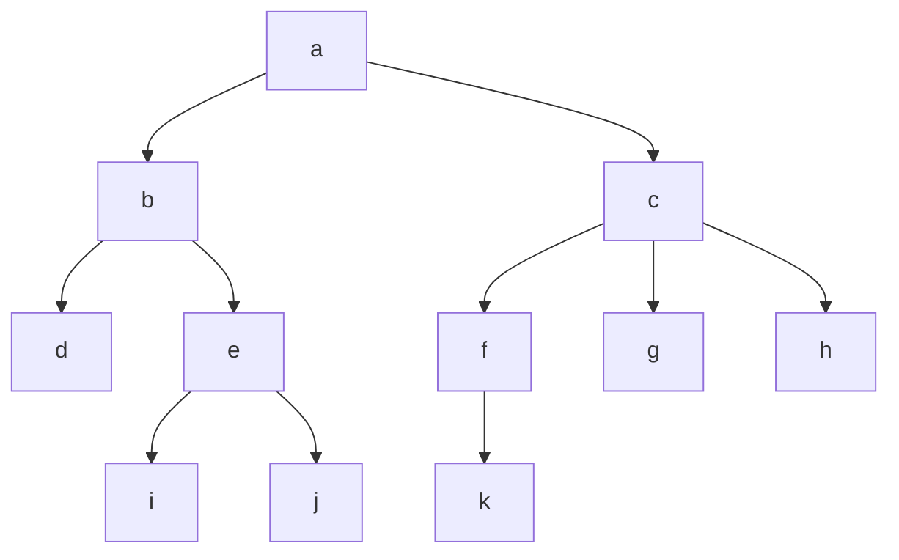
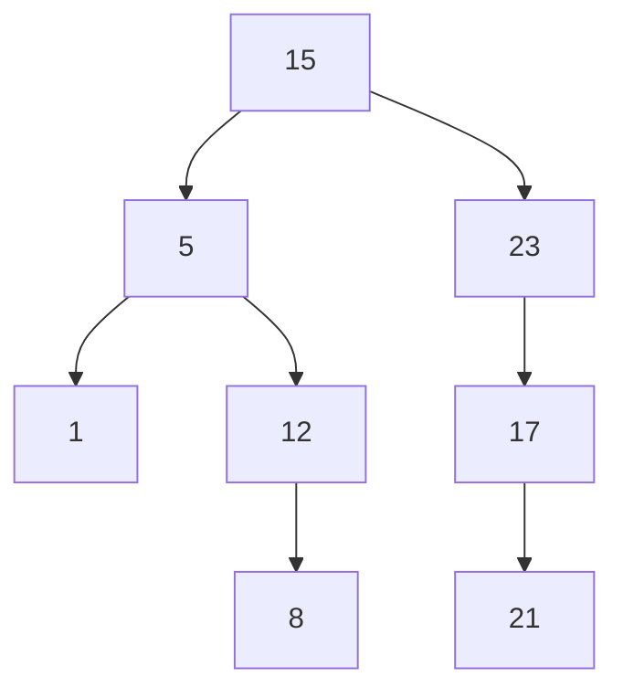

> [!Note] 💡 Notation Conventions
> - $n$ — number of nodes in the tree.
> - $h$ — height of the tree or a subtree.
> - $t$ — number of leaves.
> - $T$, $T_L$, $T_R$ — a tree, its left subtree, its right subtree.
> - $N(h)$ — minimum number of nodes in a balanced tree of height $h$.
> - All logarithms are base-2 unless stated otherwise.
> - Height of the empty tree is defined as $-1$.
> - "Level" and "depth" are used interchangeably (both count edges from the root).

---

# Lecture 8 — Trees

## 1. Introduction

Trees are the canonical data structure for hierarchical, non-linear organization. Their importance is practical: a **balanced tree** achieves $O(\log n)$ for search, insert, delete, and find-min — beating sorted arrays on insert/delete and linked lists on search.

| Structure | Search | Insert | Delete | Find-min | Space |
|---|---|---|---|---|---|
| Unsorted array | $O(n)$ | $O(1)$ | $O(n)$ | $O(n)$ | $O(n)$ |
| Sorted array | $O(\log n)$ | $O(n)$ | $O(n)$ | $O(1)$ | $O(n)$ |
| Singly linked list | $O(n)$ | $O(1)$ | $O(1)$ | $O(n)$ | $O(n)$ |
| Hashing (avg) | $O(1)$ | $O(1)$ | $O(1)$ | $O(n)$ | $O(p), p<n$ |
| **Balanced Tree** | $O(\log n)$ | $O(\log n)$ | $O(\log n)$ | $O(\log n)$ | $O(n)$ |

> [!Warning] ⚠️ BST Worst Case
> An unbalanced BST degenerates to $O(n)$ for all operations. The table above holds only for **balanced** trees.

---

## 2. Terminology

> [!Definition] 📖 Tree
> A **tree** with base type $D$ is either:
> - An **empty structure** (empty tree / NULL), or
> - A **node** containing: data of type $D$, and links to a finite number of other trees (subtrees/branches).

> [!Definition] 📖 Structural Roles
> - **Root** — the unique topmost node.
> - **Leaf** — a node with no children.
> - **Inner node** — any non-leaf, non-root node.
> - **Left child / Right child** — the node directly connected below and to the left/right.
> - **Parent** — the node directly above a given node.
> - **Subtree (branch)** — any node together with all its descendants.

> [!Definition] 📖 Level, Height, Degree
> - **Level (depth) of a node** — number of edges on the unique path from the root to that node. The root has level 0.
> - **Height of a node** — length of the longest path from it down to a leaf.
> - **Height of a tree** — the maximum level of any node (equivalently, the height of the root). Empty tree has height $-1$.
> - **Degree of a node** — number of children (subtrees) it has.
> - **Degree of a tree** — maximum degree among all nodes.
> - An **$n$-ary tree** is a tree with degree $n$.

> [!Definition] 📖 Ancestor, Descendant, Sibling
> - $v$ is an **ancestor** of $w$ if $v$ lies on the unique path between $w$ and the root.
> - $w$ is a **descendant** of $v$ in that case.
> - Two nodes that share the same parent are **siblings**.

**Mermaid example — labelled tree:**



*Root = 5, leaves = {−5, 3, 6, 19}, height = 3.*

---

## 3. Walk, Trail, Path

> [!Definition] 📖 Walk / Trail / Path
> Let $G$ be a graph with vertices $v, w$.
> - A **walk** from $v$ to $w$: a finite alternating sequence $v_0 e_1 v_1 e_2 \ldots e_n v_n$ where $v_0 = v$, $v_n = w$, and $e_i$ connects $v_{i-1}$ to $v_i$. Repeated edges and vertices are allowed.
> - A **trail**: a walk with no repeated **edges**.
> - A **path**: a trail with no repeated **vertices** (and therefore no cycles).

| Type | Repeated edge? | Repeated vertex? | Starts/ends same? |
|---|---|---|---|
| Walk | Allowed | Allowed | Allowed |
| Trail | No | Allowed | Allowed |
| Path | No | No | No |

---

## 4. Tree Representations

Three standard representations:

**1. Diagram** — nodes as circles/boxes, edges as lines top-down.

**2. Adjacency list** — each node lists its direct children.
```
50: [40, 60]
40: [9, 5]
60: [82]
9:  [3, 1]
82: [70]
```

**3. Parent array** — each node stores a pointer to its parent.
```
50: None   40: 50   60: 50   9: 40   5: 40   82: 60 ...
```

---

## 5. Binary Trees

> [!Definition] 📖 Binary Tree
> A **binary tree** is a rooted tree where every node has **at most two children**, designated as *left child* and *right child*.

> [!Definition] 📖 Full Binary Tree
> A **full binary tree** is a binary tree in which every parent has **exactly two children**.

> [!Definition] 📖 Perfect Binary Tree
> A **perfect binary tree** is a binary tree where every parent has **exactly two children** and **all leaves are at the same level**.

> [!Definition] 📖 Complete Binary Tree
> A **complete binary tree** of height $h$ is a binary tree that is **perfect down to level $h-1$**, with the last level filled from left to right.

> [!Definition] 📖 Left/Right Subtree
> Given parent $v$ in binary tree $T$:
> - **Left subtree of $v$** — the binary tree rooted at $v$'s left child, containing that child and all its descendants.
> - **Right subtree of $v$** — defined symmetrically.

> [!Definition] 📖 Heap (Tree)
> A **heap** is a complete tree that is either empty or its root:
> **1.** Contains a value $\geq$ the value in each of its children, and
> **2.** Has heaps as its subtrees.

### 5.1 Height–Leaves Theorem

> [!Theorem] 📌 Theorem 1 — Leaves of a Binary Tree
> For any binary tree $T$ with height $h$ and $t$ leaves:
> $$t \leq 2^h \quad \Longleftrightarrow \quad \log_2 t \leq h.$$
> Equivalently, the number of nodes at level $i$ is at most $2^i$.

> [!Proof] 🔷 Proof (by strong induction on $h$)
> **Base case** $P(0)$: $T$ has one node (the root), which is also the only leaf. $t = 1 = 2^0$. ✓
>
> **Inductive step**: Assume $P(i)$ holds for all $0 \leq i \leq k$. Let $T$ have height $k+1$, root $v$, $t$ leaves.
>
> *Case 1 — $v$ has one child* (WLOG left child $v_L$, subtree $T_L$):
> - Leaves of $T$ = leaves of $T_L$ plus $v$ itself (since $v$ is an internal node becoming a "one-child node" — wait, $v$ has no right child so it contributes nothing as a leaf). Actually: since $v$ has only one child, all leaves of $T$ are leaves of $T_L$, so $t = t_L$.
> - Height of $T_L$ is $k$, so by I.H., $t_L \leq 2^k$.
> - Therefore $t \leq 2^k < 2^{k+1}$. ✓
>
> *Case 2 — $v$ has two children* with subtrees $T_L$ (height $h_L$) and $T_R$ (height $h_R$):
> - $h_L \leq k$ and $h_R \leq k$.
> - By I.H.: $t_L \leq 2^{h_L}$ and $t_R \leq 2^{h_R}$.
> - $t = t_L + t_R \leq 2^{h_L} + 2^{h_R} \leq 2^k + 2^k = 2^{k+1}$. ✓
>
> Hence $P(k+1)$ holds in both cases. $\blacksquare$

> [!Note] 💡 Corollaries (from Theorem 1)
> Given a binary tree of height $h$:
> - **Maximum nodes**: $2^{h+1} - 1$ (perfect binary tree).
> - **Minimum nodes**: $h + 1$ (degenerate / path-shaped tree).
>
> Given a binary tree with $n$ nodes:
> - **Maximum height**: $n - 1$ (linear chain).
> - **Minimum height**: $\lfloor \log_2 n \rfloor$ (complete binary tree).

---

## 6. Tree Traversals

> [!Definition] 📖 Tree Traversal
> A **traversal** visits each node in a tree exactly once in a systematic order.
> Two families: **BFS** (breadth-first) and **DFS** (depth-first).

### 6.1 Breadth-First Search (BFS)

> [!Definition] 📖 BFS
> **BFS** starts at the root and visits nodes level by level, left to right, before moving to the next level. Uses a **queue**.



BFS order: **50, 40, 60, 9, 5, 82, 3, 1, 70**

### 6.2 Depth-First Search (DFS)

Three variants — all defined recursively:

> [!Definition] 📖 Pre-order (NLR — Node, Left, Right)
> **1.** Process the root.
> **2.** Recursively traverse each subtree left to right.
>
> ```
> void NLR(TREE root) {
>     if (root != NULL) {
>         <process root>;
>         NLR(root->child_1); ... NLR(root->child_k);
>     }
> }
> ```

> [!Definition] 📖 In-order (LNR — Left, Node, Right)
> **1.** Recursively traverse the leftmost subtree.
> **2.** Process the root.
> **3.** Recursively traverse the remaining subtrees.
>
> ```
> void LNR(TREE root) {
>     if (root != NULL) {
>         LNR(root->child_1);
>         <process root>;
>         LNR(root->child_2); ... LNR(root->child_k);
>     }
> }
> ```

> [!Definition] 📖 Post-order (LRN — Left, Right, Node)
> **1.** Recursively traverse every subtree.
> **2.** Process the root last.
>
> ```
> void LRN(TREE root) {
>     if (root != NULL) {
>         LRN(root->child_1); ... LRN(root->child_k);
>         <process root>;
>     }
> }
> ```

> [!Property] ⚙️ In-order on a BST
> In-order traversal of a BST visits keys in **sorted (ascending) order**.

---

## 7. Binary Search Trees (BST)

> [!Definition] 📖 BST (Definition 10)
> A **binary search tree** is a binary tree where for every internal node with value $X$:
> - All nodes in its **left subtree** have value $< X$.
> - All nodes in its **right subtree** have value $> X$.

**C struct representation:**
```c
typedef struct tree_node {
    tree* left;
    int   data;
    tree* right;
} TNODE;
typedef TNODE* TREE;
```

### 7.1 Search

> [!Definition] 📖 BST Search
> **1.** Start at root.
> **2.** If current node $= X$: found.
> **3.** If $X <$ current: go left.
> **4.** If $X >$ current: go right.
> **5.** If NULL reached: not found.
>
> **Complexity:** $O(h)$.

```c
TNODE* searchNode(TREE T, Data X) {
    if (T) {
        if (T->Key == X) return T;
        if (T->Key > X)  return searchNode(T->pLeft, X);
        return searchNode(T->pRight, X);
    }
    return NULL;
}
```

### 7.2 Insertion

> [!Definition] 📖 BST Insertion
> Follow the same path as search; when a NULL is reached, create a new node there.
>
> **Complexity:** $O(h)$.

```c
int insertNode(TREE &T, Data X) {
    if (T) {
        if (T->Key == X) return 0;          // duplicate
        if (T->Key > X) return insertNode(T->pLeft, X);
        else            return insertNode(T->pRight, X);
    }
    T = new TNode;
    if (T == NULL) return -1;               // out of memory
    T->Key = X;
    T->pLeft = T->pRight = NULL;
    return 1;                               // success
}
```

> [!Warning] ⚠️ BST Degeneration
> Inserting keys in **sorted order** produces a linear chain (height $= n-1$), degrading all operations to $O(n)$.

### 7.3 Deletion

Three cases depending on the target node $X$:

> [!Definition] 📖 BST Deletion — Case 1: $X$ is a leaf
> Simply remove $X$.

> [!Definition] 📖 BST Deletion — Case 2: $X$ has one child
> Link $X$'s parent directly to $X$'s only child, then remove $X$.

> [!Definition] 📖 BST Deletion — Case 3: $X$ has two children
> **1.** Find replacement node $Y$: either the **leftmost node of the right subtree** (in-order successor) or the **rightmost node of the left subtree** (in-order predecessor).
> **2.** Copy $Y$'s key into $X$.
> **3.** Delete $Y$ (which has at most one child — falls to Case 1 or 2).
>
> **Complexity:** $O(h)$.

> [!Warning] ⚠️ BST Summary
> All BST operations cost $O(h)$. Since $h \in O(n)$ in the worst case, a plain BST does **not** guarantee $O(\log n)$.

---

## 8. Balanced Trees

> [!Definition] 📖 Balanced Tree (Definition 11)
> A **balanced tree** is a rooted tree in which the **absolute height difference** between the left and right subtrees of **any node** is bounded by a constant $m$.

> [!Theorem] 📌 Theorem 2 — Height of a Balanced Tree
> A balanced tree with $n$ nodes and maximum height difference $m$ has height $h \in O(\log n)$.
> Therefore search, insert, and find-min all cost $O(\log n)$.

> [!Proof] 🔷 Proof sketch
> Let $N(h)$ = minimum number of nodes in a balanced tree of height $h$.
>
> Since height is $h$, one subtree has height $h-1$ and (by the balance condition) the other has height $\geq h-1-m$. Minimizing nodes:
> $$N(h) = 1 + N(h-1) + N(h-1-m). \tag{1}$$
>
> We prove $N(h) \geq c\phi^h$ for constants $c, \phi > 0$, then $n \geq c\phi^h$ gives $h \leq \log_\phi(n/c) = O(\log n)$.
>
> By induction, $N(k+1) \geq 1 + c\phi^k + c\phi^{k-m}$. We need $c\phi^{k-m}(\phi^{m+1} - \phi^m - 1) \leq 1$, which holds when $\phi$ is the root of $f(x) = x^{m+1} - x^m - 1$. Since $f(1) < 0$ and $f(2) > 0$ for any $m \geq 1$, $\phi \in (1,2)$.
>
> **Special case $m=1$ (AVL):** $\phi = \frac{\sqrt{5}-1}{2} \approx 1.618$ (root of $x^2 - x - 1$), $c = 2$. Therefore $h \leq \log_{1.618}(n/2) = O(\ln n)$. $\blacksquare$

---

## 9. AVL Trees

### 9.1 Definition

> [!Definition] 📖 AVL Tree (Definition 12)
> An **AVL tree** is a BST satisfying two invariants:
> - **Ordering invariant**: BST property holds at every node.
> - **Height invariant**: $|h(T_L) - h(T_R)| \leq 1$ at every node.

At any node $x$ with left subtree $T_L$ (height $h_L$) and right subtree $T_R$ (height $h_R$), exactly one of three shapes occurs:

```
  x              x              x
 / \            / \            / \
TL  TR         TL  TR         TL  TR
h-1  h          h   h          h  h-1
```

*Left-heavy, Equal, Right-heavy.*

> [!Example] 📘 AVL Check Examples
> **Valid AVL:**
> ```mermaid
> graph TD
>     10 --> 6
>     10 --> 25
>     25 --> 24
>     25 --> 35
>     24 --> |""| n1[" "]
>     35 --> 33
>     35 --> 37
> ```
> Heights: node 10 → left height 1, right height 2. Diff = 1 ✓
>
> **Invalid AVL** (violation at nodes 10 and 25):
> ```
> 10 → left subtree height 2, right subtree height 4. Diff = 2 ✗
> ```

### 9.2 Insertion

**Strategy:**
**1.** Insert as in a standard BST (preserves ordering invariant).
**2.** Find and fix the **lowest** height-invariant violation.

> [!Property] ⚙️ Why fix the lowest violation only?
> Fixing the lowest violation via rotation restores balance locally **without changing the height** of that subtree. Therefore no new violations are introduced above.

**Four cases based on where the inserted node $z$ is relative to the violating node $x$:**

| Insertion direction from $x$ | Fix |
|---|---|
| Left child of left child (LL) | **Right single rotation** at $x$ |
| Right child of right child (RR) | **Left single rotation** at $x$ |
| Right child of left child (LR) | **Left-right double rotation** at $x$ |
| Left child of right child (RL) | **Right-left double rotation** at $x$ |

> [!Definition] 📖 Right Single Rotation
> Applied when subtree $A$ (left-left) becomes too tall.
> $$y \xrightarrow{\text{right on } y} x$$
>
> Before → After:
> ```
>       y                    x
>      / \                  / \
>     x   C      →         A   y
>    / \                      / \
>   A   B                    B   C
> ```
> Ordering: $A < x < B < y < C$ is preserved.

> [!Theorem] 📌 Theorem 3 — Right Rotation Correctness
> If node $y$ violates the height invariant after inserting $z$ in the left-left case, and subtree $C$ has height $h$, then:
> - Heights of $A$ and $B$ must both be $h$.
> - The rotation restores both ordering and height invariants.

> [!Definition] 📖 Left Single Rotation
> Applied when subtree $C$ (right-right) becomes too tall.
> ```
>   x                        y
>  / \                      / \
> A   y        →           x   C
>    / \                  / \
>   B   C                A   B
> ```

> [!Theorem] 📌 Theorem 4 — Left Rotation Correctness
> If node $x$ violates the height invariant after inserting $z$ in the right-right case, and subtree $A$ has height $h$, then heights of $B$ and $C$ must both be $h$. Ordering and height invariants are restored.

> [!Definition] 📖 Right-Left Double Rotation
> Applied when $y$ (right child of $x$, left child of $z$) becomes too tall.
> ```
>     x                         y
>    / \                       / \
>   A   z    →               x   z
>      / \                  / \ / \
>     y   D                A  B C  D
>    / \
>   B   C
> ```
> Two steps: (1) right-rotate at $z$, (2) left-rotate at $x$.

> [!Theorem] 📌 Theorem 5 — Right-Left Double Rotation Correctness
> If $x$ violates after RL insertion with $A$ at height $h$:
> - Heights of $B$ and $C$ are both $h-1$.
> - Height of $D$ is $h$ or $h-1$.
> - Rotation restores both invariants.

> [!Definition] 📖 Left-Right Double Rotation
> Applied when $y$ (left child of $x$, right child of $z$) becomes too tall.
> ```
>       x                         y
>      / \                       / \
>     z   D    →               z   x
>    / \                      / \ / \
>   A   y                    A  B C  D
>      / \
>     B   C
> ```
> Two steps: (1) left-rotate at $z$, (2) right-rotate at $x$.

> [!Theorem] 📌 Theorem 6 — Left-Right Double Rotation Correctness
> If $x$ violates after LR insertion with $D$ at height $h$:
> - Heights of $B$ and $C$ are both $h-1$.
> - Height of $A$ is $h$ or $h-1$.
> - Rotation restores both invariants.

> [!Property] ⚙️ Insertion Cost
> **1.** Each rotation costs $O(1)$.
> **2.** At most **one rotation** (single or double) per insertion is needed.
> **3.** Total insertion cost: $O(\log n)$.

### 9.3 Deletion

**Strategy:**
**1.** Perform standard BST deletion (3 cases: leaf, one child, two children — same as §7.3).
**2.** Update heights of ancestor nodes.
**3.** Rebalance at the deleted position and propagate rebalancing upward as needed.

> [!Warning] ⚠️ Deletion vs. Insertion
> Unlike insertion, deletion may require **multiple rotations** propagating up the tree (not just one). Each rotation remains $O(1)$, and there are at most $O(\log n)$ of them, so total deletion cost is still $O(\log n)$.

**Balance factor encoding used in implementation:**
```c
#define LH -1   // Left High  (left subtree taller)
#define EH  0   // Equal Height
#define RH  1   // Right High (right subtree taller)
```

### 9.4 Implementation Summary

**Node struct:**
```c
typedef struct tagAVLNode {
    char   balFactor;     // LH / EH / RH
    Data   key;
    struct tagAVLNode* pLeft;
    struct tagAVLNode* pRight;
} AVLNode;
typedef AVLNode* AVLTree;
```

**Right rotation:**
```c
void rotateRight(AVLTree& root) {
    AVLTree leftChild = root->pLeft;
    root->pLeft = leftChild->pRight;
    leftChild->pRight = root;
    root = leftChild;
}
```

**Left rotation:**
```c
void rotateLeft(AVLTree& root) {
    AVLTree rightChild = root->pRight;
    root->pRight = rightChild->pLeft;
    rightChild->pLeft = root;
    root = rightChild;
}
```

---

## 10. 2-3, 2-3-4, and B-Trees

> [!Warning] ⚠️ Possible Gap
> The lecture slides for sections 9 (2-3, 2-3-4 trees) and 10 (B-trees) appear to be slide-number placeholders only (pages 155 and 157 show no content). **No definitions, properties, or examples were present in the source file for these topics.** Treat as out-of-scope for this note.

---

## 📘 Examples & Applications

### Example 1 — DFS Traversals

**Using:** Pre-order (NLR), In-order (LNR), Post-order (LRN).

**Tree:**


**Step-by-step Pre-order (NLR) — visit root first:**
$$\text{Visit 50} \to \text{Visit 40} \to \text{Visit 9} \to \text{Visit 3} \to \text{Visit 1} \to \text{Visit 5} \to \text{Visit 60} \to \text{Visit 82} \to \text{Visit 70}$$
Result: **50, 40, 9, 3, 1, 5, 60, 82, 70**

**Step-by-step In-order (LNR) — leftmost first:**
$$3 \to 9 \to 1 \to 40 \to 5 \to 50 \to 60 \to 70 \to 82$$
Result: **3, 9, 1, 40, 5, 50, 60, 70, 82**

**Step-by-step Post-order (LRN) — root last:**
$$3 \to 1 \to 9 \to 5 \to 40 \to 70 \to 82 \to 60 \to 50$$
Result: **3, 1, 9, 5, 40, 70, 82, 60, 50**

---

### Example 2 — DFS on a second tree

**Using:** Pre-order, In-order, Post-order.

**Tree:**


| Traversal | Result |
|---|---|
| Pre-order (NLR) | a, b, d, e, i, j, c, f, k, g, h |
| In-order (LNR) | d, b, i, e, j, a, f, k, c, g, h |
| Post-order (LRN) | d, i, j, e, b, k, f, g, h, c, a |

---

### Example 3 — BST Construction and Operations

**Using:** BST insertion, BST search, BST deletion cases.

**Problem:** Insert in order: 15, 5, 12, 8, 23, 1, 17, 21 into an empty BST.

**Step-by-step:**

| Step | Insert | Action |
|---|---|---|
| 1 | 15 | Root |
| 2 | 5 | $5 < 15$, go left → left child of 15 |
| 3 | 12 | $12 < 15$, $12 > 5$, go right → right child of 5 |
| 4 | 8 | $8 < 15$, $8 > 5$, $8 < 12$, go left → left child of 12 |
| 5 | 23 | $23 > 15$ → right child of 15 |
| 6 | 1 | $1 < 15$, $1 < 5$ → left child of 5 |
| 7 | 17 | $17 > 15$, $17 < 23$ → left child of 23 |
| 8 | 21 | $21 > 15$, $21 < 23$, $21 > 17$ → right child of 17 |

Resulting tree:


**Search for 8:** $8 < 15 \to 8 > 5 \to 8 < 12 \to$ Found. Cost $= O(h) = O(4)$.

**Delete 12** (Case 3 — two children: left child 8, right child = none here — actually only one child):
- 12 has one child (8). Apply Case 2: replace 12 with 8.

---

### Example 4 — AVL Insertion with Rotation

**Using:** AVL insertion, left single rotation, right-left double rotation.

**Build AVL tree inserting: 10, 18, 20.**

**Step 1:** Insert 10 → root = 10.

**Step 2:** Insert 18 → right child of 10.
```
10 (h=1)
  \
   18 (h=0)
```
Height invariant holds. ✓

**Step 3:** Insert 20 → right child of 18.
```
10 (h=2, balance = -2) ← violation (RR case)
  \
   18 (h=1)
     \
      20 (h=0)
```
**Apply left single rotation at 10:**
$$\text{Left rotate at } 10 \Rightarrow$$
```
   18
  /  \
10    20
```
Heights: 10 → h=0, 20 → h=0, 18 → h=1. ✓

---

### Example 5 — AVL Double Rotation

**Using:** BST insertion, right-left double rotation.

**Start with:**
```
10
  \
   18
  /
13
```
Insert 13: $13 > 10 \to 13 < 18$ → right-left case at node 10.

**Apply right-left double rotation:**
- Step 1: Right-rotate at 18 → 13 becomes child of 10, 18 becomes right child of 13.
- Step 2: Left-rotate at 10 → 13 becomes root.

Result:
```
   18
  /  \
10    13   ← Wait: result per lecture slide:
```
**Correct result per lecture:**
```
   18
  /  \
10    20
     /
    13
```
After fix:
```
   18
  /  \
10    13
```
The only AVL tree with {10, 13, 18} satisfying both invariants. ✓

---

### Example 6 — Height–Leaves Quiz

**Using:** Theorem 1.

**Problem:** Can a binary tree have height 6 and 70 leaves?

**Solution:**
$$\text{By Theorem 1: } t \leq 2^h = 2^6 = 64.$$
Since $70 > 64$, **no such tree exists**.

---

## 🗂️ Summary

**Tree basics:**
- Tree = root node + finite subtrees. Height of empty tree = $-1$.
- Level = edges from root. Height = length of longest root-to-leaf path.
- Degree of tree = max children any node has.

**Traversals:**
- **BFS**: level-order (queue).
- **DFS Pre-order (NLR)**: root → left → right.
- **DFS In-order (LNR)**: left → root → right. On BST → sorted order.
- **DFS Post-order (LRN)**: left → right → root.

**Binary tree bounds (Theorem 1):** $t \leq 2^h$, equivalently $h \geq \log_2 t$.

**BST:** all operations $O(h)$. Worst-case $h = n-1$ (sorted insertion) → $O(n)$.

**BST deletion:** 3 cases (leaf, one child, two children). Two-child case: replace with in-order successor or predecessor, then delete that node.

**Balanced tree:** $|h_L - h_R| \leq m$ at every node $\Rightarrow h \in O(\log n)$.

**AVL tree:** BST + $|h_L - h_R| \leq 1$. Two invariants: ordering + height.

**AVL rotations:**

| Violation | Rotation |
|---|---|
| LL (insert into left of left) | Right single rotation |
| RR (insert into right of right) | Left single rotation |
| LR (insert into right of left) | Left-right double rotation |
| RL (insert into left of right) | Right-left double rotation |

- Each rotation costs $O(1)$.
- Insertion: at most **1 rotation** needed → $O(\log n)$ total.
- Deletion: may need up to $O(\log n)$ rotations → still $O(\log n)$ total.

**AVL height:** $h \leq \log_{1.618}(n/2) = O(\ln n)$ for $m=1$.

**2-3, 2-3-4, B-trees:** not covered in source material.
