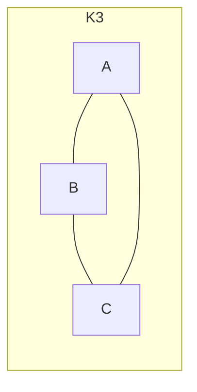
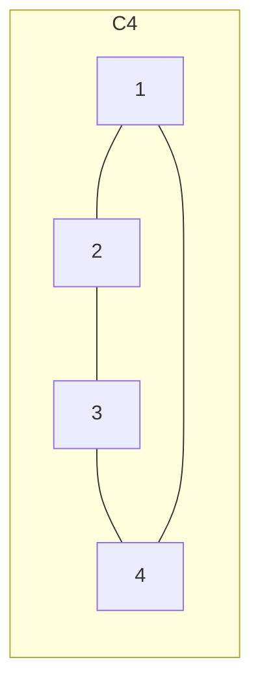

# Chapter 10: Graphs — Part 1

> [!Note] 💡 Notation Conventions
> - $G = (V, E)$ denotes a graph with vertex set $V$ and edge set $E$.
> - **Undirected edge** between $u$ and $v$: written $uv$ or $\{u,v\}$.
> - **Directed edge** from $u$ to $v$: written $(u, v)$.
> - $|V| = n$ (number of vertices), $|E| = e$ or $m$ (number of edges).
> - **Default:** "graph" = simple undirected graph; "digraph" = simple directed graph, unless stated otherwise.
> - $\deg(v)$: degree of vertex $v$; $\deg^+(v)$: out-degree; $\deg^-(v)$: in-degree.
> - $N(v)$: neighborhood of $v$ (set of all adjacent vertices).
> - Matrices are 0-indexed by vertex labels $v_1, v_2, \ldots, v_n$.

---

## 1. Graph Definitions

> [!Definition] 📖 Graph Types
> **1. Undirected graph** $G = (V, E)$: $V$ is a non-empty set of **vertices** (nodes); $E \subseteq \{\{u,v\} \mid u,v \in V\}$ is a set of **edges** (unordered pairs).
>
> **2. Directed graph (digraph)** $G = (V, E)$: $E \subseteq V \times V$ is a set of **ordered pairs** (directed edges).
>
> **3. Loop**: an edge connecting a vertex to itself.
>
> **4. Simple graph/digraph**: at most one edge between any two vertices, and **no loops**.
>
> **5. Multigraph**: possibly multiple edges between two vertices and/or loops (undirected).
>
> **6. Multidigraph**: possibly multiple directed edges between two vertices and/or loops.
>
> **7. Endpoints**: for edge $uv$, vertices $u$ and $v$ are its **endpoints**; they are called **adjacent** (neighbors). The edge is **incident** with $u$ and $v$.

> [!Note] 💡 Visual Summary
> | Type | Multiple edges? | Loops? | Directed? |
> |---|---|---|---|
> | Simple graph | No | No | No |
> | Multigraph | Yes | Yes | No |
> | Simple digraph | No | No | Yes |
> | Multidigraph | Yes | Yes | Yes |

---

## 2. Graph Terminology & Degrees

> [!Definition] 📖 Degree (Undirected)
> Let $G = (V, E)$ be an undirected graph.
> - The **neighborhood** of $v$: $N(v) = \{u \in V \mid uv \in E\}$.
> - The **degree** of $v$: $\deg(v) = |N(v)|$.
> - If $G$ has a loop at $v$, that loop contributes **2** to $\deg(v)$.

> [!Theorem] 📌 Handshaking Theorem (Undirected)
> Let $G = (V, E)$ be an undirected graph with $e$ edges. Then:
> $$\sum_{v \in V} \deg(v) = 2e$$
> **Corollary:** The number of vertices with odd degree is always **even**.

> [!Proof] 🔷 Handshaking Theorem
> Each edge $\{u, v\}$ contributes exactly 1 to $\deg(u)$ and 1 to $\deg(v)$, so it contributes exactly 2 to $\sum_{v} \deg(v)$. Summing over all $e$ edges gives $2e$. $\blacksquare$
>
> **Corollary proof:** Write $V = V_{\text{odd}} \cup V_{\text{even}}$ (odd/even degree vertices). Then:
> $$2e = \sum_{v \in V_{\text{odd}}} \deg(v) + \sum_{v \in V_{\text{even}}} \deg(v)$$
> The second sum is even; hence $\sum_{v \in V_{\text{odd}}} \deg(v)$ is even. Since each term is odd, $|V_{\text{odd}}|$ must be even. $\blacksquare$

> [!Definition] 📖 Degree (Directed)
> Let $G = (V, E)$ be a digraph, and let $e = (u, v) \in E$.
> - $u$ is the **initial vertex**; $v$ is the **terminal vertex**.
> - **In-degree** of $v$: $\deg^-(v)$ = number of edges with $v$ as terminal vertex.
> - **Out-degree** of $v$: $\deg^+(v)$ = number of edges with $v$ as initial vertex.

> [!Theorem] 📌 Handshaking Theorem (Digraph)
> Let $G$ be a digraph. Then:
> $$\sum_{v \in V} \deg^+(v) = \sum_{v \in V} \deg^-(v) = |E|$$

---

## 3. Special Simple Graphs

### 3.1 Complete Graph $K_n$

> [!Definition] 📖 Complete Graph
> $K_n$ is the simple graph on $n$ vertices with **exactly one edge between every pair of distinct vertices**.
> $$|E(K_n)| = \binom{n}{2} = \frac{n(n-1)}{2}$$
> Every vertex has degree $n - 1$.

> [!Note] 💡
> $K_1$: single vertex, no edges. $K_2$: one edge. $K_3$: triangle. $K_4$: 4 vertices, 6 edges.

---

### 3.2 Cycle $C_n$

> [!Definition] 📖 Cycle
> $C_n$ ($n \geq 3$) has vertices $v_1, v_2, \ldots, v_n$ and edges:
> $$v_1v_2,\ v_2v_3,\ \ldots,\ v_{n-1}v_n,\ v_nv_1$$
> Every vertex has degree 2. $|E(C_n)| = n$.

---

### 3.3 Wheel $W_n$

> [!Definition] 📖 Wheel
> $W_n$ ($n \geq 3$) is obtained by adding one **hub vertex** $h$ to $C_n$ and connecting $h$ to all $n$ cycle vertices.
> $$|V(W_n)| = n+1, \quad |E(W_n)| = 2n$$
> Hub has degree $n$; rim vertices have degree 3.

---

### 3.4 $n$-Cube $Q_n$

> [!Definition] 📖 Hypercube ($n$-cube)
> $Q_n$ ($n \geq 1$) has $2^n$ vertices, each labeled by a **binary string of length $n$**. Two vertices are adjacent iff their binary labels differ in **exactly one bit position**.
> $$|V(Q_n)| = 2^n, \quad |E(Q_n)| = n \cdot 2^{n-1}$$
> Every vertex has degree $n$.

> [!Example] 📘 $Q_3$
> Vertices: 000, 001, 010, 011, 100, 101, 110, 111.
> E.g., 000 is adjacent to 001, 010, 100 (one bit flip each).

---

### 3.5 Bipartite Graphs

> [!Definition] 📖 Bipartite Graph
> $G = (V, E)$ is **bipartite** if $V$ can be partitioned into two non-empty disjoint sets $V = V_1 \sqcup V_2$ (i.e., $V_1 \cap V_2 = \emptyset$, $V_1, V_2 \neq \emptyset$) such that every edge connects a vertex in $V_1$ to a vertex in $V_2$.
>
> **Equivalently:** $G$ is bipartite iff its vertices can be **2-colored** (e.g., Red/Blue) such that no edge connects two vertices of the same color.

> [!Property] ⚙️ Bipartiteness of Special Graphs
> - $K_n$ is bipartite iff $n \leq 2$.
> - $C_n$ is bipartite iff $n$ is **even**.
> - $W_n$ is **never** bipartite (hub connects to both colors).
> - $Q_n$ is **always** bipartite (partition by parity of number of 1-bits).

---

### 3.6 Complete Bipartite Graph $K_{m,n}$

> [!Definition] 📖 Complete Bipartite Graph
> $K_{m,n}$ has vertex set partitioned into $V_1$ ($m$ vertices) and $V_2$ ($n$ vertices), with an edge between **every** pair $(u, v)$ with $u \in V_1$, $v \in V_2$.
> $$|V| = m + n, \quad |E| = m \cdot n$$
>
> **Star graph:** $K_{1,n}$ — one hub connected to $n$ leaves.

---

### 3.7 Edge Counts Summary

> [!Property] ⚙️ Edge Counts for Special Graphs
> | Graph | Vertices | Edges |
> |---|---|---|
> | $K_n$ | $n$ | $\dfrac{n(n-1)}{2}$ |
> | $C_n$ | $n$ | $n$ |
> | $W_n$ | $n+1$ | $2n$ |
> | $Q_n$ | $2^n$ | $n \cdot 2^{n-1}$ |
> | $K_{m,n}$ | $m+n$ | $mn$ |

---

## 4. Graph Operations

> [!Definition] 📖 Graph Operations
> **1. Union:** $G_1 \cup G_2 = (V_1 \cup V_2,\ E_1 \cup E_2)$.
>
> **2. Subgraph:** $H = (W, F)$ is a subgraph of $G = (V, E)$ if $W \subseteq V$ and $F \subseteq E$.
>
> **3. Induced subgraph** on $W \subseteq V$: $(W, F)$ where $F$ contains **all** edges of $E$ whose both endpoints are in $W$.
>
> **4. Edge removal/addition:** $G - e = (V, E \setminus \{e\})$; $G + e = (V, E \cup \{e\})$ for edge $e$.
>
> **5. Complement** $\bar{G}$: same vertex set as $G$; edge $uv \in \bar{G}$ iff $uv \notin G$.

> [!Warning] ⚠️ Subgraph vs. Induced Subgraph
> A subgraph $H$ only requires $W \subseteq V$ and $F \subseteq E$ — $F$ need not contain all edges between vertices of $W$. If it does contain all such edges, $H$ is the **induced** subgraph on $W$.
> Example: if $G$ has edge $AB$ and $H$ uses vertices $\{A, B\}$ but omits $AB$, $H$ is still a valid subgraph, but **not** the induced subgraph on $\{A, B\}$.

---

## 5. Connectivity, Walks, Paths, and Cycles

> [!Definition] 📖 Movement in a Graph
> 
> Let $G = (V, E)$ be a graph. A journey through the graph is defined by a sequence of alternating vertices and edges, starting at $v_0$ and ending at $v_n$: $v_0, e_1, v_1, e_2, \ldots, e_n, v_n$. The **length** of this sequence is $n$ (the number of edges traversed).
> 
> **1. Walk:** An unrestricted sequence. Vertices and edges **can** be repeated.
> 
> **2. Trail:** A walk with **no repeated edges**. (Vertices can be repeated).
> 
> **3. Path:** A walk with **no repeated vertices**. (This logically guarantees no repeated edges).
> 
> **4. Closed Walk:** A walk that starts and ends at the same vertex ($v_0 = v_n$).
> 
> **5. Circuit:** A closed walk with **no repeated edges**.
> 
> **6. Cycle:** A closed walk of length $n \geq 3$ with **no repeated vertices**, except for the required $v_0 = v_n$.

> [!Note] 💡 Visual Summary
> 
> |**Term**|**Can Repeat Vertices?**|**Can Repeat Edges?**|**Starts & Ends at Same Vertex?**|
> |---|---|---|---|
> |**Walk**|Yes|Yes|Optional|
> |**Trail**|Yes|No|Optional|
> |**Path**|No|No|No|
> |**Circuit**|Yes|No|Yes|
> |**Cycle**|No (Except start/end)|No|Yes|

---

### 5.1 Connectedness in Undirected Graphs

> [!Definition] 📖 Connected Undirected Graphs
> 
> **1. Connected Graph:** An undirected graph is connected if there is a path between **every** pair of distinct vertices in the graph.
> 
> **2. Connected Component:** A maximal connected subgraph of $G$. A graph that is not connected consists of two or more disjoint connected components.
> 
> **3. Cut Vertex (Articulation Point):** A vertex whose removal (along with all incident edges) increases the number of connected components in the graph.
> 
> **4. Cut Edge (Bridge):** An edge whose removal increases the number of connected components in the graph.

> [!Theorem] 📌 Path Existence
> 
> Let $G = (V, E)$ be an undirected graph. There is a **path** between two distinct vertices $u$ and $v$ if and only if there is a **walk** between $u$ and $v$.
> 
> _(If a walk repeats a vertex, the loop between the repetitions can be excised to form a shorter path)._

---

### 5.2 Connectedness in Directed Graphs

> [!Definition] 📖 Connected Digraphs
> 
> Direction matters when evaluating connectivity in digraphs.
> 
> **1. Strongly Connected:** A directed graph is strongly connected if there is a directed path from $a$ to $b$ **and** a directed path from $b$ to $a$ for every pair of distinct vertices in the graph.
> 
> **2. Weakly Connected:** A directed graph is weakly connected if the **underlying undirected graph** (the graph obtained by ignoring the direction of all edges) is connected.

> [!Warning] ⚠️ Strong vs. Weak
> 
> A strongly connected digraph is inherently weakly connected. However, a weakly connected digraph is not necessarily strongly connected (e.g., a simple path $A \to B \to C$ is weakly connected, but you cannot travel back from $C$ to $A$).

---

## 6. Representing Graphs: Adjacency Matrix

### 6.1 Undirected Graph

> [!Definition] 📖 Adjacency Matrix (Undirected)
> Let $G = (V, E)$ be a simple graph with $|V| = n$, vertices ordered as $v_1, \ldots, v_n$. The **adjacency matrix** $A = [a_{ij}]_{n \times n}$ is:
> $$a_{ij} = \begin{cases} 1 & \text{if } v_iv_j \in E \\ 0 & \text{otherwise} \end{cases}$$

> [!Property] ⚙️ Properties of $A$ (Undirected)
> **1.** $A$ is **symmetric**: $a_{ij} = a_{ji}$ for all $i, j$.
> **2.** $\sum_{j=1}^n a_{ij} = \deg(v_i)$ (row sum = degree of $v_i$).
> **3.** All diagonal entries are 0 (no loops in simple graph).

> [!Example] 📘 Adjacency Matrix (Undirected)
> **Using:** Adjacency matrix definition, degree from row sum.
>
> Graph $G$: vertices $A, B, C, D$ with edges $AB, AC, AD, BC, CD$.
>
> Order: $A=v_1, B=v_2, C=v_3, D=v_4$.
>
> $$A_G = \begin{pmatrix} 0 & 1 & 1 & 1 \\ 1 & 0 & 1 & 0 \\ 1 & 1 & 0 & 1 \\ 1 & 0 & 1 & 0 \end{pmatrix}$$
>
> Row sums: $\deg(A)=3, \deg(B)=2, \deg(C)=3, \deg(D)=2$. Total = $10 = 2 \times 5$ edges. ✓

---

### 6.2 Directed Graph

> [!Definition] 📖 Adjacency Matrix (Digraph)
> Let $G$ be a digraph with vertices $v_1, \ldots, v_n$. The adjacency matrix $A = [a_{ij}]_{n \times n}$ is:
> $$a_{ij} = \begin{cases} 1 & \text{if } (v_i, v_j) \in E \\ 0 & \text{otherwise} \end{cases}$$
>
> - Row $i$ sum = $\deg^+(v_i)$ (out-degree).
> - Column $j$ sum = $\deg^-(v_j)$ (in-degree).
> - $A$ is **not** necessarily symmetric.

---

### 6.3 Multigraph

> [!Definition] 📖 Adjacency Matrix (Multigraph)
> For a multigraph, $a_{ij} =$ **number of edges** between $v_i$ and $v_j$. For a multidigraph, $a_{ij} =$ **number of directed edges** from $v_i$ to $v_j$.

---

### 6.4 Laplacian Matrix

> [!Definition] 📖 Laplacian Matrix
> Let $G = (V, E)$ with vertices ordered $v_1, \ldots, v_n$. The **Laplacian matrix** is:
> $$L = D - A$$
> where:
> - $D$ is the **diagonal degree matrix**: $D_{ii} = \deg(v_i)$, $D_{ij} = 0$ for $i \neq j$.
> - $A$ is the adjacency matrix.
>
> Explicitly:
> $$L_{ij} = \begin{cases} \deg(v_i) & i = j \\ -1 & v_iv_j \in E \\ 0 & \text{otherwise} \end{cases}$$

> [!Property] ⚙️ Properties of Laplacian
> **1.** Each row sum of $L$ equals **0**.
> **2.** $L$ is symmetric (for undirected graphs).
> **3.** $L$ encodes spanning tree counts, Tutte polynomial, and acyclic orientations.

> [!Example] 📘 Laplacian Matrix
> **Using:** $L = D - A$, degree matrix.
>
> Graph $G$: vertices $A, B, C, D$ with edges $AB, AC, AD, BC, CD$ (same as adjacency matrix example above).
>
> Degrees: $\deg(A)=3, \deg(B)=2, \deg(C)=3, \deg(D)=2$.
>
> $$L_G = \begin{pmatrix} 3 & -1 & -1 & -1 \\ -1 & 2 & -1 & 0 \\ -1 & -1 & 3 & -1 \\ -1 & 0 & -1 & 2 \end{pmatrix}$$
>
> Check row sums: $3-1-1-1=0$, $-1+2-1+0=0$, $-1-1+3-1=0$, $-1+0-1+2=0$. ✓

---

### 6.5 Incidence Matrix

> [!Definition] 📖 Incidence Matrix
> Let $G$ be a multigraph with vertices $v_1, \ldots, v_n$ and edges $e_1, \ldots, e_m$. The **incidence matrix** $M = [m_{ij}]$ of size $n \times m$ is:
> $$m_{ij} = \begin{cases} 1 & \text{if } v_i \text{ is incident to } e_j \\ 0 & \text{otherwise} \end{cases}$$

> [!Example] 📘 Incidence Matrix
> **Using:** Incidence matrix definition.
>
> Graph: vertices $A, B, C$; edges $e_1 = AB$, $e_2 = BC$, $e_3 = AC$.
>
> $$M = \begin{array}{c|ccc} & e_1 & e_2 & e_3 \\ \hline A & 1 & 0 & 1 \\ B & 1 & 1 & 0 \\ C & 0 & 1 & 1 \end{array}$$
>
> Row sums = degrees: $\deg(A)=2, \deg(B)=2, \deg(C)=2$. Column sums = 2 for each edge (each edge has 2 endpoints). ✓

---

### 6.6 Counting Paths via Matrix Powers

> [!Theorem] 📌 Paths via $A^r$
> Let $G$ be a graph (undirected or directed) with adjacency matrix $A$ with respect to vertex ordering $v_1, \ldots, v_n$. The number of **paths of length $r$** from $v_i$ to $v_j$ equals the $(i, j)$-entry of $A^r$.

> [!Example] 📘 Counting Paths of Length 3
> **Using:** $A^r$ path-counting theorem, matrix multiplication.
>
> Graph: vertices $A, B, C$; edges $AB$ (double), loop at $B$, and $BC$. Adjacency matrix (ordering $A, B, C$):
>
> $$A = \begin{pmatrix} 0 & 2 & 0 \\ 2 & 1 & 1 \\ 0 & 1 & 0 \end{pmatrix}$$
>
> To count paths of length 3 from $A$ to $C$, compute $(A^3)_{1,3}$.
>
> **Step 1:** $A^2 = A \cdot A$:
> $$A^2 = \begin{pmatrix} 0 & 2 & 0 \\ 2 & 1 & 1 \\ 0 & 1 & 0 \end{pmatrix} \begin{pmatrix} 0 & 2 & 0 \\ 2 & 1 & 1 \\ 0 & 1 & 0 \end{pmatrix} = \begin{pmatrix} 4 & 2 & 2 \\ 2 & 6 & 1 \\ 2 & 1 & 1 \end{pmatrix}$$
>
> **Step 2:** $A^3 = A^2 \cdot A$, entry $(1,3)$:
> $$(A^3)_{1,3} = 4 \cdot 0 + 2 \cdot 1 + 2 \cdot 0 = 2$$
>
> There are **2 paths** of length 3 from $A$ to $C$.

---

## 7. Graph Isomorphism

> [!Definition] 📖 Graph Isomorphism
> Two graphs $G$ and $H$ are **isomorphic** (written $G \cong H$) if there exists a **bijection** $f: V(G) \to V(H)$ such that:
> $$uv \in E(G) \iff f(u)f(v) \in E(H)$$
> The function $f$ is called an **isomorphism**.

> [!Definition] 📖 Graph Invariants
> A **graph invariant** is a property preserved under isomorphism. If two graphs differ on any invariant, they are **not isomorphic**. Common invariants:
> - Number of vertices $|V|$
> - Number of edges $|E|$
> - Degree sequence (sorted list of all vertex degrees)
> - Number of connected components
> - Existence/count of cycles of specific lengths

> [!Warning] ⚠️ Isomorphism is Hard in General
> Matching invariants only proves non-isomorphism when they differ. To **prove** isomorphism, you must explicitly construct the bijection $f$ and verify all edges are preserved.

> [!Example] 📘 Proving Isomorphism
> **Using:** Bijection construction, edge verification.
>
> $G$: vertices $A, B, C, D$; edges $AB, BC, CD, DA$ (a 4-cycle).
> $H$: vertices $X, Y, W, Z$; edges $XY, YZ, ZW, WX$ (a 4-cycle, drawn differently).
>
> Define $f: A \mapsto X,\ B \mapsto Y,\ C \mapsto W,\ D \mapsto Z$.
>
> Verify:
> - $AB \in G \Rightarrow f(A)f(B) = XY \in H$ ✓
> - $BC \in G \Rightarrow YW \in H$ ✓
> - $CD \in G \Rightarrow WZ \in H$ ✓
> - $DA \in G \Rightarrow ZX \in H$ ✓
>
> $f$ is a bijection and preserves all edges, so $G \cong H$.

> [!Example] 📘 Proving Non-Isomorphism via Degree Sequence
> **Using:** Degree sequence invariant.
>
> $G$: 5 vertices, edges forming a 5-cycle + one diagonal. Degree sequence: $\{3, 3, 2, 2, 2\}$.
> $H$: 5 vertices, edges forming a pentagon only. Degree sequence: $\{2, 2, 2, 2, 2\}$.
>
> Degree sequences differ $\Rightarrow$ $G \not\cong H$.

> [!Example] 📘 Isomorphism Check: Two 5-vertex Graphs (from lecture)
> **Using:** Degree sequence, edge count, then bijection.
>
> Both graphs from the lecture slide have 5 vertices and 6 edges.
>
> **Left graph** degree sequence (from figure): $\{3, 3, 2, 2, 2\}$.
> **Right graph** (pentagon $C_5$) degree sequence: $\{2, 2, 2, 2, 2\}$.
>
> Degree sequences differ $\Rightarrow$ **not isomorphic**.

---

## 📘 Examples & Applications

> [!Example] 📘 Handshaking Theorem — Existence of Simple Graph
> **Using:** Handshaking theorem, degree sequence sum, odd-degree count.
>
> **Problem:** Do simple graphs exist with 5 vertices of degrees:
> **(a)** 1, 2, 3, 3, 4  **(b)** 1, 2, 3, 3, 3  **(c)** 1, 2, 3, 4, 4
>
> **Rule:** Sum of degrees must be even; number of odd-degree vertices must be even.
>
> **(a)** Sum $= 1+2+3+3+4 = 13$ (odd) $\Rightarrow$ **No**, impossible.
>
> **(b)** Sum $= 1+2+3+3+3 = 12$ (even). Odd-degree vertices: $\{1, 3, 3, 3\}$ — count $= 4$ (even). ✓ **Possible.** Verify max degree $\leq 4$ ✓ (simple graph on 5 vertices has max degree 4).
>
> **(c)** Sum $= 1+2+3+4+4 = 14$ (even). Odd-degree vertices: $\{1, 3\}$ — count $= 2$ (even). ✓ **Possible.**

> [!Example] 📘 Which Special Graphs Are Bipartite?
> **Using:** 2-coloring criterion for bipartiteness.
>
> - $K_n$: bipartite only for $n=1$ (trivially) or $n=2$. For $n \geq 3$, any triangle blocks 2-coloring.
> - $C_n$: bipartite iff $n$ is **even**. For odd $n$, the cycle has odd length, forcing two adjacent vertices to share the same color.
> - $W_n$: **never** bipartite. The hub is adjacent to all rim vertices; the rim forms $C_n$, and the hub would need to be colored opposite all of them — impossible since some rim vertices must share colors for even $n$, and $C_n$ itself is non-bipartite for odd $n$.
> - $Q_n$: **always** bipartite. Partition by parity of number of 1-bits in the binary label. Every edge flips exactly one bit, so it always connects a vertex with even parity to one with odd parity.

> [!Example] 📘 Adjacency Matrix of a Digraph
> **Using:** Directed adjacency matrix, in/out-degree from rows/columns.
>
> Digraph with vertices $A, B, C, D, E, F$ (ordering as listed), edges:
> $A \to B$; $B \to C, D$; $C \to D$; $D \to E$; $E \to A$; $F \to A, B, C, E$.
>
> $$A_G = \begin{pmatrix} 0&1&0&0&0&0 \\ 0&0&1&1&0&0 \\ 0&0&0&1&0&0 \\ 0&0&0&0&1&0 \\ 1&0&0&0&0&0 \\ 1&1&1&0&1&0 \end{pmatrix}$$
>
> Row sums (out-degrees): $A:1,\ B:2,\ C:1,\ D:1,\ E:1,\ F:4$.
> Column sums (in-degrees): $A:2,\ B:2,\ C:2,\ D:2,\ E:2,\ F:0$.
> Note: $A$ is not symmetric — characteristic of digraphs.

---

## 🗂️ Summary

- A **simple graph** has no loops and no multiple edges; default convention throughout.
- **Handshaking Theorem:** $\sum \deg(v) = 2|E|$; number of odd-degree vertices is always even.
- **Digraph version:** $\sum \deg^+ = \sum \deg^- = |E|$.
- **Special graphs edge counts:** $K_n$: $\binom{n}{2}$; $C_n$: $n$; $W_n$: $2n$; $Q_n$: $n \cdot 2^{n-1}$; $K_{m,n}$: $mn$.
- **Bipartite** = 2-colorable. $C_n$ bipartite iff $n$ even; $Q_n$ always bipartite.
- **Adjacency matrix** $A$: symmetric for undirected (row sum = degree); asymmetric for digraphs (row sum = out-degree, col sum = in-degree).
- **Laplacian** $L = D - A$: row sums all zero.
- **Incidence matrix** $M$: $n \times m$; column sums = 2 for each edge.
- **Paths of length $r$** from $v_i$ to $v_j$ = $(A^r)_{ij}$.
- **Isomorphism** requires a degree-preserving bijection on vertex sets. Use invariants (vertex count, edge count, degree sequence) to quickly detect non-isomorphism.
