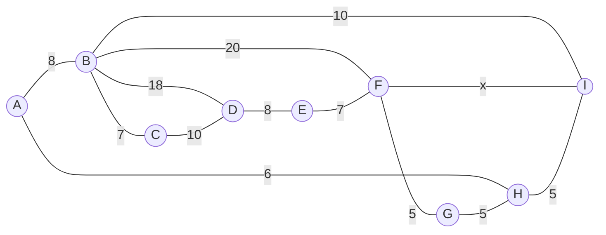
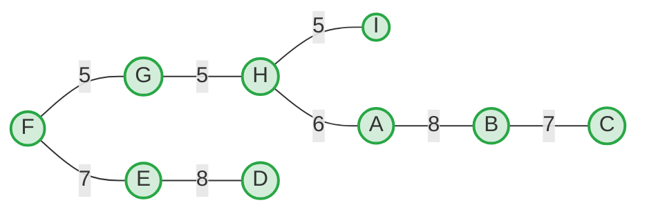

# Problem 1

**a. If $G$ is connected then $G$ can only be a tree if and only $|V| = |E| + 1$.**
**Statement:** True
**Explanation:** By definition, a tree is a connected, undirected, and acyclic graph. A fundamental theorem in graph theory states that any connected graph with $|V|$ vertices is a tree if and only if it contains exactly $|V| - 1$ edges. Rearranging the equation $|E| = |V| - 1$ yields $|V| = |E| + 1$.

**b. The DFS and BFS traversal operations of $G$ take $O(|V| + |E|)$ time complexity in adjacency matrix representation.**
**Statement:** False
**Explanation:** The $O(|V| + |E|)$ time complexity is strictly for graphs represented using an **adjacency list**. When using an adjacency matrix, determining the adjacent nodes for any given vertex requires scanning its entire row of length $|V|$. Doing this for all $|V|$ vertices results in a time complexity of $O(|V|^2)$.

**c. If $G$ is a complete graph and $|E|$ is an odd number then $|V|$ is also an odd number.**
**Statement:** False
**Explanation:** The total number of edges in a complete graph is calculated by $|E| = \frac{|V|(|V| - 1)}{2}$. Consider a counterexample where $|V|$ is an even number, such as $|V| = 6$. The number of edges would be $|E| = \frac{6(5)}{2} = 15$. Here, $|E|$ is odd but $|V|$ is even, completely disproving the premise.

---

## Problem 2
*Evaluating decreasing sequences representing degrees of nodes in a simple graph.*

**A. 6, 5, 4, 2, 1, 1, 1.** (7 vertices)
**Answer:** No
**Explanation:** Applying the Havel-Hakimi theorem: dropping the 6 requires subtracting 1 from the next six values: `(5-1), (4-1), (2-1), (1-1), (1-1), (1-1) = 4, 3, 1, 0, 0, 0`. Dropping the 4 would require subtracting 1 from the next four values. However, only three non-zero numbers remain (3, 1, 0). Proceeding would yield negative degrees, which is impossible for a simple graph.

**B. 7, 6, 5, 4, 4, 3, 2, 1.** (8 vertices)
**Answer:** Yes
**Graph Visualization:**
```mermaid
graph TD
    v1((1: 7)) --- v2((2: 6))
    v1 --- v3((3: 5))
    v1 --- v4((4: 4))
    v1 --- v5((5: 4))
    v1 --- v6((6: 3))
    v1 --- v7((7: 2))
    v1 --- v8((8: 1))
    
    v2 --- v3
    v2 --- v4
    v2 --- v5
    v2 --- v6
    v2 --- v7
    
    v3 --- v4
    v3 --- v5
    v3 --- v6
    
    v4 --- v5
````

_(Nodes are labeled `VertexID: Degree`)_

**C. 6, 6, 6, 6, 3, 3, 2, 2.** (8 vertices)

**Answer:** No

**Explanation:** Havel-Hakimi theorem reduction:

1. Drop 6 -> `5, 5, 5, 2, 2, 1, 2`. Re-sort: `5, 5, 5, 2, 2, 2, 1`
    
2. Drop 5 -> `4, 4, 1, 1, 1, 1`
    
3. Drop 4 -> `3, 0, 0, 0, 1`. Re-sort: `3, 1, 0, 0, 0`
    
    Dropping the 3 requires reducing three subsequent nodes, but only one positive degree remains, leading to negative values.
    

**D. 7, 6, 6, 4, 4, 3, 2, 2.** (8 vertices)

**Answer:** Yes

**Graph Visualization:**
```mermaid
graph TD
    v1((1: 7)) --- v2((2: 6))
    v1 --- v3((3: 6))
    v1 --- v4((4: 4))
    v1 --- v5((5: 4))
    v1 --- v6((6: 3))
    v1 --- v7((7: 2))
    v1 --- v8((8: 2))
    
    v2 --- v3
    v2 --- v4
    v2 --- v5
    v2 --- v6
    v2 --- v7
    
    v3 --- v4
    v3 --- v5
    v3 --- v6
    v3 --- v8
```

**E. 8, 7, 7, 6, 4, 2, 1, 1.** (8 vertices)

**Answer:** No

**Explanation:** In a simple undirected graph containing $|V| = 8$ vertices, a node cannot connect to itself (no loops) and can have at most one edge connecting it to any other specific node (no multiple edges). Thus, the maximum possible degree for any node is $|V| - 1 = 7$. A degree of 8 is impossible.

---

## Problem 3

### a. Vertices, Edges, and Adjacency List

- **Vertices:** 9 (`A, B, C, D, E, F, G, H, I`)
    
- **Edges:** 13
    
- **Given Graph:**



**Adjacency List:**

- **A:** B(8), H(6)
    
- **B:** A(8), C(7), D(18), F(20), I(10)
    
- **C:** B(7), D(10)
    
- **D:** B(18), C(10), E(8)
    
- **E:** D(8), F(7)
    
- **F:** B(20), E(7), G(5), I(x)
    
- **G:** F(5), H(5)
    
- **H:** A(6), G(5), I(5)
    
- **I:** B(10), F(x), H(5)
    

### b. Prim's Algorithm (Start at F, x = 8)

|**Step**|**Current Tree Nodes**|**Available Edges (from Tree to outside)**|**Edge Chosen**|**Weight**|
|---|---|---|---|---|
|1|`{F}`|F-G(5), F-E(7), F-I(8), F-B(20)|**F-G**|5|
|2|`{F, G}`|G-H(5), F-E(7), F-I(8), F-B(20)|**G-H**|5|
|3|`{F, G, H}`|H-I(5), H-A(6), F-E(7), F-I(8)...|**H-I**|5|
|4|`{F, G, H, I}`|H-A(6), F-E(7), I-B(10)...|**H-A**|6|
|5|`{F, G, H, I, A}`|F-E(7), A-B(8), I-B(10)...|**F-E**|7|
|6|`{F, G, H, I, A, E}`|A-B(8), E-D(8), I-B(10)...|**A-B**|8|
|7|`{F, G, H, I, A, E, B}`|B-C(7), E-D(8), B-D(18)...|**B-C**|7|
|8|`{F, G, H, I, A, E, B, C}`|E-D(8), C-D(10), B-D(18)...|**E-D**|8|

**Total Weight of Minimum Spanning Tree:** $5 + 5 + 5 + 6 + 7 + 8 + 7 + 8 =$ **51**

**Minimum Spanning Tree Visualization:**



### c. Dijkstra's Algorithm and the Variable Edge $x$

**Question:** Which vertices have their shortest path to A unaffected by $x$ (where $x > 0$)?

**Unaffected Vertices:** `A, B, C, D, G, H, I`

**Explanation using Dijkstra's routing from A:**

Let's resolve shortest paths from A without relying on edge (F, I).

1. $A \rightarrow H = 6$
    
2. $A \rightarrow B = 8$
    
3. $A \rightarrow H \rightarrow G = 6 + 5 = 11$
    
4. $A \rightarrow H \rightarrow I = 6 + 5 = 11$
    
5. $A \rightarrow B \rightarrow C = 8 + 7 = 15$
    
6. $A \rightarrow B \rightarrow C \rightarrow D = 15 + 10 = 25$
    

At this point, paths to $H, B, G, I, C,$ and $D$ are resolved.

If we attempted to use the unknown edge $x$ to find a shorter path to these nodes, the traversal would _first_ have to reach node $I$ (costing 11) or node $F$. Reaching $I$ costs exactly 11 without $x$. Any path routing backward from $I$ through $(I, F)$ using weight $x$ strictly costs $11 + x$. Since $x$ is a positive integer ($x > 0$), a path costing $11 + x$ will always be uncompetitive for routing to already resolved nodes like $I$ (11), $G$ (11), or $B$ (8).

Furthermore, reaching $D$ purely via the upper route is 25. Routing via the lower route utilizing $x$ would look like $A \rightarrow H \rightarrow I \rightarrow F \rightarrow E \rightarrow D = 6 + 5 + x + 7 + 8 = 26 + x$. Because $26 + x > 25$, node $D$'s shortest path is permanently unaffected.

**Why F and E ARE affected:**

Without $x$, the shortest path to $F$ is $A \rightarrow H \rightarrow G \rightarrow F = 16$.

Using $x$, the path becomes $A \rightarrow H \rightarrow I \rightarrow F = 11 + x$.

If $x$ is a small positive integer (e.g., $x \in \{1, 2, 3, 4\}$), then $11 + x < 16$. Because the shortest path to $F$ depends on the value of $x$, any node whose optimal route passes through $F$ (specifically node $E$) is also affected.