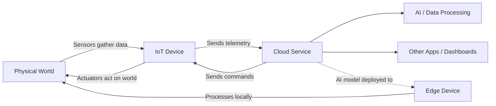

# Lesson 1 — Introduction to IoT

## Overview

The term 'Internet of Things' was coined by Kevin Ashton in 1999 to refer to connecting the Internet to the physical world via sensors. IoT devices interact with the physical world either by gathering data from sensors or providing real-world interactions via actuators, and are generally connected to other devices or the Internet. IoT as a technology area also includes cloud-based services that process sensor data or send requests to actuators, and edge devices that can process and respond to sensor data themselves using AI models trained in the cloud.

## Concepts

### What is the Internet of Things?

- Coined by **Kevin Ashton** in 1999 to refer to connecting the Internet to the physical world via sensors.
- IoT devices interact with the physical world by:
  - Gathering data from **sensors**
  - Providing real-world interactions via **actuators**
- Includes **cloud-based services** that process sensor data or send requests to actuators.
- Includes **edge devices** — devices that can process and respond to sensor data themselves, usually using AI models trained in the cloud. These are devices that do not require Internet connectivity.
- By end of 2020: ~30 billion IoT devices deployed. By 2025: projected to gather ~80 zettabytes (80 trillion gigabytes) of data.

> [!NOTE]
> **Sensors** gather information from the world, such as measuring speed, temperature or location.
> **Actuators** convert electrical signals into real-world interactions such as triggering a switch, turning on lights, making sounds, or sending control signals to other hardware.

### IoT Devices

The **T** in IoT stands for **Things** — devices that interact with the physical world by gathering data from sensors or providing real-world interactions via actuators.

- **Production/commercial devices** are custom-made (custom circuit boards, custom processors) designed for specific tasks.
- **Developer kits** are general-purpose IoT devices for developers, often including features not found on production devices (external pins, debug hardware, extra resources).

> [!TIP]
> Your phone can also be considered a general-purpose IoT device, with sensors and actuators built in, with different apps using them in different ways with different cloud services.

Developer kits fall into two categories:

#### Microcontrollers (MCU)

A microcontroller (MCU — microcontroller unit) is a small computer consisting of:
- 🧠 One or more **CPUs** — the 'brain' that runs your program
- 💾 **Memory** (RAM and program memory) — where your program, data, and variables are stored
- 🔌 **Programmable I/O connections** — to talk to external peripherals (sensors and actuators)

Key facts:
- Typically low cost: average ~US$0.50 for custom hardware, some as cheap as US$0.03
- Developer kits start at ~US$4; the **Wio Terminal** (Seeed Studios) costs ~US$30
- Designed to perform a **limited number of very specific tasks**
- Cannot connect a monitor/keyboard/mouse for general-purpose use
- Usually programmed in **C/C++**
- Often include built-in sensors, LEDs, and wireless (Bluetooth/WiFi)

> [!NOTE]
> When searching the Internet for microcontrollers, be wary of searching for **MCU** as it will also return results for the Marvel Cinematic Universe.

#### Single-Board Computers (SBC)

A single-board computer has all the elements of a complete computer on a single small board:
- Has **CPU, memory, and input/output pins** like a microcontroller
- Additionally has: graphics chip, audio outputs, USB ports, SD card slot / hard drive for OS
- Runs a full operating system
- Smaller, lower power, and cheaper than a PC/Mac
- **Raspberry Pi** is the most popular single-board computer
- IoT devices on single-board computers are typically programmed in **Python**

> [!NOTE]
> You can think of a single-board computer as a smaller, cheaper version of a PC or Mac with the addition of GPIO (general-purpose input/output) pins to interact with sensors and actuators.

### Hardware Choices for the Lessons

Each lesson supports 3 device choices:
1. **Arduino** — Seeed Studios Wio Terminal (microcontroller)
2. **Raspberry Pi 4** — physical single-board computer
3. **Virtual single-board computer** — runs on your PC or Mac (no hardware purchase needed)

- **Arduino**: Requires basic C/C++ understanding. Uses **VS Code** with the **PlatformIO** extension.
- **Single-board computer**: Requires basic Python understanding. Uses **VS Code**.
- **Virtual device**: Uses **CounterFit** tool to simulate hardware. Code is equivalent to Raspberry Pi code and mostly transferable.

> [!IMPORTANT]
> You don't need to purchase any IoT hardware to complete the assignments — everything can be done using a virtual single-board computer.

### Applications of IoT

IoT covers a huge range of use cases across four broad groups:

#### Consumer IoT
Devices consumers buy and use around the home:
- Smart speakers, smart heating systems, robotic vacuum cleaners
- Empowers people with disabilities (e.g., robotic vacuums for mobility-impaired, voice-controlled ovens for limited vision/motor control, health monitors for chronic conditions)
- Even young children use them (e.g., smart timers for schoolwork during COVID pandemic)

#### Commercial IoT
Use of IoT in the workplace:
- Offices: occupancy sensors and motion detectors to manage lighting and heating
- Factories: IoT monitoring for safety hazards (hard hats, dangerous noise levels)
- Retail: temperature monitoring of cold storage, shelf stock monitoring
- Transport: vehicle location monitoring, on-road mileage tracking, driver hour compliance, depot arrival notification

#### Industrial IoT (IIoT)
Use of IoT to control and manage machinery on a large scale:
- Factory machinery monitored with sensors (temperature, vibration, rotation speed); shut down if outside tolerances; predictive maintenance via AI models
- **Digital agriculture**: ranges from single-digit dollar sensors to massive commercial setups
  - Growing degree days to predict harvest time
  - Soil moisture monitoring connected to automated watering systems
  - Drones, satellite data, AI to monitor crop growth, disease, and soil quality

#### Infrastructure IoT
Monitoring and controlling local and global infrastructure:
- **Smart Cities**: urban areas using IoT to gather data and improve operations (e.g., Copenhagen tracks air pollution for cycling/jogging routes)
- **Smart power grids**: gather usage data at individual home level; guide decisions on building power stations; give users insights into power usage and cost reduction suggestions

### Examples of IoT Devices

Common consumer IoT devices include:
- Smart speakers
- Smart fridges, dishwashers, ovens, microwaves
- Electricity monitors for solar panels
- Smart plugs
- Video doorbells and security cameras
- Smart thermostats with room sensors
- Garage door openers
- Voice-controlled TVs and home entertainment systems
- Smart lights
- Fitness and health trackers

## Hardware / Setup

### Virtual Device Setup (CounterFit)

> [!NOTE]
> For Raspberry Pi setup, refer to `pi.md`. For Wio Terminal, refer to `wio-terminal.md`.

**Required software:**
1. **Python** — install from [python.org/downloads](https://www.python.org/downloads/)
2. **Visual Studio Code (VS Code)** — install from [code.visualstudio.com](https://code.visualstudio.com)
3. **VS Code Pylance extension** — provides Python language support

**Configure Python virtual environment:**

```sh
mkdir nightlight
cd nightlight
```

```sh
python3 -m venv .venv
```

Activate the virtual environment:
- **Windows (Command Prompt):**
  ```cmd
  .venv\Scripts\activate.bat
  ```
- **Windows (PowerShell):**
  ```powershell
  .\.venv\Scripts\Activate.ps1
  ```
- **macOS/Linux:**
  ```cmd
  source ./.venv/bin/activate
  ```

> [!TIP]
> If you get an error about running scripts being disabled on Windows (PowerShell), launch PowerShell as administrator and run: `Set-ExecutionPolicy -ExecutionPolicy Unrestricted`

Install CounterFit packages:

```sh
pip install CounterFit
pip install counterfit-connection
pip install counterfit-shims-grove
```

## Code Walkthrough

### Hello World — Virtual Device

**Step 1:** Create and open `app.py`:
- Windows: `type nul > app.py`
- macOS/Linux: `touch app.py`

```sh
code .
```

**Step 2:** Write the Hello World code:

```python
print('Hello World!')
```

The `print` function prints whatever is passed to it to the console.

**Step 3:** Run the app:

```sh
python app.py
```

Expected output:
```output
(.venv) ➜  nightlight python app.py 
Hello World!
```

### Connect to CounterFit Hardware

**Step 1:** Launch CounterFit from the terminal:

```sh
counterfit
```

The app starts running and opens in your web browser. It will be marked as *Disconnected*.

**Step 2:** Add connection code to the top of `app.py`:

```python
from counterfit_connection import CounterFitConnection
CounterFitConnection.init('127.0.0.1', 5000)
```

- `CounterFitConnection` is imported from the `counterfit_connection` module.
- `init('127.0.0.1', 5000)` initializes a connection to CounterFit running on `127.0.0.1` (localhost) on port `5000`.

> [!TIP]
> If you have other apps running on port 5000, change the port in the code and run CounterFit using `CounterFit --port <port_number>`.

**Step 3:** Open a new terminal (since CounterFit is running in the current one) and run `app.py`. The CounterFit status changes to **Connected**.

## How It Works



- IoT devices gather data from the physical world via sensors.
- Data is sent to cloud services as telemetry.
- Cloud services process data using AI or other services, then send commands back to devices via actuators.
- Edge devices process data locally without requiring an Internet connection, using AI models trained in the cloud.

## Key Terms

| Term | Definition |
|------|------------|
| Internet of Things (IoT) | A term coined by Kevin Ashton in 1999 to refer to connecting the Internet to the physical world via sensors; now used to describe any device that interacts with the physical world, either gathering data from sensors or providing interactions via actuators |
| Sensor | A hardware device that gathers information from the world, such as measuring speed, temperature, or location |
| Actuator | A device that converts electrical signals into real-world interactions such as triggering a switch, turning on lights, making sounds, or sending control signals to other hardware |
| Edge device | A device that can process and respond to sensor data itself, usually using AI models trained in the cloud, without requiring an Internet connection |
| Microcontroller (MCU) | A small computer consisting of one or more CPUs, memory (RAM and program memory), and programmable I/O connections, designed to perform a limited number of specific tasks |
| Single-board computer | A small computing device that has all the elements of a complete computer contained on a single small board, running a full operating system |
| GPIO | General-purpose input/output pins on an IoT device used to interact with sensors and actuators |
| Developer kit | A general-purpose IoT device designed for developers, often with features not found on production devices |
| CounterFit | A project that allows you to run an app locally that simulates IoT hardware such as sensors and actuators, and access them from local Python code |
| Consumer IoT | IoT devices that consumers buy and use around the home |
| Commercial IoT | The use of IoT in the workplace |
| Industrial IoT (IIoT) | The use of IoT devices to control and manage machinery on a large scale |
| Infrastructure IoT | Monitoring and controlling the local and global infrastructure that people use every day |
| Smart Cities | Urban areas that use IoT devices to gather data about the city and use that to improve how the city runs |
| Smart power grids | Power grids that allow better analytics of power demand by gathering usage data at the level of individual homes |
| Digital agriculture | The use of IoT and related technologies in farming, from temperature sensors and soil moisture monitoring to drones and AI for crop monitoring |
| Virtual environment (Python) | A copy of Python in a dedicated folder; pip packages installed into it are available only within that environment, avoiding version conflicts |

## Summary

- The term IoT was coined by Kevin Ashton in 1999; it describes devices that interact with the physical world via sensors and actuators.
- IoT includes cloud services, edge devices, and the devices themselves.
- By 2020, ~30 billion IoT devices were deployed; by 2025, they are projected to generate ~80 zettabytes of data.
- Developer kits fall into two categories: **microcontrollers** (cheap, limited tasks, C/C++) and **single-board computers** (full OS, Python).
- The Wio Terminal is a microcontroller developer kit; the Raspberry Pi is a single-board computer.
- A **virtual device** using CounterFit can simulate all IoT hardware — no physical purchase needed.
- IoT applications span four areas: Consumer, Commercial, Industrial (IIoT), and Infrastructure.
- Digital agriculture uses IoT ranging from simple soil moisture sensors to drones and AI.
- Smart Cities and Smart Grids are major Infrastructure IoT applications.
