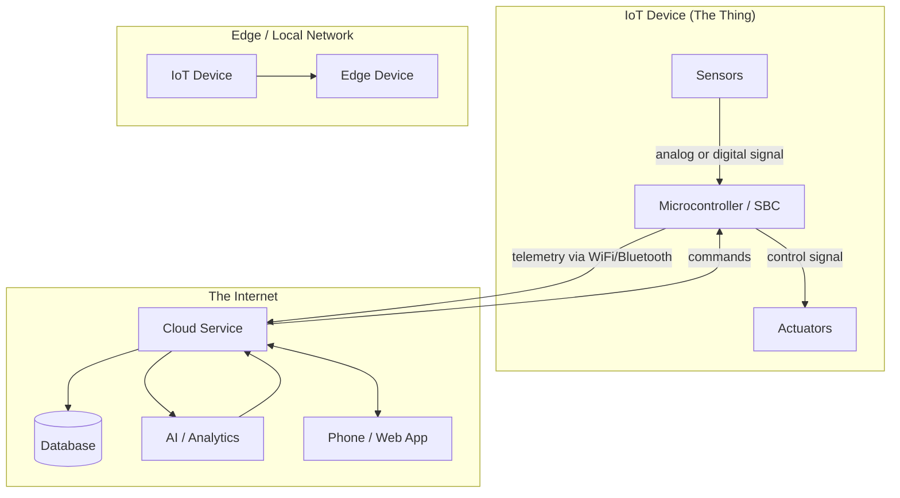
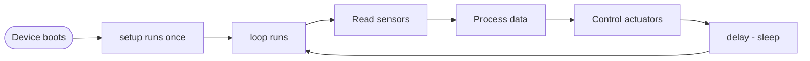

# Lesson 2 — A Deeper Dive into IoT

## Overview

This lesson dives deeper into the two components of an IoT application: the *Thing* (the device) and the *Internet* (cloud connectivity). It covers the internal architecture of microcontrollers — CPU, memory, and I/O — along with the Arduino framework and the Raspberry Pi single-board computer. It also introduces IoT on the Edge, IoT security, and how single-board computers are programmed and used professionally.

## Concepts

### Components of an IoT Application

An IoT application has two components: the **Internet** and the **Thing**.

#### The Thing

- Refers to a device that can interact with the physical world.
- Usually small, low-priced computers running at low speeds and using low power.
- Examples: simple microcontrollers with kilobytes of RAM running at a few hundred megahertz, consuming so little power they can run for weeks, months, or even years on batteries.
- Interact with the physical world using **sensors** (gather data) or **actuators** (make physical changes).
- Example — smart thermostat: temperature sensor detects room is too cold → actuator turns heating on.

#### The Internet

- Consists of applications the IoT device connects to, to send and receive data.
- Includes other applications that process sensor data and help make decisions on what requests to send to the device's actuators.
- Typical setup: a **cloud service** handles security, receives messages from the device, and sends messages back.
- The cloud service connects to other applications for processing, storing sensor data, or using data from other systems to make decisions.
- Devices don't always connect directly to the Internet; some use **mesh networking** (e.g., Bluetooth) to talk to each other, connecting via a hub device that has an Internet connection.

**Smart Thermostat Example (full system):**
The thermostat connects via home WiFi to a cloud service. It sends temperature data; this is written to a database. A phone app allows the homeowner to check current and past temperatures. Another cloud service knows the desired temperature and sends messages back via the cloud service to turn heating on or off.

**Smarter Thermostat (with AI):**
AI in the cloud uses data from other IoT devices (occupancy sensors), weather, and calendar to make smart decisions — e.g., turn off heating when a calendar shows vacation, or control heating room by room based on usage patterns.

#### IoT on the Edge

- IoT devices don't always connect to the Internet — they can connect to **edge devices** (gateway devices on the local network).
- Benefits of edge processing:
  - Faster when you have a lot of data or a slow Internet connection
  - Allows offline operation (e.g., on a ship, in a disaster area)
  - Keeps data private
- Example: Smart home devices (Apple HomePod, Amazon Alexa, Google Home) listen using AI models trained in the cloud but running **locally on the device**. They wake up on a wake word, only then send speech over the Internet. Everything before/after the wake word stays private.
- Some devices run processing code created using cloud tools but run locally, without using an Internet connection to make decisions.

> [!NOTE]
> Sometimes IoT devices and edge devices run on a network completely isolated from the Internet to keep data private and secure. This is known as **air-gapping**.

#### IoT Security

- IoT devices connect to a cloud service and are only as secure as that cloud service.
- An insecure cloud service allows malicious data or virus attacks — with real-world consequences since IoT devices control physical things.
- Example: The **Stuxnet worm** manipulated valves in centrifuges to damage them.
- Example: Hackers have accessed baby monitors and home surveillance devices due to poor security.

> [!WARNING]
> There is an old joke that 'the S in IoT stands for Security' — there is no 'S' in IoT, implying it is not secure.

---

### Deeper Dive into Microcontrollers

#### CPU

- The **'brain'** of the microcontroller — runs your code and communicates with connected devices.
- CPUs can contain one or more **cores** — essentially one or more CPUs that work together.
- CPUs rely on a **clock** that ticks many millions or billions of times a second. Each tick (cycle) synchronizes CPU actions.
- With each tick, the CPU can execute one instruction (retrieve data, perform a calculation).
- CPU speeds measured in **Hertz (Hz)**: 1 Hz = one cycle per second.

> [!NOTE]
> CPU speeds are often given in MHz or GHz. 1 MHz = 1 million Hz. 1 GHz = 1 billion Hz.

> [!NOTE]
> CPUs execute programs using the **fetch-decode-execute cycle**: each tick, the CPU fetches the next instruction from memory, decodes it, then executes it (e.g., using an ALU to add 2 numbers). Some instructions take multiple ticks.

- The **Wio Terminal** CPU runs at **120 MHz** (120,000,000 cycles per second) — much slower than desktop CPUs.
- Each clock cycle draws power and generates heat. Microcontrollers run much cooler and slower than PCs.
- PCs run off mains power or large batteries for a few hours; microcontrollers can run for days, months, or years off small batteries.
- Microcontrollers can have cores running at different speeds, switching to slower low-power cores when demand is low.

#### Memory

Microcontrollers have two types of memory:

| Type | Description |
|------|-------------|
| **Program memory** | Non-volatile — stores your program code; persists without power |
| **RAM** | Volatile — used by the program at runtime; contains variables and data from peripherals; lost when power is removed |

- A typical PC has **8 GB** of RAM; the **Wio Terminal** has **192 KB** of RAM — more than 40,000 times less.
- A typical PC has a **500 GB** hard drive; the Wio Terminal has **4 MB** of program storage.

> [!NOTE]
> Program memory stores your code and stays when there is no power. RAM is used to run your program and is reset when there is no power.

#### Input/Output (I/O)

- Microcontrollers have **GPIO (general-purpose input/output) pins** configured in software to be input or output.
- 🧠⬅️ **Input pins** are used to read values from sensors.
- 🧠➡️ **Output pins** send instructions to actuators.

#### Physical Size

| Device | Size |
|--------|------|
| Freescale Kinetis KL03 (smallest MCU) | 1.6 mm × 2 mm × 1 mm |
| Wio Terminal (developer kit) | 72 mm × 57 mm × 12 mm |
| Intel i9 CPU + Heat sink + Fan | 136 mm × 145 mm × 103 mm |

The Freescale Kinetis KL03 MCU is small enough to fit in the dimple of a golf ball.

#### Frameworks and Operating Systems

- Microcontrollers don't run a desktop-style OS — OSes like Windows/Linux/macOS need too much memory and processing power.
- To program without an OS: use tooling that allows building code in a way the microcontroller can run, using APIs to talk to peripherals.
- Manufacturers support **standard frameworks** so code follows a recipe that runs on any supported microcontroller.
- **Real-Time Operating System (RTOS)**: A lightweight OS for microcontrollers, providing:
  - **Multi-threading** — run more than one code block at the same time
  - **Networking** — communicate over the Internet securely
  - **GUI components** — for building user interfaces on devices with screens

> [!TIP]
> Examples of RTOSes: Azure RTOS, FreeRTOS, Zephyr.

#### Arduino

- Probably the most popular microcontroller framework, especially among students, hobbyists, and makers.
- An **open source electronics platform** combining software and hardware.
- Arduino boards coded in **C or C++** — allows very small compiled code that runs fast, needed on constrained devices.
- The core of an Arduino application is called a **sketch**: C/C++ code with 2 functions:
  - `setup()` — runs **once** when the board starts up (connect to WiFi, initialize pins, etc.)
  - `loop()` — runs **continuously** until power is off (read sensors, send data, etc.)

```cpp
// Arduino sketch structure
void setup() {
  // runs once at startup
}

void loop() {
  // runs repeatedly
}
```

- Normally include a **delay** in each loop (e.g., 10-second delay to sleep between sensor reads), saving power.
- Arduino provides **standard libraries** for interacting with I/O pins; same code can be recompiled for any Arduino board assuming the same pins and features.
- A large ecosystem of **third-party Arduino libraries** for sensors, actuators, and cloud IoT services.

> [!NOTE]
> This program architecture is known as an **event loop** or **message loop**. Many applications use this under the hood — it is the standard for most desktop applications on Windows, macOS, or Linux. The loop listens for messages from UI components (buttons, keyboard) and responds to them.

---

### Deeper Dive into Single-Board Computers

#### Raspberry Pi

- Developed by the **Raspberry Pi Foundation** (UK charity founded 2009) to promote study of computer science, especially at school level.
- Available in 3 variants: **full size**, **Pi Zero**, and **compute module** (for installation into custom hardware).

**Raspberry Pi 4B specs:**
- Quad-core (4 core) CPU at **1.5 GHz**
- 2, 4, or 8 GB RAM
- Gigabit Ethernet, WiFi
- 2 HDMI ports (4K), audio + composite video output
- USB ports (2× USB 2.0, 2× USB 3.0)
- **40 GPIO pins**
- Camera connector, SD card slot
- Board size: **88 mm × 58 mm × 19.5 mm**
- Powered by 3A USB-C; starts at **US$35**

**Raspberry Pi Zero specs:**
- Single-core **1 GHz** CPU
- **512 MB** RAM
- WiFi (Zero W model)
- Single HDMI port, micro-USB port
- 40 GPIO pins, camera connector, SD card slot
- Board size: **65 mm × 30 mm × 5 mm**
- **US$5** (Zero), **US$10** (Zero W with WiFi)

> [!NOTE]
> The CPUs in Raspberry Pi models are **ARM processors**, as opposed to Intel/AMD x86 or x64 processors in most PCs. These are similar to CPUs in some microcontrollers, as well as nearly all mobile phones, the Microsoft Surface X, and Apple Silicon Macs.

- All Raspberry Pi variants run **Raspberry Pi OS** — a version of Debian Linux.
  - **Lite version**: no desktop — for headless projects
  - **Full version**: full desktop environment with browser, office apps, coding tools, games

#### Programming Single-Board Computers

- Full computers running a full OS → wide range of programming languages, frameworks, and tools.
- Most popular language for Raspberry Pi IoT: **Python**
- Large ecosystem of hardware designed for the Pi, with Python libraries included.
- Some ecosystems based on **'hats'** — boards that sit on top of the Pi and connect via the 40 GPIO pins, providing additional capabilities (screens, sensors, remote-controlled cars, adapters for standardized cables).

#### Use in Professional IoT Deployments

- Single-board computers are used for professional IoT deployments, not just developer kits.
- Example: **Raspberry Pi 4 compute module** — provides Raspberry Pi 4 power in a compact, cheaper form factor without most ports, designed for installation into custom hardware.

## Hardware / Setup

> [!NOTE]
> Lesson 1 uses the same nightlight project folder set up with CounterFit. Refer to Lesson 1 for the initial virtual environment setup.

For the Wio Terminal (Arduino), if available:
- Find the CPU through the clear plastic window on the back of the device (Hardware Overview section of the Wio Terminal product page).
- Find the GPIO pins using the Pinout Diagram on the Wio Terminal product page. Apply the pin number sticker to the back.

For the Raspberry Pi:
- Find the processor details on the Raspberry Pi hardware documentation page.
- Locate the GPIO pins and identify them using the GPIO Pin Usage guide.

## Code Walkthrough

### Arduino Sketch Structure

```cpp
void setup() {
    // Called once when the board starts up
    // Use for: connecting to WiFi, initializing pins, setting up sensors
    Serial.begin(9600);
    Serial.println("Setup complete");
}

void loop() {
    // Called repeatedly until power is off
    // Use for: reading sensors, sending data to cloud
    Serial.println("Loop running");
    delay(10000); // sleep for 10 seconds to save power
}
```

- `setup()` is called **once** on each reboot.
- `loop()` runs **continuously**, called again and again.
- `delay(ms)` pauses the program for the given number of milliseconds — saves power by allowing the microcontroller to sleep.
- `Serial.begin(9600)` initializes serial communication at 9600 baud for debugging output.
- `Serial.println("...")` writes to the serial port — visible in the serial monitor.

### Arduino Standard Library Functions

| Function | Description |
|----------|-------------|
| `delay(ms)` | Pauses program for given milliseconds |
| `digitalRead(pin)` | Reads a value of `HIGH` or `LOW` from the given pin |
| `digitalWrite(pin, value)` | Writes `HIGH` or `LOW` to the given output pin |
| `analogRead(pin)` | Reads an analog value from the given pin |

These standard library functions work regardless of which Arduino board the code runs on, assuming the same pins and features are available.

## How It Works



- The **Thing** gathers data via sensors and acts via actuators.
- Data flows to the **Internet** (cloud service) as telemetry.
- The cloud stores data, runs AI/analytics, and sends commands back.
- **Edge devices** sit between IoT devices and the Internet, processing locally.



The Arduino event loop: `setup()` runs once, then `loop()` repeats forever.

## Key Terms

| Term | Definition |
|------|------------|
| The Thing | The device part of IoT — a device that can interact with the physical world using sensors and actuators |
| The Internet | The cloud connectivity part of IoT — applications the IoT device connects to in order to send and receive data |
| Edge device | A gateway device on the local network that processes data without sending it over the Internet |
| Air-gapping | Running a network completely isolated from the Internet to keep data private and secure |
| CPU (Central Processing Unit) | The 'brain' of the microcontroller that runs your code and communicates with connected devices |
| Clock cycle | A single tick of the CPU clock; each tick allows the CPU to execute one instruction |
| Hertz (Hz) | The unit of CPU speed; 1 Hz = one cycle per second |
| Fetch-decode-execute cycle | The process by which a CPU fetches an instruction from memory, decodes it, then executes it each clock tick |
| Program memory | Non-volatile memory that stores program code and retains its contents without power |
| RAM (Random-Access Memory) | Volatile memory used by the program at runtime; lost when power is removed |
| GPIO (General-Purpose Input/Output) | Pins on a microcontroller that can be configured in software as either input (reading from sensors) or output (sending to actuators) |
| RTOS (Real-Time Operating System) | A lightweight OS for microcontrollers that handles sending/receiving data from peripherals in real time |
| Arduino | An open source electronics platform combining software and hardware; the most popular microcontroller framework |
| Sketch | The core of an Arduino application; C/C++ code with `setup` and `loop` functions |
| setup() | Arduino function that runs once when the board starts up |
| loop() | Arduino function that runs continuously until power is removed |
| Event loop / Message loop | A program architecture where a loop listens for messages or events and responds to them |
| Raspberry Pi | A popular single-board computer developed by the Raspberry Pi Foundation |
| Raspberry Pi OS | A version of Debian Linux that runs on all Raspberry Pi variants |
| Hat (Raspberry Pi) | A board that sits on top of the Raspberry Pi and connects via GPIO pins, providing additional capabilities |
| Stuxnet | A worm that manipulated valves in centrifuges, demonstrating real-world consequences of poor IoT security |

## Summary

- An IoT application has two components: **The Thing** (the device) and **The Internet** (cloud connectivity).
- Devices can connect to the Internet directly or via edge devices on a local network.
- IoT security is critical — insecure cloud services can be exploited with real-world physical consequences.
- Microcontroller CPU speeds are measured in MHz; the Wio Terminal runs at 120 MHz.
- Microcontrollers use the **fetch-decode-execute cycle**; each clock tick executes one instruction.
- Microcontrollers have two memory types: **program memory** (non-volatile, stores code) and **RAM** (volatile, lost on power-off).
- GPIO pins are configured in software as input (from sensors) or output (to actuators).
- The **Arduino framework** uses a `setup()` + `loop()` architecture — setup runs once, loop runs forever.
- Standard Arduino library functions (e.g., `delay`, `digitalRead`) work across all Arduino boards.
- The **Raspberry Pi 4B** has a 1.5 GHz quad-core ARM CPU, up to 8 GB RAM, and 40 GPIO pins; starts at US$35.
- Raspberry Pi runs **Raspberry Pi OS** (Debian Linux) and is typically programmed in Python.
- Single-board computers are used in professional IoT deployments (e.g., Raspberry Pi 4 compute module).
