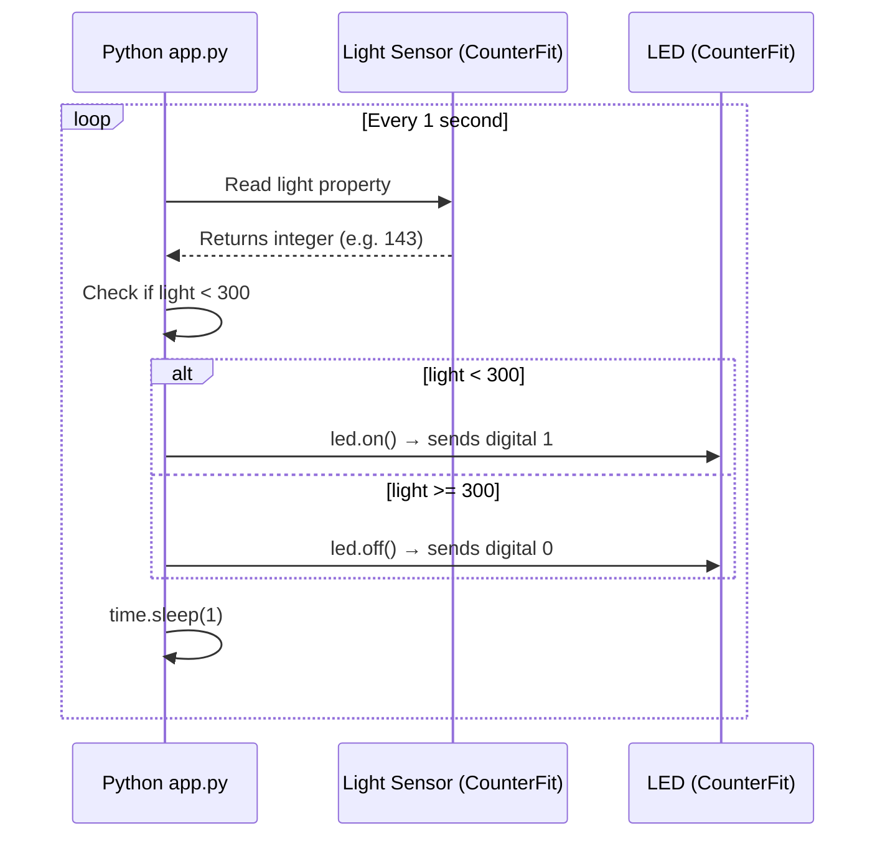

# Lesson 3 — Interact with the Physical World with Sensors and Actuators

## Overview

This lesson introduces sensors and actuators — the two critical hardware components that allow IoT devices to interact with the physical world. It covers how sensors convert physical phenomena into electrical signals (analog vs. digital), how actuators convert electrical signals into physical interactions (analog vs. digital), and introduces key concepts such as analog-to-digital conversion (ADC) and pulse-width modulation (PWM). The project built in this lesson is a **nightlight**: a light sensor reads light levels and an LED is automatically turned on when the light is below a threshold.

## Concepts

### What Are Sensors?

Sensors are hardware devices that sense the physical world — they measure one or more properties around them and send the information to an IoT device.

Common sensors include:
- **Temperature sensors** — sense air temperature or the temperature of what they are immersed in; often combined with air pressure and humidity in a single sensor
- **Buttons** — sense when they have been pressed
- **Light sensors** — detect light levels for specific colors, UV, IR, or general visible light
- **Cameras** — sense a visual representation of the world by taking a photograph or streaming video
- **Accelerometers** — sense movement in multiple directions
- **Microphones** — sense sound, either general sound levels or directional sound

All sensors share one property: they **convert whatever they sense into an electrical signal** that can be interpreted by an IoT device. How the signal is interpreted depends on the sensor and the communication protocol used.

### Sensor Types

Sensors are either **analog** or **digital**.

#### Analog Sensors

- Receive a voltage from the IoT device; sensor components **adjust this voltage**; the returned voltage is measured to give the sensor value.
- Example — **potentiometer** (a dial that rotates between two positions):
  - IoT device sends 5V in
  - Full off position (0): 0V out
  - Full on position (11): 5V out
- Example — **analog temperature sensor** (thermistor): resistance changes with temperature; output voltage is converted to Kelvin, then °C or °F, by calculations in code.

> [!NOTE]
> **Voltage** is a measure of how much push there is to move electricity from one place to another. A standard AA battery is 1.5V. An LED lights with 2–3V. A 100W filament lightbulb needs 240V.

#### Analog-to-Digital Conversion (ADC)

- IoT devices are digital — they can only work with 0s and 1s.
- Analog sensor values must be converted to a digital signal before they can be processed.
- Many IoT devices have built-in **analog-to-digital converters (ADCs)**.
- Sensors can also use ADCs via a connector board (e.g., in the Seeed Grove ecosystem with a Raspberry Pi, a 'hat' sits on the Pi with an ADC).

**Example:**
- Analog light sensor running at 3.3V returns 1V.
- Seeed Grove light sensor outputs values from 0 to 1,023.
- At 3.3V, a 1V output = value of **300**.
- 300 in binary = `0000000100101100`.
- The Grove hat converts this and sends it to the IoT device.

> [!TIP]
> From a coding perspective, ADC conversion is usually handled by sensor libraries — you just call `light` property or `analogRead` to get the value (e.g., 300).

#### Digital Sensors

- Output a digital signal — either by measuring only two states, or by having a built-in ADC.
- Becoming more common to avoid the need for external ADCs.

**Simple example — button/switch:**
- Two states: on or off.
- GPIO pins on IoT devices read this signal directly as 0 or 1.
- If voltage returned = voltage sent → value is 1; otherwise → value is 0.

> [!NOTE]
> Voltages are never exact — components have some resistance. GPIO pins on a Raspberry Pi work on 3.3V and read a return signal above 1.8V as 1, below 1.8V as 0.

**Button logic:**
- 3.3V in → button off → 0V out → value **0**
- 3.3V in → button on → 3.3V out → value **1**

**More advanced digital sensors:**
- Read analog values, then convert internally using built-in ADCs.
- Example — digital temperature sensor: uses thermocouple like analog sensor, but on-board ADC converts to digital, sending 0s and 1s to the IoT device.
- Example — camera: captures image, sends it as digital data (usually compressed JPEG) to the IoT device; can stream video frame by frame or as compressed video.

---

### What Are Actuators?

Actuators are the **opposite of sensors** — they convert an electrical signal from an IoT device into an interaction with the physical world such as emitting light or sound, or moving a motor.

Common actuators include:
- **LED** — emits light when turned on
- **Speaker** — emits sound based on the signal (from a buzzer to an audio speaker)
- **Stepper motor** — converts a signal into a defined amount of rotation (e.g., turning a dial 90°)
- **Relay** — a switch turned on/off by an electrical signal; allows a small voltage from an IoT device to turn on larger voltages
- **Screens** — complex actuators that show information on a display, from simple LED displays to high-resolution video monitors

### Actuator Types

Like sensors, actuators are either **analog** or **digital**.

#### Analog Actuators

- Take an analog signal and convert it into an interaction where the interaction changes based on the voltage supplied.
- Example — **dimmable light**: the amount of voltage supplied determines how bright it is.
- IoT devices work on digital signals, so to send an analog signal they need a **digital-to-analog converter (DAC)**, either on the device or on a connector board.

#### Pulse-Width Modulation (PWM)

PWM is another option for converting digital signals to simulate an analog signal — by sending many short digital pulses.

**Motor speed control example (150 RPM):**
- Motor with 5V supply
- Pulse: 5V for 0.02s → motor rotates 1/10 of a rotation (36°)
- Pause: 0V for 0.02s
- Cycle time: 0.04s
- 25 pulses per second × 0.1 rotations per pulse = 2.5 rotations/sec

```output
25 pulses per second x 0.1 rotations per pulse = 2.5 rotations per second
2.5 rotations per second x 60 seconds in a minute = 150rpm
```

**Half speed (75 RPM):**
- Same cycle time (0.04s), but pulse halved: 0.01s on, 0.03s off
- Each pulse rotates 1/20 of a rotation
- 25 pulses × 0.05 rotations = 1.25 rotations/sec

```output
25 pulses per second x 0.05 rotations per pulse = 1.25 rotations per second
1.25 rotations per second x 60 seconds in a minute = 75rpm
```

> [!NOTE]
> When a PWM signal is on for half the time and off for half, it is referred to as a **50% duty cycle**. Duty cycles are measured as the percentage of time the signal is in the on state compared to the off state.

> [!TIP]
> Some sensors also use PWM to convert analog signals to digital signals.

#### Digital Actuators

- Either have two states (controlled by high or low voltage) or have a built-in DAC.
- Simple example — **LED**:
  - Digital signal 1 → high voltage → LED on
  - Digital signal 0 → 0V → LED off
- More advanced digital actuators (e.g., screens) require digital data in specific formats and usually come with libraries.

---

### Nightlight Project Logic

```output
Check the light level.
If the light is less than 300
    Turn the LED on
Otherwise
    Turn the LED off
```

## Hardware / Setup

### Virtual Device — CounterFit Setup

> [!NOTE]
> For Raspberry Pi setup, refer to `pi-sensor.md` and `pi-actuator.md`. For Wio Terminal, refer to `wio-terminal-sensor.md` and `wio-terminal-actuator.md`.

**Required virtual hardware components (added in CounterFit):**

| Component | Type | Pin | Notes |
|-----------|------|-----|-------|
| Light sensor | Sensor | Pin 0 | Type: *Light*, Units: *NoUnits* |
| LED | Actuator | Pin 5 | Type: *LED* |

**Adding the Light Sensor in CounterFit:**
1. In the *Create sensor* box → *Sensor type* dropdown → select **Light**
2. Leave *Units* set to **NoUnits**
3. Ensure *Pin* is set to **0**
4. Select **Add**

**Adding the LED in CounterFit:**
1. In the *Create actuator* box → *Actuator type* dropdown → select **LED**
2. Set *Pin* to **5**
3. Select **Add**
4. Optionally change the LED color using the *Color* picker → **Set**

> [!TIP]
> The light sensor in CounterFit is a simulated photodiode that converts light to an electrical signal. It sends an integer value indicating relative light amount (no standard unit like lux).

**Physical Raspberry Pi wiring:**
- Uses a Grove light sensor connected to the Seeed Grove hat on the Pi
- The Grove hat sits on the Pi's 40 GPIO pins and includes an ADC to convert the analog light sensor signal to a digital value

## Code Walkthrough

### Install Required Libraries (Virtual Device)

```sh
pip install counterfit-shims-grove
```

### Sensor Code (`app.py`)

**Step 1 — Imports:**

```python
import time
from counterfit_shims_grove.grove_light_sensor_v1_2 import GroveLightSensor
```

- `import time` imports the Python `time` module (used for `time.sleep()`).
- `from counterfit_shims_grove.grove_light_sensor_v1_2 import GroveLightSensor` imports the `GroveLightSensor` class from the CounterFit Grove shim library — code to interact with a light sensor created in the CounterFit app.

**Step 2 — Create sensor instance:**

```python
light_sensor = GroveLightSensor(0)
```

- Creates an instance of `GroveLightSensor` connected to pin **0** — the CounterFit Grove pin the light sensor is on.

**Step 3 — Poll sensor in an infinite loop:**

```python
while True:
    light = light_sensor.light
    print('Light level:', light)
    time.sleep(1)
```

- `light_sensor.light` — reads the current light level using the `light` property; reads the analog value from pin 0.
- `print('Light level:', light)` — prints the value to the console.
- `time.sleep(1)` — pauses 1 second. A sleep reduces power consumption — light levels don't need to be checked continuously.

**Run:**

```sh
python3 app.py
```

**Expected output:**

```output
(.venv) ➜  GroveTest python3 app.py 
Light level: 143
Light level: 244
Light level: 246
Light level: 253
```

In CounterFit, change the sensor value using:
- Enter a number in the *Value* box → **Set**
- Check *Random*, enter *Min* and *Max* → **Set** (returns random value in range each read)

---

### Actuator Code — Complete Nightlight (`app.py`)

**Add LED import:**

```python
from counterfit_shims_grove.grove_led import GroveLed
```

- Imports `GroveLed` from the CounterFit Grove shim — code to interact with an LED in the CounterFit app.

**Create LED instance:**

```python
led = GroveLed(5)
```

- Creates an instance of `GroveLed` connected to pin **5** — the CounterFit Grove pin the LED is on.

**Complete nightlight loop:**

```python
while True:
    light = light_sensor.light
    print('Light level:', light)
    
    if light < 300:
        led.on()
    else:
        led.off()
    
    time.sleep(1)
```

- `if light < 300:` — checks the light value against the threshold of 300.
- `led.on()` — calls the `on` method of `GroveLed`, sending a digital value of **1** to the LED (turns it on).
- `led.off()` — calls the `off` method, sending a digital value of **0** to the LED (turns it off).

> [!WARNING]
> The `if/else` block must be indented to the same level as the `print('Light level:', light)` line to be inside the `while` loop.

**Run:**

```sh
python3 app.py
```

Change the CounterFit light sensor value above/below 300 — the LED turns on and off accordingly.

> [!NOTE]
> For Raspberry Pi and Wio Terminal variants, the same threshold (300) and logic apply. The Pi uses `pi-sensor.md` and `pi-actuator.md` with Grove hardware connected to the GPIO hat. The Wio Terminal uses built-in light sensing via `analogRead`.

## How It Works

```mermaid
flowchart LR
    CF[CounterFit App\n(browser)] -->|simulates| LS[Light Sensor\nPin 0]
    LS -->|light value 0–1023| PY[Python app.py]
    PY -->|if light < 300| LED_ON[LED on\nPin 5]
    PY -->|if light >= 300| LED_OFF[LED off\nPin 5]
    LED_ON --> CF
    LED_OFF --> CF
```



- The Python app polls the CounterFit light sensor every second.
- The analog value (0–1023) is read via the Grove shim.
- If the value is below 300 (indicating low light), the LED is turned on by sending a digital HIGH (1) to pin 5.
- If the value is 300 or above (indicating sufficient light), the LED is turned off by sending a digital LOW (0) to pin 5.

## Key Terms

| Term | Definition |
|------|------------|
| Sensor | A hardware device that senses the physical world by measuring one or more properties and sends the information to an IoT device |
| Actuator | A device that converts an electrical signal from an IoT device into an interaction with the physical world |
| Analog sensor | A sensor that receives a voltage, adjusts it based on the measured property, and returns a proportional voltage |
| Digital sensor | A sensor that outputs a digital signal — either two states (on/off) or via a built-in ADC |
| Analog-to-digital converter (ADC) | Hardware that converts an analog voltage value into a digital (binary) representation |
| Digital-to-analog converter (DAC) | Hardware that converts a digital signal from an IoT device into an analog voltage for analog actuators |
| Voltage | A measure of how much push there is to move electricity from one place to another |
| Potentiometer | An analog sensor (dial) that adjusts the voltage returned based on its rotation position |
| Thermistor | A resistor that changes resistance based on temperature, used in analog temperature sensors |
| Photodiode | A component that converts light into an electrical signal; used in light sensors |
| Pulse-Width Modulation (PWM) | A technique for converting digital signals to simulate analog signals by sending short digital pulses |
| Duty cycle | The percentage of time a PWM signal is in the on state compared to the off state |
| LED (Light-Emitting Diode) | A digital actuator that emits light when current flows through it; controlled by digital 1 (on) or 0 (off) |
| Relay | A switch actuator that can be turned on or off by an electrical signal, allowing a small voltage to control larger voltages |
| Stepper motor | An actuator that converts a signal into a defined amount of rotation |
| GroveLightSensor | A CounterFit Grove shim class used to read values from a virtual light sensor connected to a specified pin |
| GroveLed | A CounterFit Grove shim class used to control a virtual LED connected to a specified pin |
| CounterFit | A tool that simulates IoT hardware (sensors and actuators) and allows access from local Python code |

## Summary

- Sensors measure physical properties and convert them to electrical signals for the IoT device.
- All sensors return an electrical signal; analog sensors return a proportional voltage, digital sensors return 0 or 1.
- IoT devices are digital — analog sensor values must be converted using an **ADC** before processing.
- The Seeed Grove light sensor returns values from 0 to 1,023; at 3.3V, 1V input = value 300 = binary `0000000100101100`.
- Digital sensors (e.g., buttons) return 1 (voltage present) or 0 (no voltage) directly.
- Actuators convert electrical signals from IoT devices into physical world interactions.
- Analog actuators (e.g., dimmable lights) need a **DAC** to convert digital signals; **PWM** can also simulate analog by using rapid digital pulses.
- PWM at 25 pulses/second with 0.02s on-time achieves 150 RPM; halving the on-time halves the speed to 75 RPM.
- A 50% duty cycle means the PWM signal is on half the time, off half the time.
- The nightlight project uses a light sensor (pin 0) and LED (pin 5) — LED turns on when light < 300.
- `GroveLightSensor(0)` reads from pin 0; `GroveLed(5)` controls pin 5; `led.on()` sends digital 1; `led.off()` sends digital 0.
- A `time.sleep(1)` in the loop reduces power consumption by not checking continuously.
