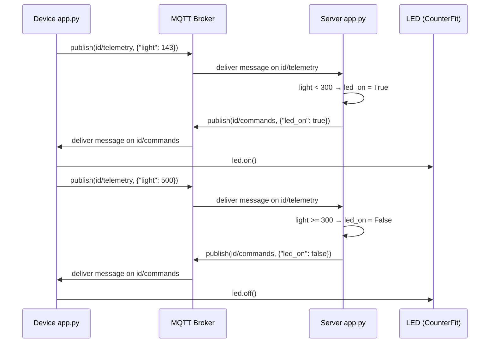

# Lesson 4 — Connect Your Device to the Internet

## Overview

The **I** in IoT stands for **Internet** — the cloud connectivity and services that enable most IoT features. This lesson covers communication protocols used by IoT devices, focusing on **MQTT** (the most popular IoT protocol), how **telemetry** is sent from device to cloud, and how **commands** are sent from cloud back to device. The project extends the nightlight from Lesson 3: the device now sends light level telemetry over MQTT, and a server app responds with commands to control the LED based on the received light level.

## Concepts

### Communication Protocols

IoT devices use communication protocols to communicate with the Internet. The most popular protocols are based around **publish/subscribe messaging** via a **broker**:

- IoT devices **connect to the broker**, **publish** telemetry, and **subscribe** to commands.
- Cloud services **connect to the broker**, **subscribe** to all telemetry, and **publish** commands to specific devices or groups.

> [!NOTE]
> **MQTT** is the most popular communication protocol for IoT devices. Others include **AMQP** and **HTTP/HTTPS**.

### Message Queuing Telemetry Transport (MQTT)

- A **lightweight, open standard messaging protocol** for sending messages between devices.
- Designed in **1999** to monitor oil pipelines; released as an open standard 15 years later by **IBM**.
- Has a **single broker** and **multiple clients**; all clients connect to the broker.
- Messages are routed using **named topics** (not directly to individual clients).
- A client **publishes** to a topic; any client **subscribed** to that topic receives the message.

**Topic hierarchy:**
- Topics can have a hierarchy: e.g., `/telemetry/temperature` and `/telemetry/humidity`
- Subscribe to `/telemetry/*` to receive both

**Quality of Service (QoS):**
Messages can be sent with a QoS that determines the guarantee of delivery:

| QoS Level | Name | Description |
|-----------|------|-------------|
| 0 | At most once | Sent once; no acknowledgement (fire and forget) |
| 1 | At least once | Retried until acknowledgement received (acknowledged delivery) |
| 2 | Exactly once | Two-level handshake ensures only one copy received (assured delivery) |

**Important MQTT behaviors:**
- Although named "Message Queueing," MQTT does **not** actually support message queues — a client that disconnects then reconnects won't receive messages sent during disconnection, except messages already being processed.
- Messages can have a **retained flag** — MQTT broker stores the last retained message on a topic and sends it to clients that later subscribe.
- MQTT supports a **keep alive** function that checks if the connection is still alive during long gaps between messages.
- MQTT connections can be: public/open, encrypted with usernames and passwords, or secured with certificates.
- MQTT communicates over **TCP/IP** on a different port than HTTP. Can also use MQTT over **websockets** for web apps or in situations where firewalls block standard MQTT.

> [!WARNING]
> The public test broker at `test.mosquitto.org` is **not secure** — anyone could be listening to what you publish. Do not use it with data that needs to be kept private.

> [!NOTE]
> The **Eclipse Mosquitto** broker is a free MQTT broker you can run yourself. The public test broker is hosted at [test.mosquitto.org](https://test.mosquitto.org) and doesn't require an account.

### Telemetry

- The word **telemetry** is derived from Greek roots meaning "to measure remotely."
- Telemetry is the act of **gathering data from sensors and sending it to the cloud**.
- Data is sent encoded as **JSON** (JavaScript Object Notation) — a standard for encoding data as key/value pairs.

> [!NOTE]
> One of the earliest telemetry devices was invented in France in 1874 and sent real-time weather and snow depths from Mont Blanc to Paris over physical wires.

**Smart thermostat telemetry example:**

| Name | Value | Description |
|------|-------|-------------|
| `thermostat_temperature` | 18°C | Built-in temperature sensor |
| `livingroom_temperature` | 19°C | Remote sensor in living room |
| `bedroom_temperature` | 21°C | Remote sensor in bedroom |

#### How Often to Send Telemetry?

- **Thermostat**: every few minutes is sufficient — temperatures change slowly. Once a day is too infrequent; every second wastes bandwidth, power, and cloud resources.
- **Factory machinery**: multiple times per second may be necessary — missing telemetry that indicates a machine fault could cause catastrophic damage.

> [!IMPORTANT]
> For edge-heavy scenarios with massive amounts of data, consider using an edge device to process telemetry first, reducing reliance on the Internet.

#### Loss of Connectivity

- **Thermostat**: data can probably be lost — the current temperature is what matters, not a measurement from 20 minutes ago.
- **Factory machinery**: data should be stored — anomaly detection ML models look for trends over time and need every data point. Once reconnected, the device sends all queued telemetry.
- IoT devices should consider operating offline — a smart thermostat should make limited decisions about heating even without cloud connectivity.

### Commands

- **Commands** are messages sent by the cloud **to a device** instructing it to do something.
- Usually involves giving output via an actuator, but can also be instructions for the device itself (reboot, gather extra telemetry, etc.).
- Example — thermostat: cloud sends command to turn heating on or off based on telemetry analysis.

**Handling commands with multiple topics:**
- Telemetry and commands sent on a single topic means all devices share that topic.
- For device-specific commands: use multiple topics named with unique device IDs, e.g., `/commands/device1`, `/commands/device2`.

#### Loss of Connectivity (Commands)

- If the **latest command overrides earlier ones** — earlier commands can be ignored (e.g., turn heating on, then off → ignore the on command).
- If **commands must be processed in sequence** (e.g., move robot arm up, then close grabber) — they must be sent in order once connectivity is restored.

## Hardware / Setup

### Virtual Device — No Additional Hardware Needed

The nightlight from Lesson 3 (CounterFit with light sensor on pin 0 and LED on pin 5) is reused. Additional pip package required:

```sh
pip3 install paho-mqtt
```

### Python Virtual Environment for Server Code

The server code runs locally on your computer (separate from the device code):

```sh
mkdir nightlight-server
cd nightlight-server
```

```sh
python3 -m venv .venv
```

Activate:
- **Windows (Command Prompt):** `.venv\Scripts\activate.bat`
- **Windows (PowerShell):** `.\.venv\Scripts\Activate.ps1`
- **macOS/Linux:** `source ./.venv/bin/activate`

```sh
pip install paho-mqtt
```

> [!NOTE]
> For Raspberry Pi, global packages are used (no virtual environment needed). For the Wio Terminal, MQTT libraries are installed differently using the Arduino/PlatformIO ecosystem. The virtual device and Raspberry Pi share the same Python code.

## Code Walkthrough

### Device Code — Connect to MQTT (`app.py`)

**Step 1 — Add MQTT import:**

```python
import paho.mqtt.client as mqtt
```

The `paho.mqtt.client` library allows the app to communicate over MQTT.

**Step 2 — Set up client ID and name:**

```python
id = '<ID>'

client_name = id + 'nightlight_client'
```

- Replace `<ID>` with a unique ID (e.g., a GUID from [guidgen.com](https://www.guidgen.com)).
- `client_name` is a unique name for this MQTT client on the broker.

> [!IMPORTANT]
> The test broker `test.mosquitto.org` is public and used by many people. A unique ID ensures your code doesn't clash with others. The same ID must be used in both device and server code.

**Step 3 — Connect to MQTT broker:**

```python
mqtt_client = mqtt.Client(client_name)
mqtt_client.connect('test.mosquitto.org')

mqtt_client.loop_start()

print("MQTT connected!")
```

- `mqtt.Client(client_name)` creates the MQTT client object with a unique name.
- `.connect('test.mosquitto.org')` connects to the public test broker.
- `.loop_start()` starts a processing loop in a **background thread** that listens for messages on subscribed topics.

**Expected output:**

```output
(.venv) ➜  nightlight python app.py 
MQTT connected!
Light level: 0
Light level: 0
```

---

### Device Code — Send Telemetry (`app.py`)

**Step 4 — Add JSON import and telemetry topic:**

```python
import json
```

```python
client_telemetry_topic = id + '/telemetry'
```

- `json` library encodes telemetry as a JSON document.
- `client_telemetry_topic` is the MQTT topic the device publishes light levels to.

**Step 5 — Replace the while loop to publish telemetry:**

```python
while True:
    light = light_sensor.light
    telemetry = json.dumps({'light' : light})

    print("Sending telemetry ", telemetry)

    mqtt_client.publish(client_telemetry_topic, telemetry)

    time.sleep(5)
```

- `json.dumps({'light': light})` — encodes the light level as JSON: `{"light": 143}`.
- `.publish(client_telemetry_topic, telemetry)` — publishes the JSON string to the telemetry topic.
- `time.sleep(5)` — sleeps 5 seconds to reduce message frequency.

**Expected output:**

```output
(.venv) ➜  nightlight python app.py 
MQTT connected!
Sending telemetry  {"light": 0}
Sending telemetry  {"light": 0}
```

---

### Device Code — Subscribe to Commands (`app.py`)

**Step 6 — Define command topic:**

```python
server_command_topic = id + '/commands'
```

The `server_command_topic` is the MQTT topic the device subscribes to for LED commands.

**Step 7 — Add command handler (above the main loop):**

```python
def handle_command(client, userdata, message):
    payload = json.loads(message.payload.decode())
    print("Message received:", payload)

    if payload['led_on']:
        led.on()
    else:
        led.off()

mqtt_client.subscribe(server_command_topic)
mqtt_client.on_message = handle_command
```

- `handle_command` is called when a message is received on a subscribed topic.
- `json.loads(message.payload.decode())` — decodes the JSON payload from the message.
- `payload['led_on']` — reads the `led_on` field from the JSON.
- If `led_on` is `True` → `led.on()`. If `False` → `led.off()`.
- `mqtt_client.subscribe(server_command_topic)` — subscribes to the command topic.
- `mqtt_client.on_message = handle_command` — sets the handler function for incoming messages.

> [!NOTE]
> The `on_message` handler is called for **all topics** subscribed to. If your code subscribes to multiple topics, you can get the topic that the message was sent to from the `message.topic` attribute of the `message` object.

---

### Server Code (`nightlight-server/app.py`)

**Initial server — receive telemetry:**

```python
import json
import time

import paho.mqtt.client as mqtt

id = '<ID>'

client_telemetry_topic = id + '/telemetry'
client_name = id + 'nightlight_server'

mqtt_client = mqtt.Client(client_name)
mqtt_client.connect('test.mosquitto.org')

mqtt_client.loop_start()

def handle_telemetry(client, userdata, message):
    payload = json.loads(message.payload.decode())
    print("Message received:", payload)

mqtt_client.subscribe(client_telemetry_topic)
mqtt_client.on_message = handle_telemetry

while True:
    time.sleep(2)
```

- Replace `<ID>` with the **same unique ID** used in the device code.
- Creates an MQTT client, connects to the test broker, starts a background listener.
- Subscribes to the telemetry topic and defines `handle_telemetry` to print received messages.
- `while True: time.sleep(2)` keeps the application running — the MQTT client listens on a background thread.

**Expected output:**

```output
(.venv) ➜  nightlight-server python app.py
Message received: {'light': 0}
Message received: {'light': 400}
```

**Add command topic and LED control:**

```python
server_command_topic = id + '/commands'
```

Add to the end of `handle_telemetry`:

```python
command = { 'led_on' : payload['light'] < 300 }
print("Sending message:", command)

client.publish(server_command_topic, json.dumps(command))
```

- `payload['light'] < 300` — evaluates to `True` if light is below 300 (dark), `False` otherwise.
- `{'led_on': True/False}` — the command JSON sent to the device.
- `client.publish(server_command_topic, json.dumps(command))` — publishes the command to the command topic.

**Expected output (server):**

```output
(.venv) ➜  nightlight-server python app.py
Message received: {'light': 0}
Sending message: {'led_on': True}
Message received: {'light': 400}
Sending message: {'led_on': False}
```

**Run order:** The device `app.py` must be running first (with CounterFit active) for the server `app.py` to receive messages.

## How It Works

```mermaid
flowchart LR
    CF[CounterFit\nLight Sensor] -->|light value| Device[Device\napp.py]
    Device -->|publishes JSON telemetry\nto id/telemetry topic| Broker[MQTT Broker\ntest.mosquitto.org]
    Broker -->|delivers telemetry| Server[Server\napp.py]
    Server -->|evaluates: light < 300?| Server
    Server -->|publishes command JSON\nto id/commands topic| Broker
    Broker -->|delivers command| Device
    Device -->|led_on=True → led.on()| LED[LED in CounterFit]
    Device -->|led_on=False → led.off()| LED
```



## Key Terms

| Term | Definition |
|------|------------|
| Telemetry | The act of gathering data from sensors and sending it to the cloud; derived from Greek roots meaning "to measure remotely" |
| Command | A message sent by the cloud to a device instructing it to do something, usually involving an actuator or internal action |
| MQTT (Message Queuing Telemetry Transport) | A lightweight, open standard messaging protocol designed in 1999 to monitor oil pipelines; the most popular IoT communication protocol |
| Broker | A central server in publish/subscribe messaging that routes messages between clients based on topics |
| Topic | A named channel in MQTT used to route messages; clients publish to topics and subscribe to receive messages from topics |
| Publish | To send a message to a specific MQTT topic |
| Subscribe | To register interest in receiving messages from a specific MQTT topic |
| Publish/subscribe (pub/sub) | A messaging pattern where senders (publishers) send messages to topics and receivers (subscribers) receive messages from topics they have registered for |
| Quality of Service (QoS) | An MQTT feature determining the guarantee of message delivery (at most once, at least once, exactly once) |
| Retained flag | An MQTT flag that causes the broker to store the last message on a topic and send it to newly subscribing clients |
| Keep alive | An MQTT feature that checks if a connection is still alive during long gaps between messages |
| JSON (JavaScript Object Notation) | A standard for encoding data in text using key/value pairs |
| paho-mqtt | A popular Python MQTT library (pip package) used to communicate over MQTT |
| `mqtt_client.connect()` | Method to connect the MQTT client to a broker |
| `mqtt_client.loop_start()` | Starts a background thread that processes MQTT messages |
| `mqtt_client.publish()` | Sends a message to the specified MQTT topic |
| `mqtt_client.subscribe()` | Subscribes the client to receive messages from a specified MQTT topic |
| `mqtt_client.on_message` | Callback function called when a message is received on any subscribed topic |
| Eclipse Mosquitto | An open-source MQTT broker; also provides a public test broker at test.mosquitto.org |
| Python virtual environment | An isolated Python installation in a dedicated folder; pip packages installed into it are only available within that environment |

## Summary

- The **I** in IoT stands for Internet — cloud connectivity enables most IoT features.
- IoT communication is most commonly based on **publish/subscribe messaging** via a broker.
- **MQTT** is the most popular IoT protocol — lightweight, open standard, designed in 1999, released by IBM.
- MQTT routes messages via **named topics**; clients publish to topics and subscribe to receive from topics.
- MQTT QoS levels: **0** (fire and forget), **1** (at least once), **2** (exactly once/assured delivery).
- **Telemetry** = sensor data sent to the cloud, encoded as JSON.
- Telemetry frequency depends on the use case — too often wastes resources, too rarely loses important data.
- **Commands** = cloud → device instructions, usually to control actuators.
- The nightlight project publishes `{"light": value}` to `id/telemetry`; the server evaluates and publishes `{"led_on": true/false}` to `id/commands`.
- `mqtt_client.loop_start()` runs a background thread — keeps listening for messages while the main program runs.
- `json.dumps()` encodes Python dicts to JSON strings; `json.loads()` decodes JSON strings back to dicts.
- The public test broker at `test.mosquitto.org` requires no account but is not secure — not for private data.
- Loss of connectivity handling depends on use case: thermostat data can be lost; factory machinery data should be queued.
