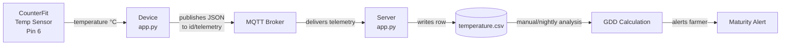
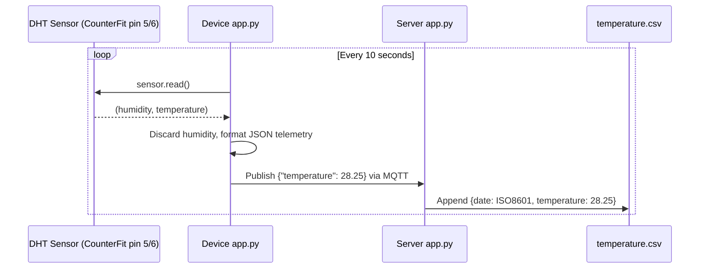

# Lesson 5 — Predict Plant Growth with IoT

## Overview

This lesson introduces **Digital Agriculture** — the use of tools to collect, store, and analyze farm data. The primary concept is **Growing Degree Days (GDD)**: a method of predicting plant maturity by accumulating daily temperature measurements above a plant's base temperature. An IoT device reads ambient temperature via a DHT11 sensor, publishes it over MQTT, and a server subscribes to record the data in a CSV file for later GDD calculation.

## Concepts

### Digital Agriculture

Digital Agriculture is transforming farming using data collection, storage, and analysis. It has been called the **'Fourth Agricultural Revolution'** or **'Agriculture 4.0'** as part of the broader Fourth Industrial Revolution described by the World Economic Forum.

Techniques enabled by digital agriculture include:
- **Temperature measurement** — measuring temperature to predict plant growth and maturity
- **Automated watering** — measuring soil moisture and turning on irrigation when the soil is too dry, rather than timed watering (which can lead to under- or over-watering)
- **Pest control** — cameras on automated robots or drones check for pests; pesticides are applied only where needed, reducing run-off into local water supplies

> [!NOTE]
> The term **'Precision Agriculture'** defines observing, measuring, and responding to crops on a per-field basis, or even per part of a field — measuring water, nutrient, and pest levels and responding accurately.

The broader **agriculture value chain** includes: tracking produce quality during shipping and processing, warehouse and e-commerce systems, and even tractor rental apps.

---

### Why Is Temperature Important?

Plants need: water, light, CO₂, nutrients, and **warmth** to grow. This is why:
- Plants bloom in spring as temperature rises
- Snowdrops and daffodils can sprout early during a warm spell
- Hothouses and greenhouses accelerate growth

Plants have three key temperature values (based on **daily average** temperatures):

| Temperature | Meaning |
|-------------|---------|
| **Base (minimum)** | Minimum daily average needed for growth |
| **Optimum** | Best daily average for maximum growth |
| **Maximum** | Above this the plant shuts down growth to conserve water |

> [!NOTE]
> **Hothouses** are artificially heated (more precise control). **Greenhouses** rely on the sun for warmth (only control is windows/openings).

> [!TIP]
> Commercial tomato growers in hothouses set temperature to ~25°C (day) and ~20°C (night) for fastest growth. Combined with artificial lights, fertilizers, and controlled CO₂ levels, they can grow and harvest all year round.

---

### Growing Degree Days (GDD)

Growing Degree Days (also known as growing degree units) measure plant growth based on temperature. Assuming a plant has enough water, nutrients, and CO₂, temperature determines the growth rate.

**GDD Formula (simplified):**

```
GDD = ((T_max + T_min) / 2) - T_base
```

- **GDD** — number of growing degree days for that day
- **T_max** — daily maximum temperature (°C)
- **T_min** — daily minimum temperature (°C)
- **T_base** — plant's base temperature (°C)

> [!NOTE]
> 5 GDD°C (Celsius) is the equivalent of 9 GDD°F (Fahrenheit).

**Example — Corn/Maize 🌽:**
- Base temperature: 10°C
- Needs 800–2,700 GDD to mature
- Day 1: T_max = 16, T_min = 12
- GDD = ((16 + 12) / 2) − 10 = 14 − 10 = **4 GDD**
- Still needs 796 more GDD to reach maturity (for an 800-GDD variety)

**Example — Strawberries 🍓:**
- Base temperature: 10°C
- Needs ~250 GDD to bear fruit
- Day: T_max = 25, T_min = 12
- GDD = ((25 + 12) / 2) − 10 = 18.5 − 10 = **8.5 GDD**

---

### Using IoT to Calculate GDD

Without IoT, farmers must check fields daily to see when crops are ready — huge labor impact, risk of missing early-maturing crops.

**IoT architecture for GDD monitoring:**
1. IoT device measures temperature → publishes via MQTT
2. Server subscribes → saves to a database or CSV file
3. Nightly job calculates GDD for the day and total GDD for each crop
4. Alert sent if a plant is near maturity

The server can augment data by:
- Adding device-to-location mapping (look up which crops the device monitors)
- Stamping accurate timestamps (some IoT devices lack hardware clocks)

> [!NOTE]
> Different fields may have different temperatures depending on topography, moisture, wind exposure, and proximity to structures.

## Hardware / Setup

### Virtual Device — CounterFit Setup

> [!NOTE]
> For Raspberry Pi: refer to `pi-temp.md`. For Wio Terminal: refer to `wio-terminal-temp.md`.

**Project folder:** `temperature-sensor`

**Install required pip package:**

```sh
pip install counterfit-shims-seeed-python-dht
```

**CounterFit sensors to add:**

| Component | Type | Pin | Units |
|-----------|------|-----|-------|
| Humidity sensor | Sensor | Pin 5 | Percentage |
| Temperature sensor | Sensor | Pin 6 | Celsius |

> [!IMPORTANT]
> CounterFit simulates the combined DHT sensor by connecting to **two** sensors: a **humidity sensor on the given pin** and a **temperature sensor on the next pin** (pin + 1). If humidity is on pin 5, temperature must be on pin 6.

**Adding sensors in CounterFit:**
1. Humidity: *Sensor type* → **Humidity**, Pin → **5**, Units → **Percentage** → Add
2. Temperature: *Sensor type* → **Temperature**, Pin → **6**, Units → **Celsius** → Add

## Code Walkthrough

### Temperature Sensor App (`app.py`)

**Step 1 — Connect to CounterFit:**

```python
from counterfit_connection import CounterFitConnection
CounterFitConnection.init('127.0.0.1', 5000)
```

**Step 2 — Import libraries:**

```python
import time
from counterfit_shims_seeed_python_dht import DHT
```

- `DHT` is the sensor class for the virtual Grove Digital Humidity and Temperature sensor (shim for DHT11).

**Step 3 — Create sensor instance:**

```python
sensor = DHT("11", 5)
```

- `"11"` — indicates a virtual DHT11 sensor type.
- `5` — pin number for the humidity sensor; the shim automatically reads temperature from pin 6 (next pin).

**Step 4 — Poll sensor:**

```python
while True:
    _, temp = sensor.read()
    print(f'Temperature {temp}°C')
    time.sleep(10)
```

- `sensor.read()` returns a tuple: `(humidity, temperature)`.
- `_, temp = ...` — discards humidity (the `_` is conventional for ignored values), keeps temperature.
- `time.sleep(10)` — reads every 10 seconds (temperatures change slowly).

**Expected output:**

```output
(.venv) ➜  temperature-sensor python app.py
Temperature 28.25°C
Temperature 30.71°C
Temperature 25.17°C
```

In CounterFit, check *Random*, set *Min* and *Max* to simulate varying temperatures.

---

### Server Code — Save to CSV (`temperature-sensor-server/app.py`)

**Additional imports:**

```python
from os import path
import csv
from datetime import datetime
```

**Create CSV file if it doesn't exist:**

```python
temperature_file_name = 'temperature.csv'
fieldnames = ['date', 'temperature']

if not path.exists(temperature_file_name):
    with open(temperature_file_name, mode='w') as csv_file:
        writer = csv.DictWriter(csv_file, fieldnames=fieldnames)
        writer.writeheader()
```

- `fieldnames` defines the column headers: `date` and `temperature`.
- `csv.DictWriter` creates a writer that writes dictionaries as rows.
- `writer.writeheader()` writes the header row (`date,temperature`) to the CSV file on first run.

**Append each received telemetry to CSV:**

```python
with open(temperature_file_name, mode='a') as temperature_file:        
    temperature_writer = csv.DictWriter(temperature_file, fieldnames=fieldnames)
    temperature_writer.writerow({'date' : datetime.now().astimezone().replace(microsecond=0).isoformat(), 'temperature' : payload['temperature']})
```

- Opens the CSV in **append** mode (`'a'`).
- `datetime.now().astimezone().replace(microsecond=0).isoformat()` — stores timestamp in ISO 8601 format with timezone (e.g., `2021-04-19T17:21:36-07:00`).
- `payload['temperature']` — the temperature value from the MQTT telemetry JSON.

**Expected CSV output:**

```output
date,temperature
2021-04-19T17:21:36-07:00,25
2021-04-19T17:31:36-07:00,24
2021-04-19T17:41:36-07:00,25
```

---

### Manual GDD Calculation from CSV

From `temperature.csv`, find the highest and lowest temperatures for the day, then apply the GDD formula:

**Strawberry example (base = 10°C, T_max = 25, T_min = 12):**
```
25 + 12 = 37
37 / 2 = 18.5
18.5 - 10 = 8.5 GDD
```
Strawberries need ~250 GDD to bear fruit.

## How It Works





## Key Terms

| Term | Definition |
|------|------------|
| Digital Agriculture | The use of tools (IoT, AI, data analytics) to collect, store, and analyze farm data to improve yields and efficiency |
| Agriculture 4.0 | The fourth agricultural revolution, characterized by the use of digital agriculture technologies |
| Precision Agriculture | Observing, measuring, and responding to crops on a per-field or sub-field basis |
| Base temperature | The minimum daily average temperature at which a plant will grow |
| Optimum temperature | The daily average temperature at which a plant achieves maximum growth |
| Maximum temperature | The temperature above which a plant shuts down growth to conserve water |
| Growing Degree Days (GDD) | A measure of plant growth based on accumulated heat units above the base temperature per day |
| GDD Formula | GDD = ((T_max + T_min) / 2) − T_base |
| DHT11 | A digital humidity and temperature sensor; uses two virtual CounterFit sensors (humidity on pin N, temperature on pin N+1) |
| CSV (Comma-Separated Values) | A plain text file format that stores tabular data with values separated by commas and records on new lines |
| ISO 8601 | An international standard for representing dates and times in a machine-readable format (e.g., `2021-04-19T17:21:36-07:00`) |
| `csv.DictWriter` | A Python class that writes dictionaries as rows to a CSV file |
| Agriculture value chain | The entire journey from farm to table, including shipping, processing, warehousing, and e-commerce |

## Summary

- Digital Agriculture = 'Agriculture 4.0'; uses IoT to increase yields, reduce fertilizer/pesticide use, and optimize water usage.
- Plants have three temperature thresholds: **base** (minimum for growth), **optimum** (maximum growth), **maximum** (plant shuts down above this).
- **GDD = ((T_max + T_min) / 2) − T_base** — accumulate daily to predict maturity.
- Corn needs 800–2,700 GDD (base 10°C); strawberries need ~250 GDD (base 10°C).
- IoT devices measure temperature → publish via MQTT → server stores in CSV → nightly GDD analysis → maturity alerts.
- The CounterFit DHT shim uses **two** virtual sensors: humidity on pin 5, temperature on pin 6.
- `sensor.read()` returns `(humidity, temperature)`; humidity is discarded with `_`.
- Timestamps are stored in ISO 8601 format with timezone.
- For virtual devices, use the *Random* checkbox in CounterFit to simulate varying temperatures.
