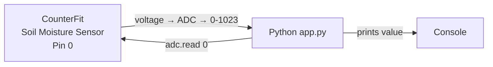
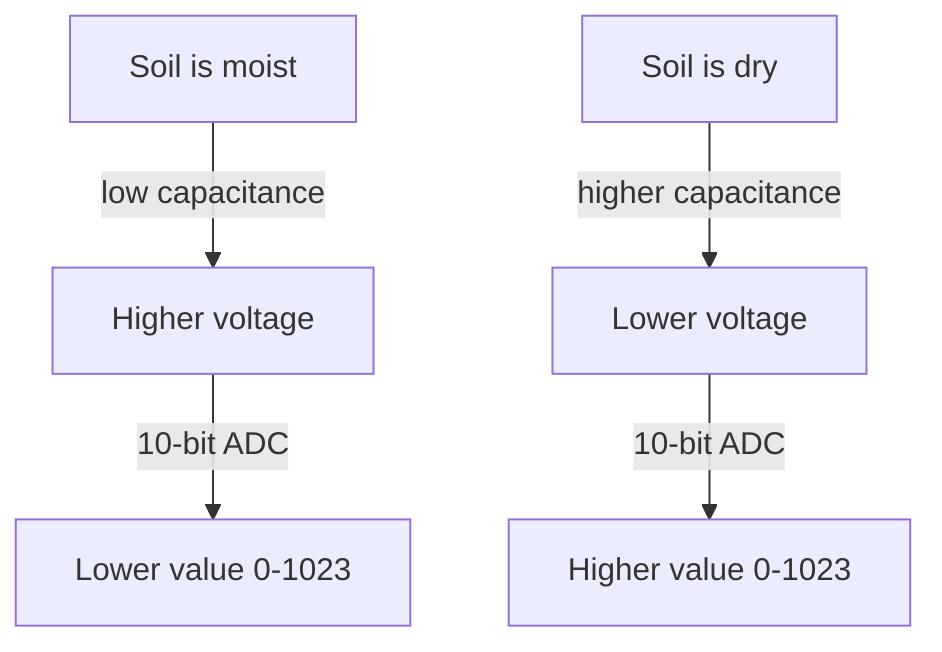

# Lesson 6 — Detect Soil Moisture

## Overview

This lesson focuses on soil moisture as the most controllable ambient property for plant growth. It introduces soil moisture sensors (resistive and capacitive), then provides a deeper dive into how sensors and actuators communicate with IoT devices — covering **GPIO**, **analog pins/ADC**, **I²C**, **UART**, **SPI**, and **wireless protocols**. The project adds a virtual capacitive soil moisture sensor to CounterFit and reads values from it using Python.

## Concepts

### Why Soil Moisture Matters

Plants need water for three functions:
1. **Photosynthesis** — water + CO₂ + light → carbohydrates + oxygen
2. **Transpiration** — diffusion of CO₂ into the plant via leaf pores; also carries nutrients and cools the plant (similar to sweating)
3. **Structure** — plants are ~90% water; this keeps cells rigid. Without enough water, plants wilt and die.

> [!NOTE]
> Too little water → plants cannot absorb enough to grow.
> Too much water → roots cannot absorb enough oxygen, roots die, plants cannot get nutrients.

Optimal moisture: not too wet, not too dry. IoT devices can measure soil moisture to guide watering decisions.

---

### Soil Moisture Sensor Types

Both types are **analog sensors** — they return a voltage that must be converted using an ADC.

#### Resistive Sensors

- Two probes inserted into soil; electrical current sent through one, received by the oter.
- **Water is a good conducthor** → higher moisture = lower resistance = higher return current.
- Simpler and cheaper.

> [!TIP]
> You can build a DIY resistive sensor using two nails separated by a few centimeters and a multimeter.

#### Capacitive Sensors

- Measures the electric charge stored across positive and negative electrical plates (capacitance).
- The capacitance of soil changes as moisture changes → converted to a voltage.
- **Wetter soil = lower voltage output**.
- Used in CounterFit; more durable than resistive sensors (no corrosion of probes).

> [!NOTE]
> For **resistive** sensors: voltage increases as moisture increases.
> For **capacitive** sensors: voltage **decreases** as moisture increases (graph slopes downward).

---

### How Sensors Communicate with IoT Devices

To communicate with sensors you need **hardware** (physical connectivity) and a **communication protocol** (a well-defined way to send and receive data).

Key questions sensors must answer:
- How long is each bit sent?
- If a pin is high for 0.1s, is that one 1-bit or ten?
- Where does a multi-bit number start/end?

#### GPIO (General-Purpose Input/Output) Pins

- A set of pins on IoT dev kits (Raspberry Pi, Wio Terminal) to connect hardware.
- Pins types: **voltage** (3.3V or 5V supply), **ground**, **programmable** (input or output).
- Direct use with **digital sensors/actuators**:
  - **Button**: connect between 5V pin and input pin. Pressed → input reads 5V (1). Released → reads 0V (0).
  - **LED**: connect output pin through LED to ground. Output high (3.3V) → LED lights.
- For analog sensors/actuators: use GPIO pins with a controller board that has an ADC/DAC.

> [!TIP]
> An electrical circuit needs to connect a voltage to ground via circuitry. Think of voltage as the battery's positive (+) terminal and ground as the negative (−) terminal.

#### Analog Pins (Arduino/Wio Terminal)

- Same as GPIO pins but have a built-in **ADC** (10-bit resolution).
- Convert voltage ranges to values **0–1,023**.
- On a 3.3V board: 3.3V returns 1,023; 1.65V returns 511.
- Soil moisture sensors use analog pins (return 0–1,023).

> [!NOTE]
> On a Raspberry Pi, there are no native analog pins. A Grove hat with an ADC converts analog sensor signals to digital to send over GPIO. The Wio Terminal has built-in analog pins.

#### I²C (Inter-Integrated Circuit)

- Pronounced "I-squared-C."
- A **multi-controller, multi-peripheral** protocol.
- Data is sent as **addressed packets** — each packet contains the address of the target device.
- Devices have a **fixed address** (hard-coded on the device; e.g., all Grove light sensors share the same address).

**Wires:**

| Wire | Name | Description |
|------|------|-------------|
| SDA | Serial Data | Sends data between devices |
| SCL | Serial Clock | Clock signal set by controller |
| VCC | Voltage common collector | Power supply for devices |
| GND | Ground | Common ground for the circuit |

**Communication:** One device issues a **start condition** → becomes controller → sends target address + read/write intent → sends/receives data → sends **stop condition** → bus released.

**Speed modes:**
- Standard mode: 100 Kbps
- Fast mode: 400 Kbps (Raspberry Pi limit)
- High Speed mode: 3.4 Mbps (few devices support this)

> [!NOTE]
> Old terminology was "master/slave" — now replaced by **controller/peripheral** per the Open Source Hardware Association.

#### UART (Universal Asynchronous Receiver-Transmitter)

- Two devices, each with **Tx** (transmit) and **Rx** (receive) pins.
- Tx of device 1 → Rx of device 2; Tx of device 2 → Rx of device 1.
- Data is sent one **bit at a time** (serial communication).
- Devices share a **baud rate** (speed in bits/second). Common: **9,600 baud** = 9,600 bits/second.
- Uses **start and stop bits** — one start bit before a byte (8 bits), one stop bit after.
- Maximum speed: ~6.5 Mbps.
- UART can be used over GPIO pins (set one pin as Tx, another as Rx).

#### SPI (Serial Peripheral Interface)

- Designed for **short distances** (e.g., processor to flash memory on a board).
- Single controller (usually IoT device processor) + multiple peripherals.
- Controller controls everything — selects peripheral, sends/requests data.

**Wires:**

| Wire | Name | Description |
|------|------|-------------|
| COPI | Controller Output, Peripheral Input | Data from controller to peripheral |
| CIPO | Controller Input, Peripheral Output | Data from peripheral to controller |
| SCLK | Serial Clock | Clock signal from controller |
| CS | Chip Select | One wire per peripheral; activates one at a time |

- **Full-duplex**: controller can send and receive at the same time.
- Uses a clock signal (no start/stop bits needed).
- No defined speed limits; often multiple MB/s.
- Raspberry Pi supports SPI over GPIO pins 19, 21, 23, 24, and 26.

#### Wireless

Sensors can communicate over standard wireless protocols, avoiding physical connections:

| Protocol | Range | Notes |
|----------|-------|-------|
| **Bluetooth Low Energy (BLE)** | Short | Popular for fitness trackers, combines multiple sensors |
| **LoRaWAN** (Long Range, Low Power) | Long | Used in commercial soil moisture sensors; sends to a hub |
| **WiFi** | Medium | Standard WiFi for local network access |
| **Zigbee** | Medium | Mesh networking — each device connects to nearby devices, forming a web-like structure. Named after the waggle dance of honeybees |

> [!TIP]
> Zigbee devices connect to as many nearby devices as possible. Messages hop from device to device until reaching a coordinator that sends them to the Internet. This reduces the need for large WiFi networks in a field.

---

### Sensor Calibration

Sensors measure electrical properties (resistance or capacitance). Raw measurements are not useful (e.g., "22.5 KΩ" for temperature). **Calibration** converts raw measurements to useful units.

- Some sensors come **pre-calibrated** (e.g., the DHT11 temperature sensor — already outputs °C).
  - Calibration: expose sensor to known temperatures in factory, measure resistance, build a conversion formula.
  - The formula to convert resistance to temperature is the **Steinhart-Hart equation**.
- Soil moisture sensors measure resistance or capacitance — values vary by **soil type** too (not just moisture).

**Calibrating soil moisture sensors:**
- Take sensor readings from a field soil sample.
- Send sample to a lab to measure **gravimetric** or **volumetric** water content:
  - **Gravimetric**: kg of water per kg of dry soil
  - **Volumetric**: m³ of water per m³ of dry soil
- Plot sensor voltage vs. lab-measured moisture on a graph, fit a line.
- Use the line to convert future sensor readings to actual soil moisture percentages.

> [!NOTE]
> A few lab measurements can calibrate a sensor for an entire field — drastically faster than manual sampling.

## Hardware / Setup

### Virtual Device — CounterFit Setup

> [!NOTE]
> For Raspberry Pi: refer to `pi-soil-moisture.md`. For Wio Terminal: refer to `wio-terminal-soil-moisture.md`.

**Project folder:** `soil-moisture-sensor`

**CounterFit sensors to add:**

| Component | Type | Pin | Units |
|-----------|------|-----|-------|
| Soil moisture sensor | Sensor | Pin 0 | NoUnits |

**Adding in CounterFit:**
- *Sensor type* → **Soil Moisture**, Pin → **0**, Units → **NoUnits** → **Add**

> [!NOTE]
> The virtual soil moisture sensor simulates a capacitive sensor using a 10-bit ADC, reporting values from 1–1,023.

## Code Walkthrough

### Soil Moisture Sensor App (`app.py`)

**Step 1 — Connect to CounterFit:**

```python
from counterfit_connection import CounterFitConnection
CounterFitConnection.init('127.0.0.1', 5000)
```

**Step 2 — Import libraries:**

```python
import time
from counterfit_shims_grove.adc import ADC
```

- `ADC` is a class from the CounterFit Grove shim that interacts with a virtual analog-to-digital converter connected to a CounterFit sensor.

**Step 3 — Create ADC instance:**

```python
adc = ADC()
```

Creates an instance of the ADC class. The ADC connects to sensors on the CounterFit app.

**Step 4 — Read soil moisture in a loop:**

```python
while True:
    soil_moisture = adc.read(0)
    print("Soil moisture:", soil_moisture)

    time.sleep(10)
```

- `adc.read(0)` — reads the analog value from **pin 0** (where the soil moisture sensor is connected).
- Returns a value from **1–1,023** (10-bit resolution).
- `time.sleep(10)` — reads every 10 seconds.

**Expected output:**

```output
(.venv) ➜ soil-moisture-sensor $ python app.py 
Soil moisture: 615
Soil moisture: 612
Soil moisture: 498
Soil moisture: 493
Soil moisture: 490
Soil Moisture: 388
```

> [!TIP]
> Higher values = drier soil (capacitive sensor: more moisture → lower voltage → lower ADC reading). Set the sensor value in CounterFit via *Value* box or enable *Random* with *Min* and *Max*.

## How It Works





> **Capacitive sensor behavior**: wetter soil → lower voltage → lower ADC reading. Drier soil → higher voltage → higher ADC reading. This is the opposite of resistive sensors.

## Key Terms

| Term | Definition |
|------|------------|
| Photosynthesis | A process where plants use water, CO₂, and light to produce carbohydrates and oxygen |
| Transpiration | The process by which plants use water to diffuse CO₂ into cells via leaf pores; also carries nutrients and cools the plant |
| Resistive soil moisture sensor | Uses two probes and measures resistance; higher moisture = lower resistance = higher current |
| Capacitive soil moisture sensor | Measures capacitance of soil; higher moisture = lower voltage output |
| Calibration | Matching measured values to a physical quantity using known reference points, allowing future measurements to be converted to useful units |
| Gravimetric water content | Soil moisture measured as kg of water per kg of dry soil |
| Volumetric water content | Soil moisture measured as m³ of water per m³ of dry soil |
| Steinhart-Hart equation | The formula to calculate temperature from resistance in thermistor-based temperature sensors |
| GPIO (General-Purpose I/O) | Programmable pins on IoT devices for connecting sensors and actuators |
| I²C | A multi-controller, multi-peripheral protocol that sends data as addressed packets over SDA and SCL wires |
| UART | A serial communication protocol where Tx pin of one device connects to Rx of another; uses baud rate (bits/second) and start/stop bits |
| Baud rate | The speed of UART communication in bits per second; common rate is 9,600 bps |
| SPI | A controller/peripheral protocol using COPI, CIPO, SCLK, and CS wires; full-duplex, no start/stop bits needed |
| Full-duplex | A communication mode where data can be sent and received simultaneously |
| LoRaWAN | Long Range, Low Power networking protocol used for IoT sensors in fields to send data to a hub |
| Zigbee | A mesh network protocol where devices connect to nearby devices and messages hop to a coordinator |
| ADC class (CounterFit) | A Python class from the CounterFit Grove shim used to read analog values from virtual sensors |
| `adc.read(pin)` | Reads an analog value (0–1,023) from the specified pin in CounterFit |

## Summary

- Plants need water for photosynthesis, transpiration, and structural integrity; they are ~90% water.
- Too little water → plants can't grow; too much → roots lose oxygen and die.
- **Resistive sensors**: 2 probes; higher moisture = lower resistance (higher current).
- **Capacitive sensors**: measure capacitance; higher moisture = **lower** voltage. Used in CounterFit.
- Both are analog sensors returning 0–1,023 via a 10-bit ADC.
- Sensor/actuator communication requires hardware (physical wires) and protocols (data format rules).
- **GPIO**: programmable pins (input = sensors, output = actuators); digital only on Raspberry Pi.
- **Analog pins**: GPIO with built-in 10-bit ADC; on Arduino/Wio Terminal — 0–1,023 range.
- **I²C**: addressed packets over SDA/SCL; Raspberry Pi limited to 400 Kbps Fast mode.
- **UART**: serial, bit-by-bit; Tx→Rx cross-connection; speed set by baud rate (9,600 common); uses start/stop bits.
- **SPI**: controller/peripheral; full-duplex (COPI + CIPO); clock-synced (no start/stop bits); fast (no speed limit).
- **Wireless**: BLE (short range, fitness), LoRaWAN (long range, low power, agriculture), Zigbee (mesh network).
- **Sensor calibration**: converts raw electrical measurements to useful units; soil sensors need lab comparison to soil moisture samples for calibration.
- `adc.read(0)` reads from CounterFit soil moisture sensor on pin 0; higher value = drier soil.
