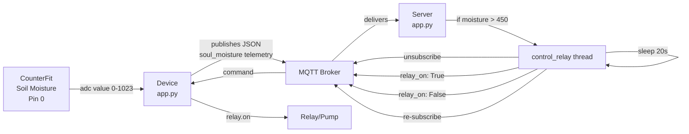
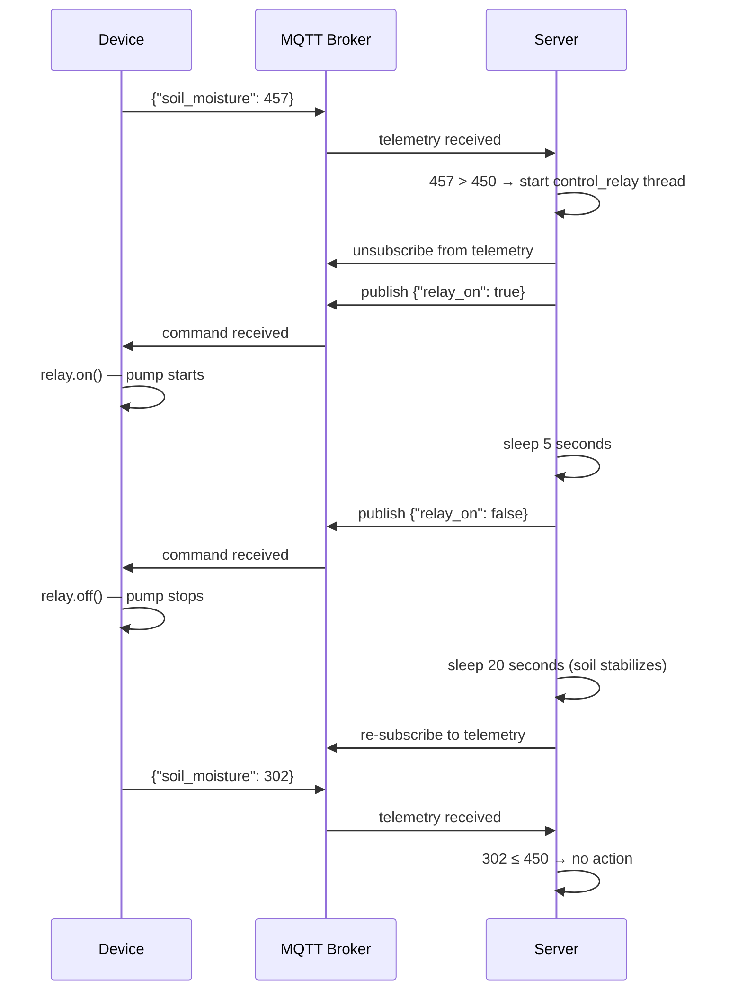

# Lesson 7 — Automated Plant Watering

## Overview

This lesson covers how to build an automated watering system for a plant. It introduces **relays** — electromechanical switches that allow a low-power IoT device to control a high-power irrigation pump. The soil moisture sensor from Lesson 6 is extended to control a relay over MQTT: the device sends moisture telemetry, and the server sends `relay_on` / `relay_off` commands. A key concept is **sensor and actuator timing** — the delay between watering and moisture stabilizing — and how to handle it by unsubscribing from telemetry during the watering cycle.

## Concepts

### High Power Devices from Low Power IoT

IoT devices use low voltages (3.3V or 5V, < 1A). This is insufficient to power a water pump (even small houseplant pumps draw too much current — would **burn out the board**).

- **Solution**: Connect pump to an external power supply. Use an actuator to switch the pump on, like a light switch uses a tiny finger-force to switch on mains electricity.

> [!NOTE]
> IoT devices typically provide 3.3V–5V at less than 1A. Mains electricity is 230V (120V in North America, 100V in Japan) at up to 30A. IoT devices control pumps using relays.

---

### Relays

A relay is an **electromechanical switch** that converts an electrical signal into a mechanical movement.

**Core component: Electromagnet**
- When electricity passes through the coil → becomes magnetized → pulls a lever → closes switch contacts → completes output circuit.
- When electricity is off → electromagnet deactivates → lever releases → contacts open → output circuit breaks.

**Types: Digital actuators**
- **High signal** to control circuit → relay **on** → output circuit complete → pump runs.
- **Low signal** → relay **off** → output circuit open → pump stops.

**Grove relay specs:**
- Control circuit: 3.3V or 5V from IoT dev kit
- Output circuit: up to **250V at 10A** — enough for mains-powered irrigation devices

**Relay wiring for a pump:**
- Red wire: 5V USB power supply → relay output terminal 1
- Red wire: relay output terminal 2 → pump positive
- Black wire: pump → USB power supply ground
- When relay on → 5V sent to pump → pump runs

> [!TIP]
> Relays make an audible **click** when the lever moves. Some relay boards have an LED indicator for on/off status.

> [!NOTE]
> A relay can also switch between two output circuits (not just on/off). The lever moves from completing one circuit to completing another, sharing a common power or ground.

---

### Control the Relay Over MQTT

In a commercial system, control logic is centralized to:
- Make decisions using data from **multiple sensors**
- Allow configuration changes from one place

**MQTT-based relay control:**

**Device side:**
- Sends soil moisture telemetry with property `soil_moisture`
- Subscribes to commands with property `relay_on`
- Turns relay on or off based on `relay_on` boolean

**Server side:**
- Subscribes to `soil_moisture` telemetry
- Sends `relay_on: True` if `soil_moisture > 450` (dry soil), else `relay_on: False`

> [!NOTE]
> IoT data is not one-to-one: multiple devices can send to a broker and multiple services can read from it. One service might store soil moisture data in a database for analysis; another can simultaneously read the same telemetry to control irrigation.

---

### Sensor and Actuator Timing

In the nightlight (Lesson 3), the light sensor responded instantly. **Soil moisture is different** — water takes time to soak through soil to the sensor.

**Real-world observation (strawberry plant):**
- Soil moisture reading before watering: **658**
- Watering begins → reading does NOT change immediately
- Watering can even finish before water reaches the sensor
- After water soaks through: reading drops to ~**320**

**Problem with naive approach (like nightlight):**
If you just keep relay on until soil_moisture ≤ 450:
- Water pumped → sensor still shows dry → relay stays on → too much water
- Water eventually soaks through → moisture drops below 450 → relay off
- But excess water continues to soak → root damage risk

**Better solution — Watering Cycle:**
1. Turn on pump for **5 seconds**
2. Wait **20 seconds** for water to soak through
3. Check soil moisture
4. If still above threshold, repeat

> [!IMPORTANT]
> It's better to under-water than over-water — you can always add more water, but you can't remove it from soil.

**Timing is specific to:**
- The IoT device setup
- The soil type
- The distance from pump to sensor
- The size of the plant container

The best timing is found by trial and error with sensor data, with a constant feedback loop.

> [!TIP]
> More granular control: turn pump on for 1 second per 100 units above the moisture threshold, instead of a fixed 5 seconds.

> [!NOTE]
> Weather predictions can also inform watering: if rain is expected, put watering on hold. After rain, soil may already be moist enough.

---

### Handling Overlapping Telemetry

- Watering cycle takes ~25 seconds (5s pump + 20s wait).
- Device sends soil moisture every 10 seconds.
- A new telemetry message arrives while the server is still in the watering cycle → could start another cycle.

**Two options:**
1. ❌ Change the IoT device to send telemetry every minute — may miss data for other analytics services.
2. ✅ **Unsubscribe from telemetry during the watering cycle** — the server ignores telemetry while busy, but the data is still on the broker for other subscribers.

## Hardware / Setup

### Virtual Device — CounterFit Setup

> [!NOTE]
> For Raspberry Pi: refer to `pi-relay.md`. For Wio Terminal: refer to `wio-terminal-relay.md`.

**Project folder:** `soil-moisture-sensor` (extended from Lesson 6)

**CounterFit components:**

| Component | Type | Pin | Notes |
|-----------|------|-----|-------|
| Soil moisture sensor | Sensor | Pin 0 | From Lesson 6 |
| Relay | Actuator | Pin 5 | Type: Relay |

**Relay logic:** Sending digital 1 turns relay on (completes circuit); digital 0 turns it off.

**Server project folder:** `soil-moisture-sensor-server`

Install MQTT package if not already done:

```sh
pip install paho-mqtt
```

## Code Walkthrough

### Device Code — Send Soil Moisture Telemetry & Respond to Commands

The device code extends Lesson 6 with MQTT support, following the same pattern as Lesson 4:

```python
# Telemetry topic
client_telemetry_topic = id + '/telemetry'
server_command_topic = id + '/commands'
```

**Publish telemetry with `soil_moisture` property:**

```python
soil_moisture = adc.read(0)
telemetry = json.dumps({'soil_moisture': soil_moisture})
mqtt_client.publish(client_telemetry_topic, telemetry)
```

**Respond to relay commands:**

```python
def handle_command(client, userdata, message):
    payload = json.loads(message.payload.decode())
    if payload['relay_on']:
        relay.on()
    else:
        relay.off()

mqtt_client.subscribe(server_command_topic)
mqtt_client.on_message = handle_command
```

---

### Server Code — Timed Relay Control (`soil-moisture-sensor-server/app.py`)

**Step 1 — Import threading:**

```python
import threading
```

`threading` allows Python to execute other code while waiting (e.g., during the `time.sleep` wait period).

**Step 2 — Define timing constants:**

```python
water_time = 5
wait_time = 20
```

- `water_time` — how long (seconds) to run the relay (pump on).
- `wait_time` — how long (seconds) to wait after turning off the relay before re-checking moisture.

**Step 3 — Helper to send relay command:**

```python
def send_relay_command(client, state):
    command = { 'relay_on' : state }
    print("Sending message:", command)
    client.publish(server_command_topic, json.dumps(command))
```

- `state` is `True` (relay on) or `False` (relay off).
- Serializes the command as JSON and publishes to the command topic.

**Step 4 — Control relay with timing:**

```python
def control_relay(client):
    print("Unsubscribing from telemetry")
    mqtt_client.unsubscribe(client_telemetry_topic)

    send_relay_command(client, True)
    time.sleep(water_time)
    send_relay_command(client, False)

    time.sleep(wait_time)

    print("Subscribing to telemetry")
    mqtt_client.subscribe(client_telemetry_topic)
```

- **Unsubscribe** from telemetry first — prevents new telemetry from triggering another watering cycle during this one.
- Send `relay_on: True` → wait 5 seconds → send `relay_on: False`.
- Wait 20 seconds for soil moisture to stabilize.
- **Re-subscribe** to telemetry — ready for the next check.

**Step 5 — Handle telemetry and trigger watering:**

```python
def handle_telemetry(client, userdata, message):
    payload = json.loads(message.payload.decode())
    print("Message received:", payload)

    if payload['soil_moisture'] > 450:
        threading.Thread(target=control_relay, args=(client,)).start()
```

- If `soil_moisture > 450` — soil is too dry → start `control_relay` on a **separate thread** (runs in background so MQTT loop remains responsive).
- If moisture is ≤ 450 — soil is adequately moist, do nothing.

**Expected server output:**

```output
(.venv) ➜  soil-moisture-sensor-server ✗ python app.py
Message received: {'soil_moisture': 457}
Unsubscribing from telemetry
Sending message: {'relay_on': True}
Sending message: {'relay_on': False}
Subscribing to telemetry
Message received: {'soil_moisture': 302}
```

## How It Works





## Key Terms

| Term | Definition |
|------|------------|
| Relay | An electromechanical switch that converts an electrical signal into a mechanical movement to turn a circuit on or off |
| Electromagnet | A magnet created by passing electricity through a coil of wire; magnetizes when current flows, demagnetizes when it stops |
| Mains electricity | The electricity delivered to homes and businesses through national infrastructure (typically 230V/120V/100V depending on region) |
| Current (Amps) | The amount of electricity moving through a circuit; IoT devices support < 1A, pumps require much more |
| Control circuit | The low-power circuit (3.3V or 5V from IoT device) that activates the relay |
| Output circuit | The high-power circuit (up to 250V/10A) controlled by the relay that powers devices like pumps |
| Sensor/actuator timing | The delay between activating an actuator and the sensor detecting the resulting change in the environment |
| Watering cycle | A defined sequence: turn on pump → wait → turn off pump → wait for stabilization → re-check moisture |
| `water_time` | The duration (in seconds) the relay is turned on per watering cycle (e.g., 5 seconds) |
| `wait_time` | The duration (in seconds) to wait for soil moisture to stabilize after watering (e.g., 20 seconds) |
| `threading.Thread` | Python mechanism to run a function concurrently in a background thread |
| `mqtt_client.unsubscribe()` | Stops the MQTT client from receiving messages on a specified topic |
| `soil_moisture` telemetry property | The JSON property name used for the soil moisture reading in this project's telemetry |
| `relay_on` command property | The JSON property name used in the command message to control the relay (True = on, False = off) |

## Summary

- IoT devices (3.3V/5V, < 1A) cannot directly power irrigation pumps — relays bridge the gap.
- A **relay** uses an electromagnet to control a mechanical switch; it can handle up to 250V/10A in the output circuit.
- Relays are **digital actuators**: high signal → electromagnet on → lever moves → circuit completes → pump runs.
- Soil moisture threshold: `soil_moisture > 450` → relay on (soil too dry); `≤ 450` → relay off.
- **Sensor timing problem**: water takes ~20 seconds to soak to the sensor; naive always-on control wastes water and risks root damage.
- **Watering cycle solution**: pump on for 5s → wait 20s → re-check moisture.
- Server **unsubscribes from telemetry** during the watering cycle to prevent overlapping cycles.
- `threading.Thread(target=control_relay, args=(client,)).start()` runs the watering cycle on a background thread.
- `send_relay_command(client, True/False)` publishes `{"relay_on": true/false}` to the MQTT command topic.
- Best timing is found by trial and observation — err on the side of under-watering (can always add more; can't remove excess water).
