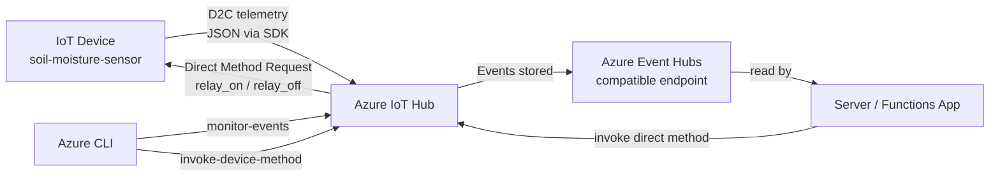
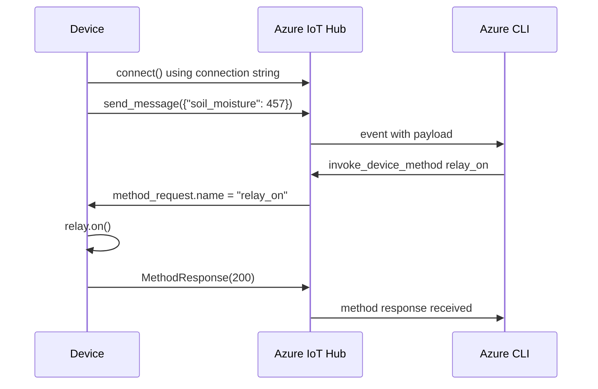

# Lesson 8 — Migrate Your Plant to the Cloud

## Overview

This lesson transitions the plant monitoring system from a public MQTT broker to a proper **cloud IoT service**. It explains what the cloud is (rented computing infrastructure), introduces **Azure IoT Hub** as the managed IoT service, and covers the different communication modes IoT Hub provides: **Device-to-Cloud (D2C)** messages, **Cloud-to-Device (C2D)** messages, **Direct Method requests**, and **Device Twins**. The device and server code are updated to connect to IoT Hub using the Azure IoT SDK, and the Azure CLI is used to monitor events and invoke direct methods.

## Concepts

### What Is the Cloud?

**Before the cloud:** companies managed their own **data centers** — buying hardware, managing power/cooling/networking, ensuring security, installing software. This was:
- Very expensive
- Required skilled staff
- Slow to scale (months to plan, buy, and install hardware for seasonal demand spikes)

**The cloud:** rent computing resources from a provider (Microsoft Azure, Google GCP, etc.) who manages all the infrastructure. Benefits:
- **Rent more as demand spikes**, release when demand drops
- Cloud provider handles hardware, power, cooling, networking, security, updates
- Pay one monthly bill to the provider
- **Economies of scale** → lower costs

> [!TIP]
> The cloud is often jokingly called "someone else's computer."

**Microsoft's cloud data centers** span multiple square kilometers (some planned expansions exceed 5 km²). They run largely on renewable energy, are more efficient than many small data centers, and work to reduce waste and water usage.

#### Microsoft Azure

Azure is Microsoft's developer cloud — the cloud used throughout this course.

---

### Why Use Cloud IoT Services?

The public test MQTT broker (`test.mosquitto.org`) has drawbacks for commercial use:

| Issue | Problem |
|-------|---------|
| **Reliability** | Free service, no guarantees, can be turned off anytime |
| **Security** | Public — anyone can listen to telemetry or send rogue commands |
| **Performance** | Designed for only a few test messages; can't scale |
| **Discovery** | No way to know what devices are connected |

Cloud IoT services (e.g., **Azure IoT Hub**) solve all of these:
- **Maintained** by large providers with investment in reliability
- **Security baked-in** — only registered devices with valid keys/certificates can connect
- **High performance** — handles many millions of messages daily, scales as needed
- **Device registry** — knows all registered devices, can communicate with them individually or in bulk
- **Free tier available** — sufficient for learning (e.g., IoT Hub F1: 8,000 messages/day)

> [!NOTE]
> IoT devices connect to a cloud service via a **device SDK** (easiest — handles topics, security) or directly via MQTT/HTTP.

**Security mechanism:** Unknown devices cannot connect — the service has a registry of allowed devices with secret keys or certificates. Unregistered devices are rejected.

---

### Azure IoT Hub Communication Modes

IoT Hub has defined communication channels instead of arbitrary MQTT topics:

| Mode | Direction | Description |
|------|-----------|-------------|
| **Device-to-Cloud (D2C)** | Device → Hub | Telemetry messages sent from device to IoT Hub; read by application code |
| **Cloud-to-Device (C2D)** | Hub → Device | Messages from application code via IoT Hub to a device |
| **Direct Method requests** | Hub → Device | Request that the device does something; **requires a response** so the app can confirm success |
| **Device Twins** | Both | JSON documents synchronized between device and IoT Hub; stores reported (device) or desired (hub) settings |

> [!NOTE]
> IoT Hub stores D2C messages and direct method requests for a configurable period (default: 1 day). A device that disconnects can retrieve missed messages on reconnection. **Device Twins are stored permanently** — a device can always get the latest twin on reconnection.

> [!NOTE]
> Under the hood, IoT Hub communication can use **MQTT**, **HTTPS**, or **AMQP**.

> [!TIP]
> Under the hood, IoT Hub uses a service called **Azure Event Hubs** for the D2C message path. Code that reads D2C messages is often called reading "events."

---

### Connection Strings

A **connection string** is a text string containing connection details for a service. IoT Hub connection strings include:

```
HostName=soil-moisture-sensor.azure-devices.net;DeviceId=soil-moisture-sensor;SharedAccessKey=Bhry+...
```

| Key | Description |
|-----|-------------|
| `HostName` | The URL of the IoT Hub |
| `DeviceId` | The unique ID of the device |
| `SharedAccessKey` | A symmetric key shared between the device and the IoT Hub |

> [!WARNING]
> Connection strings should be kept secure. Do not check them into public source code control. Ideally load from a hardware security module (HSM) on the device.

---

### Azure Resource Groups and SKUs

- **Resource**: An Azure service (IoT Hub, VM, database, etc.)
- **Resource Group**: A logical grouping of resources. Deleting the resource group deletes all resources in it.
- **SKU (pricing tier)**: Different cost levels with different features or data volumes (e.g., `F1` = free tier IoT Hub)
- **Partition**: A stream of data; more partitions = less blocking when multiple services read/write to the hub
- **Annotations**: Properties automatically attached to IoT Hub messages (e.g., device ID, timestamp). Timestamps are in **UNIX time** (seconds since midnight Jan 1, 1970).

## Hardware / Setup

> [!NOTE]
> For Wio Terminal: refer to `wio-terminal-connect-hub.md`. For Raspberry Pi and Virtual Device: refer to `single-board-computer-connect-hub.md`.

**Prerequisites:** Azure subscription (Azure for Students or Azure Free) + Azure CLI installed.

### Set Up Azure CLI

Install the Azure CLI and IoT extension:

```sh
az extension add --name azure-iot
az login
```

If you have multiple subscriptions, set the active one:

```sh
az account list --output table
az account set --subscription <SubscriptionId>
```

### Create Resource Group

```sh
az group create --name soil-moisture-sensor \
                --location <location>
```

Get available locations: `az account list-locations --output table`. Choose the region closest to you.

### Create IoT Hub (Free Tier)

```sh
az iot hub create --resource-group soil-moisture-sensor \
                  --sku F1 \
                  --partition-count 2 \
                  --name <hub_name>
```

- `--sku F1` — free tier (8,000 messages/day, most features)
- `--partition-count 2` — required for free tier
- `<hub_name>` — must be **globally unique** (forms part of the URL)

> [!NOTE]
> You can only have **one free tier IoT Hub per subscription**.

### Register Device and Get Connection String

```sh
# Register device
az iot hub device-identity create --device-id soil-moisture-sensor \
                                  --hub-name <hub_name>

# Get connection string
az iot hub device-identity connection-string show --device-id soil-moisture-sensor \
                                                  --output table \
                                                  --hub-name <hub_name>
```

Store the connection string — the SDK needs it to connect.

## Code Walkthrough

### Install IoT Hub SDK (Virtual Device / Raspberry Pi)

```sh
pip install azure-iot-device
```

### Device Code — Connect to IoT Hub

Replace MQTT connection code with:

```python
from azure.iot.device import IoTHubDeviceClient, MethodResponse

connection_string = '<connection_string>'  # or load from env variable
device_client = IoTHubDeviceClient.create_from_connection_string(connection_string)
device_client.connect()
print('Connected to IoT Hub')
```

- `IoTHubDeviceClient.create_from_connection_string()` creates a device client from the connection string.
- `.connect()` establishes the connection to the hub.

### Send Telemetry (D2C)

```python
import json

telemetry = json.dumps({'soil_moisture': soil_moisture})
device_client.send_message(telemetry)
print('Telemetry sent:', telemetry)
```

### Respond to Direct Methods

```python
def handle_method_request(method_request):
    print('Direct method received -', method_request.name)
    
    if method_request.name == 'relay_on':
        relay.on()
    elif method_request.name == 'relay_off':
        relay.off()
    
    method_response = MethodResponse.create_from_method_request(method_request, 200)
    device_client.send_method_response(method_response)

device_client.on_method_request_received = handle_method_request
```

- Direct methods are received via `on_method_request_received`.
- `MethodResponse.create_from_method_request(method_request, 200)` — creates a response with HTTP-like status 200 (OK).
- `.send_method_response()` — sends the acknowledgement back to IoT Hub.

---

### Monitor Events with Azure CLI

```sh
az iot hub monitor-events --hub-name <hub_name>
```

Output:
```json
{
    "event": {
        "origin": "soil-moisture-sensor",
        "payload": "{\"soil_moisture\": 376}"
    }
}
```

**With annotations (timestamps, device ID, etc.):**

```sh
az iot hub monitor-events --properties anno --hub-name <hub_name>
```

Annotations include `iothub-enqueuedtime` (UNIX time), `x-opt-offset`, `x-opt-sequence-number`, etc.

---

### Invoke Direct Methods with Azure CLI

```sh
# Turn relay on
az iot hub invoke-device-method --device-id soil-moisture-sensor \
                                --method-name relay_on \
                                --method-payload '{}' \
                                --hub-name <hub_name>

# Turn relay off
az iot hub invoke-device-method --device-id soil-moisture-sensor \
                                --method-name relay_off \
                                --method-payload '{}' \
                                --hub-name <hub_name>
```

Expected device output:
```output
Direct method received -  relay_on
```

## How It Works





## Key Terms

| Term | Definition |
|------|------------|
| Cloud | Infrastructure-as-a-service where computing resources are rented from a provider who manages all hardware and software |
| Microsoft Azure | Microsoft's developer cloud; the cloud used in this course |
| Azure IoT Hub | Microsoft's managed cloud IoT service for secure, reliable device-to-cloud and cloud-to-device communication |
| Resource | Any Azure service (IoT Hub, VM, database, etc.) |
| Resource Group | A logical grouping of Azure resources; deleting the group deletes all resources in it |
| SKU | Pricing tier of an Azure service (e.g., F1 = free tier) |
| F1 tier (IoT Hub) | Free IoT Hub tier; supports 8,000 messages/day, max 1 per subscription |
| Partition | A stream of data in IoT Hub; more partitions reduce blocking when multiple services read/write |
| Device-to-Cloud (D2C) | Messages sent from an IoT device to IoT Hub (telemetry) |
| Cloud-to-Device (C2D) | Messages sent from application code via IoT Hub to an IoT device |
| Direct Method | A request from application code via IoT Hub to a device to do something; requires a response confirming success |
| Device Twin | A JSON document synchronized between device and IoT Hub; stores reported (device-side) and desired (hub-side) settings |
| Connection string | A text string containing connection details (hostname, device ID, and secret key) used to connect a device to IoT Hub |
| SharedAccessKey | The symmetric key component of a connection string; known by both the device and IoT Hub |
| SAS token | Shared Access Signature token sent on first connection to verify identity; contains URL, expiry, and encrypted signature |
| Event Hub compatible endpoint | The mechanism used to read D2C messages from IoT Hub; based on Azure Event Hubs |
| Annotations | Properties automatically attached to IoT Hub messages (device ID, timestamp, offset, sequence number) |
| UNIX time | A timestamp format representing seconds since midnight UTC on January 1, 1970 |
| Azure CLI | A command-line interface for managing Azure services |
| `az iot hub device-identity create` | CLI command to register a new device in IoT Hub |
| `az iot hub monitor-events` | CLI command to watch D2C telemetry events from an IoT Hub |
| `az iot hub invoke-device-method` | CLI command to send a direct method request to a registered device |
| `IoTHubDeviceClient` | Python SDK class for connecting an IoT device to Azure IoT Hub |
| `MethodResponse` | Python SDK class for constructing a response to a direct method request |

## Summary

- Before the cloud, companies managed expensive in-house data centers; the cloud lets them rent computing resources from providers like Microsoft Azure.
- **Azure IoT Hub** is Microsoft's managed IoT service: secure, reliable, high-performance, with device registry.
- Public MQTT brokers have reliability, security, performance, and discovery problems that cloud IoT services solve.
- IoT Hub free tier (F1): 8,000 messages/day, max 1 per subscription.
- IoT Hub communication modes: **D2C** (telemetry), **C2D** (commands), **Direct Methods** (with response), **Device Twins** (synchronized JSON state).
- D2C messages are stored for 1 day; Device Twins are permanent.
- Under the hood: IoT Hub uses MQTT/HTTPS/AMQP; D2C uses Azure Event Hubs-compatible endpoint.
- A **connection string** contains: HostName, DeviceId, SharedAccessKey.
- Register a device: `az iot hub device-identity create --device-id ...`
- Get connection string: `az iot hub device-identity connection-string show --device-id ...`
- Monitor events: `az iot hub monitor-events --hub-name ...`
- Invoke method: `az iot hub invoke-device-method --method-name relay_on ...`
- `IoTHubDeviceClient.create_from_connection_string(conn_str).connect()` connects the device.
- Direct methods received via `device_client.on_method_request_received`; respond with `MethodResponse(200)`.
