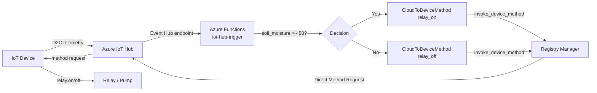
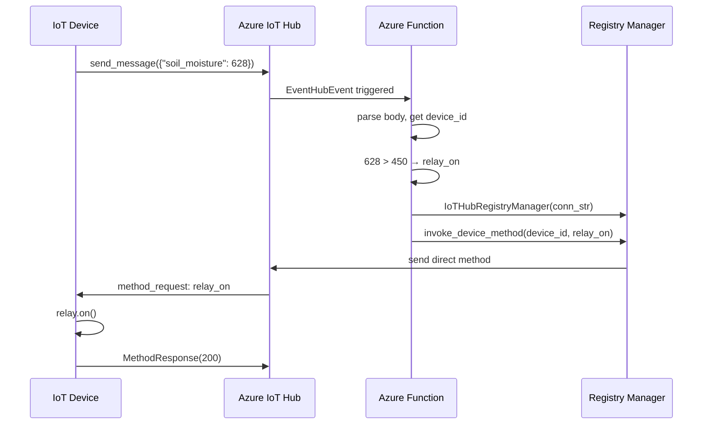

# Lesson 9 — Migrate Application Logic to the Cloud

## Overview

This lesson moves the server control code (relay timing logic) from a local machine to the cloud using **Azure Functions** (Microsoft's serverless computing service). Serverless enables code to run automatically in response to events — in this case, IoT Hub messages — without managing servers. The Azure Functions app subscribes to IoT Hub events via the **Event Hub compatible endpoint**, evaluates soil moisture, and sends **Direct Method requests** via the **IoT Hub Registry Manager** to turn the relay on or off on the correct device.

## Concepts

### What Is Serverless?

**Serverless computing** (also called **Functions as a Service / FaaS**) involves:
- Writing **small blocks of code** (functions) that run in the cloud in response to **events**.
- Events can come from: web requests, message queues, database changes, IoT service messages, etc.
- Your code is **only run when the event happens** — nothing is kept running between events.
- **Highly scalable**: if many events arrive simultaneously, the cloud provider runs the function many times in parallel across available servers.

> [!NOTE]
> Despite the name "serverless," servers ARE used — you just don't care about them. The cloud provider manages everything: servers, networking, storage, CPU, memory.

**Limitation:** Cannot store state in memory between events (function instance may differ each time). **Solution:** Store shared state in a database or other persistent storage.

**Cost model:** You pay for **time your code runs** and **memory used** — not per server.

> [!TIP]
> At the time of writing, one cloud provider offers **1,000,000 free serverless executions/month** before charging; after that, US$0.20 per 1,000,000 executions. When code isn't running, you pay nothing.

**Ideal for IoT:** Serverless functions are called for each message from any device connected to the IoT service — runs only when needed, handles any number of devices.

---

### Azure Functions

Azure Functions is Microsoft's serverless computing service.

Supported languages out of the box: **Python, JavaScript, TypeScript, C#, F#, Java, PowerShell** (+ custom handlers for any HTTP-capable language).

**Function App structure:**
- One **Functions App** = one or more **triggers** (event-responding functions).
- Triggers share common configuration (e.g., connection strings in `local.settings.json`).
- Can be run **locally** using Azure Functions Core Tools — same runtime as the cloud.

**Key files in a Functions App:**

| File | Purpose |
|------|---------|
| `host.json` | Global settings for the Functions App (rarely modified) |
| `local.settings.json` | Local dev settings (connection strings, etc.) — NOT deployed to cloud, NOT committed to source control |
| `requirements.txt` | Pip packages needed — deployed to cloud so runtime can install them |

**Trigger folder contents:**

| File | Purpose |
|------|---------|
| `__init__.py` | Python code containing the `main()` function |
| `function.json` | Configuration for the trigger (bindings) |

**Bindings:** Connections between Azure Functions and other Azure services.
- **Input binding**: data comes into the function (e.g., Event Hub trigger)
- **Output binding**: function's result goes to another service (e.g., write to database)

---

### IoT Hub Event Hub Compatible Endpoint

- IoT Hub is based on **Azure Event Hubs** — a message streaming service.
- To read D2C messages in a Functions App, use an **Event Hub trigger** (there is no specific "IoT Hub trigger").
- Connect using the **Event Hub compatible endpoint connection string** from the IoT Hub.

**Key `function.json` binding fields:**

| Field | Value | Description |
|-------|-------|-------------|
| `type` | `eventHubTrigger` | Listen to Event Hub events |
| `name` | `events` | Parameter name in the `main()` function |
| `direction` | `in` | Input binding |
| `connection` | `IOT_HUB_CONNECTION_STRING` | Name of the setting (not the actual string) |
| `cardinality` | `one` | Process one event at a time (bug fix: default template uses `many`) |
| `eventHubName` | `""` | Must be empty when connection string already contains the hub name |

> [!WARNING]
> Due to a bug in the Azure Functions template, `cardinality` defaults to `many` which causes errors. Always set it to `one`.

---

### Registry Manager — Sending Direct Methods from Cloud

To **send commands** to IoT devices from serverless code, use the **IoT Hub Registry Manager**:
- Allows: viewing registered devices, sending C2D messages, invoking direct methods, updating device twins.
- Needs its own connection string (with **ServiceConnect** policy permission).

**`send_relay_command` flow:**
1. Get device ID from event annotations (`event.iothub_metadata['connection-device-id']`)
2. Read `REGISTRY_MANAGER_CONNECTION_STRING` from environment variables
3. Create `IoTHubRegistryManager` instance
4. Invoke direct method (`relay_on` or `relay_off`) on the target device

> [!TIP]
> Unlike the MQTT version (which sent commands to all devices), this approach sends the direct method to **the specific device that sent the telemetry** — works for multiple sensor/relay setups.

---

### Local Development with Azurite

The Functions App needs storage for app files and logs. Locally, use **Azurite** — a Node.js storage emulator:

```sh
npm install -g azurite
mkdir azurite
azurite --location azurite
```

Azurite emulates:
- Blob service: `http://127.0.0.1:10000`
- Queue service: `http://127.0.0.1:10001`
- Table service: `http://127.0.0.1:10002`

Set in `local.settings.json`:
```json
"AzureWebJobsStorage": "UseDevelopmentStorage=true"
```

---

### Deploying to the Cloud

Two Azure resources needed:
1. **Storage Account** — replaces local Azurite
2. **Functions App** — hosts and runs the serverless code

**Cloud settings (Application Settings)** replace `local.settings.json` in the cloud. Read from environment variables in code using `os.environ['SETTING_NAME']`.

## Hardware / Setup

**No IoT device changes needed.** Device code from Lesson 8 (connected to IoT Hub) continues unchanged.

**Tools to install (development PC):**
- Azure Functions Core Tools (CLI)
- VS Code Azure Functions extension
- Node.js + Azurite (local storage emulator)

**Project folder:** `soil-moisture-trigger`

## Code Walkthrough

### Create Functions App Project

```sh
mkdir soil-moisture-trigger
cd soil-moisture-trigger
python3 -m venv .venv
# Activate virtual environment (see Lesson 1 for platform-specific commands)
func init --worker-runtime python soil-moisture-trigger
```

Update `local.settings.json`:
```json
{
    "IsEncrypted": false,
    "Values": {
        "AzureWebJobsStorage": "UseDevelopmentStorage=true",
        "IOT_HUB_CONNECTION_STRING": "<event_hub_compatible_connection_string>",
        "REGISTRY_MANAGER_CONNECTION_STRING": "<service_connection_string>"
    }
}
```

---

### Create IoT Hub Event Trigger

```sh
func new --name iot-hub-trigger --template "Azure Event Hub trigger"
```

Update `iot-hub-trigger/function.json`:

```json
{
    "scriptFile": "__init__.py",
    "bindings": [
        {
            "type": "eventHubTrigger",
            "name": "event",
            "direction": "in",
            "eventHubName": "",
            "connection": "IOT_HUB_CONNECTION_STRING",
            "cardinality": "one",
            "consumerGroup": "$Default"
        }
    ]
}
```

**Key fixes from default template:**
- `cardinality: "one"` (not `"many"`)
- `eventHubName: ""` (empty — connection string already contains the hub name)
- `connection: "IOT_HUB_CONNECTION_STRING"` (points to setting, not actual string)

---

### Function Code (`iot-hub-trigger/__init__.py`)

**Imports:**

```python
import logging
import json
import os
import azure.functions as func
from azure.iot.hub import IoTHubRegistryManager
from azure.iot.hub.models import CloudToDeviceMethod
```

**Main function:**

```python
def main(event: func.EventHubEvent):
    body = json.loads(event.get_body().decode('utf-8'))
    device_id = event.iothub_metadata['connection-device-id']
    
    logging.info(f'Received message: {body} from {device_id}')
    
    soil_moisture = body['soil_moisture']
    
    if soil_moisture > 450:
        direct_method = CloudToDeviceMethod(method_name='relay_on', payload='{}')
    else:
        direct_method = CloudToDeviceMethod(method_name='relay_off', payload='{}')
    
    logging.info(f'Sending direct method request for {direct_method.method_name} for device {device_id}')
    
    registry_manager_connection_string = os.environ['REGISTRY_MANAGER_CONNECTION_STRING']
    registry_manager = IoTHubRegistryManager(registry_manager_connection_string)
    
    registry_manager.invoke_device_method(device_id, direct_method)
    
    logging.info('Direct method request sent!')
```

**Code explanation:**

| Line | Explanation |
|------|-------------|
| `event.get_body().decode('utf-8')` | Gets the raw JSON telemetry bytes and decodes to a string |
| `json.loads(...)` | Parses the JSON string to a Python dictionary |
| `event.iothub_metadata['connection-device-id']` | Gets the device ID from IoT Hub annotations |
| `body['soil_moisture']` | Reads the soil moisture value from the telemetry |
| `CloudToDeviceMethod(method_name='relay_on', payload='{}')` | Creates a direct method request; payload is an empty JSON object |
| `os.environ['REGISTRY_MANAGER_CONNECTION_STRING']` | Reads the connection string from environment variables (locally from `local.settings.json`; in cloud from Application Settings) |
| `IoTHubRegistryManager(connection_string)` | Creates a registry manager instance |
| `registry_manager.invoke_device_method(device_id, direct_method)` | Sends the direct method to the specific device |

---

### Add `azure-iot-hub` to `requirements.txt`

```
azure-iot-hub
```

Then install:
```sh
pip install -r requirements.txt
```

---

### Run Functions App Locally

```sh
func start
```

Expected output when device is running:
```output
[2021-05-05T02:44:09.352Z] Python EventHub trigger processed an event: {"soil_moisture":628}
[2021-05-05T02:44:09.354Z] Python EventHub trigger processed an event: {"soil_moisture":624}
```

> [!NOTE]
> Do NOT run the `az iot hub monitor-events` command at the same time as the Functions app — both try to consume from the same endpoint and will conflict.

---

### Deploy to Azure

**1. Get connection strings:**

```sh
# Event Hub compatible endpoint (for input binding)
az iot hub connection-string show --default-eventhub --output table --hub-name <hub_name>

# Registry Manager (ServiceConnect policy, for invoking direct methods)
az iot hub connection-string show --policy-name service --output table --hub-name <hub_name>
```

**2. Create storage account:**

```sh
az storage account create --resource-group soil-moisture-sensor \
                          --sku Standard_LRS \
                          --name <storage_name>
```

**3. Create Functions App (Linux, Python):**

```sh
az functionapp create --resource-group soil-moisture-sensor \
                      --runtime python \
                      --functions-version 3 \
                      --os-type Linux \
                      --consumption-plan-location <location> \
                      --storage-account <storage_name> \
                      --name <functions_app_name>
```

**4. Upload application settings:**

```sh
az functionapp config appsettings set --resource-group soil-moisture-sensor \
                                      --name <functions_app_name> \
                                      --settings "IOT_HUB_CONNECTION_STRING=<value>"

az functionapp config appsettings set --resource-group soil-moisture-sensor \
                                      --name <functions_app_name> \
                                      --settings "REGISTRY_MANAGER_CONNECTION_STRING=<value>"
```

**5. Deploy Functions App:**

```sh
func azure functionapp publish <functions_app_name>
```

Expected output:
```output
Deployment successful.
Remote build succeeded!
Functions in soil-moisture-sensor:
    iot-hub-trigger - [eventHubTrigger]
```

## How It Works





## Key Terms

| Term | Definition |
|------|------------|
| Serverless / FaaS (Functions as a Service) | A cloud model where code runs as small functions in response to events; the cloud provider manages all server infrastructure |
| Azure Functions | Microsoft's serverless computing service |
| Trigger | A function in a Functions App that responds to a specific type of event |
| Binding | A connection between a Function and another Azure service (input or output) |
| Input binding | Data flows from another service into the function (e.g., an Event Hub trigger) |
| Output binding | The function's output is automatically sent to another service (e.g., a database) |
| Event Hub trigger | A Function trigger that responds to messages from Azure Event Hubs (used for IoT Hub D2C messages) |
| Azurite | A local Node.js emulator for Azure Storage; used during local Azure Functions development |
| `local.settings.json` | Local development settings for Functions Apps; NOT deployed to cloud, NOT committed to source control |
| Application Settings | Cloud equivalents of `local.settings.json`; set via CLI and read as environment variables |
| `os.environ['KEY']` | Python way to read application settings (environment variables) in Functions App code |
| `EventHubEvent` | The Azure Functions class representing an event from an Event Hub trigger |
| `event.get_body()` | Method to get the raw bytes of the event payload |
| `event.iothub_metadata` | Dictionary of IoT Hub annotation properties (e.g., `connection-device-id`) |
| IoT Hub Registry Manager | A management tool for IoT Hub that can view devices, send C2D messages, invoke direct methods, and update device twins |
| `CloudToDeviceMethod` | Azure IoT Hub SDK class for constructing a direct method request |
| `registry_manager.invoke_device_method()` | Sends a direct method request to a specific device via the Registry Manager |
| `cardinality: "one"` | Function.json setting that processes one event at a time (required fix from default template) |
| Consumer group | A group of readers that consume the same event stream independently; Functions app uses `$Default` consumer group |
| `func init` | CLI command to create a new Functions App project |
| `func new` | CLI command to create a new trigger inside a Functions App |
| `func start` | CLI command to run the Functions App locally |
| `func azure functionapp publish` | CLI command to deploy the Functions App to Azure |

## Summary

- **Serverless/FaaS**: code runs only when an event happens; no server to manage; pay per execution.
- Azure Functions is Microsoft's FaaS; supports Python natively.
- A Functions App contains one or more **triggers** (functions that respond to events).
- IoT Hub D2C messages are consumed via an **Event Hub trigger** (not a dedicated IoT Hub trigger).
- **Azurite** emulates Azure Storage locally; set `"AzureWebJobsStorage": "UseDevelopmentStorage=true"`.
- `local.settings.json` stores local settings; **Application Settings** replace these in the cloud.
- Read settings with `os.environ['SETTING_NAME']` — works both locally and in the cloud.
- `event.get_body().decode('utf-8')` → JSON string → `json.loads()` → Python dict.
- `event.iothub_metadata['connection-device-id']` → gets the device ID from annotations.
- `CloudToDeviceMethod(method_name='relay_on', payload='{}')` → constructs the method request.
- `IoTHubRegistryManager` sends the direct method to the **specific device** that sent the telemetry.
- Unlike MQTT (broadcasts to all), Registry Manager targets **one device** — works for multi-device setups.
- `function.json` bug fix: set `cardinality: "one"` and `eventHubName: ""`.
- Deploy: create storage account → create Functions App → upload app settings → `func azure functionapp publish`.
