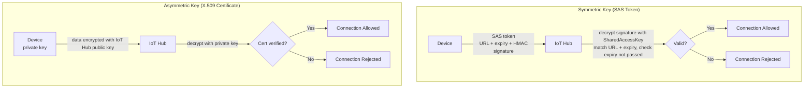
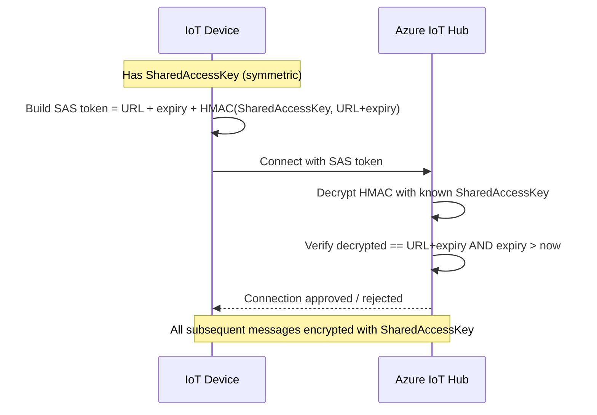

# Lesson 10 — Keep Your Plant Secure

## Overview

This final Farm lesson covers **IoT security** — ensuring only authorized devices can connect to your cloud service, and only your cloud service can send commands to your devices. It explains the risks of an insecure IoT system, introduces **cryptography** (symmetric vs. asymmetric encryption), and covers how IoT Hub uses **connection strings (symmetric keys/SAS tokens)** and **X.509 certificates** to authenticate devices. The lesson also covers how to generate a self-signed X.509 certificate using the Azure CLI and connect a device to IoT Hub using it.

## Concepts

### Why Secure IoT Devices?

IoT security involves ensuring:
- Only expected devices can connect and send telemetry.
- Only your cloud service can send commands to your devices.
- Sensitive data (medical, personal, business-critical) is not leaked.

**Real-world risks of insecure IoT:**

| Risk | Example |
|------|---------|
| Fake device sends incorrect data | Rival farmer sends constant high moisture readings → irrigation never turns on → crops die from thirst |
| Unauthorized data access | Hackers read personal/business data |
| Rogue commands | Hackers control devices to cause damage |
| Network access via device | Exploit IoT device to access private networks |
| Personal data blackmail | Access private data for extortion |

**Real-world examples:**
- **2018**: Hackers used a WiFi access point on a **fish tank thermostat** to steal data from a casino's network.
- **2016 Mirai Botnet**: Malware connected to IoT devices (DVRs, cameras) with **default usernames/passwords** → launched a massive DDoS attack on Dyn, an Internet infrastructure provider, taking down large portions of the Internet.
- **CloudPets**: Database of connected toy users (including children's voice messages) was publicly available over the Internet.
- **Strava**: A fitness app revealed home locations of runners by tagging others you ran past.

> [!NOTE]
> IoT hacking is such a threat that tools like **Azure Defender for IoT** have been developed — similar to anti-virus/security tools, but designed for small, low-powered IoT devices.

> [!WARNING]
> Security topics not covered in this lesson: monitoring data in transit, direct device hacking, or changes to device configurations. This lesson focuses on authentication when connecting to the cloud.

---

### Cryptography

**The problem:** A device ID alone can be cloned — a hacker could set up a malicious device with the same ID and send bogus data.

**The solution:** **Encrypt** the data being sent using a secret value (an **encryption key**) known only to the device and the cloud. The cloud **decrypts** the data; if decryption fails (key mismatch) the device is rejected.

**Cryptography** = the technique for encryption and decryption.

#### History of Cryptography

- Earliest examples date back **3,500 years**.
- **Substitution ciphers**: substitute one letter for another.
  - **Caesar cipher**: shift the alphabet by a defined amount (only sender and recipient know the shift).
  - **Vigenère cipher**: use words to encrypt, so each letter in the original is shifted by a different amount.
- Historical uses: protecting pottery glaze recipes in ancient Mesopotamia; secret love notes in India; ancient Egyptian magical spells.

#### Modern Cryptography

- Uses **complicated mathematics** to encrypt data with too many possible keys for brute-force attacks.
- Used everywhere: **HTTPS** (encrypts browser-to-server traffic), **full-disk encryption**.
- Even modern cryptography is at risk from **quantum computing**, which may be able to break all known encryption in a very short time.

---

### Symmetric vs. Asymmetric Encryption

#### Symmetric Encryption

- Uses the **same key** to both encrypt and decrypt.
- Both sender and receiver must know the same key.
- **Least secure**: the key must be shared somehow; if the key is intercepted, encryption is broken.
- **Faster** than asymmetric.

#### Asymmetric Encryption

- Uses **two keys**: a **public key** (encrypts) and a **private key** (decrypts).
- The public key can be shared widely — it can only encrypt, not decrypt.
- The private key is kept private — only the recipient decrypts.
- **More secure**: private key never needs to be shared.
- **Slower** than symmetric.

**Combined approach (used in practice):**
- Use asymmetric encryption to securely share a symmetric key.
- Use the symmetric key to encrypt all subsequent data.
- More secure key exchange + faster bulk data encryption.

---

### Securing IoT Devices

#### Symmetric Keys (Connection String / SAS Token)

IoT Hub uses the **SharedAccessKey** in the connection string as a symmetric key:

```output
HostName=soil-moisture-sensor.azure-devices.net;DeviceId=soil-moisture-sensor;SharedAccessKey=Bhry+ind7kKEIDxubK61RiEHHRTrPl7HUow8cEm/mU0=
```

The key is **never sent** over the network. Instead:

**SAS Token flow (first connection):**
1. Device creates a **Shared Access Signature (SAS) token** containing:
   - URL of the IoT Hub
   - Expiry timestamp (usually 1 day from now)
   - A **signature**: the URL + expiry time **encrypted with the SharedAccessKey**
2. IoT Hub decrypts the signature with its copy of the key.
3. If decrypted value matches the URL + expiry, and current time < expiry → **connection allowed**.
4. The expiry timestamp prevents replay attacks (capturing and reusing the token later).

> [!NOTE]
> Because of the expiry time, your IoT device must have an accurate clock — usually synchronized via **NTP (Network Time Protocol)**. Inaccurate time = failed connections.

**After connection:** All data is encrypted with the SharedAccessKey.

**Key rotation:** Devices have **2 keys** (2 connection strings). If one is compromised, switch to the other key while the first is regenerated.

> [!WARNING]
> Storing the symmetric key in code is bad practice — if code is stolen, the key is exposed. Better to load from a **Hardware Security Module (HSM)** — a chip on the device that stores encrypted values accessible only by code. Never check keys into public source code control.

---

#### X.509 Certificates (Asymmetric Encryption)

When using asymmetric encryption (public/private key pairs), the public key must be shared with anyone who wants to send data. **Problem:** How does the recipient verify the public key actually belongs to you (not an impostor)?

**Solution: X.509 Certificate**

- A **digital document** containing the public key + metadata, **signed by a trusted third party** called a **Certification Authority (CA)**.
- Trust chain: you trust the certificate because you trust the CA (similar to trusting a passport because you trust the issuing government).
- **Self-signed certificates**: signed by yourself (not a CA) — fine for testing only, never for production.

**Certificate fields include:**
- Who the public key is from
- CA details
- Validity period (start/end dates)
- The public key itself

**Verification:** Before using a certificate, verify it was signed by the original CA.

**Advantage of X.509 for IoT:**
- One certificate can be **shared between many devices**.
- Upload the certificate to IoT Hub; all devices use the same certificate.
- Each device only needs to know its own **private key** to decrypt messages.

**Azure's public key:**
- Azure services use a public certificate that is sometimes built into SDKs.
- The public key can be safely embedded in source code — it can only **encrypt** data sent to Azure, not decrypt received data.

---

### Generate an X.509 Certificate

**Steps:**
1. Create a public/private key pair (most common algorithm: **RSA** — Rivest–Shamir–Adleman)
2. Submit the public key + data for signing (by a CA, or self-sign)

**Azure CLI automates this:**

```sh
az iot hub device-identity create --device-id soil-moisture-sensor-x509 \
                                  --am x509_thumbprint \
                                  --output-dir . \
                                  --hub-name <hub_name>
```

This creates two files:
- `soil-moisture-sensor-x509-key.pem` — **private key** (keep secret, never commit to public source control)
- `soil-moisture-sensor-x509-cert.pem` — **X.509 certificate** (public; shared with IoT Hub)

And registers a new device with ID `soil-moisture-sensor-x509` in IoT Hub.

> [!NOTE]
> `--am x509_thumbprint` tells the command to use X.509 certificate authentication (thumbprint mode), automatically generating the key pair and self-signing the certificate.

## Hardware / Setup

> [!NOTE]
> For Wio Terminal: refer to `wio-terminal-x509.md`. For Raspberry Pi and Virtual Device: refer to `single-board-computer-x509.md`.

**Prerequisites:** Azure CLI with IoT extension, IoT Hub from Lesson 8.

After generating the certificate files, update device code to use the certificate instead of the connection string.

**Virtual Device code change (Python):**

```python
from azure.iot.device import IoTHubDeviceClient, X509

hostname = "<hub_name>.azure-devices.net"
device_id = "soil-moisture-sensor-x509"

x509 = X509(
    cert_file="soil-moisture-sensor-x509-cert.pem",
    key_file="soil-moisture-sensor-x509-key.pem",
)

device_client = IoTHubDeviceClient.create_from_x509_certificate(
    hostname=hostname,
    device_id=device_id,
    x509=x509
)
device_client.connect()
```

> [!TIP]
> After completing this lesson, clean up cloud resources by deleting the resource group: `az group delete --name soil-moisture-sensor`

## Code Walkthrough

### Generate Certificate with Azure CLI

```sh
az iot hub device-identity create --device-id soil-moisture-sensor-x509 \
                                  --am x509_thumbprint \
                                  --output-dir . \
                                  --hub-name <hub_name>
```

Files created:
- `soil-moisture-sensor-x509-key.pem` → private key
- `soil-moisture-sensor-x509-cert.pem` → public X.509 certificate

---

### Connect Device with X.509 Certificate (Virtual Device)

```python
from azure.iot.device import IoTHubDeviceClient, X509

# Load certificate and key from files
x509 = X509(
    cert_file="soil-moisture-sensor-x509-cert.pem",
    key_file="soil-moisture-sensor-x509-key.pem",
)

# Create client using X.509 (not connection string)
device_client = IoTHubDeviceClient.create_from_x509_certificate(
    hostname="<hub_name>.azure-devices.net",
    device_id="soil-moisture-sensor-x509",
    x509=x509
)
device_client.connect()
```

Key difference from symmetric key approach:
- **Symmetric** (Lesson 8): `IoTHubDeviceClient.create_from_connection_string(connection_string)`
- **Asymmetric** (X.509): `IoTHubDeviceClient.create_from_x509_certificate(hostname, device_id, x509)`

## How It Works





## Key Terms

| Term | Definition |
|------|------------|
| IoT Security | Ensuring only authorized devices can connect to a cloud service, and only the cloud service can send commands to devices |
| Encryption | The process of converting data into a scrambled format using an encryption key, making it unreadable without the key |
| Decryption | The reverse of encryption — converting encrypted data back to readable format using a key |
| Encryption key | A secret value used to scramble (encrypt) data |
| Cryptography | The technique of encryption and decryption |
| Substitution cipher | An early cryptography method that replaces one letter with another (e.g., Caesar cipher, Vigenère cipher) |
| Caesar cipher | A substitution cipher that shifts the alphabet by a fixed amount; both sender and receiver know the shift |
| Vigenère cipher | A cipher that uses a keyword to shift each letter by a different amount |
| Symmetric encryption | Uses the same key to encrypt and decrypt; must be shared between sender and receiver; faster but less secure |
| Asymmetric encryption | Uses a public key (encrypt) and private key (decrypt); private key never shared; slower but more secure |
| Public key | The encryption key in asymmetric encryption; can be shared widely; can only encrypt, not decrypt |
| Private key | The decryption key in asymmetric encryption; kept secret; can only decrypt, not encrypt |
| X.509 certificate | A digital document containing a public key, signed by a Certificate Authority (CA), used to verify identity |
| Certification Authority (CA) | A trusted third party that signs X.509 certificates to verify they belong to who they claim |
| Self-signed certificate | An X.509 certificate signed by the creator (not a CA); acceptable for testing, never for production |
| RSA (Rivest–Shamir–Adleman) | The most widely used algorithm to generate public/private key pairs |
| Connection string | Text containing HostName, DeviceId, and SharedAccessKey used to connect a device to IoT Hub |
| SharedAccessKey | The symmetric key component of a connection string; used to create SAS tokens |
| SAS token (Shared Access Signature) | A token sent on first connection containing the URL, expiry time, and a signature encrypted with the SharedAccessKey |
| NTP (Network Time Protocol) | A protocol for synchronizing device clocks over the Internet; required for accurate SAS token expiry validation |
| Key rotation | Switching from one symmetric key to another when the first is compromised; IoT Hub supports 2 keys per device |
| Hardware Security Module (HSM) | A chip on an IoT device that stores encrypted keys; code can read but cannot extract the raw key |
| HTTPS | HyperText Transfer Protocol Secure — encrypts communication between browsers and web servers |
| Mirai Botnet | A 2016 botnet that exploited IoT devices with default credentials to launch massive DDoS attacks |
| Azure Defender for IoT | Microsoft's security tool for detecting threats on IoT devices |
| `--am x509_thumbprint` | Azure CLI flag to create a device identity using X.509 certificate authentication |
| `.pem` file | A file format used to store certificates and private keys (Privacy Enhanced Mail format) |

## Summary

- IoT security is critical — insecure systems can have real-world physical consequences (plants dying, networks hacked).
- Real-world examples: Mirai Botnet (DVR/camera default passwords), fish tank thermostat (casino data theft), CloudPets (children's voice messages leaked).
- **Encryption** converts data to scrambled format with a key; **decryption** reverses it.
- **Symmetric encryption**: same key for encrypt/decrypt — faster, less secure; key must be shared.
- **Asymmetric encryption**: public key encrypts, private key decrypts — slower, more secure; private key never shared.
- **Combined approach**: asymmetric to share the symmetric key, symmetric for bulk data.
- IoT Hub symmetric auth: `SharedAccessKey` in the connection string. Device sends a **SAS token** (URL + expiry + encrypted signature) on first connection; IoT Hub decrypts and verifies.
- SAS tokens have an expiry (usually 1 day) — prevents replay attacks; devices need accurate clocks via NTP.
- Devices have 2 keys for **key rotation** — switch to backup key if primary is compromised.
- **X.509 certificate**: digital document with public key, signed by a CA; verified before use.
- One X.509 certificate can be shared across many devices — each device only needs its own private key.
- Generate with: `az iot hub device-identity create --am x509_thumbprint --output-dir .`
- Files created: `*-key.pem` (private, keep secret) and `*-cert.pem` (public certificate).
- Connect with certificate: `IoTHubDeviceClient.create_from_x509_certificate(hostname, device_id, X509(...))`.
- After completing all Farm lessons: delete the resource group to avoid ongoing costs: `az group delete --name soil-moisture-sensor`.
