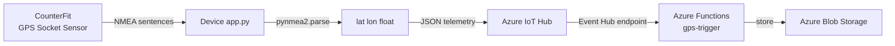
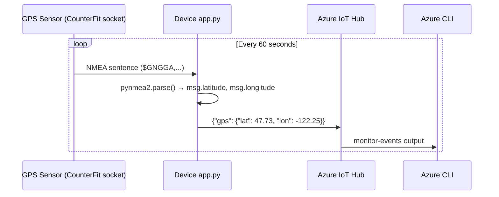

# Lesson 11 — Location Tracking

## Overview

This lesson introduces **connected vehicles** and how IoT transforms supply chain logistics through location tracking. It covers the fundamentals of **geospatial coordinates** (latitude/longitude, degrees/minutes/seconds vs. decimal degrees), explains how **GPS systems** work using satellite triangulation, and shows how to decode **NMEA 0183** sentences from a GPS sensor. The virtual device uses a simulated GPS sensor that outputs NMEA data, decoded using a Python library.

## Concepts

### The Supply Chain

The supply chain is the end-to-end process of getting food from a farmer to a consumer: loading produce onto trucks, ships, or airplanes, delivering to central hubs or warehouses, and eventually to the consumer.

**IoT improves the supply chain** by allowing managers to:
- Know where every vehicle is at any time
- Re-route vehicles mid-journey when traffic problems arise
- Alert crews to prepare for arrivals and reduce unloading wait times
- Ensure driver safety and legal compliance

> [!NOTE]
> **Logistics** is the process of transporting goods from one place to another (e.g., farm → warehouse → supermarket via trucks). A farmer packs boxes → loaded onto a truck → delivered to a central warehouse → sorted onto a second truck carrying mixed produce → delivered to the supermarket.

---

### Connected Vehicles

**Connected vehicles** are vehicles connected to central IT systems, reporting location and sensor data.

Benefits:

| Benefit | Description |
|---------|------------|
| Location tracking | Know where a vehicle is at any time; alert crew for unloading preparation; locate stolen vehicles |
| Route optimization | Combine location + traffic data to re-route vehicles mid-journey |
| Tax compliance | Some countries charge road tax based on mileage on public roads only (e.g., New Zealand's RUC) |
| Driver telemetry | Monitor speed, cornering, braking for safety; linked to insurance rates |
| Driver hours compliance | Ensure drivers only drive for legally allowed hours based on engine on/off times |
| Temperature monitoring | Refrigerated trucks can be re-routed if temperature threatens cargo |

> [!TIP]
> Benefits can be combined — e.g., driver hours + location to re-route if driver can't reach the destination within allowed hours.

Most vehicles operate **outside WiFi coverage** → use **cellular networks** to send GPS data.

---

### Geospatial Coordinates

Geospatial coordinates define points on Earth's surface using a pair of values.

**Example:** The Microsoft Campus in Redmond, WA, USA is at `47.6423109, -122.1390293`.

#### Latitude

- Measures degrees **north to south**.
- Lines circle the Earth parallel to the equator.
- **Equator = 0°**, **North Pole = 90° (positive)**, **South Pole = -90° (negative)**.

#### Longitude

- Measures degrees **east to west**.
- **Prime Meridian = 0°** — defined in 1884 as the line from North Pole to South Pole through the **Royal Observatory in Greenwich, England**.
- Goes from -180° (west) through 0° (Prime Meridian) to 180° (east).
- **180° and -180° are the same point** (the antimeridian, or 180th meridian — opposite the Prime Meridian).

> [!NOTE]
> **Meridian**: an imaginary straight line from the North Pole to the South Pole, forming a semicircle. The **antimeridian** is not the same as the International Date Line (which follows geo-political boundaries and is not a straight line).

#### Degrees, Minutes, Seconds (DMS) vs. Decimal Degrees

Traditional geospatial measurements use **sexagesimal** (base-60) numbering (from ancient Babylonians):
- 1 degree = 60 minutes
- 1 minute = 60 seconds

**At the equator:**
- 1° latitude = **111.3 km**
- 1 minute = 111.3 / 60 = **1.855 km**
- 1 second = 1.855 / 60 = **0.031 km**

**Example:** 2 degrees, 17 minutes, 43 seconds → written as `2°17'43"` → in decimal degrees: `2.295277`.

Computers use **decimal degrees**: `latitude, longitude`.

Coordinate notation: always `latitude, longitude`:
- `47.6423109` = 47.6423109° north of the equator
- `-122.1390293` = 122.1390293° west of the Prime Meridian

---

### Global Positioning System (GPS)

GPS works by receiving signals from multiple **satellites** orbiting Earth:
1. Satellites continuously broadcast their current position and an accurate timestamp over **radio waves**.
2. A GPS sensor detects signals from at least 3 satellites.
3. By measuring how long each signal took to arrive (radio waves travel at constant speed), the sensor calculates **distance from each satellite**.
4. Using distances to 3+ satellites, the sensor **triangulates** its position on Earth.

> [!NOTE]
> GPS satellites include **atomic clocks** that drift by 38 microseconds/day due to relativistic time dilation (satellites travel faster than Earth's rotation → time slows down as predicted by Einstein's special and general relativity). This must be corrected in GPS system design.

**Altitude** is also included because GPS satellites are orbiting, not fixed above a point.

**Accuracy:**
- Pre-2000: accuracy limited to ~5m by US military.
- Post-2000: accuracy improved to ~30cm (interference can degrade this).

**GPS constellations (multiple countries/unions):**
- USA: GPS
- Russia: GLONASS
- EU: Galileo
- Japan: QZSS
- China: BeiDou
- India: NAVIC

Modern GPS sensors connect to multiple constellations for faster and more accurate fixes.

> [!NOTE]
> GPS antennas need a **clear view of the sky**. In trucks/cars, antennas are positioned on the windshield or roof. For IoT devices, the antenna must also face the sky.

---

### NMEA GPS Data

GPS sensors output data using the **NMEA 0183 standard** — text-based messages from the National Marine Electronics Association (a US marine electronics trade organization).

**Format:**
- Each message is a **sentence** starting with `$`
- Followed by 2 source characters (`GP` = US GPS, `GN` = GLONASS)
- Followed by 3 type characters
- Fields separated by commas, ending with a newline

**Common message types:**

| Type | Description |
|------|------------|
| `GGA` | GPS Fix Data — latitude, longitude, altitude, number of satellites |
| `ZDA` | Current date and time including local time zone |
| `GSV` | Details of satellites currently in view |

> [!TIP]
> GPS data includes timestamps, so IoT devices can sync time from a GPS sensor instead of using NTP or a hardware real-time clock.

---

### NMEA Coordinate Format

Coordinates in GGA messages use the `(dd)dmm.mmmm` format:
- `dd` = degrees
- `mm.mmmm` = minutes (with decimal seconds)

Direction: `N`/`S` for latitude; `E`/`W` for longitude.

**Example NMEA sentence:**
```
$GNGGA,020604.001,4738.538654,N,12208.341758,W,1,3,,164.7,M,-17.1,M,,*67
```

- Latitude: `4738.538654,N` → 47° + (38.538654 / 60)° = **47.6423109°** (positive = North)
- Longitude: `12208.341758,W` → 122° + (08.341758 / 60)° = **122.1390293°** (negative = West)

> [!NOTE]
> The NMEA 0183 standard is proprietary (costs US$2,000+), but much of it has been reverse-engineered and is available in open-source libraries.

---

### Decode GPS Data with Python

Rather than parsing raw NMEA sentences manually, use an open-source library.

**Virtual device:** Reads simulated GPS NMEA data from a CounterFit socket sensor, then decodes using the `pynmea2` library (or equivalent).

## Hardware / Setup

> [!NOTE]
> For Raspberry Pi: `pi-gps-sensor.md`. For Wio Terminal: `wio-terminal-gps-sensor.md`. For Virtual Device: `virtual-device-gps-sensor.md`.

**Project folder:** `gps-sensor`

**Virtual device GPS sensor:** The virtual GPS sensor is a text socket sensor in CounterFit that sends NMEA sentences. The virtual device reads these over a socket connection and decodes them.

**Install pip packages:**

```sh
pip install pynmea2
pip install azure-iot-device
```

## Code Walkthrough

### Read and Decode GPS Data (Virtual Device)

The virtual device reads NMEA data from CounterFit via a socket:

```python
import pynmea2
import socket

# Connect to CounterFit GPS socket sensor
s = socket.socket(socket.AF_INET, socket.SOCK_STREAM)
s.connect(('127.0.0.1', 5000))

with s.makefile() as f:
    while True:
        line = f.readline()
        if line.startswith('$GNGGA') or line.startswith('$GPGGA'):
            msg = pynmea2.parse(line)
            lat = msg.latitude
            lon = msg.longitude
            print(f'Latitude: {lat}, Longitude: {lon}')
```

**Code explanation:**

| Line | Explanation |
|------|-------------|
| `pynmea2.parse(line)` | Parses a raw NMEA sentence string into a Python object with named attributes |
| `msg.latitude` | Decimal degrees latitude (float) |
| `msg.longitude` | Decimal degrees longitude (float) |
| `$GNGGA` | GGA message (GPS Fix Data) from a multi-constellation receiver |
| `$GPGGA` | GGA message from the US GPS system specifically |

---

### Send GPS Telemetry to IoT Hub

Once `lat` and `lon` are extracted, send as JSON telemetry:

```python
import json
from azure.iot.device import IoTHubDeviceClient, Message

message_json = { "gps": { "lat": lat, "lon": lon } }
print("Sending telemetry", message_json)
message = Message(json.dumps(message_json))
device_client.send_message(message)
```

**Send every 60 seconds** (to stay within the free tier's 8,000 messages/day):

```python
import time
time.sleep(60)
```

**Expected CLI output:**
```output
{
    "event": {
        "origin": "gps-sensor",
        "payload": "{\"gps\": {\"lat\": 47.73481, \"lon\": -122.25701}}"
    }
}
```

## How It Works





## Key Terms

| Term | Definition |
|------|------------|
| Supply chain | The end-to-end process of getting goods from a producer (farmer) to a consumer, via transport and warehousing |
| Logistics | The process of transporting goods from one place to another (e.g., farm to supermarket) |
| Connected vehicles | Vehicles linked to central IT systems, reporting location and other sensor data |
| Geospatial coordinates | A pair of values (latitude, longitude) used to define a point on Earth's surface |
| Latitude | Degrees north (positive) or south (negative) of the equator; ranges from -90° to 90° |
| Longitude | Degrees east (positive) or west (negative) of the Prime Meridian; ranges from -180° to 180° |
| Prime Meridian | The 0° longitude reference line passing through the Royal Observatory in Greenwich, England |
| Antimeridian (180th meridian) | The meridian 180° from the Prime Meridian; opposite side of Earth |
| Decimal degrees | Coordinates expressed as a single floating-point number instead of degrees, minutes, and seconds |
| Sexagesimal (base-60) | Numbering system used by ancient Babylonians; basis for degrees/minutes/seconds and hours/minutes/seconds |
| GPS satellite | Orbiting spacecraft that broadcasts position and a precise timestamp over radio waves |
| GPS triangulation | The process of using distance-to-satellite data from 3+ satellites to calculate position |
| Atomic clock | Extremely precise clock used in GPS satellites; corrected for relativistic time dilation |
| GPS constellation | A group of GPS satellites deployed by a country or political union (e.g., US GPS, Russian GLONASS) |
| NMEA 0183 | A standard from the National Marine Electronics Association for GPS data messages |
| GGA sentence | NMEA GPS Fix Data message containing latitude, longitude, and altitude |
| `(dd)dmm.mmmm` format | NMEA coordinate format where `dd` = degrees, `mm.mmmm` = decimal minutes |
| `pynmea2` | Python library for parsing NMEA sentences into objects with named attributes |
| `msg.latitude` / `msg.longitude` | Decimal degree float values returned by pynmea2 from a parsed GGA sentence |

## Summary

- The supply chain is the full path from farm to consumer; IoT connected vehicles dramatically improve logistics.
- **Latitude**: -90° (South Pole) to 90° (North Pole); **Longitude**: -180° (west) to 180° (east).
- **Prime Meridian** (0°) passes through Greenwich, England; defined in 1884.
- **Decimal degrees** = `(degrees) + (minutes/60) + (seconds/3600)`; e.g., `2°17'43"` = `2.295277`.
- Always specify coordinates as `latitude, longitude`.
- GPS uses signals from 3+ satellites to triangulate position; also provides altitude.
- GPS satellites use atomic clocks corrected for relativistic time dilation.
- After 2000, GPS accuracy improved from ~5m to ~30cm.
- NMEA 0183: text-based GPS standard; each sentence starts with `$`, source code, type code, then comma-separated fields.
- GGA sentences contain latitude, longitude, altitude, and satellite count.
- Format: `(dd)dmm.mmmm` + direction character (`N`/`S` for lat, `E`/`W` for lon).
- `pynmea2.parse(line)` → `msg.latitude`, `msg.longitude` in decimal degrees.
- Send GPS telemetry every 60 seconds to stay within the free IoT Hub message quota.
- Telemetry format: `{"gps": {"lat": <lat>, "lon": <lon>}}`.
