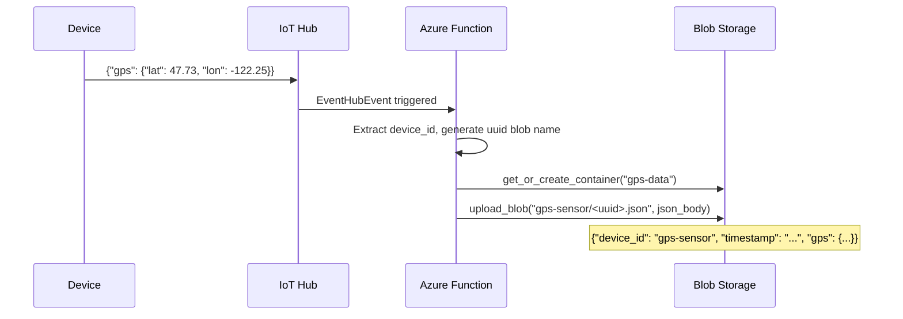

# Lesson 12 — Store Location Data

## Overview

This lesson covers how to store IoT GPS data in the cloud. It explains the difference between **structured and unstructured data**, compares **SQL vs. NoSQL databases**, introduces the **hot/warm/cold path** concept for data processing latency, and shows how to use an **Azure Functions** Event Hub trigger to save GPS telemetry to **Azure Blob Storage** as JSON files. Each GPS reading is stored as a separate blob, organized by device ID.

## Concepts

### Structured vs. Unstructured Data

**Structured data:** Has a well-defined, rigid structure that doesn't change; maps to tables with relationships.
- Example: a person's name, date of birth, and address — each field is always the same type.
- Stored in **SQL (relational) databases**.

**Unstructured data:** No well-defined, rigid structure; can change structure frequently.
- Example: documents like written text or spreadsheets.
- Stored in **NoSQL (document) databases**.

> [!NOTE]
> There is also **semi-structured data** — structured but not in fixed tables (e.g., JSON with varying fields). Azure Table Storage is a semi-structured store.

**IoT data is unstructured.** Different vehicle types send different sensor data:
- Farm tractors: GPS only
- Delivery trucks: GPS + speed + acceleration + driver identity
- Refrigerated trucks: GPS + speed + acceleration + driver identity + temperature

Data can also change dynamically: a truck cab sending different data depending on which trailer is attached. All of this goes to the same IoT service but has different structures.

---

### SQL Databases

Also called **Relational Database Management Systems (RDBMS)**. Use **SQL (Structured Query Language)** to add, remove, update, and query data.

**Characteristics:**
- Data organized into **tables** with **named columns** (predefined schema).
- Each row in a table must fit the schema.
- Tables can relate to each other using shared IDs (relational).
- Adding a new column requires modifying the table schema.

**Example:** A `users` table with an ID per user; a `purchases` table with a column for the user's ID — query both tables using the shared ID.

**Best for:** Structured data with a consistent, well-known shape.

**Well-known SQL databases:** Microsoft SQL Server, MySQL, PostgreSQL.

---

### NoSQL Databases

Also called **document databases**. Named "NoSQL" because they don't have the rigid structure of relational databases.

> [!NOTE]
> Despite the name, some NoSQL databases allow SQL-style queries.

**Characteristics:**
- No pre-defined schema — insert any JSON documents.
- Documents organized in **containers/folders** (like files on a hard disk).
- Different documents in the same container can have different fields.
- Adding a new field to future documents requires NO schema change.

**Example:** Farm vehicle IoT data — a tractor document has only GPS fields; a refrigerated truck document also has temperature fields. A new truck with built-in scales can add `weight` fields without changing anything else.

**Well-known NoSQL databases:** Azure CosmosDB, MongoDB, CouchDB.

This lesson uses **Azure Blob Storage** (unstructured, JSON blobs) to store GPS data.

---

### Hot, Warm, and Cold Paths

IoT data doesn't always need to be processed immediately. Different data has different latency requirements:

| Path | Latency | Use Case | Example |
|------|---------|----------|---------|
| **Hot** | Real-time or near real-time | Alerts, immediate responses | Alert when a truck is approaching a depot; temperature in refrigerated truck too high |
| **Warm** | Short time after receipt | Reporting, short-term analytics | Daily mileage reports using data from the previous day |
| **Cold** | Historic, long-term | Data warehousing, batch analytics | Annual mileage; optimal route analysis for fuel cost reduction |

**Cold path storage:** Data warehouses — databases designed for storing large amounts of data that never changes and can be queried quickly. A regular job moves data from warm storage to the data warehouse daily, weekly, or monthly.

> [!TIP]
> GPS telemetry sent from trucks is **warm path** data — stored after receipt for reporting and journey visualization in the next lesson.

---

### Azure Storage Accounts

Azure Storage Accounts provide multiple storage types, all in one account:

| Type | Description | Use Case |
|------|------------|---------|
| **Blob storage** | Binary Large Objects — any unstructured data (JSON, images, videos) | IoT JSON data, media files |
| **Table storage** | Semi-structured data, NoSQL — data in tables with unique keys | Structured but schema-free data |
| **Queue storage** | Messages up to 64KB in a queue (FIFO) | Long-term message storage for batch jobs |
| **File storage** | Files in the cloud, accessible via industry-standard protocols | Cloud drives mountable on PCs/Macs |

**Blob storage containers:**
- Named **containers** (buckets), similar to tables in a relational DB.
- Containers can have **folders** organized hierarchically.
- Public access can be granted to allow reading blobs from external web apps.

**Blob naming convention in this lesson:**
- Blobs organized by device ID (folder = device ID): `gps-sensor/<uuid>.json`
- Each GPS reading = one blob file.
- UUID generated using Python's `uuid` module to ensure uniqueness.

---

### Blob Storage Python SDK

The `azure-storage-blob` pip package provides the `BlobServiceClient` and `ContainerClient` classes.

**Helper function: `get_or_create_container`**
```python
def get_or_create_container(name):
    connection_str = os.environ['STORAGE_CONNECTION_STRING']
    blob_service_client = BlobServiceClient.from_connection_string(connection_str)
    
    for container in blob_service_client.list_containers():
        if container.name == name:
            return blob_service_client.get_container_client(container.name)
    
    return blob_service_client.create_container(name, public_access=PublicAccess.Container)
```

- `BlobServiceClient.from_connection_string()` — creates a client connected to the storage account.
- `list_containers()` — iterates all existing containers.
- `get_container_client()` — returns a client for an existing container.
- `create_container()` — creates a new container with `PublicAccess.Container` (allows external web apps to read blobs — used in Lesson 13 for map visualization).

> [!NOTE]
> The blob SDK does not have a built-in "create if not exists" method for containers — the helper function above implements this pattern manually.

---

### Blob Data Structure

Each blob stored is a JSON document with this structure:

```json
{
    "device_id": "gps-sensor",
    "timestamp": "2021-05-21T00:57:53.878Z",
    "gps": {
        "lat": 47.73092,
        "lon": -122.26206
    }
}
```

> [!IMPORTANT]
> The timestamp uses `event.iothub_metadata['enqueuedtime']` — the time the message arrived at IoT Hub — NOT the current time of the function. A message might sit on the hub for a while before the Functions App processes it. Using enqueued time ensures the stored timestamp reflects when the GPS reading was taken.

## Hardware / Setup

**No device code changes from Lesson 11.** Device sends `{"gps": {"lat": ..., "lon": ...}}` telemetry every 60 seconds.

**Azure resources needed:**
1. IoT Hub (from Lesson 11, or new)
2. Azure Storage Account
3. Azure Functions App (project folder: `gps-trigger`)

**Install pip packages:**
```sh
pip install azure-storage-blob
```

**Set in `local.settings.json`:**
```json
{
    "Values": {
        "AzureWebJobsStorage": "UseDevelopmentStorage=true",
        "IOT_HUB_CONNECTION_STRING": "<event_hub_connection_string>",
        "STORAGE_CONNECTION_STRING": "<storage_account_connection_string>"
    }
}
```

**Get storage account connection string:**
```sh
az storage account show-connection-string --output table --name <storage_name>
```

## Code Walkthrough

### Azure Functions App — Store GPS Blobs

**Project structure:**
```
gps-trigger/
├── host.json
├── local.settings.json
├── requirements.txt
└── iot-hub-trigger/
    ├── __init__.py
    └── function.json
```

**`requirements.txt`:**
```
azure-functions
azure-storage-blob
```

---

**`function.json`:**
```json
{
    "scriptFile": "__init__.py",
    "bindings": [
        {
            "type": "eventHubTrigger",
            "name": "event",
            "direction": "in",
            "eventHubName": "",
            "connection": "IOT_HUB_CONNECTION_STRING",
            "cardinality": "one",
            "consumerGroup": "$Default"
        }
    ]
}
```

---

**`__init__.py`:**

```python
import logging
import json
import os
import uuid
import azure.functions as func
from azure.storage.blob import BlobServiceClient, PublicAccess


def get_or_create_container(name):
    connection_str = os.environ['STORAGE_CONNECTION_STRING']
    blob_service_client = BlobServiceClient.from_connection_string(connection_str)

    for container in blob_service_client.list_containers():
        if container.name == name:
            return blob_service_client.get_container_client(container.name)

    return blob_service_client.create_container(name, public_access=PublicAccess.Container)


def main(event: func.EventHubEvent):
    device_id = event.iothub_metadata['connection-device-id']
    blob_name = f'{device_id}/{str(uuid.uuid1())}.json'

    container_client = get_or_create_container('gps-data')
    blob = container_client.get_blob_client(blob_name)

    event_body = json.loads(event.get_body().decode('utf-8'))
    blob_body = {
        'device_id' : device_id,
        'timestamp' : event.iothub_metadata['enqueuedtime'],
        'gps': event_body['gps']
    }

    logging.info(f'Writing blob to {blob_name} - {blob_body}')
    blob.upload_blob(json.dumps(blob_body).encode('utf-8'))
```

**Code explanation (line by line):**

| Line | Explanation |
|------|-------------|
| `event.iothub_metadata['connection-device-id']` | Gets the sending device's ID from IoT Hub annotations |
| `f'{device_id}/{str(uuid.uuid1())}.json'` | Creates a blob path: device ID as folder, UUID as filename (e.g., `gps-sensor/a9487ac2-...json`) |
| `get_or_create_container('gps-data')` | Gets or creates the `gps-data` container in blob storage |
| `container_client.get_blob_client(blob_name)` | Creates a blob client referencing the new blob (it doesn't exist yet) |
| `event.iothub_metadata['enqueuedtime']` | Timestamp when the telemetry was received by IoT Hub (ISO 8601) |
| `event_body['gps']` | The GPS sub-object from the telemetry JSON |
| `blob.upload_blob(json.dumps(...).encode('utf-8'))` | Serializes the body to JSON, encodes to bytes, uploads as a new blob |

---

### Verify Uploaded Blobs

**List blobs with CLI:**
```sh
az storage blob list --container-name gps-data \
                     --output table \
                     --account-name <storage_name> \
                     --account-key <key1>
```

**Get account key:**
```sh
az storage account keys list --output table --account-name <storage_name>
```

**Download a blob:**
```sh
az storage blob download --container-name gps-data \
                         --account-name <storage_name> \
                         --account-key <key1> \
                         --name gps-sensor/<uuid>.json \
                         --file output.json
```

**Expected blob contents:**
```json
{"device_id": "gps-sensor", "timestamp": "2021-05-21T00:57:53.878Z", "gps": {"lat": 47.73092, "lon": -122.26206}}
```

---

### Deploy to Cloud

```sh
# Create storage account (if not already done)
az storage account create --resource-group gps-sensor --sku Standard_LRS --name <storage_name>

# Create Functions App
az functionapp create --resource-group gps-sensor \
                      --runtime python \
                      --functions-version 3 \
                      --os-type Linux \
                      --consumption-plan-location <location> \
                      --storage-account <storage_name> \
                      --name <functions_app_name>

# Upload Application Settings
az functionapp config appsettings set --resource-group gps-sensor \
                                      --name <functions_app_name> \
                                      --settings "IOT_HUB_CONNECTION_STRING=<value>"

az functionapp config appsettings set --resource-group gps-sensor \
                                      --name <functions_app_name> \
                                      --settings "STORAGE_CONNECTION_STRING=<value>"

# Deploy
func azure functionapp publish <functions_app_name>
```

## How It Works

```mermaid
flowchart LR
    Device[IoT Device\ngps-sensor] -->|JSON telemetry\n{"gps": {"lat": ..., "lon": ...}}| Hub[Azure IoT Hub]
    Hub -->|Event Hub endpoint\nIOT_HUB_CONNECTION_STRING| Trigger[Azure Functions\niot-hub-trigger]
    Trigger -->|get_or_create_container\ngps-data| Storage[Azure Blob Storage]
    Trigger -->|upload_blob\ngps-sensor/uuid.json| Storage
```



## Key Terms

| Term | Definition |
|------|------------|
| Structured data | Data with a well-defined, rigid structure mapping to tables with columns; stored in SQL databases |
| Unstructured data | Data without a rigid structure, varying from document to document; stored in NoSQL databases |
| Semi-structured data | Structured but not fixed in tables (e.g., JSON with varying fields); Azure Table Storage |
| SQL (Relational) database | A database with a predefined schema of tables and relationships; uses SQL for queries |
| NoSQL (document) database | A schema-free database storing JSON documents in containers/folders |
| Hot path | Data processing in real-time or near real-time for alerts |
| Warm path | Data processed shortly after receipt for reporting and short-term analytics |
| Cold path | Historical data stored long-term in a data warehouse for batch analytics |
| Azure Blob Storage | Azure service for storing unstructured binary large objects (files, JSON, images, video) |
| Azure Table Storage | Azure semi-structured NoSQL storage with unique key-based rows |
| Azure Queue Storage | Azure service for FIFO message queuing up to 64KB per message |
| Azure File Storage | Cloud file storage mountable as a drive using industry-standard protocols |
| Blob container | A named bucket in Azure Blob Storage for organizing blobs (similar to a folder) |
| `PublicAccess.Container` | Blob container access level allowing external websites to read blobs via URL |
| `BlobServiceClient` | Python SDK class for interacting with an Azure Blob Storage account |
| `ContainerClient` | Python SDK class for interacting with a specific blob container |
| `get_blob_client(name)` | Returns a client for a named blob (existing or new) |
| `upload_blob(data)` | Uploads bytes as the content of a new blob |
| `uuid.uuid1()` | Python function generating a universally unique ID based on host and current time |
| `event.iothub_metadata['enqueuedtime']` | The ISO 8601 timestamp when a message was received by IoT Hub |
| `STORAGE_CONNECTION_STRING` | Application Setting (local.settings.json or Azure App Settings) containing the storage account credentials |

## Summary

- **Structured data**: fixed schema → SQL databases. **Unstructured data**: varying fields → NoSQL/blob storage.
- IoT data is unstructured — different vehicles send different fields; NoSQL is the right fit.
- SQL databases use predefined table schemas and relationships. NoSQL (document) databases accept any JSON, no schema changes needed.
- **Hot path**: real-time alerts. **Warm path**: data stored for reports (this lesson). **Cold path**: data warehouse for long-term batch analytics.
- GPS telemetry → IoT Hub → Azure Functions Event Hub trigger → Azure Blob Storage.
- Each GPS reading is one JSON blob, organized by device ID in a folder: `gps-sensor/<uuid>.json`.
- `get_or_create_container()` helper manually checks and creates the `gps-data` container.
- `PublicAccess.Container` on the container allows a web page to read blobs (needed for Lesson 13 map viz).
- `event.iothub_metadata['enqueuedtime']` — use IoT Hub enqueued time as the blob timestamp (not current time, as messages may be delayed).
- `blob.upload_blob(json.dumps(blob_body).encode('utf-8'))` — serialize dict to JSON string, encode to bytes, upload.
- Deploy: create storage account → create Functions App → upload Application Settings → `func azure functionapp publish`.
