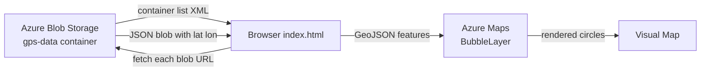
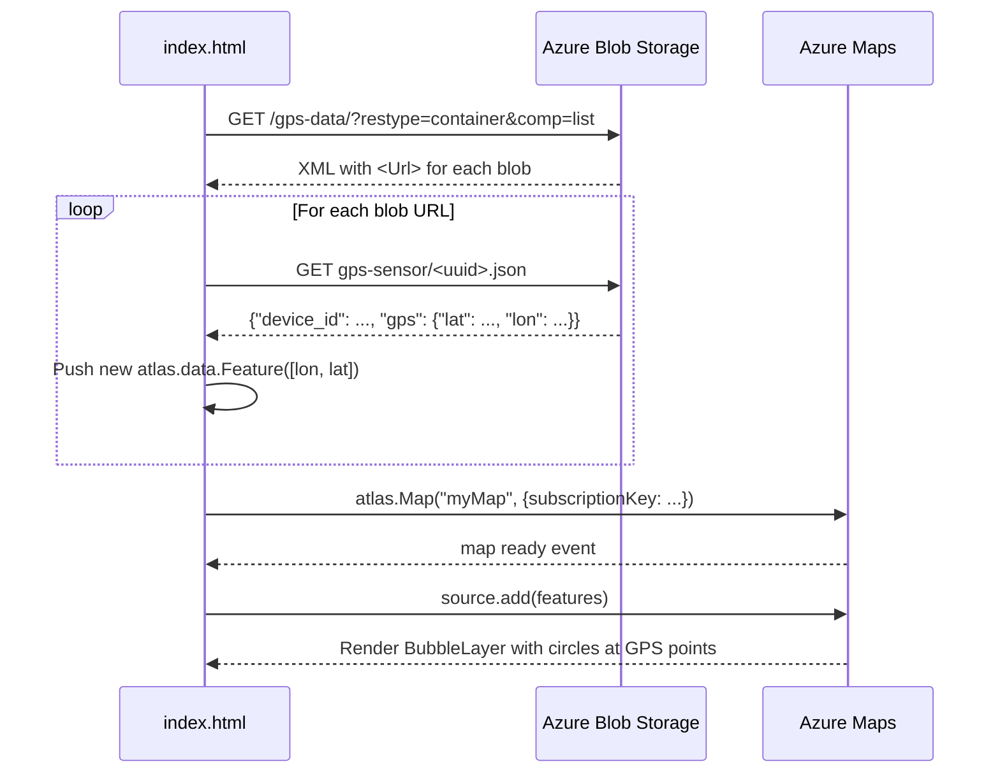

# Lesson 13 — Visualize Location Data

## Overview

This lesson covers **data visualization** for IoT GPS data. It explains what data visualization is and why it matters for decision-making, introduces **Azure Maps** as a geospatial mapping service, shows how to create a map on an HTML web page using the Azure Maps Web SDK, explains the **GeoJSON format** for geographic data, and shows how to fetch GPS blobs from Azure Blob Storage and plot them as bubble markers on the map.

## Concepts

### What Is Data Visualization?

**Data visualization** is representing data pictorially to make it easier for humans to understand and make decisions. Raw numbers in a table are hard to interpret — charts and maps communicate patterns and anomalies instantly.

**Example:** 24 rows of hourly soil moisture readings vs. a line chart — the chart shows at a glance when moisture dropped and when watering was triggered.

> [!TIP]
> The best visualizations allow humans to **make decisions quickly**. Sometimes the best visualization is a flashing warning light rather than a complex dashboard.

For GPS data, the clearest visualization is plotting points on a **map**. A map showing delivery trucks allows depot workers to:
- See when trucks will arrive
- See which type of truck is coming (refrigerated → prepare fridge space)
- Plan unloading crew and equipment

---

### Map Services

Map services available for developers: Bing Maps, Leaflet, Open Street Maps, Google Maps, and **Azure Maps**.

**Azure Maps** is "a collection of geospatial services and SDKs that use fresh mapping data to provide geographic context to web and mobile applications."

**Azure Maps features:**
- Map styles: blank canvas, tiles, satellite, satellite+roads, grayscale, shaded relief (elevation), night view, high contrast
- Real-time updates via Azure Event Grid
- Controls: pinch, drag, click event handlers
- Layers: bubbles, lines, polygons, heat maps, and more
- Traffic incidents, indoor navigation, search, elevation, weather

**SDKs:**
- **Web SDK**: JavaScript SDK for browser-based maps
- **Android SDK**: for mobile Android apps
- **REST API**: for any language via HTTP

> [!NOTE]
> This lesson uses the **Azure Maps Web SDK** to draw a map and display GPS sensor points.

---

### Create an Azure Maps Resource

```sh
az maps account create --name gps-sensor \
                       --resource-group gps-sensor \
                       --accept-tos \
                       --sku S1
```

- `--sku S1` — paid tier with a generous free call allowance. Includes all features needed for this lesson.
- After creation, get the API key:

```sh
az maps account keys list --name gps-sensor \
                          --resource-group gps-sensor \
                          --output table
```

Copy the `PrimaryKey` value — this is the **subscription key** used in all Azure Maps API calls.

---

### GeoJSON Format

**GeoJSON** is an open standard JSON specification for geographic data.

**Structure:**

```json
{
    "type": "FeatureCollection",
    "features": [
        {
            "type": "Feature",
            "geometry": {
                "type": "Point",
                "coordinates": [
                    -2.10237979888916,
                    57.164918677004714
                ]
            }
        }
    ]
}
```

**Key rules:**

| Rule | Detail |
|------|--------|
| Coordinate order | **`[longitude, latitude]`** — NOT `[latitude, longitude]` |
| Geometry types | `Point` (single location), `Polygon` (area), `LineString` (path), and more |
| `FeatureCollection` | The top-level container for multiple `Feature` objects |
| `Feature` | A single geographic feature with a `geometry` and optional `properties` |

> [!CAUTION]
> GeoJSON uses `[longitude, latitude]` — the **opposite** order from how coordinates are usually spoken (`lat, lon`). Getting this wrong causes points to appear in the wrong location.

**Point geometry:**
- `coordinates` is an array of 2 values: `[longitude, latitude]` (float).

**Polygon geometry:**
- `coordinates` is an array of arrays of `[longitude, latitude]` pairs.
- The polygon must close: the last point must equal the first point.
- A rectangle has 5 points (4 corners + closing repeat of corner 1).

---

### CORS

**CORS (Cross-Origin Resource Sharing)** — a browser security mechanism that by default blocks JavaScript on one origin (domain) from reading data from a different origin.

Since the map HTML page reads blobs from Azure Blob Storage (a different origin), CORS must be explicitly enabled on the storage account:

```sh
az storage cors add --methods GET \
                    --origins "*" \
                    --services b \
                    --account-name <storage_name> \
                    --account-key <key1>
```

- `--methods GET` — only allow GET requests (reading data)
- `--origins "*"` — allow any website (wildcard)
- `--services b` — only apply to blobs (not tables, queues, files)

## Hardware / Setup

**No device code changes.** Device continues sending GPS telemetry from Lesson 11.

**Azure resources needed:**
- Azure Maps account (created above)
- Azure Storage Account (from Lesson 12, with GPS blobs in `gps-data` container)

**Enable CORS on storage** (required for web page access):
```sh
az storage cors add --methods GET --origins "*" --services b \
                    --account-name <storage_name> --account-key <key1>
```

## Code Walkthrough

### HTML Web Page (`index.html`)

**Step 1 — HTML structure:**

```html
<html>
<head>
    <link rel="stylesheet" href="https://atlas.microsoft.com/sdk/javascript/mapcontrol/2/atlas.min.css" type="text/css" />
    <script src="https://atlas.microsoft.com/sdk/javascript/mapcontrol/2/atlas.min.js"></script>
    <style>
        #myMap {
            width: 100%;
            height: 100%;
        }
    </style>
</head>

<body onload="init()">
    <div id="myMap"></div>
</body>
</html>
```

- The Azure Maps **CSS** file styles the map control.
- The Azure Maps **JS** file is the Web SDK script.
- `#myMap` div fills the page where the map will render.
- `onload="init()"` calls the `init()` JavaScript function when the page loads.

---

**Step 2 — Initialize map and load GPS data:**

```javascript
var map, features;

function init() {
    fetch("https://<storage_name>.blob.core.windows.net/gps-data/?restype=container&comp=list")
        .then(response => response.text())
        .then(str => new window.DOMParser().parseFromString(str, "text/xml"))
        .then(xml => {
            let blobList = Array.from(xml.querySelectorAll("Url"));
            blobList.forEach(async blobUrl => {
                loadJSON(blobUrl.innerHTML)
            });
        })
        .then(response => {
            map = new atlas.Map('myMap', {
                center: [-122.26473, 47.73444],
                zoom: 14,
                authOptions: {
                    authType: "subscriptionKey",
                    subscriptionKey: "<subscription_key>",
                }
            });
            map.events.add('ready', function () {
                var source = new atlas.source.DataSource();
                map.sources.add(source);
                map.layers.add(new atlas.layer.BubbleLayer(source));
                source.add(features);
            })
        })
}
```

**Code flow:**
1. `fetch(URL)` — calls the Azure Blob Storage container list API.
   - URL format: `https://<account>.blob.core.windows.net/<container>/?restype=container&comp=list`
   - Returns XML listing all blobs in the container, each with a `<Url>` element.
2. `DOMParser().parseFromString()` — parses the XML response.
3. `xml.querySelectorAll("Url")` — gets all blob URLs from the XML.
4. `loadJSON(blobUrl.innerHTML)` — fetches each individual blob JSON file.
5. `new atlas.Map('myMap', {...})` — creates the Azure Maps map centered at `[-122.26473, 47.73444]` (Seattle area), zoom level 14.
6. `map.events.add('ready', ...)` — runs when the map is fully loaded.
7. `new atlas.source.DataSource()` — creates a GeoJSON data source for the map.
8. `new atlas.layer.BubbleLayer(source)` — adds a layer of circles to the map, one per GeoJSON point.
9. `source.add(features)` — adds all the GPS feature points to the data source.

---

**Step 3 — Load and parse each GPS blob:**

```javascript
function loadJSON(file) {
    var xhr = new XMLHttpRequest();
    features = [];
    xhr.onreadystatechange = function () {
        if (xhr.readyState === XMLHttpRequest.DONE) {
            if (xhr.status === 200) {
                gps = JSON.parse(xhr.responseText)
                features.push(
                    new atlas.data.Feature(
                        new atlas.data.Point(
                            [parseFloat(gps.gps.lon), parseFloat(gps.gps.lat)]
                        )
                    )
                )
            }
        }
    };
    xhr.open("GET", file, true);
    xhr.send();
}
```

**Code explanation:**

| Line | Explanation |
|------|-------------|
| `new XMLHttpRequest()` | Creates an HTTP request object |
| `xhr.onreadystatechange` | Callback when request state changes |
| `xhr.readyState === XMLHttpRequest.DONE` | Request is complete (readyState 4) |
| `xhr.status === 200` | HTTP 200 OK — successful response |
| `JSON.parse(xhr.responseText)` | Parses the blob JSON string to a Python dict |
| `gps.gps.lon`, `gps.gps.lat` | Extracts longitude and latitude from blob data |
| `[parseFloat(gps.gps.lon), parseFloat(gps.gps.lat)]` | Creates GeoJSON coordinates array `[lon, lat]` |
| `new atlas.data.Point([lon, lat])` | Creates a GeoJSON Point geometry |
| `new atlas.data.Feature(point)` | Wraps the point in a GeoJSON Feature |
| `features.push(...)` | Adds the feature to the features array |

The `BubbleLayer` on the map then renders each feature as a circle at the correct GPS coordinates.

---

### Expected Output

When the `index.html` page loads in a browser, it:
1. Fetches the blob list from Azure Storage.
2. Loads each blob JSON file.
3. Creates GeoJSON features from the lat/lon coordinates.
4. Renders the Azure Maps map.
5. Adds bubble markers at each GPS location — creating a visual path of the vehicle's route.

```
map centered at Seattle → bubbles along a walking/driving path
```

## How It Works





## Key Terms

| Term | Definition |
|------|------------|
| Data visualization | Representing data pictorially to make it easier for humans to understand and make decisions |
| Azure Maps | Microsoft's geospatial services and SDKs platform for adding mapping features to web and mobile applications |
| Azure Maps Web SDK | A JavaScript library for embedding and interacting with Azure Maps in web browsers |
| `atlas.Map` | The main Azure Maps JavaScript class that creates a map control in a div element |
| `atlas.source.DataSource` | A GeoJSON data container that holds map feature data |
| `atlas.layer.BubbleLayer` | A map layer that renders GeoJSON Point features as circles |
| `atlas.data.Feature` | A GeoJSON Feature object wrapping a geometry (e.g., a Point) |
| `atlas.data.Point` | A GeoJSON Point geometry with `[longitude, latitude]` coordinates |
| GeoJSON | An open standard JSON format for representing geographic data (points, polygons, line strings) |
| `FeatureCollection` | The top-level GeoJSON container for an array of `Feature` objects |
| `[lon, lat]` order | GeoJSON coordinate convention — longitude first, latitude second (opposite of common spoken convention) |
| `BubbleLayer` | Azure Maps layer type that renders circles centered on GeoJSON Point coordinates |
| CORS (Cross-Origin Resource Sharing) | Browser security mechanism that restricts cross-origin HTTP requests; must be explicitly enabled on Azure Storage for web page access |
| `--origins "*"` | CORS setting allowing any web origin to make requests |
| `restype=container&comp=list` | Azure Blob Storage URL parameters to list all blobs in a container |
| `DOMParser` | JavaScript API for parsing XML (or HTML) strings into a DOM tree |
| `XMLHttpRequest` | JavaScript API for making asynchronous HTTP requests |
| `parseFloat()` | JavaScript function to convert a string to a floating-point number |
| `subscriptionKey` | The API key for an Azure Maps account, used for authentication |
| `authType: "subscriptionKey"` | Azure Maps authentication mode using a direct API key |

## Summary

- Data visualization turns raw numbers into patterns that allow fast human decision-making.
- Azure Maps is Microsoft's geospatial platform for maps, routing, traffic, weather, and more.
- Create an Azure Maps resource: `az maps account create --sku S1 --accept-tos`.
- Get API key: `az maps account keys list` → copy `PrimaryKey`.
- **GeoJSON** coordinates are `[longitude, latitude]` (NOT `[lat, lon]`).
- GeoJSON structure: `FeatureCollection` → `Feature` → `geometry` → `Point` or `Polygon`.
- `atlas.Map(divId, { center: [lon, lat], zoom: N, authOptions: {...} })` creates the map.
- `atlas.source.DataSource` + `atlas.layer.BubbleLayer` + `source.add(features)` renders circles on the map.
- Blob container list URL: `https://<account>.blob.core.windows.net/<container>/?restype=container&comp=list`.
- Enable CORS before fetching blobs from a web page: `az storage cors add --methods GET --origins "*" --services b`.
- `loadJSON()` fetches each blob, parses `gps.gps.lat` and `gps.gps.lon`, and creates GeoJSON `Feature(Point([lon, lat]))` objects.
- The `BubbleLayer` renders each feature as a circle on the map, visualizing the GPS path.
