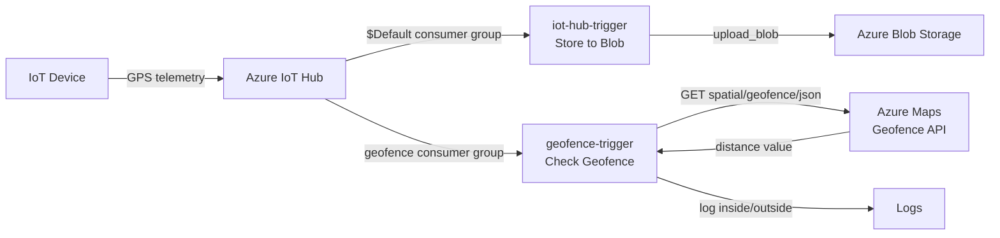
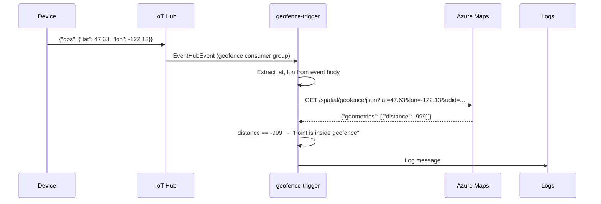

# Lesson 14 — Geofences

## Overview

This final Transport lesson covers **geofences** — virtual geographic boundaries used to trigger alerts when a vehicle enters or exits an area. It explains why geofences are useful (unloading preparation, tax compliance, theft monitoring, location compliance), shows how to define a geofence as a **GeoJSON polygon**, upload it to **Azure Maps**, test coordinates against it using the REST API, and finally how to add a second **IoT Hub event trigger** using a dedicated **consumer group** in an Azure Functions app to check GPS readings against the geofence.

## Concepts

### What Are Geofences?

A **geofence** is a virtual perimeter for a real-world geographic region.

**Types:**
- **Circle**: defined by a center point and radius (e.g., a 100m circle around a building)
- **Polygon**: a custom shape covering an area (e.g., a school zone, campus, or city limits)

**Use cases:**

| Use Case | Description |
|----------|-------------|
| Unloading preparation | Alert depot crew when a truck arrives → reduced waiting time → more deliveries per day |
| Tax compliance | Track mileage on public vs. private roads (e.g., New Zealand's Road User Charges for diesel vehicles) |
| Theft monitoring | Alert if a vehicle leaves an expected area (e.g., a farm) unexpectedly |
| Location compliance | Ensure vehicles carrying certain cargo (fertilizers, pesticides) stay away from designated areas (e.g., organic fields) |

> [!NOTE]
> You've likely used geofences without knowing it — iOS Reminders and Google Keep can set location-based reminders by creating a geofence around a place and alerting you when your phone enters it.

---

### Defining a Geofence (GeoJSON Polygon)

Geofences in Azure Maps are defined as GeoJSON polygons:

```json
{
    "type": "FeatureCollection",
    "features": [
        {
            "type": "Feature",
            "geometry": {
                "type": "Polygon",
                "coordinates": [
                    [
                        [-122.13393688201903, 47.63829579223815],
                        [-122.13389128446579, 47.63782047131512],
                        [-122.13240802288054, 47.63783312249837],
                        [-122.13238388299942, 47.63829037035086],
                        [-122.13393688201903, 47.63829579223815]
                    ]
                ]
            },
            "properties": {
                "geometryId": "1"
            }
        }
    ]
}
```

**Key rules for polygon GeoJSON:**

| Rule | Detail |
|------|--------|
| Coordinate order | `[longitude, latitude]` — same as other GeoJSON |
| Closing the polygon | The **last point must equal the first point** to close the shape |
| Points count | A rectangle has **5 points**: 4 corners + 1 repeat of the first corner |
| `geometryId` property | **Required** for Azure Maps geofence upload; must be **unique** within the file |
| Multiple polygons | Upload multiple `Feature` objects in the same `FeatureCollection`, each with a different `geometryId` |

> [!IMPORTANT]
> The `properties` section with `geometryId` is **mandatory** for Azure Maps geofences. Without it, the API returns `BadRequest: All feature properties should contain a geometryId`.

---

### Upload Geofence to Azure Maps

Azure Maps does not have a Python SDK — use **curl** (or a web API client) to call the REST API.

**Step 1 — Upload the geofence:**

```sh
curl --request POST 'https://atlas.microsoft.com/mapData/upload?api-version=1.0&dataFormat=geojson&subscription-key=<subscription_key>' \
     --header 'Content-Type: application/json' \
     --include \
     --data @geofence.json
```

- `@geofence.json` — reads the file content as the request body.
- `--include` — includes response headers in the output.
- Response headers include a `location` URL for checking upload status.

**Step 2 — Check upload status:**

```sh
curl --request GET '<location>&subscription-key=<subscription_key>'
```

Check the `status` field in the response. Wait and retry until `"status": "Succeeded"`.

**Step 3 — Get the UDID:**

When status is `Succeeded`, look at `resourceLocation` in the response:
```json
{
    "resourceLocation": "https://us.atlas.microsoft.com/mapData/metadata/7c3776eb-da87-4c52-ae83-caadf980323a?api-version=1.0"
}
```
The **UDID** is the UUID after `metadata/`: `7c3776eb-da87-4c52-ae83-caadf980323a`.

> [!NOTE]
> API call parameters: add `?key=value` after the URL, separated by `&`. The `api-version=1.0` parameter specifies which API version to use (for backwards compatibility as the API evolves).

---

### Testing Points Against a Geofence

**Azure Maps Geofence API:**

```
https://atlas.microsoft.com/spatial/geofence/json?api-version=1.0&deviceId=gps-sensor&subscription-key=<key>&udid=<UDID>&lat=<lat>&lon=<lon>
```

**Optional:** Add `searchBuffer=<distance>` (0–500m, default 50m) to control sensitivity.

**Response structure:**

```json
{
    "geometries": [
        {
            "deviceId": "gps-sensor",
            "udId": "7c3776eb-...",
            "geometryId": "1",
            "distance": 999.0,
            "nearestLat": 47.645875,
            "nearestLon": -122.142713
        }
    ]
}
```

**`distance` values:**

| Value | Meaning |
|-------|---------|
| `999` | Point is **outside** the geofence by more than the search buffer (>50m by default) |
| `0` to `50` (positive) | Point is **just outside** the geofence, within the search buffer |
| `-999` | Point is **inside** the geofence by more than the search buffer |
| `-50` to `0` (negative) | Point is **just inside** the geofence, within the search buffer |

**The `searchBuffer` explained:**

The search buffer handles GPS inaccuracy. GPS can be off by meters. A point that reads as just outside the fence might actually be inside. The search buffer provides a "fuzzy zone":
- Within the search buffer: exact distance returned.
- Outside the search buffer: ±999 returned.

> [!TIP]
> Real applications must consider multiple GPS readings, vehicle speed, and road data before acting on a geofence event. A single inaccurate GPS reading (e.g., showing a truck on a campus when it's on the adjacent highway) should be ignored if there's no road access through the fence.

---

### Consumer Groups

**Problem:** Multiple Azure Functions triggers reading from the same IoT Hub endpoint conflict — they share the same "read position" and don't know which messages each has processed.

**Solution: Consumer groups** — multiple independent connections to the same IoT Hub event stream. Each has its own "read position."

- IoT Hub creates a `$Default` consumer group automatically.
- Create additional consumer groups for additional triggers.
- **Best practice:** One application per consumer group.

> [!NOTE]
> When you ran `az iot hub monitor-events`, it connected to the `$Default` consumer group — this is why you couldn't run both the event monitor and a Functions trigger at the same time. Using separate consumer groups allows both to run independently.

**Create a new consumer group:**

```sh
az iot hub consumer-group create --name geofence --hub-name <hub_name>
```

**List consumer groups:**

```sh
az iot hub consumer-group list --output table --hub-name <hub_name>
```

Output:
```output
Name      ResourceGroup
--------  ---------------
$Default  gps-sensor
geofence  gps-sensor
```

Update the `geofence-trigger/function.json` to use the new consumer group:

```json
"consumerGroup": "geofence"
```

## Hardware / Setup

**No device code changes.** Device sends GPS telemetry from Lesson 11.

**Azure resources needed:**
- IoT Hub (from Lesson 11/12)
- Azure Maps account with UDID for uploaded geofence
- Azure Functions App (`gps-trigger`) from Lesson 12

**Create new consumer group:**
```sh
az iot hub consumer-group create --name geofence --hub-name <hub_name>
```

**Add to `local.settings.json`:**
```json
{
    "Values": {
        "IOT_HUB_CONNECTION_STRING": "<event_hub_connection_string>",
        "MAPS_KEY": "<azure_maps_primary_key>",
        "GEOFENCE_UDID": "<udid_from_upload>"
    }
}
```

## Code Walkthrough

### Define Geofence (`geofence.json`)

```json
{
    "type": "FeatureCollection",
    "features": [
        {
            "type": "Feature",
            "geometry": {
                "type": "Polygon",
                "coordinates": [
                    [
                        [-122.13393688201903, 47.63829579223815],
                        [-122.13389128446579, 47.63782047131512],
                        [-122.13240802288054, 47.63783312249837],
                        [-122.13238388299942, 47.63829037035086],
                        [-122.13393688201903, 47.63829579223815]
                    ]
                ]
            },
            "properties": {
                "geometryId": "1"
            }
        }
    ]
}
```

---

### Create `geofence-trigger` in the Functions App

```sh
func new --name geofence-trigger --template "Azure Event Hub trigger"
```

Update `geofence-trigger/function.json`:

```json
{
    "scriptFile": "__init__.py",
    "bindings": [
        {
            "type": "eventHubTrigger",
            "name": "event",
            "direction": "in",
            "eventHubName": "",
            "connection": "IOT_HUB_CONNECTION_STRING",
            "cardinality": "one",
            "consumerGroup": "geofence"
        }
    ]
}
```

---

### Geofence Trigger Code (`geofence-trigger/__init__.py`)

**Install `requests` pip package:**
```sh
pip install requests
```
Add to `requirements.txt`:
```
requests
```

**Full trigger code:**

```python
import logging
import json
import os
import requests
import azure.functions as func


def main(event: func.EventHubEvent):
    maps_key = os.environ['MAPS_KEY']
    geofence_udid = os.environ['GEOFENCE_UDID']

    event_body = json.loads(event.get_body().decode('utf-8'))
    lat = event_body['gps']['lat']
    lon = event_body['gps']['lon']

    url = 'https://atlas.microsoft.com/spatial/geofence/json'
    params = {
        'api-version': 1.0,
        'deviceId': 'gps-sensor',
        'subscription-key': maps_key,
        'udid': geofence_udid,
        'lat': lat,
        'lon': lon
    }

    response = requests.get(url, params=params)
    response_body = json.loads(response.text)

    distance = response_body['geometries'][0]['distance']

    if distance == 999:
        logging.info('Point is outside geofence')
    elif distance > 0:
        logging.info(f'Point is just outside geofence by a distance of {distance}m')
    elif distance == -999:
        logging.info('Point is inside geofence')
    else:
        logging.info(f'Point is just inside geofence by a distance of {distance}m')
```

**Code explanation:**

| Line | Explanation |
|------|-------------|
| `os.environ['MAPS_KEY']` | Reads Azure Maps subscription key from app settings |
| `os.environ['GEOFENCE_UDID']` | Reads the geofence UDID from app settings |
| `lat = event_body['gps']['lat']` | Extracts latitude from telemetry JSON |
| `lon = event_body['gps']['lon']` | Extracts longitude from telemetry JSON |
| `params = {...}` | Query parameters dictionary (appended as `?key=value&...` by `requests`) |
| `requests.get(url, params=params)` | Makes GET request to Azure Maps geofence API |
| `response_body['geometries'][0]['distance']` | Extracts distance from first (only) geometry in response |
| `distance == 999` | Point is outside fence by more than 50m |
| `distance > 0` | Point is just outside fence (within 50m search buffer) |
| `distance == -999` | Point is inside fence by more than 50m |
| `else` (negative) | Point is just inside fence (within 50m search buffer) |

---

### Deploy to Cloud

Add new Application Settings for `MAPS_KEY` and `GEOFENCE_UDID`:

```sh
az functionapp config appsettings set --resource-group gps-sensor \
                                      --name <functions_app_name> \
                                      --settings "MAPS_KEY=<value>"

az functionapp config appsettings set --resource-group gps-sensor \
                                      --name <functions_app_name> \
                                      --settings "GEOFENCE_UDID=<value>"

func azure functionapp publish <functions_app_name>
```

---

### Clean Up Cloud Resources

After completing this lesson and its assignment:

```sh
az group delete --name gps-sensor
```

This deletes all resources in the `gps-sensor` resource group (IoT Hub, Storage Account, Functions App, Azure Maps).

## How It Works





## Key Terms

| Term | Definition |
|------|------------|
| Geofence | A virtual perimeter for a real-world geographic region; can be a circle or polygon |
| Geofence polygon | A GeoJSON polygon defining the boundaries of a geofence; coordinates in `[lon, lat]` order, closed shape |
| `geometryId` | A required unique ID in the `properties` of each geofence polygon feature in Azure Maps |
| UDID (Unique Data ID) | The unique ID returned by Azure Maps after uploading a geofence; used in API queries to reference the geofence |
| `searchBuffer` | The fuzzy zone distance (0–500m, default 50m) around a geofence edge for handling GPS inaccuracy |
| `distance` (geofence API) | Distance in meters between a test point and the nearest geofence edge; positive = outside, negative = inside; ±999 = beyond search buffer |
| `999` (distance) | The test point is outside the geofence by more than the search buffer |
| `-999` (distance) | The test point is inside the geofence by more than the search buffer |
| Consumer group | An independent connection to IoT Hub's event stream with its own read position; multiple apps can consume the same events |
| `$Default` consumer group | The default consumer group automatically created with an IoT Hub |
| `az iot hub consumer-group create` | CLI command to create a new consumer group for an IoT Hub |
| `consumerGroup` (function.json) | The consumer group a Function's Event Hub trigger connects to |
| curl | A command-line tool for making HTTP requests to web APIs |
| `requests` (Python) | A Python library for making HTTP requests, used here to call the Azure Maps REST API |
| `requests.get(url, params=params)` | Makes a GET HTTP request, with `params` dict converted to `?key=value&...` URL parameters |
| Azure Maps Geofence API | REST endpoint `atlas.microsoft.com/spatial/geofence/json` that tests a point against an uploaded polygon geofence |
| `az maps account create` | CLI command to create an Azure Maps resource |
| `az maps account keys list` | CLI command to retrieve Azure Maps API keys |

## Summary

- A **geofence** is a virtual geographic boundary (circle or polygon) for triggering alerts when crossed.
- Use cases: unloading preparation, road tax compliance, theft alerts, location compliance.
- GeoJSON polygon: `FeatureCollection` → `Feature` → `Polygon` geometry + `properties` with `geometryId`.
- Last polygon coordinate must equal the first (closed shape). Coordinates are `[lon, lat]`.
- Upload geofence to Azure Maps with curl POST → check status → get UDID.
- Test a point: GET `atlas.microsoft.com/spatial/geofence/json?lat=...&lon=...&udid=...`
- `distance`: positive = outside, negative = inside; `999`/`-999` = beyond 50m search buffer.
- GPS is imperfect — use `searchBuffer` and consider multiple readings/road data before acting.
- **Consumer groups** give each IoT Hub reader its own independent event stream.
- `$Default` is IoT Hub's built-in consumer group; create others with `az iot hub consumer-group create`.
- Set `"consumerGroup": "geofence"` in `function.json` for the new trigger.
- Azure Maps doesn't have a Python SDK — call REST API using the `requests` library.
- `requests.get(url, params=dict)` constructs the URL with query parameters automatically.
- Extract `response_body['geometries'][0]['distance']` to determine inside/outside status.
- After completing the Transport project: `az group delete --name gps-sensor`.
