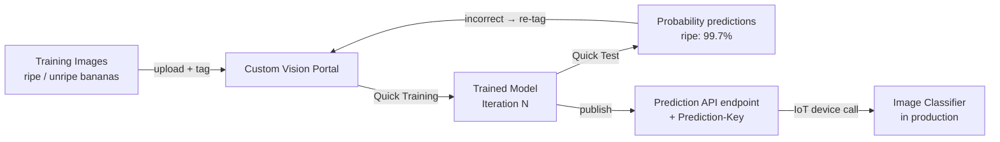

# Lesson 15 — Train a Fruit Quality Detector

## Overview

This lesson introduces how **AI and Machine Learning** are used in IoT manufacturing to sort and inspect produce. It explains the difference between **traditional programming and machine learning**, defines key ML concepts (**training, models, predictions, image classifiers, transfer learning**), and walks through using **Azure Custom Vision** — a cloud-based image classification service — to train a model that can distinguish between ripe and unripe fruit using only a small set of images.

## Concepts

### Using AI and ML to Sort Food

**The evolution of automated produce sorting:**

| Era | Method | Limitation |
|----|--------|------------|
| Hand harvesting | Humans sort during harvest | Labor-intensive (backbreaking work) |
| Machine harvesting | Machinery harvests → human sorting at factory | Cheaper harvest, still costly manual sorting |
| Optical sorting (Gen 1) | Sensors detect colors (e.g., green vs. red tomatoes); actuators push rejects into bins | Only works for obvious color differences |
| AI/ML sorting (Gen 2) | ML models detect subtle differences: disease, bruising, over-ripeness | Handles complex visual patterns |

> [!NOTE]
> Not all crops ripen evenly — e.g., some tomatoes are still green when the majority is ripe. Machines harvest everything; sorting is moved to the factory. Optical color sensors pushed green tomatoes into bins with levers or puffs of air.

**AI sorting advantage:** Detects subtle visual differences that cannot be detected by simple color thresholds, such as disease spots or bruising.

---

### Traditional Programming vs. Machine Learning

**Traditional programming:**
- Input + Algorithm → Output
- Algorithm is defined by the programmer.
- Example: GPS coordinates + geofence algorithm → inside/outside result.

**Machine learning (ML):**
- Input + Known Outputs → Train a model
- The ML algorithm learns the patterns automatically.
- Model: trained algorithm that accepts new input and predicts output.

> [!NOTE]
> **Training** is the process of an ML algorithm learning from data. **Training data** is the set of inputs and their known outputs used during training.

**Example:** Millions of unripe banana pictures labeled `unripe` + millions of ripe banana pictures labeled `ripe` → ML trains a model. Feed a new banana picture → model predicts `ripe` or `unripe`.

> [!NOTE]
> **Predictions** are the outputs of ML models. They are **probabilities**, not binary answers:
> - `ripe: 99.7%`, `unripe: 0.3%`
> - Code picks the highest probability.

---

### Image Classifier

An **image classifier** is an ML model that:
- Is trained on labeled images (each image tagged with a class label)
- Classifies new, unseen images into one of those classes

> [!NOTE]
> This is supervised learning — labels are required for training. Unsupervised learning doesn't require labeled data (not covered here). Refer to [ML for Beginners](https://aka.ms/ML-beginners) for more.

---

### Transfer Learning

Training an image classifier from scratch requires **millions of images**.

**Transfer learning** solves this by:
1. Starting with a model already trained on millions/billions of diverse images.
2. Taking its **internal knowledge** (shapes, colors, patterns → learned feature detectors).
3. Re-training only the final classification layer on a **small number of new images**.

> [!NOTE]
> Like children's shape books: once you can recognize a semicircle, rectangle, and triangle, you can identify a sailboat or a cat depending on configuration. The classifier recognizes shapes → transfer learning teaches it which combination means "ripe banana."

**Result:** Accurate classifiers trained with as few as 5–30 images per class.

---

### Azure Custom Vision

**Custom Vision** is a cloud-based tool for training image classifiers with a small number of images.

**Part of Microsoft Cognitive Services** — a suite of AI tools including speech recognition, translation, language understanding, and image analysis. All available with a free tier.

**Key features:**
- Upload images via web portal, web API, or SDK.
- Tag each image with a classification label.
- Train the model → test it → publish it.
- Published model accessible via web API or SDK.
- Custom Vision can train with as few as **5 images per class** (30+ recommended for better results).

**Free tier (F0):** More than sufficient for creating and training models for development work.

> [!NOTE]
> Training ML models requires large compute power, typically via **GPUs (Graphics Processing Units)** — the same specialized hardware that renders video games. Using cloud services lets you rent GPU time for only as long as you need it.

**Project settings used in this lesson:**
- Project name: `fruit-quality-detector`
- Resource: `fruit-quality-detector-training`
- Project type: **Classification**
- Classification type: **Multiclass** (one label per image)
- Domain: **Food** (a model pre-trained on food images → best for fruit classification)

---

### Model Precision, Recall, and Average Precision (AP)

After training, Custom Vision shows model metrics:
- **Precision**: Of predictions labeled as a class, how many were correct?
- **Recall**: Of all images in a class, how many were found?
- **AP (Average Precision)**: Summary of precision across all threshold values.

---

### Retraining

Every time you run Quick Test, images and predictions are stored. If predictions are wrong, you can:
1. Go to the Predictions tab.
2. Tag the incorrectly predicted images with the correct label.
3. Retrain → creates a new iteration.

Retraining with images the model got wrong improves accuracy over time.

> [!IMPORTANT]
> Train with images that are similar to what the production camera will capture. A model trained on phone photos may perform poorly with low-resolution IoT device camera images. There is a famous example of a cancer classifier that learned to detect rulers (always present in cancerous mole photos) rather than cancer itself.

## Hardware / Setup

**Azure resources:**

1. Create resource group `fruit-quality-detector`.
2. Create Custom Vision training resource (free tier):

```sh
az cognitiveservices account create --name fruit-quality-detector-training \
                                    --resource-group fruit-quality-detector \
                                    --kind CustomVision.Training \
                                    --sku F0 \
                                    --yes \
                                    --location <location>
```

3. Create Custom Vision prediction resource (free tier):

```sh
az cognitiveservices account create --name fruit-quality-detector-prediction \
                                    --resource-group fruit-quality-detector \
                                    --kind CustomVision.Prediction \
                                    --sku F0 \
                                    --yes \
                                    --location <location>
```

> [!NOTE]
> Use `--sku S0` if you already have a free Cognitive Services account.

**Training data requirements:**
- Minimum 5 images per label (30+ recommended).
- Tags: `ripe` and `unripe`.
- Images should be PNG or JPEG, smaller than 6MB.
- The subject should fill most of the frame (images are resized to 227×227 for training).
- Use consistent or varied backgrounds — avoid backgrounds unique to one class.
- Use extra images (not used for training) for testing.

**Image resolution note:** Custom Vision accepts images up to 10240×10240 but trains on 227×227 resolution. The subject must be large in the frame.

## Code Walkthrough

This lesson has no device code. All interactions are through the **Custom Vision web portal** at [CustomVision.ai](https://customvision.ai).

**Workflow:**

```
1. Create project → Set domain to "Food", type to "Classification", "Multiclass"
2. Upload ripe images → Tag as "ripe"
3. Upload unripe images → Tag as "unripe"
4. Train → Quick Training
5. Test → Use Quick Test with unseen images
6. Review metrics (Precision, Recall, AP)
7. Retrain → Tag incorrectly predicted images → Train again
```

**Example predictions:**
```
Unripe banana → ripe: 1.1%, unripe: 98.9%   (correct)
Ripe banana   → ripe: 99.7%, unripe: 0.3%   (correct)
```

## How It Works



## Key Terms

| Term | Definition |
|------|------------|
| Machine learning (ML) | A discipline where algorithms learn from input/output training data rather than following hand-coded rules |
| Training | The process of an ML algorithm learning patterns from a labeled dataset |
| Training data | Input-output pairs used to train an ML model (e.g., banana images labeled ripe or unripe) |
| Model | The output of ML training — a function that takes new input and predicts output |
| Prediction | The output of an ML model for a new input; expressed as probabilities summing to 1 |
| Image classifier | An ML model that assigns class labels to images based on visual features |
| Transfer learning | Reusing a model trained on a large dataset as a starting point for training on a new, smaller dataset |
| Custom Vision | Microsoft Azure's cloud-based tool for training and deploying image classifiers |
| Cognitive Services | Microsoft Azure's suite of pre-built AI services including vision, speech, and language |
| Tag (Custom Vision) | A class label applied to a training image in Custom Vision |
| Quick Training | Custom Vision's fast training mode using transfer learning on the selected domain |
| Domain | The base model used in Custom Vision (e.g., Food, General) — pick the domain closest to your use case |
| Food (compact) | A Custom Vision domain optimized for food images that can be exported for edge deployment |
| Iteration | A version of the trained model in Custom Vision; each training run creates a new iteration |
| Precision | Of all predictions assigned to a class, the fraction that were correct |
| Recall | Of all true examples of a class, the fraction correctly identified |
| AP (Average Precision) | Summary metric averaging precision across all recall thresholds |
| Prediction-Key | A secure API key required to call the Custom Vision prediction endpoint |

## Summary

- IoT devices with cameras + ML classifiers can automate produce quality checking at factories.
- **Traditional programming**: input + algorithm → output. **ML**: input + known output → train a model → model predicts output for new inputs.
- ML predictions are **probabilities**, not binary; pick the highest probability class.
- An **image classifier** is trained on labeled images and classifies new images into labels.
- **Transfer learning**: start from a model trained on millions of images, retrain with a small set (5–30 per class) for a new task.
- **Azure Custom Vision**: cloud tool for training image classifiers; no ML expertise required.
- Project settings: Classification, Multiclass, Food domain, `fruit-quality-detector-training` resource.
- Train images: 5+ per tag (30+ is better); subjects should fill the frame; PNG/JPEG under 6MB.
- Quick Training → view Precision/Recall/AP → Quick Test with unseen images.
- Retrain from incorrectly predicted images in the Predictions tab to improve accuracy.
- Train with images similar to production — phone photos ≠ IoT camera images.
