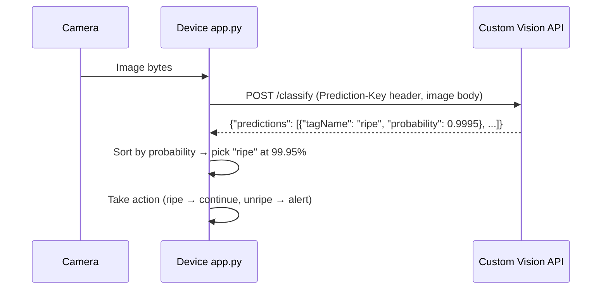

# Lesson 16 — Check Fruit Quality from an IoT Device

## Overview

This lesson covers how to **capture images using a camera sensor** connected to an IoT device and **call the Custom Vision image classifier** from device code. It explains the hardware behind camera sensors (CMOS/APS sensors, lenses, photodiodes), how to publish a model iteration in Custom Vision, and how to send captured images to the Custom Vision prediction REST API. The lesson also covers how to **improve the model** by retraining it with images captured from the IoT device camera (which differ in quality from phone images).

## Concepts

### Camera Sensors

**Camera sensors** capture still images or streaming video for IoT applications.

**Hardware:**
- **Image sensor (APS — Active Pixel Sensor):** A grid of photodiodes. Each pixel is a photodiode that detects the amount of light falling on it.
- **CMOS (Complementary Metal-Oxide Semiconductor):** The most popular type of APS sensor. "CMOS sensor" is often used synonymously with "camera sensor" in IoT/electronics.
- **Lens:** Focuses light from a scene onto the image sensor. Inverts the image — both your eye and the camera sensor flip the image back before you see it.

> [!NOTE]
> Cameras connect to IoT devices using protocols like **SPI** to handle large data transfer (images are much larger than single sensor values like temperature). The camera library handles the communication protocol.

**Camera types for IoT:**
- Small, low-resolution cameras built for microcontrollers
- Higher resolution cameras (camera modules for Raspberry Pi)
- Thermal/infra-red cameras
- UV cameras
- Multi-camera setups with interchangeable lenses

**IoT image size constraints:** Microcontrollers have limited RAM and processing power, which constrains the maximum image resolution and the speed of image capture and transmission.

---

### Model Iterations and Publishing

**Iterations:** Each time you train your Custom Vision model, a new **iteration** is created (Iteration 1, Iteration 2, etc.). This lets you:
- Compare prediction results across iterations using Quick Test.
- Keep a published (production) version while developing the next.

**Publishing an iteration:**
1. Go to **Performance** tab in Custom Vision.
2. Select the latest iteration.
3. Click **Publish** → Set Prediction resource to `fruit-quality-detector-prediction` → Name: `Iteration2`.

After publishing, click **Prediction URL** to get:
- **URL** (for image file upload):
  ```
  https://<location>.api.cognitive.microsoft.com/customvision/v3.0/Prediction/<id>/classify/iterations/Iteration2/image
  ```
- **Prediction-Key**: A secure key that must be sent with every API call.

> [!IMPORTANT]
> Only applications that provide the correct Prediction-Key are allowed to use the model — any call without the key is rejected.

---

### Custom Vision REST API

The prediction API accepts an image as binary POST data:

```
POST https://<location>.api.cognitive.microsoft.com/customvision/v3.0/Prediction/<id>/classify/iterations/<iteration>/image
Content-Type: application/octet-stream
Prediction-Key: <key>

<image binary data>
```

**Response:**
```json
{
    "predictions": [
        {"tagName": "ripe",   "probability": 0.9995},
        {"tagName": "unripe", "probability": 0.0005}
    ]
}
```

---

### Improving the Model for IoT Camera Images

Phone images vs. IoT camera images differ significantly in:
- **Resolution**: IoT cameras are typically much lower resolution.
- **Color/contrast**: IoT cameras have poorer color accuracy and contrast.
- **Lighting**: Factory environments may have inconsistent or artificial lighting.

> [!TIP]
> To get the best results, train the model with images captured from the **same camera and environment** that will be used for predictions. A model trained on iPhone photos may predict poorly for Raspberry Pi camera images.

**Retraining with IoT device images:**
1. Run the device code to classify multiple images.
2. Go to the **Predictions** tab in Custom Vision.
3. Tag incorrectly predicted images with the correct label.
4. Retrain → publish the new iteration.
5. Update the endpoint URL in device code.

---

### Virtual Device: Camera Simulation

For the virtual device, a camera is simulated using CounterFit. Images are read from a local file or from CounterFit's virtual camera sensor. The device code reads the image as bytes and sends it to the Custom Vision API.

## Hardware / Setup

**Raspberry Pi / Virtual Device:**

Install pip packages:
```sh
pip install requests
pip install picamera   # Raspberry Pi only
```

**Virtual device camera:** CounterFit provides a virtual camera sensor. Set it to return a local image file.

**Application settings (environment variables or .env file):**
```
PREDICTION_URL=https://<location>.api.cognitive.microsoft.com/customvision/v3.0/Prediction/<id>/classify/iterations/Iteration2/image
PREDICTION_KEY=<your_prediction_key>
```

## Code Walkthrough

### Capture Image and Classify (Virtual Device / Raspberry Pi)

```python
import os
import requests

PREDICTION_URL = os.environ['PREDICTION_URL']
PREDICTION_KEY = os.environ['PREDICTION_KEY']


def get_image():
    """Read image bytes from the camera or virtual device."""
    # For virtual device - read from a local file
    with open("fruit.jpg", 'rb') as image_file:
        return image_file.read()

    # For Raspberry Pi (picamera):
    # import picamera
    # import io
    # camera = picamera.PiCamera()
    # camera.resolution = (640, 480)
    # stream = io.BytesIO()
    # camera.capture(stream, format='jpeg')
    # stream.seek(0)
    # return stream.read()


def classify_image(image_data):
    """Send image to Custom Vision prediction API."""
    headers = {
        'Content-Type': 'application/octet-stream',
        'Prediction-Key': PREDICTION_KEY
    }
    response = requests.post(PREDICTION_URL, headers=headers, data=image_data)
    results = response.json()

    predictions = results['predictions']
    # Sort by probability descending, get the highest
    best = sorted(predictions, key=lambda p: p['probability'], reverse=True)[0]
    print(f"Prediction: {best['tagName']} ({best['probability']*100:.1f}%)")
    return best['tagName']


# Main loop
image_data = get_image()
label = classify_image(image_data)

if label == 'unripe':
    print("Unripe fruit detected! Alert!")
else:
    print("Fruit is ripe. Continue.")
```

**Code explanation:**

| Line | Explanation |
|------|-------------|
| `PREDICTION_URL` | REST endpoint URL for the published iteration; includes the iteration name (`Iteration2`) |
| `PREDICTION_KEY` | API key required for authentication to the Custom Vision prediction endpoint |
| `open("fruit.jpg", 'rb')` | Opens image file in binary read mode |
| `Content-Type: application/octet-stream` | HTTP header indicating raw binary data is being sent |
| `Prediction-Key` | Custom Vision authentication header |
| `requests.post(url, headers, data)` | POST request with image bytes as the body |
| `results['predictions']` | List of `{tagName, probability}` dicts |
| `sorted(..., key=..., reverse=True)[0]` | Gets the highest-probability prediction |
| `best['tagName']` | The class label with the highest probability |
| `best['probability']` | Float 0.0–1.0 representing confidence |

---

### Expected Output

```output
Prediction: ripe (99.9%)
Fruit is ripe. Continue.
```

or

```output
Prediction: unripe (98.6%)
Unripe fruit detected! Alert!
```

## How It Works

```mermaid
flowchart LR
    Camera[Camera Sensor\nCMOS / virtual] -->|image bytes| DeviceApp[Device app.py]
    DeviceApp -->|POST /classify image bytes| CV[Custom Vision\nPrediction API]
    CV -->|{"predictions": [...]}| DeviceApp
    DeviceApp -->|highest probability label| Decision{Label?}
    Decision -->|ripe| Continue[Continue processing]
    Decision -->|unripe| Alert[Trigger alert / LED]
```



## Key Terms

| Term | Definition |
|------|------------|
| Camera sensor | An electronic sensor that captures still images or video using a grid of photodiodes (APS/CMOS) |
| APS (Active-Pixel Sensor) | A type of image sensor where each pixel is an active electronic circuit (photodiode + transistor) |
| CMOS (Complementary Metal-Oxide Semiconductor) | The dominant type of APS sensor used in cameras; known as "CMOS sensor" in IoT |
| Photodiode | A semiconductor device that converts light into an electrical signal; one per pixel in a camera sensor |
| Lens | An optical element that focuses light from a scene onto the camera's image sensor; inverts the image |
| Model iteration | A specific trained version of a Custom Vision model; created each time training is run |
| Publish (Custom Vision) | Making a model iteration available for external API calls |
| Prediction URL | The REST endpoint for calling a published Custom Vision model iteration |
| Prediction-Key | The API secret key required in the `Prediction-Key` header to authenticate prediction API calls |
| `application/octet-stream` | HTTP content type for raw binary data (used when sending image bytes to the prediction API) |
| `requests.post(url, headers, data)` | Python function to make a POST HTTP request with headers and binary data |
| `results['predictions']` | The list of `{tagName, probability}` objects returned by the Custom Vision prediction API |
| Retraining | The process of adding new training images and running a new training iteration to improve model accuracy |
| Prediction tab | The Custom Vision portal tab showing images submitted via Quick Test, which can be re-tagged and used for retraining |

## Summary

- **Camera sensors** use a grid of photodiodes (APS/CMOS) and a lens to capture images.
- Cameras connect via SPI and use libraries for communication; images are much larger than scalar sensor readings.
- Custom Vision training generates **iterations**; each retraining creates a new iteration.
- **Publish** an iteration to get a Prediction URL and Prediction-Key.
- The prediction API accepts raw image bytes as `application/octet-stream` in a POST request.
- Authentication: `Prediction-Key` header required.
- Response: `predictions` list with `tagName` (label) and `probability` (confidence).
- Pick the highest probability label: `sorted(predictions, key=lambda p: p['probability'], reverse=True)[0]`.
- IoT camera images differ from phone images (lower resolution, different color/contrast) → retrain with images from the IoT device for best results.
- Retraining: classify images with IoT device → tag incorrectly predicted images in Predictions tab → train new iteration → publish → update URL in code.
