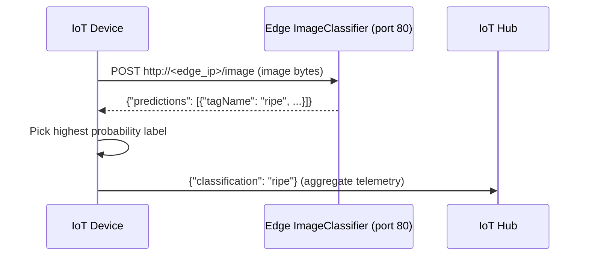

# Lesson 17 — Run Your Fruit Detector on the Edge

## Overview

This lesson covers **edge computing** — processing IoT data on a local network rather than in the cloud. It explains the benefits and drawbacks of edge vs. cloud computing, introduces **Azure IoT Edge** as a service to deploy cloud workloads to edge devices, shows how to **export a Custom Vision model** as a compact Docker container, and walks through deploying it to an IoT Edge device using **Azure Container Registry** and a **deployment manifest**. The edge-deployed classifier is accessed from IoT device code using the same REST API as the cloud version.

## Concepts

### Edge Computing

**Edge computing** moves processing from the cloud to devices on the same local network as the IoT devices — the "edge" of the cloud.

**Architecture without edge:**
```
IoT devices → Internet → Cloud (analysis, AI models)
```

**Architecture with edge:**
```
IoT devices → Edge device (local network, analysis, AI models) → Cloud (if needed)
```

**Example:** Run image classification on an edge device; only send aggregate analytics (e.g., count of ripe vs. unripe fruit) to the cloud.

---

### Upsides of Edge Computing

| Upside | Explanation |
|--------|-------------|
| **Speed** | Internal network is faster and lower latency than internet. Transatlantic internet data takes 28ms+ even at light speed |
| **Remote accessibility** | Works with limited or no internet connectivity (disaster zones, developing nations) |
| **Lower costs** | Reduces cloud service usage; AI accelerator boards (e.g., NVIDIA Jetson Nano, under $100) run AI workloads locally |
| **Privacy and security** | Data stays on your network; not uploaded to cloud; reduces data breach risk. Ideal for medical data and camera footage |
| **Handling insecure devices** | Devices with known vulnerabilities connect to a separate network; the edge device acts as a gateway |
| **Supporting incompatible devices** | Devices that can't connect to IoT Hub (HTTP-only, Bluetooth-only) can be bridged via an edge gateway |

---

### Downsides of Edge Computing

| Downside | Explanation |
|----------|-------------|
| **Scale and flexibility** | Cloud auto-scales; edge requires physically adding more devices |
| **Reliability and resiliency** | Cloud has multi-region redundancy; edge requires large investment for equivalent redundancy |
| **Maintenance** | Cloud providers handle updates and maintenance; edge requires manual management |

> [!TIP]
> For IoT systems, use a **blend of cloud and edge computing** — leverage each based on the needs of the system.

> [!NOTE]
> Some disaster scenarios don't apply to edge. If a factory loses power, the machines generating data are also offline — no need for a backup edge device.

---

### Azure IoT Edge

**Azure IoT Edge** is a service for deploying cloud workloads to edge devices.

**How it works:**
1. Set up a device as an IoT Edge device (registered in IoT Hub with `--edge-enabled`).
2. From the cloud, deploy code to the edge device as **modules**.
3. IoT Edge manages the lifecycle of these modules.

> [!NOTE]
> **Workloads**: any service doing work — AI models, applications, serverless functions.
> **Modules**: software deployed to IoT Edge. Default modules: `edgeAgent` (manages module lifecycle) and `edgeHub` (routes messages). Custom models (e.g., image classifiers) are additional modules.

**Key capability:** Train the image classifier in the cloud → deploy it to the edge device. IoT devices send images to the edge device instead of the internet. Update the model in the cloud → push new version to the edge via IoT Edge.

**IoT Edge runs Linux containers.** Supported platforms: Linux natively; Windows via Linux VMs.

---

### Containers

**Containers** are self-contained, isolated application environments:
- Run like a separate computer inside your computer.
- Have their own software, services, and applications.
- Cannot access the host computer unless you explicitly share things (e.g., folders, ports).
- Expose services via **open ports**.

**Example:** A container runs a web server on port 80 → expose it on the host's port 80 → any browser can connect.

**Docker** is the most popular tool for managing containers. A **DockerFile** is a set of instructions for building a container image.

> [!NOTE]
> Containers are tagged with a name and version (e.g., `classifier:v1`). When updating a container, build the same tag with a higher version.

---

### Custom Vision Compact Models

**Standard models**: Trained in the cloud; called via cloud API.

**Compact models**: Smaller models that can be downloaded and deployed on IoT devices.

To export a compact model:
1. Change domain to **Food (compact)**.
2. Under Export Capabilities: select **Basic platforms (TensorFlow, CoreML, ONNX, ...)**.
3. Retrain with Quick Training.
4. Export as **DockerFile** → choose Linux (x86/AMD64) or ARM (Raspberry Pi 3).
5. Download the ZIP → unzip.

**The downloaded package contains:**
- A DockerFile (build instructions)
- Application code hosting the model and exposing a REST API

**The exported container REST API** is identical to the cloud API — same JSON response format — but no Prediction-Key required (security is handled at the network level).

---

### Azure Container Registry

**Azure Container Registry (ACR)** stores Docker container images in the cloud. IoT Edge downloads modules from the registry.

> [!CAUTION]
> Azure Container Registry is **not free**. Clean up the resource group when done to avoid ongoing charges.

**Setup steps:**

```sh
# Create ACR
az acr create --resource-group fruit-quality-detector \
              --sku Basic \
              --name <registry_name>

# Log in to ACR
az acr login --name <registry_name>

# Enable admin mode (to generate a password)
az acr update --admin-enabled true --name <registry_name>

# Generate password
az acr credential renew --password-name password \
                        --output table \
                        --name <registry_name>
```

---

### Deployment Manifest

The deployment manifest is a JSON file that tells IoT Edge which modules to deploy.

**Key sections:**

| Section | Purpose |
|---------|---------|
| `registryCredentials` | Credentials to pull images from ACR |
| `systemModules` | Built-in `edgeAgent` and `edgeHub` |
| `modules` | Custom modules to deploy (e.g., `ImageClassifier`) |
| `routes` | Message routing between modules and upstream (IoT Hub) |

**ImageClassifier module settings:**
```json
"ImageClassifier": {
    "version": "1.0",
    "type": "docker",
    "status": "running",
    "restartPolicy": "always",
    "settings": {
        "image": "<registry_name>.azurecr.io/classifier:v1",
        "createOptions": "{\"ExposedPorts\": {\"80/tcp\": {}}, \"HostConfig\": {\"PortBindings\": {\"80/tcp\": [{\"HostPort\": \"80\"}]}}}"
    }
}
```

The container exposes port 80 (HTTP). The REST API endpoint becomes `http://<edge_device_ip>/image`.

---

### Verify Edge Deployment

Connect to the IoT Edge device via SSH and run:

```sh
iotedge list
```

Expected output:
```output
NAME             STATUS     CONFIG
ImageClassifier  running    <registry>.azurecr.io/classifier:v1
edgeAgent        running    mcr.microsoft.com/azureiotedge-agent:1.1
edgeHub          running    mcr.microsoft.com/azureiotedge-hub:1.1
```

Check logs:
```sh
iotedge logs ImageClassifier
```

Expected log output:
```output
Loading model...Success!
Loading labels...2 found. Success!
* Serving Flask app "app" (lazy loading)
* Running on http://0.0.0.0:80/
```

---

### Model Retraining Limitation

Edge classifiers are **not connected to the Custom Vision project**. Images classified at the edge are NOT sent to the cloud → they don't appear in the Predictions tab → cannot be used for automatic retraining.

This is intentional — one of the core benefits of edge computing is **privacy** (images don't leave the local network). The tradeoff is that improving the model requires a separate mechanism to collect and upload representative images.

## Hardware / Setup

**Register IoT Edge device:**

```sh
az iot hub device-identity create --edge-enabled \
                                  --device-id fruit-quality-detector-edge \
                                  --hub-name <hub_name>
```

**Get connection string:**

```sh
az iot hub device-identity connection-string show \
    --device-id fruit-quality-detector-edge \
    --output table \
    --hub-name <hub_name>
```

Install IoT Edge runtime:
- **Linux/Raspberry Pi**: `install Azure IoT Edge for Linux` guide.
- **Windows**: IoT Edge in a Linux VM.
- **macOS**: Create a Linux VM in Azure.

## Code Walkthrough

### Build and Push Container

```sh
# Build container (from the directory of the unzipped Custom Vision export)
docker build --platform linux/amd64 -t <registry_name>.azurecr.io/classifier:v1 .

# Push to ACR
docker push <registry_name>.azurecr.io/classifier:v1

# Verify
az acr repository list --output table --name <registry_name>
```

- `--platform linux/amd64` — for x86 Linux / Windows VM.
- `--platform linux/armhf` — for Raspberry Pi.
- Tag format: `<registry>.azurecr.io/<image>:<version>`.

---

### Deploy to IoT Edge

```sh
az iot edge set-modules --device-id fruit-quality-detector-edge \
                        --content deployment.json \
                        --hub-name <hub_name>
```

---

### Test Edge Classifier with curl

```sh
curl --location \
     --request POST 'http://<edge_device_ip>/image' \
     --header 'Content-Type: image/png' \
     --data-binary '@<image_file>'
```

**Response:**
```json
{
    "predictions": [
        {"probability": 0.9995615, "tagName": "ripe"},
        {"probability": 0.0004384, "tagName": "unripe"}
    ]
}
```

> [!NOTE]
> No `Prediction-Key` needed for the edge endpoint. Security is managed at the network level rather than via API keys.

---

### Use Edge Endpoint from Device Code

Update the device code from Lesson 16 to point to the edge device instead of the cloud:

```python
# Previously: Custom Vision cloud endpoint
# PREDICTION_URL = 'https://<location>.api.cognitive.microsoft.com/...'

# Now: IoT Edge device endpoint
PREDICTION_URL = 'http://<edge_device_ip>/image'

# No Prediction-Key needed
headers = {
    'Content-Type': 'application/octet-stream'
    # Remove 'Prediction-Key' header
}
```

The rest of the code (sending image bytes, parsing response) remains the same.

## How It Works

```mermaid
flowchart LR
    CV[Custom Vision\nPortal] -->|export Food compact model| Zip[DockerFile + app code]
    Zip -->|docker build| Image[Container Image]
    Image -->|docker push| ACR[Azure Container Registry]
    ACR -->|deployment manifest| IotEdge[Azure IoT Edge\nfruit-quality-detector-edge]
    IotEdge -->|pull + run| Container[ImageClassifier\nmodule\nport 80]
    Device[IoT Device] -->|POST /image HTTP| Container
    Container -->|JSON predictions| Device
    Device -->|aggregate counts| Hub[IoT Hub]
    Hub -->|analytics| Cloud[Azure cloud analytics]
```





## Key Terms

| Term | Definition |
|------|------------|
| Edge computing | Processing IoT data on devices at the local network level rather than in the cloud |
| Workload | Any service performing computation — AI models, applications, serverless functions |
| Azure IoT Edge | A service to deploy cloud workloads (as modules) to edge devices managed via IoT Hub |
| Module | Software deployed to an IoT Edge device; default modules are `edgeAgent` and `edgeHub` |
| `edgeAgent` | The IoT Edge system module that manages the lifecycle of all other modules |
| `edgeHub` | The IoT Edge system module that routes messages between modules and to IoT Hub |
| Container | An isolated, self-contained application runtime environment with its own software stack |
| DockerFile | A text file with instructions for building a Docker container image |
| Docker | The most popular tool for building and managing containers |
| Container image | A read-only template for creating containers; includes the app code and all dependencies |
| Container registry | A cloud service (like Azure Container Registry) for storing and distributing container images |
| Azure Container Registry (ACR) | Microsoft's cloud service for hosting Docker container images (paid service) |
| Container tag | A name and version label for a container image (e.g., `classifier:v1`) |
| Deployment manifest | A JSON document specifying which modules and container images to deploy to an IoT Edge device |
| `az iot edge set-modules` | CLI command to deploy a deployment manifest to an IoT Edge device |
| `iotedge list` | CLI command run on an edge device to list all running IoT Edge modules |
| Compact model | A smaller Custom Vision model that can be exported and run on an edge device |
| Food (compact) | A Custom Vision domain optimized for food images that supports model export |
| `--platform linux/amd64` | Docker build flag specifying the target architecture (x86-64 Linux or Windows VM) |
| `--platform linux/armhf` | Docker build flag specifying the target architecture (ARM, Raspberry Pi) |
| `--edge-enabled` | Flag in `az iot hub device-identity create` for creating an IoT Edge-capable device registration |

## Summary

- **Edge computing** moves processing from the cloud to the local network, closer to IoT devices.
- **Upsides**: Speed, offline operation, lower cost, privacy, gateway for incompatible devices.
- **Downsides**: Cannot auto-scale, less redundancy, requires manual maintenance.
- **Azure IoT Edge**: deploy code as **modules** to edge devices registered in IoT Hub.
- **Modules**: Docker containers. Default: `edgeAgent` + `edgeHub`. Custom: `ImageClassifier`.
- To export a compact model: Custom Vision → Settings → Domain: **Food (compact)** → Retrain → Export as **DockerFile** (Linux or ARM).
- Build container: `docker build --platform <arch> -t <registry>.azurecr.io/classifier:v1 .`
- Push to ACR: `docker push <registry>.azurecr.io/classifier:v1`
- Deploy: `az iot edge set-modules --content deployment.json --hub-name <hub>`
- Verify on device: `iotedge list` → `iotedge logs ImageClassifier`
- Edge REST API: `POST http://<edge_ip>/image` with image bytes — no Prediction-Key needed.
- Edge classifiers don't send images to Custom Vision → images don't appear in Predictions tab → manual retraining workflow needed.
- Privacy tradeoff: images never leave the local network = no automatic cloud-based retraining.
