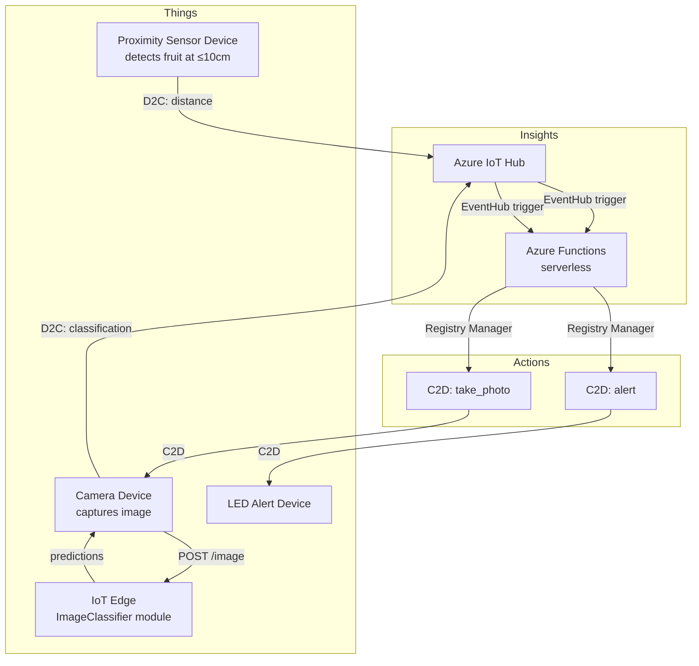

# Lesson 18 — Trigger Fruit Quality Detection from a Sensor

## Overview

This final Manufacturing lesson presents the **reference IoT architecture** (Things → Insights → Actions), shows how to design a complex IoT application for fruit quality control in a processing plant, explains how **proximity sensors** detect fruit on a conveyer belt to trigger image classification, discusses **data design considerations** (message structure, unit consistency, where decisions should be made), and covers architectural patterns for simulating multiple IoT devices. The lesson also discusses what changes when moving from a prototype to a production system.

## Concepts

### Reference IoT Architecture: Things, Insights, Actions

IoT applications can be described as three interconnected layers:

| Layer | Description | Examples from This Course |
|-------|-------------|--------------------------|
| **Things** | Devices that gather data from sensors; may use edge services to interpret data | GPS sensors, soil moisture sensors, cameras, proximity sensors, IoT Hub |
| **Insights** | Analysis and decision-making from device data; sometimes augmented with external data | Azure Functions processing telemetry, AI model predictions, analytics on stored data |
| **Actions** | Commands to devices, or visualization | Sending relay commands, LED alerts, Azure Maps visualization, watering system triggers |

> [!NOTE]
> **Reference architecture**: A template architecture you can use as a starting point when designing new systems, substituting your own devices and services where appropriate. Not a rigid prescription.

**Example (engine monitoring):**
- **Thing**: Engine sending temperature data.
- **Insight**: Evaluate if the engine is overheating.
- **Action**: Proactively schedule maintenance.

---

### Data and Security Considerations

When designing an IoT architecture:

- **What data does the device send?** Define message schemas before building.
- **How is data secured?** Transmission security (TLS), stored data security, access control.
- **Who can access the device and cloud services?** Authentication and authorization.

> [!IMPORTANT]
> Defining message schemas up front avoids costly bugs. Famous example: the $125M Mars Climate Orbiter crashed because one team used metric units and another used imperial units.

**Schema consistency questions:**
- Use `temperature` or `temp` in the JSON field name?
- °C or °F? (Keep cloud-facing units consistent regardless of display settings.)
- Is the decision made on the device or in the cloud?

---

### Fruit Quality Control System Design

**Scenario:** A fruit processing plant currently uses employees to manually sort unripe fruit from a conveyer belt. The goal is full automation.

**Application layers:**

| Layer | Components |
|-------|-----------|
| **Things** | Proximity sensor (detects fruit) + camera device (photographs fruit) + edge device (runs classifier) + LED device (alerts unripe) |
| **Insights** | Serverless app decides whether to trigger classification; stores results; determines if unripe alert is needed |
| **Actions** | Command to camera device → capture image; command to LED device → alert |

**Message flow:**

```mermaid
sequenceDiagram
    participant Prox as Proximity Sensor Device
    participant Hub as IoT Hub
    participant Fn as Azure Functions (serverless)
    participant Cam as Camera Device (edge classifier)
    participant LED as LED Alert Device

    Prox->>Hub: {"distance": 5}  (fruit detected)
    Hub->>Fn: EventHub trigger
    Fn->>Hub: C2D command → camera device
    Hub->>Cam: "take photo and classify"
    Cam->>Edge: POST /image
    Edge-->>Cam: {"predictions": [{"tagName": "unripe", ...}]}
    Cam->>Hub: {"classification": "unripe"}
    Hub->>Fn: EventHub trigger
    Fn->>Fn: Store result; determine alert needed
    Fn->>Hub: C2D command → LED device
    Hub->>LED: "turn on LED"
```

> [!NOTE]
> This entire application could be implemented as a single device with all logic built-in, using IoT Hub only for data storage and configuration. The multi-device design here is intended to demonstrate concepts for large-scale IoT applications.

---

### Proximity Sensors

**Proximity sensors** measure the distance from the sensor to an object by:
1. Transmitting electromagnetic radiation (laser beam, IR light, ultrasonic pulse).
2. Detecting the radiation reflected off an object.
3. Calculating distance from the time between transmission and reception (time-of-flight).

> [!NOTE]
> Smartphones use proximity sensors to turn off the screen when held to your ear — detects an object near the screen during a call to disable touch input.

**In the fruit detector:**
- A proximity sensor on the conveyer belt detects when a piece of fruit is in position.
- Triggers the image capture and classification.

**Configuration decision — where is the threshold decision made?**

| Option | Pros | Cons |
|--------|------|------|
| **Decision on the cloud (IoT Hub/Function)** | Threshold can be adjusted without changing device firmware | More messages sent → higher cost; more bandwidth |
| **Decision on the device** | Fewer messages; faster response | Requires a mechanism to configure the threshold remotely (e.g., device twin) |

> [!TIP]
> If the decision is made in the cloud, you send many distance measurements. If made on the device, use a **device twin** to push configuration (threshold distance) to the device remotely. The right choice depends on your specific use case, cost constraints, and configuration needs.

---

### Data Message Structure

For the fruit quality detector, messages include:

**Proximity telemetry (device → IoT Hub):**
```json
{ "distance": 5 }
```

**Camera result telemetry (device → IoT Hub):**
```json
{ "classification": "unripe" }
```

**Command to camera (IoT Hub → device):**
```json
{ "command": "take_photo" }
```

**Command to LED (IoT Hub → device):**
```json
{ "command": "alert" }
```

---

### Simulating Multiple IoT Devices

**Raspberry Pi / Virtual Device (single board computers):**
- Can run multiple Python files simultaneously in different terminal sessions.
- Each file = one simulated "IoT device."
- Each connects to IoT Hub with its own device connection string.

> [!CAUTION]
> Some hardware cannot be accessed by multiple applications at the same time (e.g., a camera or GPIO pin). Plan which device owns which hardware.

**Microcontrollers (e.g., Wio Terminal):**
- Can only run one application at a time — all "device" logic must be in one program.

**Patterns for microcontrollers:**
- Create one class per logical device: `DistanceSensor`, `ClassifierCamera`, `LEDController`.
- Each class has its own `setup()` and `loop()` methods.
- Main `loop()` calls all device loops; use a counter for different polling intervals:
  - If device A runs every 1s and device B runs every 10s → use 1s delay → increment counter → call device B when counter reaches 10.

---

### Moving to Production

The prototype differs from a production system in several ways:

| Prototype | Production |
|-----------|------------|
| Developer kit hardware | Ruggedized components (withstand noise, heat, vibration, factory stress) |
| Direct internet/cloud for all messages | Internal communications; only aggregate data goes to cloud; some processing on a gateway edge device |
| Hard-coded configuration values | Configurable via device twin (e.g., distance threshold for proximity sensor) |
| LED alert | Automated actuator to physically remove unripe fruit |

> [!NOTE]
> **Device twin**: A JSON document in Azure IoT Hub associated with each device, containing desired and reported state. The cloud can push configuration changes to the device without manual firmware updates.
> **OPC-UA**: Machine-to-machine communication protocol used in industrial automation — relevant for factory floor device integration.

## Hardware / Setup

**Virtual device proximity sensor:** CounterFit provides a virtual distance sensor that returns a simulated distance value. Configure to return values representing "fruit present" (small distance) vs. "no fruit" (large distance).

**Install pip packages:**
```sh
pip install azure-iot-device
```

**Multiple device simulation (virtual):**

Run three separate Python files in three terminal sessions:
- `proximity_device.py` — monitors distance sensor, sends telemetry to IoT Hub.
- `camera_device.py` — receives command from IoT Hub, captures image, calls edge classifier, sends result.
- `led_device.py` — receives command from IoT Hub, turns LED on/off.

Each uses a different device connection string registered in IoT Hub.

## Code Walkthrough

### Proximity Sensor Device (`proximity_device.py`)

```python
import time
import json
from azure.iot.device import IoTHubDeviceClient, Message

CONNECTION_STRING = "<proximity_device_connection_string>"
DISTANCE_THRESHOLD = 10  # cm — fruit is detected if distance <= 10cm

client = IoTHubDeviceClient.create_from_connection_string(CONNECTION_STRING)

while True:
    distance = read_distance()  # Read from CounterFit or real sensor

    if distance <= DISTANCE_THRESHOLD:
        message = Message(json.dumps({"distance": distance}))
        client.send_message(message)
        print(f"Fruit detected! Distance: {distance}cm. Telemetry sent.")

    time.sleep(1)
```

**Code explanation:**

| Line | Explanation |
|------|-------------|
| `DISTANCE_THRESHOLD` | Distance in cm below which a piece of fruit is considered detected |
| `read_distance()` | Platform-specific function to read the proximity sensor value |
| `distance <= DISTANCE_THRESHOLD` | Decision made on the device (vs. sending all readings to the cloud) |
| `send_message(message)` | D2C telemetry sent to IoT Hub |

---

### Azure Function: Respond to Proximity and Send Camera Command

```python
import json
import os
import azure.functions as func
from azure.iot.hub import IoTHubRegistryManager

IOT_HUB_CONNECTION_STRING = os.environ['IOT_HUB_CONNECTION_STRING']
CAMERA_DEVICE_ID = 'camera-device'


def main(event: func.EventHubEvent):
    event_body = json.loads(event.get_body().decode('utf-8'))

    if 'distance' in event_body:
        # Fruit detected → send command to camera device
        registry_manager = IoTHubRegistryManager(IOT_HUB_CONNECTION_STRING)
        registry_manager.send_c2d_message(
            CAMERA_DEVICE_ID,
            json.dumps({"command": "take_photo"}),
            properties={}
        )
        print(f"Sent take_photo command to {CAMERA_DEVICE_ID}")

    elif 'classification' in event_body:
        classification = event_body['classification']
        print(f"Classification received: {classification}")

        if classification == 'unripe':
            # Send alert command to LED device
            registry_manager = IoTHubRegistryManager(IOT_HUB_CONNECTION_STRING)
            registry_manager.send_c2d_message(
                'led-device',
                json.dumps({"command": "alert"}),
                properties={}
            )
```

---

### Camera Device (`camera_device.py`)

```python
import json
import requests
from azure.iot.device import IoTHubDeviceClient, Message

CONNECTION_STRING = "<camera_device_connection_string>"
EDGE_CLASSIFIER_URL = 'http://<edge_device_ip>/image'

client = IoTHubDeviceClient.create_from_connection_string(CONNECTION_STRING)


def message_received_handler(message):
    payload = json.loads(message.data)
    if payload.get('command') == 'take_photo':
        print("Command received: take photo")
        image_data = capture_image()  # Platform-specific

        # Call edge classifier
        response = requests.post(EDGE_CLASSIFIER_URL,
                                 headers={'Content-Type': 'application/octet-stream'},
                                 data=image_data)
        result = response.json()

        best = sorted(result['predictions'],
                      key=lambda p: p['probability'],
                      reverse=True)[0]
        label = best['tagName']

        # Send classification result to IoT Hub
        client.send_message(Message(json.dumps({"classification": label})))
        print(f"Classification: {label}")


client.on_message_received = message_received_handler
client.connect()

import time
while True:
    time.sleep(1)
```

---

### LED Alert Device (`led_device.py`)

```python
import json
from azure.iot.device import IoTHubDeviceClient

CONNECTION_STRING = "<led_device_connection_string>"
client = IoTHubDeviceClient.create_from_connection_string(CONNECTION_STRING)


def message_received_handler(message):
    payload = json.loads(message.data)
    if payload.get('command') == 'alert':
        print("Unripe fruit! Turning on LED alert.")
        set_led(True)  # Platform-specific LED control


client.on_message_received = message_received_handler
client.connect()

import time
while True:
    time.sleep(1)
```

## How It Works



## Key Terms

| Term | Definition |
|------|------------|
| Reference IoT architecture | A template architecture organizing IoT systems into Things, Insights, and Actions |
| Things | IoT devices that gather data from sensors and interact with edge services |
| Insights | Analysis layer producing decisions from device data; serverless functions, AI models, analytics |
| Actions | Commands to devices, alerts, or visualizations based on insights |
| Proximity sensor | A sensor that measures distance to an object using electromagnetic radiation (laser, IR, ultrasonic) |
| Time-of-flight | The technique proximity sensors use: measure the time between emitting and receiving a reflected signal to calculate distance |
| Device twin | A JSON document in IoT Hub representing desired and reported state for a device; used to push configuration remotely |
| Message schema | The defined structure and field names for messages exchanged between devices and services |
| Threshold | A configured value (e.g., distance ≤ 10cm) that triggers an action |
| C2D (Cloud-to-Device) | Messages sent from IoT Hub to a device (commands, configuration) |
| D2C (Device-to-Cloud) | Messages sent from a device to IoT Hub (telemetry, status) |
| `IoTHubRegistryManager` | Azure SDK class for sending C2D messages and interacting with device identities in IoT Hub |
| `client.on_message_received` | Python SDK property for setting a callback function that handles incoming C2D messages |
| OPC-UA | Machine-to-machine communication protocol used in industrial automation for factory floor device integration |
| Ruggedized | Hardware designed to withstand harsh industrial conditions (noise, heat, vibration, stress) |
| Gateway device | An edge device that bridges incompatible or insecure IoT devices to a wider network or IoT Hub |
| Production vs. prototype | Production uses ruggedized hardware, internal communications, configurable thresholds (device twin), automated actuators; prototype uses developer kits with direct cloud connections |

## Summary

- IoT architecture: **Things** (sensors/devices) → **Insights** (cloud/edge analysis) → **Actions** (commands/visualization).
- The fruit quality detector prototype: proximity sensor detects fruit → cloud sends camera command → camera calls edge classifier → cloud decides alert → LED turns on.
- Define message schemas before building to avoid mismatched data bugs (like the Mars Climate Orbiter unit mismatch that caused a $125M failure).
- **Proximity sensors** measure distance using electromagnetic radiation time-of-flight.
- Decision on device vs. cloud: device-side decisions reduce messages (lower cost) but require remote configuration via **device twins**; cloud-side decisions increase messages but allow easy threshold adjustment.
- Simulating multiple devices on SBCs: run separate Python files in separate terminals, each with its own connection string.
- Simulating multiple devices on microcontrollers: one app with multiple classes (`DistanceSensor`, `ClassifierCamera`, `LEDController`), use a loop counter for different polling rates.
- Production differences: ruggedized hardware, internal comms (edge gateway), configurable via device twins, automated actuators instead of LEDs.
- Clean up: `az group delete --name fruit-quality-detector` after completing this project.
