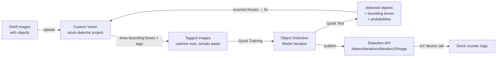

# Lesson 19 — Train a Stock Detector

## Overview

This lesson introduces **object detection** as distinct from image classification. While an image classifier predicts a single label for the whole image, an object detector **locates and counts multiple specific objects** within an image, returning bounding boxes and per-object probabilities. The lesson covers how to train a Custom Vision **object detector** on retail shelf images using the **Products on Shelves** domain and how to retrain it for better performance.

## Concepts

### Object Detection vs. Image Classification

| Feature | Image Classification | Object Detection |
|---------|---------------------|-----------------|
| Input | Entire image | Entire image |
| Output | List of (tag, probability) pairs for the image as a whole | List of (tag, probability, bounding box) per detected object |
| Handles multiple objects? | No (one label per image) | Yes (one result per detected object) |
| Tells you *where*? | No | Yes (bounding box coordinates) |
| Training data | Images tagged with class labels | Images with drawn bounding boxes per object |

**Image classification example:** Image of cashew nuts → `cashew nuts: 98.4%`, `tomato paste: 1.6%`.

**Object detection example:** Image with cashew nuts and 3 cans of tomato paste →
- Cashew nuts: bounding box at [top, left, height, width], probability 97.6%
- Tomato paste (can 1): bounding box, probability 86.3%
- Tomato paste (can 2): bounding box, probability 72.1%
- Tomato paste (can 3): bounding box, probability 68.5%

> [!NOTE]
> **Bounding box**: The rectangular region drawn around a detected object in an image. This allows counting objects and knowing their location within the image.

---

### How Object Detection Works

Object detection works by dividing the image into multiple cells, then checking whether the center of a potential bounding box matches a trained object's appearance — similar to running image classification over many sub-regions of the image.

> [!NOTE]
> This is a simplification. Many techniques exist (see the [Object detection Wikipedia page](https://wikipedia.org/wiki/Object_detection)).

**Famous object detection model:** YOLO (You Only Look Once) — very fast, can detect 20 classes of objects (people, dogs, bottles, cars) in real-time. Object detection models can be retrained using **transfer learning** to detect custom objects.

---

### Object Detection in Retail

**Use cases:**

| Use Case | Description |
|----------|------------|
| **Stock checking and counting** | Detect when shelves are low on stock; notify staff or robots to restock |
| **Mask detection** | Detect people with/without masks during public health events |
| **Automated billing** | Detect items picked off shelves in cashierless stores; bill customers automatically |
| **Hazard detection** | Detect broken items or spilled liquids; alert cleaning crews |
| **Wrong stock detection** | Detect items placed in the wrong location; alert humans or robots |

**Example:** A camera above a shelf holds 8 cans of tomato paste. Object detector detects only 7 → sends restock notification with location of missing item (useful for robotic restocking).

> [!NOTE]
> Restocking algorithms need to consider product type, popularity, and store policy — a single missing can may not trigger restocking immediately.

**Wrong stock scenario:** A customer places baby corn on the tomato paste shelf. Object detector sees an unexpected `baby corn` tag → alerts staff/robot to return it. Especially critical for perishable/frozen items that cannot be sold if left out too long.

---

### Azure Custom Vision — Object Detector

Custom Vision supports **object detection** projects in addition to image classification.

**Project settings for this lesson:**
- Project name: `stock-detector`
- Resource: `stock-detector-training`
- Project type: **Object Detection**
- Domain: **Products on Shelves** (specifically tuned for retail shelf stock detection)

**Training requirements:**
- Minimum **15 images** per object type (more is better).
- Images with multiple different objects count toward the 15-image minimum for all objects in that image.
- Draw tight bounding boxes around each object in every image.
- Images should show objects **as if on store shelves** (matches the Products on Shelves domain).

**Suggested tags feature:** After training 15+ images, use **Suggested Tags** — the partially trained model auto-suggests bounding boxes for untagged images. Confirm or correct suggestions to speed up tagging.

---

### Model Metrics for Object Detection

After training, Custom Vision shows:
- **Precision**: Of all bounding boxes predicted for a tag, what fraction was correct?
- **Recall**: Of all true objects, what fraction was correctly detected?
- **mAP (mean Average Precision)**: A single summary metric averaging AP across all object classes and IoU thresholds.

---

### Retraining the Object Detector

Retraining object detection models is more complex than retraining classifiers:

1. Go to **Predictions** tab → Select an image.
2. Review each red bounding box:
   - **Correct box, correct tag**: Accept as-is.
   - **Box in wrong location**: Use corner handles to adjust.
   - **Wrong tag**: Remove with X, add correct tag.
   - **No actual object**: Delete with trash icon.
3. Close the editor → Image moves to **Training Images** tab.
4. Repeat for all predictions → Re-train → Publish new iteration.

## Hardware / Setup

**Azure resources:**

```sh
# Create resource group
az group create --name stock-detector --location <location>

# Training resource
az cognitiveservices account create --name stock-detector-training \
                                    --resource-group stock-detector \
                                    --kind CustomVision.Training \
                                    --sku F0 \
                                    --yes \
                                    --location <location>

# Prediction resource
az cognitiveservices account create --name stock-detector-prediction \
                                    --resource-group stock-detector \
                                    --kind CustomVision.Prediction \
                                    --sku F0 \
                                    --yes \
                                    --location <location>
```

> [!NOTE]
> You can only have one free (F0) Custom Vision Training and Prediction resource at a time. Clean up the `fruit-quality-detector` resource group before creating these if you used F0 in Project 4.

**Training data:**
- 15+ images per object, PNG/JPEG under 6MB.
- Show objects on a shelf.
- Draw tight bounding boxes around each item in each image.
- Include test images (unseen during training) with multiple objects.
- Example images provided in the course: `images/` folder (cashew nuts, tomato paste).

## Code Walkthrough

This lesson has **no device code** — all work is done in the Custom Vision web portal at [CustomVision.ai](https://customvision.ai).

**Workflow:**

```
1. Create project → Object Detection, Products on Shelves domain
2. Upload shelf images
3. Draw bounding boxes around each item → assign tags (e.g., "cashew nuts", "tomato paste")
4. Train → Quick Training
5. Quick Test with unseen images → observe bounding boxes and probabilities
6. Review metrics (Precision, Recall, mAP)
7. Retrain → confirm/fix bounding boxes in Predictions tab → Train new iteration
```

**Expected Quick Test results:**

```
Detected: cashew nuts   97.6%  bounding box: {top:0.1, left:0.05, height:0.3, width:0.4}
Detected: tomato paste  86.3%  bounding box: {top:0.2, left:0.5, height:0.4, width:0.2}
Detected: tomato paste  72.1%  bounding box: {top:0.2, left:0.7, height:0.4, width:0.2}
Detected: tomato paste  68.5%  bounding box: {top:0.2, left:0.9, height:0.4, width:0.2}
```

## How It Works



## Key Terms

| Term | Definition |
|------|------------|
| Object detection | An AI technique that locates and labels one or more specific objects within an image, returning bounding boxes and per-object probabilities |
| Image classification | An AI technique that assigns class labels and probabilities to an entire image |
| Bounding box | A rectangular region in an image that contains a detected object, defined by top, left, height, and width as fractions of image dimensions (0–1 scale) |
| Tag (object detection) | The class label for a specific object annotated in a training image by drawing a bounding box |
| Products on Shelves | A Custom Vision domain optimized for detecting retail products displayed on store shelves |
| YOLO (You Only Look Once) | A fast, popular object detection model capable of detecting 20 object classes in real-time |
| mAP (mean Average Precision) | A summary evaluation metric for object detection models averaging AP across all classes and IoU thresholds |
| Suggested tags | Custom Vision feature that uses a partially trained model to auto-suggest bounding boxes on untagged images |
| IoU (Intersection over Union) | A metric comparing the overlap between a predicted bounding box and the ground truth box |
| Transfer learning | Reusing a pre-trained model as a starting point to train on new custom objects |
| Precision (object detection) | Of all predicted bounding boxes for a tag, the fraction that correctly detected a real object |
| Recall (object detection) | Of all real objects of a tag, the fraction correctly detected by the model |
| Wrong stock detection | Using object detection to identify items placed in incorrect shelf locations |
| Tight bounding box | A bounding box drawn as close as possible to the edges of the object, avoiding excess background |

## Summary

- **Object detection** detects and locates multiple specific objects in an image, returning bounding boxes + per-object probabilities.
- **Image classification** classifies the whole image; doesn't work for counting or locating individual objects.
- Training: draw **bounding boxes** around each object in each image, assign a tag → at least 15 images per tag.
- Custom Vision project: **Object Detection** type, **Products on Shelves** domain.
- **Suggested tags**: after 15+ images, the model auto-suggests bounding boxes on remaining images.
- **mAP** (mean Average Precision): summary metric for object detection quality.
- Retraining requires reviewing each bounding box: confirm, resize, retag, or delete.
- Use cases in retail: stock counting, mask detection, automated billing, hazard detection, wrong stock location.
- Example: 8-can shelf → detector finds 7 → sends restock notification with missing item location.
- Wrong stock: detect unexpected items (e.g., baby corn on tomato paste shelf) → alert for immediate correction.
