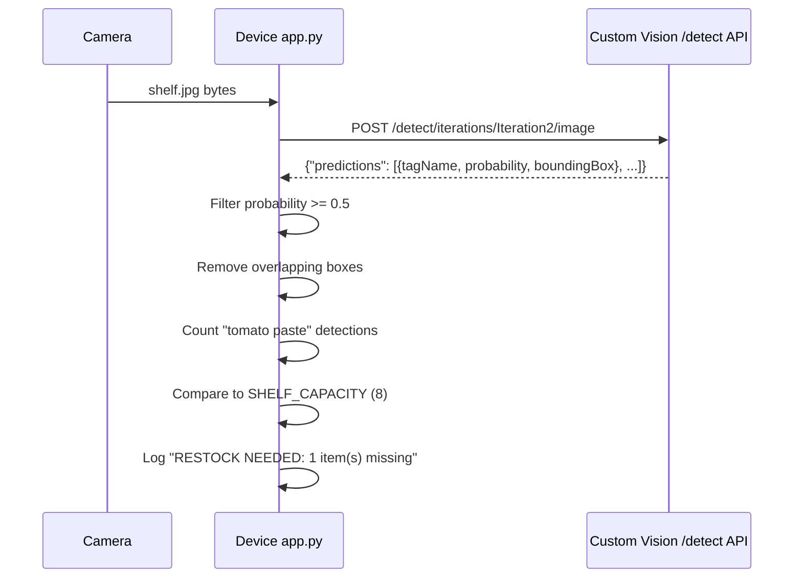

# Lesson 20 — Check Stock from an IoT Device

## Overview

This final Retail lesson shows how to **call the trained object detector from an IoT device** to count items on a shelf. It covers how to publish the object detector iteration, how to send an image to the `/detect` API endpoint, how to interpret **bounding boxes** (coordinates on a 0–1 normalized scale), how to use overlap detection to filter false positives, and how to build a complete **stock counting** system. The lesson also covers retraining the model using IoT device camera images.

## Concepts

### Stock Counting with Object Detection

**Use case:** A camera on a store shelf points at a section that can hold N items. The object detector counts how many items are currently visible. If the count is below a threshold → send a restock notification.

**Example:** Shelf capacity = 8 cans. Detector finds 7 → send notification: "1 can missing from [bounding box location]."

> [!TIP]
> Bounding box location data is useful for **robotic restocking** — the robot can target the exact empty slot on the shelf.

**Wrong stock detection:** Run the detector on a shelf → if a tag appears that doesn't belong in that section (e.g., baby corn on the tomato paste shelf) → send alert to return the item.

> [!NOTE]
> Restocking thresholds depend on the product, customer traffic, and store policy. A single missing can might not warrant immediate restocking.

---

### Bounding Boxes

**Bounding boxes** define the location of each detected object in the image.

**Format:** 4 values, all on a **normalized 0–1 scale** (as a fraction of image dimensions):
- `top`: distance from the top of the image to the top edge of the bounding box.
- `left`: distance from the left of the image to the left edge of the bounding box.
- `height`: height of the bounding box (top + height = bottom edge).
- `width`: width of the bounding box (left + width = right edge).

**Example calculation (600px wide × 800px tall image):**

| Coordinate | Pixels | Normalized (0–1) |
|-----------|--------|-----------------|
| Top | 320px | 320/800 = **0.4** |
| Left | 240px | 240/600 = **0.4** |
| Height | 240px | 240/800 = **0.3** |
| Width | 120px | 120/600 = **0.2** |

> [!TIP]
> The normalized scale means bounding box coordinates work regardless of the image resolution or scaling.

---

### Handling Overlapping Bounding Boxes

An object detector can sometimes produce **overlapping bounding boxes** — two predictions for the same physical object, one inside the other.

**Example:** Detection 1: `tomato paste, 78.3%`, bounding box [0.2, 0.4, 0.3, 0.2]. Detection 2: `tomato paste, 64.3%`, bounding box [0.21, 0.41, 0.28, 0.19] (fully inside Detection 1).

It is impossible for one can to be inside another → the lower-probability detection is a false positive.

**Filter strategy:** If two bounding boxes for the same tag have significant overlap (one is mostly inside the other), discard the lower-probability one.

```python
def boxes_overlap(box1, box2, threshold=0.8):
    """Returns True if box2 is significantly inside box1."""
    # box: {top, left, height, width}
    # Check if box2 is mostly contained within box1
    b1_bottom = box1['top'] + box1['height']
    b1_right  = box1['left'] + box1['width']
    b2_bottom = box2['top'] + box2['height']
    b2_right  = box2['left'] + box2['width']

    # Intersection
    inter_top    = max(box1['top'], box2['top'])
    inter_left   = max(box1['left'], box2['left'])
    inter_bottom = min(b1_bottom, b2_bottom)
    inter_right  = min(b1_right, b2_right)

    if inter_bottom <= inter_top or inter_right <= inter_left:
        return False  # No overlap

    inter_area = (inter_bottom - inter_top) * (inter_right - inter_left)
    box2_area  = box2['height'] * box2['width']

    return inter_area / box2_area > threshold
```

---

### Object Detection API Response

The Custom Vision object detection API returns:

```json
{
    "predictions": [
        {
            "tagName": "tomato paste",
            "probability": 0.863,
            "boundingBox": {
                "left": 0.04,
                "top": 0.12,
                "width": 0.14,
                "height": 0.55
            }
        },
        {
            "tagName": "tomato paste",
            "probability": 0.712,
            "boundingBox": {
                "left": 0.22,
                "top": 0.10,
                "width": 0.13,
                "height": 0.53
            }
        }
    ]
}
```

**Difference from classifier API:**
- Classifier: `/classify/iterations/<iteration>/image`
- Object detector: `/detect/iterations/<iteration>/image`
- Each prediction has a `boundingBox` field (in addition to `tagName` and `probability`).

---

### Probability Threshold for Counting

Not all predictions are reliable. Apply a **probability threshold** (e.g., 0.5 = 50%) to filter out low-confidence detections before counting:

```python
PROBABILITY_THRESHOLD = 0.5

reliable_predictions = [
    p for p in predictions
    if p['probability'] >= PROBABILITY_THRESHOLD
]
```

## Hardware / Setup

**Publish the object detector:**
1. Custom Vision portal → `stock-detector` project → **Performance** tab.
2. Latest iteration → **Publish** → set prediction resource to `stock-detector-prediction`.
3. Click **Prediction URL** → copy URL (format: `.../detect/iterations/Iteration2/image`) and Prediction-Key.

**Install pip packages:**
```sh
pip install requests
```

**Environment variables:**
```
PREDICTION_URL=https://<location>.api.cognitive.microsoft.com/customvision/v3.0/Prediction/<id>/detect/iterations/Iteration2/image
PREDICTION_KEY=<key>
```

## Code Walkthrough

### Call the Object Detector and Count Stock

```python
import os
import requests
import json

PREDICTION_URL = os.environ['PREDICTION_URL']
PREDICTION_KEY = os.environ['PREDICTION_KEY']
PROBABILITY_THRESHOLD = 0.5
SHELF_CAPACITY = 8  # Expected max number of items on the shelf

STOCK_TAG = 'tomato paste'  # The item to count


def get_image():
    """Capture image from camera or virtual device."""
    with open("shelf.jpg", 'rb') as f:
        return f.read()


def detect_stock(image_data):
    """Send image to Custom Vision object detection API."""
    headers = {
        'Content-Type': 'application/octet-stream',
        'Prediction-Key': PREDICTION_KEY
    }
    response = requests.post(PREDICTION_URL, headers=headers, data=image_data)
    return response.json()['predictions']


def filter_predictions(predictions):
    """Apply probability threshold and deduplicate overlapping boxes."""
    # Step 1: Apply probability threshold
    reliable = [p for p in predictions if p['probability'] >= PROBABILITY_THRESHOLD]

    # Step 2: Sort by probability descending
    reliable.sort(key=lambda p: p['probability'], reverse=True)

    # Step 3: Remove overlapping duplicates
    filtered = []
    for pred in reliable:
        is_duplicate = False
        for existing in filtered:
            if existing['tagName'] == pred['tagName']:
                if boxes_overlap(existing['boundingBox'], pred['boundingBox']):
                    is_duplicate = True
                    break
        if not is_duplicate:
            filtered.append(pred)

    return filtered


def boxes_overlap(box1, box2, threshold=0.8):
    """Returns True if box2 is mostly contained within box1."""
    b1_bottom = box1['top'] + box1['height']
    b1_right  = box1['left'] + box1['width']
    b2_bottom = box2['top'] + box2['height']
    b2_right  = box2['left'] + box2['width']

    inter_top    = max(box1['top'], box2['top'])
    inter_left   = max(box1['left'], box2['left'])
    inter_bottom = min(b1_bottom, b2_bottom)
    inter_right  = min(b1_right, b2_right)

    if inter_bottom <= inter_top or inter_right <= inter_left:
        return False

    inter_area = (inter_bottom - inter_top) * (inter_right - inter_left)
    box2_area  = box2['height'] * box2['width']

    return inter_area / box2_area > threshold


def count_stock(predictions):
    """Count specific tag and report stock status."""
    stock_items = [p for p in predictions if p['tagName'] == STOCK_TAG]
    count = len(stock_items)
    print(f"Detected {count} {STOCK_TAG} items on shelf (capacity: {SHELF_CAPACITY})")

    if count < SHELF_CAPACITY:
        missing = SHELF_CAPACITY - count
        print(f"RESTOCK NEEDED: {missing} item(s) missing")
    else:
        print("Shelf is fully stocked.")

    return count


# --- Main ---
image_data = get_image()
raw_predictions = detect_stock(image_data)
filtered = filter_predictions(raw_predictions)
count = count_stock(filtered)
```

**Code explanation:**

| Function / Line | Explanation |
|-----------------|-------------|
| `PROBABILITY_THRESHOLD = 0.5` | Discard detections below 50% confidence |
| `SHELF_CAPACITY = 8` | The expected number of items when shelf is full |
| `STOCK_TAG = 'tomato paste'` | The specific object tag to count |
| `Content-Type: application/octet-stream` | Send image as raw binary |
| `Prediction-Key` header | Authentication key for Custom Vision |
| `/detect/` in URL | Distinguishes object detection from classification (`/classify/`) |
| `filter_predictions()` | Applies threshold then removes overlapping duplicate detections |
| `boxes_overlap()` | Calculates overlap between two bounding boxes; returns True if box2 is mostly inside box1 |
| `count_stock()` | Filters by `STOCK_TAG`, counts remaining detections, compares to `SHELF_CAPACITY` |

---

### Expected Output

```output
Detected 7 tomato paste items on shelf (capacity: 8)
RESTOCK NEEDED: 1 item(s) missing
```

---

### Retraining with IoT Device Images

Object detection retraining:

1. Run device code on real shelf images.
2. In Custom Vision **Predictions** tab: select each image.
3. For each red bounding box: confirm correct detections; resize incorrect boxes; fix wrong tags; delete false positives.
4. Image moves to **Training Images** tab when done.
5. Retrain → publish new iteration → update URL in code.

> [!IMPORTANT]
> Unlike image classifier retraining (just add a tag), object detection retraining requires reviewing and potentially adjusting every bounding box. This is more time-consuming but critical for accuracy in real-world conditions.

---

### Clean Up

After completing this project and the assignment:

```sh
az group delete --name stock-detector
```

## How It Works

```mermaid
flowchart LR
    Camera[Camera\npoints at shelf] -->|shelf image bytes| App[Device app.py]
    App -->|POST /detect image bytes\nPrediction-Key header| CV[Custom Vision\nObject Detection API]
    CV -->|predictions:\n[tagName, probability, boundingBox]| App
    App -->|filter by probability threshold| Filtered[Reliable detections]
    Filtered -->|remove overlapping boxes| Deduped[Unique detections]
    Deduped -->|count STOCK_TAG items| Count{Count vs. Capacity}
    Count -->|count < capacity| Alert[Send restock notification]
    Count -->|count >= capacity| OK[Shelf OK]
```



## Key Terms

| Term | Definition |
|------|------------|
| Stock counting | Using an object detector to count how many items of a specific type are visible on a shelf |
| Bounding box | The rectangular region (top, left, height, width as 0–1 fractions) returned by the object detector for each detected object |
| Normalized coordinates | Bounding box values expressed as fractions of image width/height (0–1), independent of actual pixel dimensions |
| `top` (bounding box) | Distance from top of image to top edge of bounding box, as a fraction |
| `left` (bounding box) | Distance from left of image to left edge of bounding box, as a fraction |
| `height` (bounding box) | Height of the bounding box, as a fraction of image height |
| `width` (bounding box) | Width of the bounding box, as a fraction of image width |
| Probability threshold | A minimum confidence level (e.g., 0.5) below which predictions are discarded |
| Overlapping bounding boxes | Two predictions for the same object where one bounding box is mostly inside another; the lower-probability one is a false positive |
| IoU (Intersection over Union) | A measure of overlap between two bounding boxes; used to detect and filter duplicates |
| `/detect/` (API path) | The Custom Vision REST endpoint path for object detection (vs. `/classify/` for image classification) |
| `boundingBox` (API response) | The field in each prediction result containing `top`, `left`, `height`, `width` |
| SHELF_CAPACITY | The configured maximum number of items the shelf section can hold |
| STOCK_TAG | The object tag to count in the detected predictions |
| Restock notification | An alert sent (to staff or a robot) when the detected count falls below SHELF_CAPACITY |
| Wrong stock | Items detected with unexpected tags for a given shelf section |

## Summary

- Object detector called from IoT device via POST to `/detect/iterations/<iteration>/image`.
- Response: list of `{tagName, probability, boundingBox}` per detected object.
- **Bounding box**: normalized 0–1 coordinates → `top`, `left`, `height`, `width`.
- `bottom = top + height`, `right = left + width`. Units are fractions of image dimensions.
- Apply a **probability threshold** (≥ 0.5) to filter low-confidence detections.
- Filter **overlapping boxes**: if two same-tag boxes overlap significantly, discard the lower-probability one.
- Count remaining items with the target `STOCK_TAG`; compare to `SHELF_CAPACITY` → trigger restock alert if count < capacity.
- Retraining object detectors: review each bounding box in the Predictions tab → confirm/resize/retag/delete → retrain → publish.
- Unlike classifier retraining, object detection retraining requires manual bounding box review per image.
- Clean up: `az group delete --name stock-detector` after completing the project.
