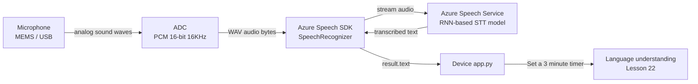

# Lesson 21 — Recognize Speech with an IoT Device

## Overview

This lesson introduces **voice control** in IoT consumer devices, focusing on the hardware and software required to capture audio and convert it to text. It explains four types of microphones, the fundamentals of **digital audio** (PCM sampling, sample rate, bit depth), why audio data is large and how to manage it on microcontrollers, and the concept of **wake word detection** for privacy. The lesson then shows how to create an **Azure Speech Service** resource and use it to convert captured speech audio to text, starting the journey toward building a **smart kitchen timer**.

## Concepts

### Voice Control in Consumer IoT

Voice control increases **accessibility** — it allows people with limited mobility or full hands to interact with devices. Use cases range from smart speakers (Alexa, Google Home, HomePod) to thermostats, light fittings, and phones.

**Examples:**
- Alexa, set a 12-minute timer
- Hey Siri, close the garage door
- OK Google, play the latest album by Taylor Swift

Setting **multiple kitchen timers by voice** is especially useful — no need to stop kneading dough or clean your hands to use a physical timer.

---

### Microphones

Microphones are **analog sensors** that convert sound waves into electrical signals. Air vibrations cause components in the microphone to move, creating tiny changes in electrical signals that are then amplified.

**Types:**

| Type | Mechanism | Needs Power? | Common Use |
|------|-----------|-------------|------------|
| **Dynamic** | Magnet attached to a moving diaphragm in a coil of wire; generates current | No | Studio microphones; same principle as speakers (reversible) |
| **Ribbon** | Metal ribbon in a magnetic field generates current | No | Vintage broadcast microphones; very sensitive |
| **Condenser** | Thin diaphragm + fixed backplate; varying static charge between them generates signal | Yes (Phantom power) | High-quality studio and recording microphones |
| **MEMS** | Pressure-sensitive diaphragm etched onto a silicon chip; same principle as condenser | Yes | Tiny; integrated into circuit boards; used in phones, IoT devices |

> [!NOTE]
> **Dynamic and loudspeakers are reversible**: An electrical current moves a magnet in a loudspeaker. A dynamic mic does the opposite — a moving magnet creates a current. This is why devices like intercoms can use one unit as both speaker and microphone.

> [!NOTE]
> **MEMS (Microelectromechanical systems)**: MEMS microphones can have a diaphragm less than 1mm wide. They are the type used in IoT devices like Raspberry Pi add-ons and the Wio Terminal.

---

### Digital Audio

Audio is an **analog signal**. To work with it digitally, it must be **sampled** — converted to discrete digital values at regular intervals.

**Sampling**: Converting the audio signal into a digital value representing the signal at a point in time.

**PCM (Pulse Code Modulation):**
- Read the voltage of the audio signal.
- Round it to the nearest value in a defined range (quantization).
- **16-bit audio**: values range from −32,768 to 32,767.
- **24-bit audio**: values range from −8,388,608 to 8,388,607.
- More bits = more precision = closer to the original sound.

**Sample rate:** How many times per second the signal is sampled, measured in KHz.
- 16 KHz: adequate for **speech-to-text**.
- 48 KHz: standard for streaming music.
- 96 KHz / 192 KHz: "lossless" audio.

> [!NOTE]
> **8-bit audio** (range: −128 to 127): First computer audio was 8-bit due to hardware limits — known as "LoFi". Retro gaming audio sounds distinctive because of this.

**Audio data size calculation (16-bit @ 16 KHz):**
```
16 bits = 2 bytes per sample
16,000 samples/second
2 × 16,000 = 32,000 bytes/second = 32 KB/second
```

**Impact on microcontrollers:**
- Wio Terminal has **192 KB RAM** total (code + variables + audio).
- At 32 KB/sec, RAM fills in ~5 seconds → must stream audio **directly to external storage** (SD card / flash memory) rather than holding it all in RAM.

**Audio file formats:**
- **WAV**: Uncompressed. 44-byte header (sample rate, bit depth, channel count) + raw PCM audio.
- **MP3**: Compressed, smaller file size, same perceived quality.

> [!NOTE]
> **Channels**: Mono = 1, Stereo = 2 (left + right), 7.1 surround = 8 channels. Each channel has its own audio data stream.

---

### Speech to Text (Speech Recognition)

**Speech to text** (speech recognition) uses AI to convert audio samples containing speech into text.

**How it works:**
1. Audio samples are grouped into fixed-size chunks.
2. Fed into a **Recurrent Neural Network (RNN)** — an ML model that uses previous data to make decisions about incoming data.
3. The RNN detects sounds: 'Hel' + 'lo' → validates 'Hello' as a word → outputs it.

**Context awareness:** Speech models understand context:
- "I went to the shops to get **two** bananas and an apple **too** by going **to** the store"
- Models distinguish homophones (to/two/too) from context.

**Custom speech models:** Speech services allow customization for:
- Noisy environments (factories).
- Industry-specific vocabulary (chemical names).
Training: provide sample audio + transcription → fine-tune using **transfer learning**.

---

### Privacy and Wake Words

**Privacy challenge:** Smart devices listen to audio continuously. Sending all audio to the cloud would:
- Use excessive bandwidth.
- Create massive privacy risks (private conversations, intimate moments).
- Lead to inadvertent recording of private audio (some companies select recordings for human validation).

**Solution: Wake words**
- Device runs a tiny ML model **locally on-device** that listens for a specific keyword.
- When detected, the device starts streaming audio to the cloud.
- No audio sent before the wake word.

**Examples:** "Alexa", "Hey Siri", "OK Google"

> [!NOTE]
> Wake word detection is also called **keyword spotting** or **keyword recognition**.

**TinyML:** Wake word detection runs on microcontrollers using **TinyML** — ML models compressed and optimized to run on devices with very limited compute and power resources.

**This course's approach:** To avoid the complexity of training a wake word model, the smart timer uses a **button** to trigger speech recognition instead of a wake word.

---

### Azure Speech Service

Part of **Cognitive Services** (Microsoft's pre-built AI services). The Speech Service provides:
- **Speech to text**: Audio → text.
- **Text to speech**: Text → audio (Lesson 23).
- **Speech translation**: Recognize speech + translate simultaneously (Lesson 24).
- Multiple voices per language (e.g., British English, New Zealand English).

## Hardware / Setup

**Azure resources:**

1. Create resource group `smart-timer`.

2. Create Speech Service resource (free tier):

```sh
az cognitiveservices account create --name smart-timer \
                                    --resource-group smart-timer \
                                    --kind SpeechServices \
                                    --sku F0 \
                                    --yes \
                                    --location <location>
```

3. Get API key:

```sh
az cognitiveservices account keys list --name smart-timer \
                                       --resource-group smart-timer \
                                       --output table
```

Copy one of the keys.

**Physical hardware (Raspberry Pi or Wio Terminal):**
- USB or HAT microphone.
- Speaker (USB, 3.5mm jack, or HDMI) for testing and later for text-to-speech.

**Virtual device:** CounterFit provides a virtual microphone that returns audio data from a local WAV file.

## Code Walkthrough

### Configure and Capture Audio (Virtual Device / Raspberry Pi)

Install the Speech SDK:

```sh
pip install azure-cognitiveservices-speech
```

**Capture audio and convert to text:**

```python
import os
import azure.cognitiveservices.speech as speechsdk

SPEECH_KEY = os.environ['SPEECH_KEY']
SPEECH_REGION = os.environ['SPEECH_REGION']  # e.g., 'eastus'


def recognize_speech():
    """Use Azure Speech Service to recognize speech from the default microphone."""
    speech_config = speechsdk.SpeechConfig(
        subscription=SPEECH_KEY,
        region=SPEECH_REGION
    )
    speech_config.speech_recognition_language = "en-GB"

    # Use the default microphone as audio input
    audio_config = speechsdk.audio.AudioConfig(use_default_microphone=True)

    recognizer = speechsdk.SpeechRecognizer(
        speech_config=speech_config,
        audio_config=audio_config
    )

    print("Listening...")
    result = recognizer.recognize_once()

    if result.reason == speechsdk.ResultReason.RecognizedSpeech:
        text = result.text
        print(f"Recognized: {text}")
        return text

    elif result.reason == speechsdk.ResultReason.NoMatch:
        print("No speech recognized.")
        return None

    elif result.reason == speechsdk.ResultReason.Canceled:
        print(f"Recognition canceled: {result.cancellation_details.error_details}")
        return None
```

**Code explanation:**

| Line | Explanation |
|------|-------------|
| `speechsdk.SpeechConfig(subscription, region)` | Configures the speech service with API key and Azure region |
| `speech_recognition_language = "en-GB"` | Sets the language for speech recognition (British English) |
| `AudioConfig(use_default_microphone=True)` | Uses the default microphone as audio input source |
| `SpeechRecognizer` | The SDK object that handles speech recognition |
| `recognize_once()` | Captures one utterance (until a pause is detected) and returns the result |
| `result.reason == RecognizedSpeech` | Check if speech was successfully recognized |
| `result.text` | The transcribed text from the recognized speech |
| `NoMatch` | The service received audio but could not match it to speech |
| `Canceled` | Recognition was canceled (usually a network or authentication error) |

---

### Button-Triggered Speech Recognition

```python
import time

# Simplified button + recognition loop
while True:
    if button_is_pressed():
        print("Button pressed — listening...")
        text = recognize_speech()
        if text:
            print(f"You said: {text}")
    time.sleep(0.1)
```

## How It Works



## Key Terms

| Term | Definition |
|------|------------|
| Microphone | An analog sensor that converts sound waves (air vibrations) into electrical signals |
| Dynamic microphone | A microphone using a moving diaphragm and magnet in a coil to generate current; no power required |
| Condenser microphone | A microphone using two charged plates (diaphragm + backplate) varying capacitance to generate a signal; requires phantom power |
| MEMS microphone | Microelectromechanical systems microphone — a microphone etched onto a silicon chip; used in IoT devices |
| Analog signal | A continuous signal that carries fine-grained information; audio is analog before sampling |
| Sampling | Converting an analog signal to a digital value at a specific point in time |
| PCM (Pulse Code Modulation) | The technique for sampling analog audio into digital values (16-bit or 24-bit integers) |
| Sample rate | The number of audio samples taken per second (e.g., 16 KHz = 16,000 samples/second) |
| Bit depth | The number of bits per sample (16-bit = 32,768 possible values); more bits = more precision |
| WAV file | An uncompressed audio file format: 44-byte header + raw PCM data |
| Channels | Separate audio streams in an audio file (mono = 1, stereo = 2) |
| Speech to text (STT) | AI-powered conversion of spoken audio to written text |
| Recurrent Neural Network (RNN) | An ML model architecture that uses previous inputs to inform current decisions; used for speech recognition |
| Speech recognition language | The language code specifying which language to recognize (e.g., `en-GB` for British English) |
| Wake word | A specific keyword ("Alexa", "Hey Siri") that activates a smart device's speech recognition |
| Keyword spotting | On-device detection of a wake word without sending audio to the cloud; also called keyword recognition |
| TinyML | Techniques for running ML models on microcontrollers with very limited compute and power resources |
| Azure Speech Service | Microsoft Cognitive Service providing speech-to-text, text-to-speech, and speech translation |
| `SpeechConfig` | Azure Speech SDK class configured with API key and region |
| `SpeechRecognizer` | Azure Speech SDK class that performs speech recognition |
| `recognize_once()` | SDK method that listens for a single utterance and returns the recognition result |
| `ResultReason.RecognizedSpeech` | SDK enum value indicating speech was successfully recognized |
| Phantom power | The power supply required to operate condenser microphones |

## Summary

- Microphone types: **dynamic** (moving coil, no power), **ribbon** (metal ribbon, no power), **condenser** (varying capacitance, needs phantom power), **MEMS** (chip-based, tiny, used in IoT).
- Audio is analog → must be **sampled** (PCM) → 16-bit @ 16 KHz = 32 KB/second.
- On microcontrollers (192 KB RAM), stream audio directly to external storage — never hold the full recording in RAM.
- WAV file: 44-byte header (sample rate, bit depth, channels) + raw PCM data.
- **Speech to text** uses RNN models that process fixed-sized audio chunks and combine context to produce text.
- Speech models understand context: homophones (to/two/too) are disambiguated by context.
- **Privacy**: Wake words detected on-device (TinyML); audio only sent to cloud after wake word detected.
- This course uses a **button** instead of a wake word to trigger recognition.
- **Azure Speech Service** (Cognitive Services): `speechsdk.SpeechConfig` + `SpeechRecognizer` + `recognize_once()` → `result.text`.
- Setup: `az cognitiveservices account create --kind SpeechServices --sku F0`.
