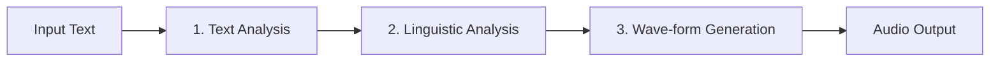
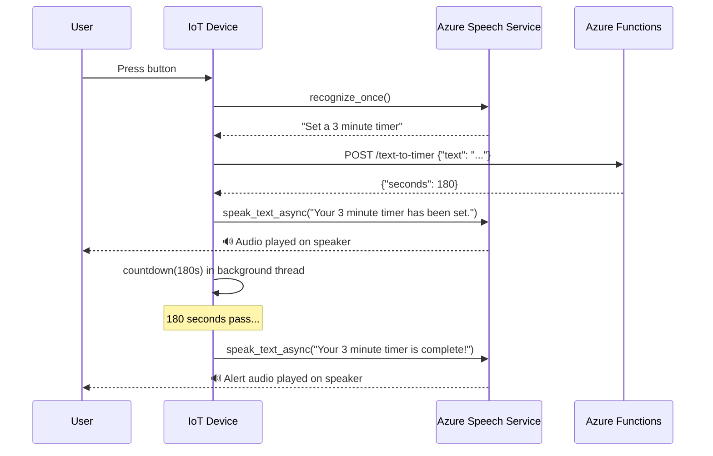

# Lesson 23 — Set a Timer and Provide Spoken Feedback

## Overview

This lesson completes the two-way communication loop of the smart timer: receiving the timer duration from the HTTP trigger (Lesson 22), **counting down the timer** on the IoT device, and using **text-to-speech (TTS)** via the Azure Speech Service to give **spoken confirmations** and alerts. It explains the three stages of TTS (text analysis, linguistic analysis, wave-form generation), the role of **SSML** for controlling voice, language, and pronunciation, and how the same Speech Service used in Lesson 21 is also used for TTS.

## Concepts

### Text to Speech (TTS / Speech Synthesis)

**Text to speech** converts written text into audio containing spoken words. The basic principle: break words into **phonemes** → stitch together audio for those phonemes.

**Three stages of TTS:**



---

### Stage 1: Text Analysis

Converts input text into speakable words:

| Input | Context | Output |
|-------|---------|--------|
| "1234" | "I have 1234 apples" | "One thousand, two hundred thirty four" |
| "1234" | "The child counted 1234" | "One, two, three, four" |
| "120" | American English | "One hundred twenty" |
| "120" | British English | "One hundred **and** twenty" |
| "in" | Abbreviation | "inch" |
| "st" | In an address | "street" |
| "st" | Before a place name | "saint" |

Context determines how numbers, abbreviations, and locale-specific forms are handled.

---

### Stage 2: Linguistic Analysis

Converts words into **phonemes** — the distinct units of sound in a language.

**Key facts:**
- English has **44 different phonemes** from 26 letters.
- The same letter makes different sounds in different words: 'a' in "car" ≠ 'a' in "care".
- Some phonemes are shared by different letters: 'c' in "circle" and 's' in "serpent" use the same phoneme.
- The same letters may make different sounds: 'ea' in "head" ≠ 'ea' in "heat".

**Intonation:**
- Context also affects **pitch and duration** of phonemes.
- Statement: "You have an apple." (pitch stays level).
- Question: "You have an apple?" (pitch rises at end — the question mark triggers this in linguistic analysis).

---

### Stage 3: Wave-form Generation

**Early TTS:** Pre-recorded audio for each phoneme stitched together → very monotonous, robotic voice.

**Modern TTS:** ML models built using **deep learning** (large neural networks similar to brain neurons):
- Produce natural-sounding voices indistinguishable from humans.
- Multiple voices per language with different accents (e.g., British English, New Zealand English).

> [!CAUTION]
> Modern ML-based TTS can be trained using **transfer learning** to sound like a specific real person from a short audio sample. This means voice authentication is no longer reliable — anyone with a few minutes of your voice can impersonate you.

**End-to-end models:** Modern deep learning models are combining all 3 stages into a single end-to-end speech synthesizer.

---

### The Azure Speech Service for TTS

The **same Azure Speech Service** used for speech-to-text (Lesson 21) also provides TTS. Send text → receive audio bytes in WAV format → play on device speaker.

**Request format:** The text is sent using **SSML** (Speech Synthesis Markup Language) — an XML-based format for speech synthesis that controls:
- Language (`xml:lang`)
- Voice (`name`)
- Speed, volume, pitch of specific words
- Pauses, emphasis

**SSML example:**

```xml
<speak version='1.0' xml:lang='en-GB'>
    <voice xml:lang='en-GB' name='en-GB-MiaNeural'>
        Your 3 minute 5 second timer has been set
    </voice>
</speak>
```

- `xml:lang='en-GB'` → British English.
- `name='en-GB-MiaNeural'` → Specific neural voice.
- The `Neural` suffix indicates a deep-learning-based neural voice (most natural sounding).

---

### Setting the Timer on the IoT Device

The device:
1. Calls the REST endpoint from Lesson 22 to get `seconds`.
2. Sets a countdown timer using Python's `time` module.
3. Announces the timer with TTS at the start.
4. Announces when the timer expires with TTS.

## Hardware / Setup

**Azure resources:** Same Speech Service resource from Lesson 21 (`smart-timer`, `SpeechServices`).

**Additional pip packages:** No new packages — uses the `azure-cognitiveservices-speech` SDK from Lesson 21.

**Speaker:** A USB speaker, 3.5mm audio jack speaker, or HDMI audio (Raspberry Pi) connected to the IoT device.

## Code Walkthrough

### Convert Text to Speech

```python
import os
import azure.cognitiveservices.speech as speechsdk

SPEECH_KEY = os.environ['SPEECH_KEY']
SPEECH_REGION = os.environ['SPEECH_REGION']


def text_to_speech(text):
    """Convert text to audio and play it on the default speaker."""
    speech_config = speechsdk.SpeechConfig(
        subscription=SPEECH_KEY,
        region=SPEECH_REGION
    )
    speech_config.speech_synthesis_language = "en-GB"
    speech_config.speech_synthesis_voice_name = "en-GB-MiaNeural"

    # Output to the default speaker
    audio_config = speechsdk.audio.AudioOutputConfig(use_default_speaker=True)

    synthesizer = speechsdk.SpeechSynthesizer(
        speech_config=speech_config,
        audio_config=audio_config
    )

    # Option 1: Simple text
    result = synthesizer.speak_text_async(text).get()

    # Option 2: SSML (more control)
    # ssml = f"""
    # <speak version='1.0' xml:lang='en-GB'>
    #     <voice xml:lang='en-GB' name='en-GB-MiaNeural'>
    #         {text}
    #     </voice>
    # </speak>"""
    # result = synthesizer.speak_ssml_async(ssml).get()

    if result.reason != speechsdk.ResultReason.SynthesizingAudioCompleted:
        print(f"TTS failed: {result.reason}")
```

**Code explanation:**

| Line | Explanation |
|------|-------------|
| `speech_synthesis_language` | Target language for TTS |
| `speech_synthesis_voice_name` | The specific voice to use (Neural voices are most natural) |
| `AudioOutputConfig(use_default_speaker=True)` | Play audio on the default speaker device |
| `SpeechSynthesizer` | SDK class for text-to-speech |
| `speak_text_async(text).get()` | Converts text to speech and plays it; `.get()` waits for completion |
| `speak_ssml_async(ssml).get()` | Same but accepts SSML input for richer control |
| `SynthesizingAudioCompleted` | Success result reason indicating TTS completed and audio was played |

---

### Set the Timer and Provide Spoken Feedback

```python
import time
import threading
import requests

FUNCTION_URL = 'http://<IP_ADDRESS>:7071/api/text-to-timer'


def get_timer_seconds(text):
    """Call the Azure Functions endpoint to get timer duration."""
    response = requests.post(FUNCTION_URL, json={'text': text})
    if response.status_code == 200:
        return response.json()['seconds']
    return None


def format_duration(seconds):
    """Convert seconds to a human-readable string for TTS."""
    minutes = seconds // 60
    secs = seconds % 60
    parts = []
    if minutes > 0:
        parts.append(f"{minutes} minute{'s' if minutes != 1 else ''}")
    if secs > 0:
        parts.append(f"{secs} second{'s' if secs != 1 else ''}")
    return " and ".join(parts)


def timer_complete(duration_text):
    """Called when the timer expires."""
    text_to_speech(f"Your {duration_text} timer is complete!")


def set_timer(seconds):
    """Set a countdown timer and announce it."""
    duration_text = format_duration(seconds)
    text_to_speech(f"Your {duration_text} timer has been set.")
    print(f"Timer set for {seconds} seconds.")

    # Use a background thread to count down without blocking
    def countdown():
        time.sleep(seconds)
        timer_complete(duration_text)

    t = threading.Thread(target=countdown)
    t.daemon = True
    t.start()


# --- Main loop ---
while True:
    if button_is_pressed():
        recognized_text = recognize_speech()  # From Lesson 21
        if recognized_text:
            seconds = get_timer_seconds(recognized_text)
            if seconds:
                set_timer(seconds)
            else:
                text_to_speech("Sorry, I didn't understand your timer request.")
    time.sleep(0.1)
```

**Code explanation:**

| Line | Explanation |
|------|-------------|
| `format_duration(seconds)` | Converts seconds to "3 minutes and 5 seconds" for natural speech |
| `text_to_speech(f"Your {duration_text} timer has been set.")` | Confirms the timer was set with the spoken duration |
| `threading.Thread(target=countdown)` | Runs the countdown in a background thread so the main loop can continue listening |
| `t.daemon = True` | Makes the thread stop automatically when the main program exits |
| `time.sleep(seconds)` | Waits for the duration of the timer |
| `timer_complete(duration_text)` | Speaks the "timer complete" alert when the countdown finishes |

---

### SSML with Dynamic Time Values

```python
def announce_timer(minutes, seconds):
    """Announce timer set using SSML with dynamic values."""
    parts = []
    if minutes > 0:
        parts.append(f"{minutes} minute{'s' if minutes != 1 else ''}")
    if seconds > 0:
        parts.append(f"{seconds} second{'s' if seconds != 1 else ''}")
    duration_str = " and ".join(parts)

    ssml = f"""
    <speak version='1.0' xml:lang='en-GB'>
        <voice xml:lang='en-GB' name='en-GB-MiaNeural'>
            Your {duration_str} timer has been set.
        </voice>
    </speak>"""

    synthesizer.speak_ssml_async(ssml).get()
```

---

### Expected Behavior

```
User presses button → says "Set a 3 minute timer"
Speech Service: "set a 3 minute timer" (recognized)
Device: POST /api/text-to-timer {"text": "set a 3 minute timer"}
Function: → LUIS → 180 seconds
Device (TTS): "Your 3 minutes timer has been set."
[3 minutes later]
Device (TTS): "Your 3 minutes timer is complete!"
```

## How It Works



## Key Terms

| Term | Definition |
|------|------------|
| Text to speech (TTS) | The process of converting written text into spoken audio |
| Speech synthesis | Another name for text to speech |
| Phoneme | A distinct unit of sound in a language; 44 phonemes in English |
| Text analysis | First TTS stage: converting input text into speakable words (handling numbers, abbreviations, locale variants) |
| Linguistic analysis | Second TTS stage: breaking words into phonemes, determining intonation and pitch |
| Wave-form generation | Third TTS stage: converting phonemes into audio (using pre-recorded snippets or ML models) |
| Neural voice | A TTS voice powered by deep learning ML models; produces natural-sounding, near-human audio |
| SSML (Speech Synthesis Markup Language) | XML-based markup language for controlling TTS: language, voice, speed, pitch, emphasis, pauses |
| `xml:lang` | SSML attribute specifying the language of the text (e.g., `en-GB`, `en-US`) |
| `name` (SSML voice) | SSML attribute specifying the voice to use (e.g., `en-GB-MiaNeural`) |
| `SpeechSynthesizer` | Azure Speech SDK class for performing text-to-speech synthesis |
| `speak_text_async(text).get()` | SDK method to synthesize plain text to speech; `.get()` waits for completion |
| `speak_ssml_async(ssml).get()` | SDK method to synthesize SSML-formatted text to speech |
| `AudioOutputConfig(use_default_speaker=True)` | SDK configuration to play synthesized audio on the default speaker device |
| `SynthesizingAudioCompleted` | SDK result reason indicating TTS successfully completed |
| `threading.Thread` | Python class for running code in a background thread (e.g., timer countdown) |
| `t.daemon = True` | Marks a thread as daemon so it stops when the main program exits |
| `format_duration(seconds)` | Custom function to convert seconds to a human-readable string for natural-sounding TTS |
| Deep learning | Very large neural networks with many layers; used for modern high-quality TTS wave-form generation |
| Voice cloning | Using transfer learning to train a TTS model to sound like a specific person; a security risk for voice authentication |

## Summary

- **Text to speech (TTS)** has 3 stages: text analysis (text → speakable words) → linguistic analysis (words → phonemes with intonation) → wave-form generation (phonemes → audio).
- **Text analysis**: handles numbers (contextual), abbreviations, locale variants (American "One hundred twenty" vs. British "One hundred and twenty").
- **Phonemes**: 44 in English; same letter can make different sounds; same sound can come from different letters.
- **Intonation**: question marks → rising pitch; context affects tone and duration of phonemes.
- **Early TTS**: pre-recorded phoneme snippets → robotic. **Modern TTS**: deep learning neural networks → near-human quality.
- **Neural voice cloning** is possible from short audio samples → voice authentication is no longer reliable.
- **Azure Speech Service** (same as STT): configure `speech_synthesis_language` and `speech_synthesis_voice_name` → `SpeechSynthesizer`.
- `speak_text_async(text).get()` → plain text; `speak_ssml_async(ssml).get()` → SSML for richer control.
- **SSML**: XML format with `<speak>` root and `<voice>` element; controls `xml:lang` and voice `name`.
- **Timer flow**: button press → STT → `text-to-timer` function → LUIS → seconds → `set_timer()` → TTS confirmation → countdown in background thread → TTS alert on completion.
- Background countdown uses `threading.Thread` to avoid blocking the main listener loop.
