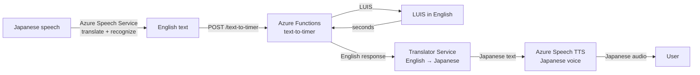

# Lesson 24 — Support Multiple Languages

## Overview

This final Consumer lesson (and the final lesson of the entire course) covers **text and speech translation** using AI. It explains the history and mechanics of **Machine Translation (MT)** and **Neural Translation**, discusses the challenges of language translation (idioms, word order, locale differences), and presents two Azure services that provide translation: the **Speech Service** (translates speech during recognition) and the **Translator service** (dedicated text translation with extra features). The lesson shows how to add **multi-language support** to the smart timer by translating user speech to English, keeping the LUIS core in English, and translating responses back to the user's language.

## Concepts

### Why Translation Is Hard

**Simple substitution works for some cases:**
- "Hello world" (English) → "Bonjour le monde" (French) — a direct word-for-word substitution works.

**But fails for most real sentences:**

| Challenge | Example |
|-----------|---------|
| Different phrase structures | "My name is Jim" → "Je m'appelle Jim" (literally "I call myself Jim") |
| Word order | French: verb before object, English: subject-verb-object |
| Untranslated words | Proper names (Jim) aren't translated — transliterated if needed for different alphabets |
| Idioms | "I've got ants in my pants" (English: restless) → German: "I have bumble bees in the bottom" |
| Locale differences | "pants" (American: outerwear) vs. "pants" (British: underwear) |
| Numbers and dates | Regional formatting differences |

> [!NOTE]
> **Language pairs**: A translation from one specific language to another (e.g., English → Spanish). Not all pairs are supported by all tools. Some systems use an **intermediate language** — translate to the intermediate, then from it to the target — so adding a new language only requires translation to/from the intermediate, not to/from every other language.

> [!NOTE]
> **Transliteration**: When words can't be translated (proper nouns, technical terms), select characters in the target alphabet that produce the same sound. E.g., "Raspberry Pi" → "J'ai un Raspberry Pi" in French (not "J'ai une pi aux framboises").

---

### Machine Translation (MT)

**Machine Translation** substitutes words and phrases:
- Large databases of **rules** for translating phrases, idioms.
- **Statistical methods**: pick the most likely translation using huge corpora of human-translated text (web pages, books, UN documentation).
- **Statistical Machine Translation**: uses intermediate representations — translate to an intermediate language, then to the target.

**Limitations:** Rules and databases can be incomplete; idioms and complex grammar often fail.

---

### Neural Translation

**Neural translation** uses ML models to translate entire sentences at once:
- Trained on massive human-translated datasets.
- Usually **smaller** than MT databases — no need for huge phrase/idiom databases.
- Modern services typically **mix** statistical MT and neural translation.

**Important**: Translations are **not 1:1 or symmetric**:
- The same sentence may be translated differently by different services.
- Translating A→B→A may produce a slightly different sentence than the original.

---

### Translation Services in Azure

**Two options:**

| Service | Type | When to Use |
|---------|------|------------|
| **Azure Speech Service** | Speech recognition + simultaneous translation | Translate speech during the STT step; not available via REST API (SDK only) |
| **Azure Translator service** | Dedicated text translation | Translate text between languages; REST API; extra features (profanity masking, custom glossaries) |

---

### Azure Translator Service

**Key features:**
- Translates text from one language to one or more target languages.
- Profanity masking.
- Custom translations for specific terms.

**Custom translation example:** "I have a Raspberry Pi" — keep "Raspberry Pi" untranslated:
- Desired: "J'ai un Raspberry Pi"
- Without customization: "J'ai une pi aux framboises" (incorrect)

---

### Multi-Language Architecture for the Smart Timer

**Strategy:** Add language translation as a layer around the existing English-only pipeline.



**Advantage:** The entire LUIS model and timer logic stay in English. Only two translation steps are added. This allows rapid support for new languages without retraining LUIS in each language.

**Downside:** Machine translation may introduce errors, especially for domain-specific phrases or cultural idioms.

---

### Real-World Translation Devices

**Microsoft Translator app**: Real-time translation of speech and written text, using speech and translation services. Used in airports, hospitals, meetings — provides accessibility for non-native speakers.

> [!NOTE]
> The Microsoft Translator supports Klingon — "Qapla'!"

---

### Clean Up

After completing this project:

```sh
az group delete --name smart-timer
```

This deletes the Speech Service, LUIS Authoring resource, Translator resource, and Functions App.

## Hardware / Setup

**Azure Translator resource:**

```sh
az cognitiveservices account create --name smart-timer-translator \
                                    --resource-group smart-timer \
                                    --kind TextTranslation \
                                    --sku F0 \
                                    --yes \
                                    --location <location>
```

**Get Translator key:**

```sh
az cognitiveservices account keys list --name smart-timer-translator \
                                       --resource-group smart-timer \
                                       --output table
```

**Environment variables to add:**
```
TRANSLATOR_KEY=<key>
TRANSLATOR_LOCATION=<location>
```

## Code Walkthrough

### Translate Speech to English During Recognition (Speech Service SDK)

The Azure Speech SDK supports **translation** as part of speech recognition:

```python
import azure.cognitiveservices.speech as speechsdk
import os

SPEECH_KEY = os.environ['SPEECH_KEY']
SPEECH_REGION = os.environ['SPEECH_REGION']


def recognize_and_translate_to_english(source_language='ja-JP'):
    """Recognize speech in source_language and translate to English."""
    translation_config = speechsdk.translation.SpeechTranslationConfig(
        subscription=SPEECH_KEY,
        region=SPEECH_REGION
    )
    translation_config.speech_recognition_language = source_language
    translation_config.add_target_language('en')  # Translate to English

    audio_config = speechsdk.audio.AudioConfig(use_default_microphone=True)

    recognizer = speechsdk.translation.TranslationRecognizer(
        translation_config=translation_config,
        audio_config=audio_config
    )

    result = recognizer.recognize_once()

    if result.reason == speechsdk.ResultReason.TranslatedSpeech:
        english_text = result.translations['en']
        print(f"Recognized ({source_language}): {result.text}")
        print(f"Translated (en): {english_text}")
        return english_text
    return None
```

> [!NOTE]
> Translation from speech is only available in the SDK, **not** the REST API.

---

### Translate Text Using the Translator REST API

The Translator service uses a REST API (not an SDK for Python in the basics):

```python
import requests
import uuid
import os

TRANSLATOR_KEY = os.environ['TRANSLATOR_KEY']
TRANSLATOR_LOCATION = os.environ['TRANSLATOR_LOCATION']
TRANSLATOR_ENDPOINT = 'https://api.cognitive.microsofttranslator.com'


def translate_text(text, source_lang='en', target_lang='ja'):
    """Translate text from source_lang to target_lang."""
    url = f'{TRANSLATOR_ENDPOINT}/translate'
    params = {
        'api-version': '3.0',
        'from': source_lang,
        'to': [target_lang]
    }
    headers = {
        'Ocp-Apim-Subscription-Key': TRANSLATOR_KEY,
        'Ocp-Apim-Subscription-Region': TRANSLATOR_LOCATION,
        'Content-Type': 'application/json',
        'X-ClientTraceId': str(uuid.uuid4())
    }
    body = [{'text': text}]

    response = requests.post(url, params=params, headers=headers, json=body)
    results = response.json()

    translated = results[0]['translations'][0]['text']
    print(f"Translated to {target_lang}: {translated}")
    return translated
```

**Code explanation:**

| Line | Explanation |
|------|-------------|
| `TRANSLATOR_ENDPOINT` | Base URL for the Translator REST API |
| `api-version=3.0` | Specifies the API version |
| `from=source_lang` | Source language code (e.g., `en`) |
| `to=[target_lang]` | Target language code(s) (list — can translate to multiple at once) |
| `Ocp-Apim-Subscription-Key` | Translator service API key header |
| `Ocp-Apim-Subscription-Region` | Required for multi-region resources |
| `X-ClientTraceId` | Unique request ID for debugging (UUID) |
| `body = [{'text': text}]` | Input body — list of text objects (can translate multiple texts at once) |
| `results[0]['translations'][0]['text']` | The translated text for the first input, first target language |

---

### Full Multi-Language Timer Flow

```python
import time
import threading

USER_LANGUAGE = 'ja-JP'  # Japanese
RESPONSE_LANGUAGE = 'ja'  # Language code for translation back


def multilingual_timer_flow():
    """Full flow: recognize Japanese speech → English → LUIS → response → Japanese TTS."""
    # Step 1: Recognize speech + translate to English
    english_text = recognize_and_translate_to_english(source_language=USER_LANGUAGE)
    if not english_text:
        return

    # Step 2: Send to Functions endpoint (LUIS in English)
    seconds = get_timer_seconds(english_text)  # From Lesson 22
    if not seconds:
        # Translate error message to user's language
        error_msg = translate_text("Sorry, I didn't understand your timer request.",
                                   source_lang='en', target_lang=RESPONSE_LANGUAGE)
        text_to_speech(error_msg, language=USER_LANGUAGE)
        return

    # Step 3: Build English response
    duration_text = format_duration(seconds)
    english_response = f"Your {duration_text} timer has been set."

    # Step 4: Translate response to user's language
    localized_response = translate_text(english_response, source_lang='en', target_lang=RESPONSE_LANGUAGE)

    # Step 5: Speak response in user's language
    text_to_speech(localized_response, language=USER_LANGUAGE)

    # Step 6: Start countdown
    def countdown():
        time.sleep(seconds)
        complete_msg = f"Your {duration_text} timer is complete!"
        localized_complete = translate_text(complete_msg, source_lang='en', target_lang=RESPONSE_LANGUAGE)
        text_to_speech(localized_complete, language=USER_LANGUAGE)

    t = threading.Thread(target=countdown)
    t.daemon = True
    t.start()
```

---

### TTS in a Specific Language

```python
def text_to_speech(text, language='en-GB'):
    """Speak text in the specified language."""
    speech_config = speechsdk.SpeechConfig(
        subscription=SPEECH_KEY,
        region=SPEECH_REGION
    )
    # Set language and voice based on language code
    voice_map = {
        'en-GB': 'en-GB-MiaNeural',
        'ja-JP': 'ja-JP-NanamiNeural',
        'fr-FR': 'fr-FR-DeniseNeural',
    }
    voice = voice_map.get(language, 'en-GB-MiaNeural')
    speech_config.speech_synthesis_voice_name = voice

    audio_config = speechsdk.audio.AudioOutputConfig(use_default_speaker=True)
    synthesizer = speechsdk.SpeechSynthesizer(speech_config=speech_config, audio_config=audio_config)
    synthesizer.speak_text_async(text).get()
```

## How It Works

```mermaid
flowchart LR
    JP[User speaks Japanese] -->|SpeechTranslationConfig\n(ja-JP → en)| EN[English text]
    EN -->|POST /text-to-timer| Fn[Azure Functions\ntext-to-timer]
    Fn -->|LUIS English| LUIS[LUIS set timer\n→ 180 seconds]
    LUIS --> Fn
    Fn -->|{"seconds": 180}| Device[Device app.py]
    Device -->|translate_text EN→JA| Trans[Translator REST API]
    Trans -->|Japanese text| Device
    Device -->|speak_text_async| TTS[Azure Speech TTS\nja-JP-NanamiNeural]
    TTS -->|Japanese audio| Speaker[Speaker 🔊]
```

## Key Terms

| Term | Definition |
|------|------------|
| Machine Translation (MT) | Traditional computer translation using rule databases and statistical methods |
| Neural Translation | AI-based translation using ML models trained on large human-translated corpora |
| Language pair | A specific source-to-target language combination for translation (e.g., English → French) |
| Intermediate language | A pivot language used to bridge translation between two languages that don't have a direct language pair |
| Transliteration | Converting words from one alphabet to another by matching sounds rather than meanings |
| Idiom | A phrase whose meaning cannot be derived from the literal interpretation of its words (e.g., "ants in your pants") |
| Statistical Machine Translation | A translation method using statistical models trained on large corpora of human translations |
| Azure Translator service | Microsoft Cognitive Service for text translation via REST API; supports profanity masking and custom glossaries |
| `TextTranslation` | The Azure cognitive services kind for creating a Translator resource |
| `Ocp-Apim-Subscription-Key` | HTTP header for passing the Translator API key |
| `Ocp-Apim-Subscription-Region` | HTTP header specifying the Azure region for the Translator resource |
| `X-ClientTraceId` | HTTP header with a unique request ID (UUID) for debugging translation requests |
| `SpeechTranslationConfig` | Azure Speech SDK configuration class for speech recognition with simultaneous translation |
| `TranslationRecognizer` | Azure Speech SDK class that performs speech recognition and translation simultaneously |
| `add_target_language('en')` | SDK method to add English as a translation target language |
| `result.translations['en']` | SDK result property containing the translated text for the 'en' target language |
| `TranslatedSpeech` | SDK result reason indicating speech was recognized and translated |
| Neural voice (multilingual) | TTS voice specific to a language and locale (e.g., `ja-JP-NanamiNeural` for Japanese) |
| Locale | A language variant specific to a region (e.g., `en-GB` for British English, `en-US` for American English) |
| Custom glossary (Translator) | A custom mapping to keep specific terms untranslated or use a preferred translation |
| Profanity masking | A Translator feature that detects and masks profane words in translations |

## Summary

- Translation has been a computer science problem for 70+ years. It's now near-human quality for many language pairs.
- Challenges: different sentence structures, word order, untranslated proper nouns, idioms, locale variations.
- **Language pairs**: not all are supported; some use intermediate languages.
- **Machine Translation (MT)**: rule databases + statistical selection from human-translated corpora.
- **Neural Translation**: ML models trained on large datasets; smaller models; mixed with MT in modern services.
- Translations are not symmetric — A→B→A may differ from the original.
- **Azure Speech Service SDK**: `SpeechTranslationConfig` + `TranslationRecognizer` → recognize speech and translate simultaneously. NOT available via REST API.
- **Azure Translator service**: REST API, `TextTranslation` kind; headers: `Ocp-Apim-Subscription-Key`, `Ocp-Apim-Subscription-Region`, `X-ClientTraceId`.
- Translator response: `results[0]['translations'][0]['text']`.
- Can translate to **multiple target languages** in one API call.
- Multi-language timer architecture: translate user speech to English → LUIS in English → translate English response back → TTS in user's language.
- Advantage: LUIS stays in English; adding new languages only requires adding translation — no LUIS retraining.
- Custom glossary: keep terms like "Raspberry Pi" untranslated.
- Profanity masking: built-in feature.
- Clean up: `az group delete --name smart-timer`.

---

> [!NOTE]
> This is Lesson 24 — the **final lesson** of the Microsoft IoT For Beginners course. You have now covered all 6 projects: Getting Started, Farm, Transport, Manufacturing, Retail, and Consumer.
