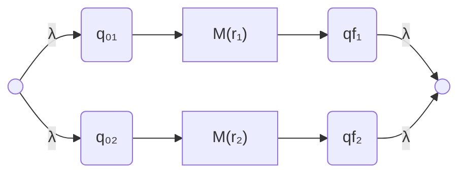
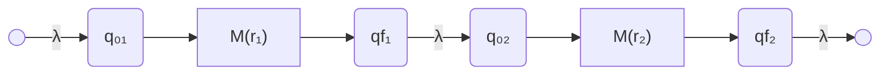
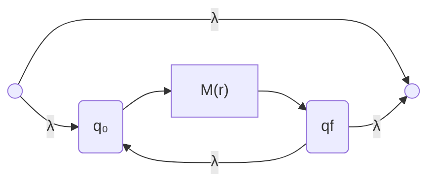
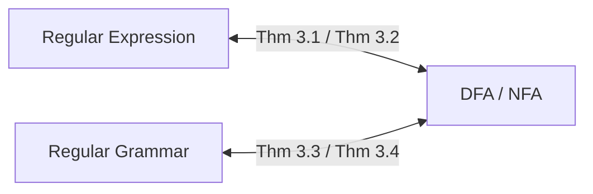
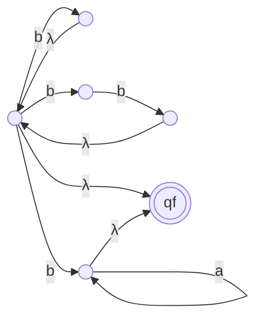
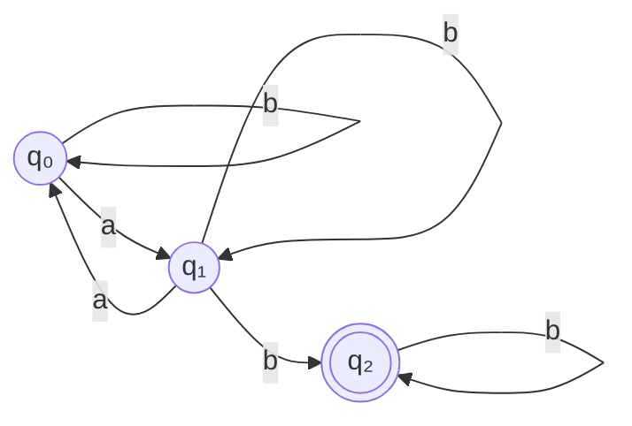
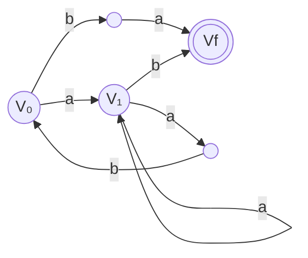

# Regular Language & Regular Grammar

> [!Note] 💡 Notation Conventions
> - $\Sigma$ — finite alphabet (set of input symbols)
> - $\lambda$ — empty string (also written $\varepsilon$ elsewhere; this note uses $\lambda$)
> - $r, r_1, r_2$ — regular expressions
> - $L(r)$ — the language denoted by regular expression $r$
> - $+$ — union of languages/expressions
> - $\cdot$ — concatenation (often omitted; $r_1 r_2 \equiv r_1 \cdot r_2$)
> - ${}^*$ — Kleene star-closure (zero or more repetitions)
> - Operator precedence (highest to lowest): ${}^*$, then $\cdot$, then $+$
> - $M(r)$ — the NFA constructed for regular expression $r$
> - $q_0$ — initial state; $q_f$ / $F$ — final state(s)
> - $\delta$ — transition function of a finite automaton
> - $V$ — set of variables (grammar); $T$ — set of terminals; $S$ — start variable; $P$ — set of productions

---

## Part 1 — Conceptual Section

### 1. Regular Expressions

> [!Definition] 📖 Regular Expression (Def 3.1)
> Let $\Sigma$ be a given alphabet. The set of **regular expressions** over $\Sigma$ is defined inductively:
> **1.** $\emptyset$, $\lambda$, and every $a \in \Sigma$ are regular expressions. These are the **primitive** regular expressions.
> **2.** If $r_1$ and $r_2$ are regular expressions, then so are:
> - $r_1 + r_2$ (union)
> - $r_1 \cdot r_2$ (concatenation)
> - $r_1^*$ (star-closure)
> - $(r_1)$ (parenthesisation)
>   
>**3.** A string is a regular expression **if and only if** it can be derived from primitive expressions by finitely many applications of rule 2.

> [!Definition] 📖 Language of a Regular Expression (Def 3.2)
> The language $L(r)$ denoted by $r$ is defined by:
> **1.** $L(\emptyset) = \emptyset$ (empty set)
> **2.** $L(\lambda) = \{\lambda\}$
> **3.** $L(a) = \{a\}$ for every $a \in \Sigma$
> **4.** $L(r_1 + r_2) = L(r_1) \cup L(r_2)$
> **5.** $L(r_1 \cdot r_2) = L(r_1) \cdot L(r_2)$ (concatenation of languages)
> **6.** $L((r_1)) = L(r_1)$
> **7.** $L(r_1^*) = (L(r_1))^*$ (Kleene closure)

> [!Property] ⚙️ Useful Identities
> - $(r^*)^* = r^*$
> - $(r_1^* + r_2)^* = (r_1 + r_2)^*$
> - $(r_1 r_2^* + r_2)^* = (r_1 + r_2)^*$

> [!Note] 💡 Equivalence of Regular Expressions
> Two regular expressions $r_1$ and $r_2$ are **equivalent** if $L(r_1) = L(r_2)$.

---

### 2. Connection: Regular Expressions ↔ Regular Languages

> [!Theorem] 📌 Theorem 3.1 — RE → NFA
> Let $r$ be a regular expression. Then there exists an NFA (nondeterministic finite accepter) $M$ such that $L(M) = L(r)$. Consequently, **every language denoted by a regular expression is regular**.

#### Procedure `re2nfa` — Converting RE to NFA

**Step 1 — Primitive expressions:**

| Expression | NFA |
|---|---|
| $\emptyset$ | $q_0 \xrightarrow{\lambda} q_1$ (no accept) |
| $\lambda$ | $q_0 \xrightarrow{\lambda} q_1$, $q_1$ is final |
| $a \in \Sigma$ | $q_0 \xrightarrow{a} q_1$, $q_1$ is final |

**Step 2 — Composite expressions:**

> [!Note] 💡 Structural Conditions
> For all constructions below, the sub-NFAs $M(r_1)$ and $M(r_2)$ must satisfy:
> - **No edge into** $q_{01}$ or $q_{02}$ (the start states of sub-NFAs)
> - **No edge out from** $q_{f1}$ or $q_{f2}$ (the final states of sub-NFAs)
> This ensures clean composition without unintended transitions.

**Union $r_1 + r_2$:** Add a new start state and a new final state; connect both via $\lambda$-transitions.

**Concatenation $r_1 r_2$:** Chain the two NFAs — final state of $M(r_1)$ feeds via $\lambda$ into start of $M(r_2)$.

**Star-closure $r^*$:** Add new start/final state; add $\lambda$-loop back from $q_f$ to $q_0$; add direct $\lambda$-skip from new start to new final (accepting $\lambda$).

> [!Note] 💡 Key Observation — Single Final State
> Any NFA with multiple final states $q_{f1}, \ldots, q_{fn}$ can be converted to an equivalent NFA with one final state by adding a new state $q_f$ and $\lambda$-transitions from each old final state into $q_f$.

---

#### Generalized Transition Graphs (GTG)

> [!Definition] 📖 Generalized Transition Graph (GTG)
> A **GTG** is a transition graph whose edges are labeled with **regular expressions** (instead of single symbols or $\lambda$). The language accepted by a GTG is the union of all languages described by walks from the initial state to any final state.

> [!Property] ⚙️ GTG ↔ Regular Language
> - Every regular language can be accepted by some GTG.
> - Every language accepted by a GTG is regular (since edge labels are REs, and RE languages are regular by Theorem 3.1).

**State removal** (used to extract the RE from an NFA/GTG):

To remove an intermediate state $q$ (one that is neither initial nor final), for every pair $(q_i, q_j)$ where there exist edges $q_i \xrightarrow{a} q$, $q \xrightarrow{e} q$ (self-loop), and $q \xrightarrow{b} q_j$, and optionally $q_i \xrightarrow{c} q_j$ directly:

$$q_i \xrightarrow{ae^*b + c} q_j$$

All paths through $q$ are summarized into direct edges between $q_i$ and $q_j$ with the combined regular expression label.

> [!Theorem] 📌 Theorem 3.2 — Regular Language → RE
> Let $L$ be a regular language. Then there exists a regular expression $r$ such that $L = L(r)$.
>
> **Construction:** For a two-state GTG $(q_0, q_f)$ with self-loops $r_1$ on $q_0$, $r_4$ on $q_f$, and edges $r_2: q_0 \to q_f$, $r_3: q_f \to q_0$:
> $$r = r_1^* r_2 (r_4 + r_3 r_1^* r_2)^*$$

---

### 3. Regular Grammars

> [!Definition] 📖 Right-Linear and Left-Linear Grammars (Def 3.3)
> A grammar $G = (V, T, S, P)$ is **right-linear** if all productions have the form:
> $$A \to xB \quad \text{or} \quad A \to x$$
> where $A, B \in V$ (variables) and $x \in T^*$ (string of terminals).
>
> A grammar is **left-linear** if all productions have the form:
> $$A \to Bx \quad \text{or} \quad A \to x$$
>
> A **regular grammar** is one that is either right-linear or left-linear (but not a mix of both).

> [!Warning] ⚠️ Linear vs. Regular Grammar
> A grammar is **linear** if at most one variable appears on the right side of any production, with no restriction on position. A grammar may be linear but **not** regular if it mixes right-linear and left-linear productions. Example:
> $$S \to A, \quad A \to aB \mid \lambda, \quad B \to Ab$$
> This is linear but not regular — $A \to aB$ is right-linear while $B \to Ab$ is left-linear.

---

#### Converting Right-Linear Grammar → NFA

> [!Theorem] 📌 Theorem 3.3 — Right-Linear Grammar → Regular Language
> If $G = (V, T, S, P)$ is a right-linear grammar, then $L(G)$ is regular.

**Procedure `GR_to_NFA`:**

- **Input:** Right-linear grammar $G_R = (V, T, S, P)$
- **Output:** NFA $M = (Q, \Sigma, \delta, q_0, F)$

> [!Note] 💡 Steps
> **S1.** Each variable $V_i \in V$ becomes a state in $Q$. So $Q \supseteq V$.
> **S2.** The initial state of $M$ is the start variable $S = V_0$.
> **S3.** For each production $V_i \to a_1 a_2 \cdots a_m$ (terminal string, no variable), add transitions $\delta^*(V_i, a_1 \cdots a_m) = V_f$ where $V_f$ is a new final state added to $M$.
> **S4.** For each production $V_i \to a_1 a_2 \cdots a_m V_j$, add transitions $\delta^*(V_i, a_1 \cdots a_m) = V_j$.

Visually:
- $V_i \to a_1 \cdots a_m V_j$ becomes the path $V_i \xrightarrow{a_1} \cdots \xrightarrow{a_m} V_j$
- $V_i \to a_1 \cdots a_m$ becomes the path $V_i \xrightarrow{a_1} \cdots \xrightarrow{a_m} V_f$ (new final state)

---

#### Converting NFA → Right-Linear Grammar

> [!Theorem] 📌 Theorem 3.4 — Regular Language → Right-Linear Grammar
> If $L$ is a regular language over $\Sigma$, then there exists a right-linear grammar $G = (V, \Sigma, S, P)$ such that $L = L(G)$.

**Procedure `NFA_to_GR`:**

- **Input:** NFA $M = (Q, \Sigma, \delta, q_0, F)$ with $Q = \{q_0, q_1, \ldots, q_n\}$
- **Output:** Right-linear grammar $G_R = (V, \Sigma, S, P)$

> [!Note] 💡 Steps
> **S1.** Each state $q_i \in Q$ becomes a variable: $V = Q$, $S = q_0$.
> **S2.** For each transition $\delta(q_i, a_j) = q_k$, add production $q_i \to a_j q_k$.
> **S3.** For each final state $q_f \in F$, add production $q_f \to \lambda$.

---

#### Equivalence Theorems

> [!Theorem] 📌 Theorem 3.5
> A language $L$ is regular **if and only if** there exists a **left-linear** grammar $G$ such that $L = L(G)$.

> [!Theorem] 📌 Theorem 3.6
> A language $L$ is regular **if and only if** there exists a **regular grammar** $G$ such that $L = L(G)$.

**Converting right-linear ↔ left-linear grammar:**
- Given $G_R$ (right-linear), build NFA $M$ from $G_R$.
- Reverse $M$ to get $M^R$ (swap initial and final states, reverse all edges).
- Extract a right-linear grammar $G_P^R$ from $M^R$.
- Convert $G_P^R$ to left-linear grammar $G_P^L$ by reversing production bodies.

---

#### Summary Diagram — Equivalences

All three representations — regular expressions, finite automata, and regular grammars — describe **exactly the class of regular languages**.

> [!Warning] ⚠️ Possible Gap — Pumping Lemma
> The table of contents lists the **Pumping Lemma** as a topic in this chapter, but no slides covering it were present in the source file. Consult lecture notes or the textbook (Linz, Ch. 3) for this topic.

---

## 📘 Examples & Applications

### Example 1 — Language of a Regular Expression

**Using:** Definition 3.2, operator precedence

**Problem:** Exhibit $L(a^* \cdot (a + b))$ in set notation.

**Solution:**
$$L(a^* \cdot (a+b)) = L(a^*) \cdot L(a+b)$$
$$= (L(a))^* \cdot (L(a) \cup L(b))$$
$$= \{\lambda, a, aa, aaa, \ldots\} \cdot \{a, b\}$$
$$= \{a, aa, aaa, \ldots\} \cup \{b, ab, aab, \ldots\}$$
$$= \{a^n : n \geq 1\} \cup \{a^n b : n \geq 0\}$$

---

### Example 2 — Identifying Languages from REs

**Using:** Definition 3.2, star-closure, concatenation

**Problem:** Find the languages denoted by:
- $r_1 = (aa)^*(bb)^*b$
- $r_2 = (ab^*a + b)^*$

**Solution:**

For $r_1$:
- $(aa)^*$ generates strings of even length over $\{a\}$: $\{\lambda, aa, aaaa, \ldots\} = \{a^{2n} : n \geq 0\}$
- $(bb)^*b$ generates one $b$ plus an even number: $\{b, bbb, bbbbb, \ldots\} = \{b^{2m+1} : m \geq 0\}$
$$\boxed{L(r_1) = \{a^{2n} b^{2m+1} : n \geq 0,\ m \geq 0\}}$$

For $r_2$:
- $ab^*a$ contributes 2 $a$'s per occurrence; $b$ contributes 0 $a$'s.
- Each repetition adds an even count of $a$'s, so the total $n_a(w)$ is always even.
$$\boxed{L(r_2) = \{w \in \{a,b\}^* : n_a(w) \text{ is even}\}}$$

---

### Example 3 — RE for "No Consecutive Zeros"

**Using:** RE construction for constrained patterns

**Problem:** Find a regular expression for $L = \{w \in \{0,1\}^* : w \text{ has no pair of consecutive zeros}\}$.

**Solution:**

Valid strings either never have a $0$, or every $0$ is immediately followed by a $1$.

$$r = (1 + 01)^*(0 + \lambda)$$

Interpretation: zero or more blocks of $1$ or $01$, optionally followed by a single trailing $0$ (which has nothing after it).

An equivalent form: $r = (1^*011^*)^*(0+\lambda) + 1^*(0+\lambda)$

---

### Example 4 — RE to NFA via `re2nfa`

**Using:** Theorem 3.1, `re2nfa` construction, union, concatenation, star-closure

**Problem:** Build an NFA for $r = (a + bb)^*(ba^* + \lambda)$.

**Solution (structural outline):**

**1.** Build $M(a)$: $q_0 \xrightarrow{a} q_1$

**2.** Build $M(b)$: $q_0 \xrightarrow{b} q_1$; build $M(bb)$ by concatenating two copies.

**3.** Build $M(a + bb)$: union of $M(a)$ and $M(bb)$ — new start and final states with $\lambda$-transitions.

**4.** Build $M((a+bb)^*)$: star-closure of step 3 — add $\lambda$-loop back from final to start, allow $\lambda$ skip.

**5.** Build $M(a^*)$: star-closure of $M(a)$.

**6.** Build $M(ba^*)$: concatenation of $M(b)$ and $M(a^*)$.

**7.** Build $M(ba^* + \lambda)$: union of $M(ba^*)$ with $M(\lambda)$.

**8.** Build $M(r)$: concatenation of step 4 and step 7.

The "improved method" (from slides) collapses intermediate $\lambda$-transitions, yielding a smaller NFA:

> [!Note] 💡
> Full diagram is complex; the slide shows a worked-out NFA with approximately 10+ states. The key steps are composing primitive NFAs according to the `re2nfa` rules.

---

### Example 5 — NFA to RE via State Removal (GTG)

**Using:** Theorem 3.2, GTG state removal

**Problem:** Find the regular expression for the NFA:

Where $q_0$ is the start state and $q_2$ is the final state.

**Solution — Remove intermediate state $q_1$:**

Edges involving $q_1$:
- $q_0 \xrightarrow{a} q_1$, $q_1 \xrightarrow{b} q_1$ (self-loop), $q_1 \xrightarrow{a} q_0$, $q_1 \xrightarrow{b} q_2$

After removing $q_1$, new edges:

| From | To | New label |
|---|---|---|
| $q_0$ | $q_0$ | $b + ab^*a$ (existing $b$ self-loop $+$ path through $q_1$) |
| $q_0$ | $q_2$ | $ab^*b$ |

Reduced GTG has two states $q_0$ (start) and $q_2$ (final):
- $q_0$ self-loop: $b + ab^*a$
- $q_0 \to q_2$: $ab^*b$
- $q_2$ self-loop: $a + b$

**Apply Theorem 3.2** with $r_1 = b + ab^*a$, $r_2 = ab^*b$, $r_3 = \emptyset$ (no back edge), $r_4 = a+b$:

$$\boxed{r = (b + ab^*a)^* \cdot ab^*b \cdot (a+b)^*}$$

---

### Example 6 — Right-Linear Grammar to NFA

**Using:** Theorem 3.3, Procedure `GR_to_NFA`

**Problem:** Build an NFA accepting the language of:
$$V_0 \to aV_1 \mid ba \qquad V_1 \to aV_1 \mid abV_0 \mid b$$

**Solution:**

Variables: $\{V_0, V_1\}$ → states. Add new final state $V_f$.

Productions → transitions:
- $V_0 \to aV_1$: $V_0 \xrightarrow{a} V_1$
- $V_0 \to ba$: $V_0 \xrightarrow{b} \bullet \xrightarrow{a} V_f$
- $V_1 \to aV_1$: $V_1 \xrightarrow{a} V_1$ (self-loop)
- $V_1 \to abV_0$: $V_1 \xrightarrow{a} \bullet \xrightarrow{b} V_0$
- $V_1 \to b$: $V_1 \xrightarrow{b} V_f$

---

### Example 7 — NFA to Left-Linear Grammar via Reversal

**Using:** Theorem 3.5, NFA reversal, `NFA_to_GR`

**Problem:** Find the left-linear grammar $G_L$ equivalent to:
$$S \to aS \mid bA \qquad A \to bB \mid a \qquad B \to aS \mid b$$

**Solution:**

**Step 1 — Build NFA $M$ from $G_R$:**

States: $\{S, A, B, F\}$ (add final state $F$ for terminal productions).
- $S \to aS$: $S \xrightarrow{a} S$
- $S \to bA$: $S \xrightarrow{b} A$
- $A \to bB$: $A \xrightarrow{b} B$
- $A \to a$: $A \xrightarrow{a} F$
- $B \to aS$: $B \xrightarrow{a} S$
- $B \to b$: $B \xrightarrow{b} F$

**Step 2 — Reverse $M$ to get $M^R$:**

Swap start and final states ($F$ becomes start, $S$ becomes final); reverse all edges.

**Step 3 — Extract right-linear grammar $G_P^R$ from $M^R$:**

$$X \to aY \mid bZ \qquad Y \to bU \qquad Z \to bY \qquad U \to aU \mid aZ \mid \lambda$$

(Here $X$ is the new start = old final $F$; $U$ = old $S$.)

**Step 4 — Convert to left-linear $G_P^L$** (reverse all production bodies):

$$X \to Ya \mid Zb \qquad Y \to Ub \qquad Z \to Yb \qquad U \to Ua \mid Za \mid \lambda$$

---

### Example 8 — RE for Real Numbers (Non-Regular Language Notice)

**Using:** RE construction for complex patterns; recognizing non-regular languages

**Problem:** Find a regular expression for real numbers in C notation, and determine whether $L_2 = \{w \in \{0,1\}^* : n_0(w) = n_1(w)\}$ is regular.

**Solution:**

For real numbers $r_1$:
$$r_1 = ({}^{\prime}+{}^{\prime} + {}^{\prime}-{}^{\prime} + \lambda)(0+1+\cdots+9)^*\big({}^{\prime}.{}^{\prime}(0+1+\cdots+9)^* + \lambda\big)\big({}^{\prime}E{}^{\prime}({}^{\prime}+{}^{\prime}+{}^{\prime}-{}^{\prime}+\lambda)(0+1+\cdots+9)^* + \lambda\big)$$

For $L_2$: **There is no regular expression for $L_2$**. The condition $n_0(w) = n_1(w)$ requires counting, which exceeds the power of finite automata. (This is provable via the Pumping Lemma.)

---

## 🗂️ Summary

**Regular Expressions:**
- Primitive: $\emptyset$, $\lambda$, $a \in \Sigma$
- Operators: $+$ (union), $\cdot$ (concat), ${}^*$ (star); precedence: ${}^* > {\cdot} > {+}$
- $L(r_1 + r_2) = L(r_1) \cup L(r_2)$; $L(r_1 r_2) = L(r_1) \cdot L(r_2)$; $L(r^*) = (L(r))^*$
- Identities: $(r^*)^* = r^*$; $(r_1^*+r_2)^* = (r_1+r_2)^*$; $(r_1 r_2^*+r_2)^* = (r_1+r_2)^*$

**RE ↔ NFA (Theorems 3.1 & 3.2):**
- Every RE → NFA via `re2nfa` (build up from primitives using union/concat/star constructions)
- Every regular language → RE via GTG state removal; final formula: $r = r_1^* r_2 (r_4 + r_3 r_1^* r_2)^*$
- GTG: edges labeled with REs; removing intermediate states combines paths into single RE-labeled edges

**Regular Grammars (Theorems 3.3–3.6):**
- Right-linear: $A \to xB$ or $A \to x$; Left-linear: $A \to Bx$ or $A \to x$
- Right-linear → NFA (`GR_to_NFA`): variables = states; $A \to xB$ gives $\delta^*(A,x) = B$; $A \to x$ gives $\delta^*(A,x) = q_f$
- NFA → Right-linear grammar (`NFA_to_GR`): $\delta(q_i, a) = q_k$ gives $q_i \to a q_k$; $q_f \in F$ gives $q_f \to \lambda$
- Right-linear ↔ Left-linear: reverse the NFA, extract grammar from reversed NFA, reverse productions
- $L$ is regular $\iff$ $L = L(G)$ for some right-linear grammar $G$ $\iff$ $L = L(G)$ for some left-linear grammar $G$

**Grand Equivalence:**
$$\text{Regular Expressions} \iff \text{DFA/NFA} \iff \text{Regular Grammars}$$
All three describe exactly the **regular languages**.

> [!Warning] ⚠️ Pumping Lemma — Not Covered
> The Pumping Lemma (listed in the chapter outline) was not present in the source slides. It is used to **prove non-regularity** of languages (e.g., $\{a^n b^n\}$, $\{w : n_0(w) = n_1(w)\}$). Refer to Linz Ch. 3 or lecture notes for this topic before the exam.
