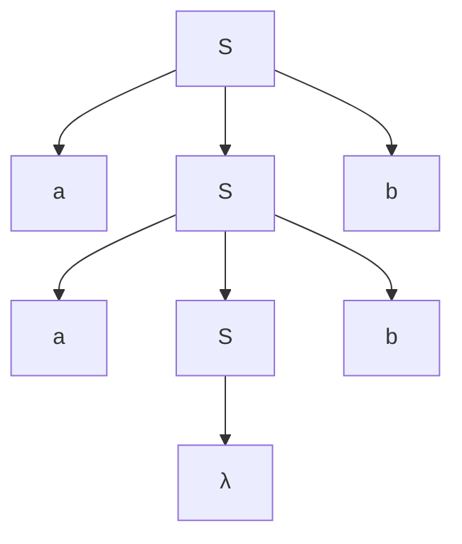
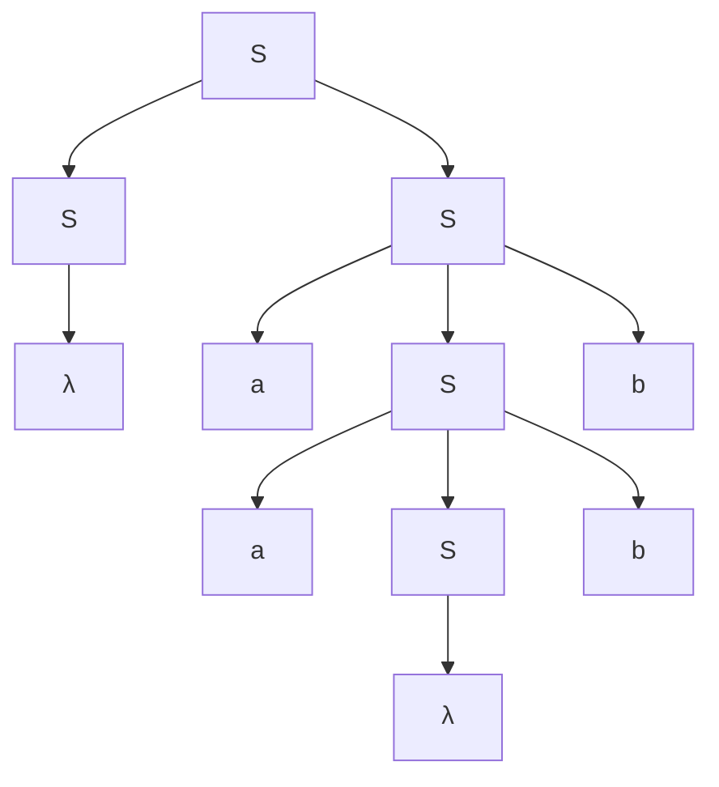
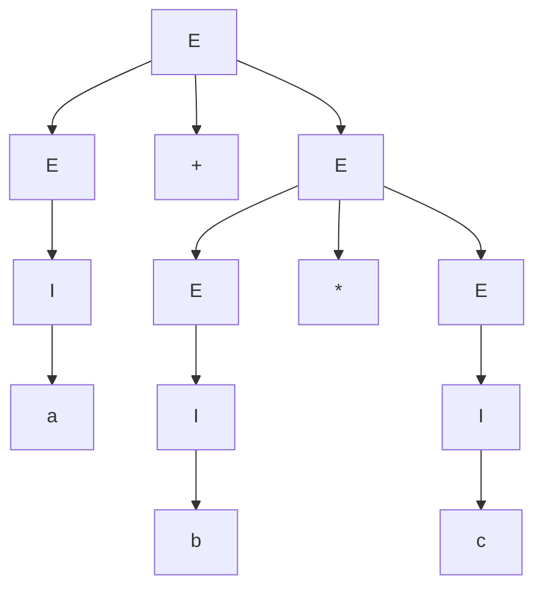
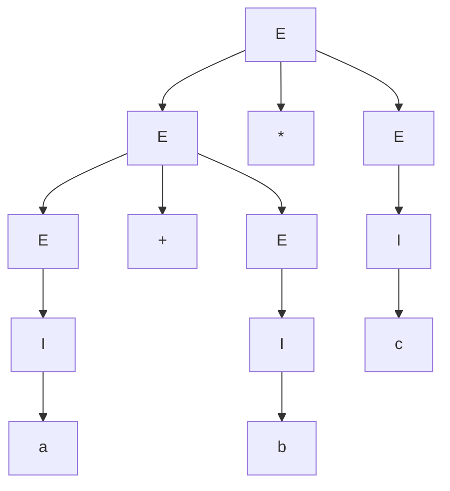
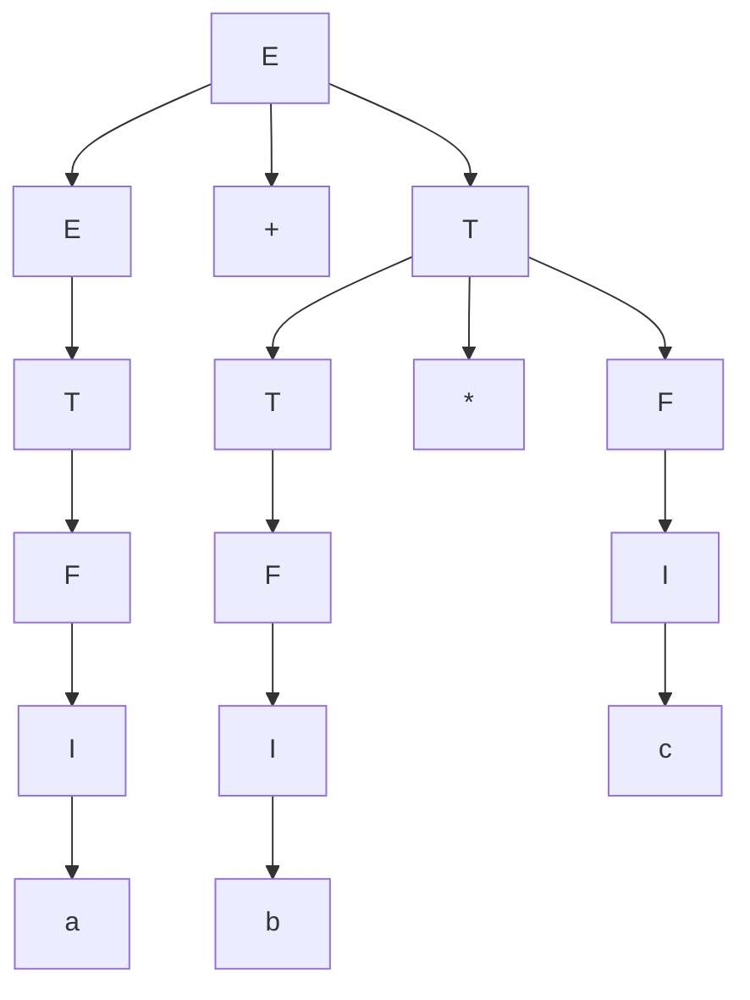

> [!Note] 💡 Notation Conventions
> - $G = (V, T, S, P)$: a grammar where $V$ = set of variables (non-terminals), $T$ = set of terminals, $S \in V$ = start symbol, $P$ = set of productions.
> - $\Sigma$: alphabet (general); in specific grammars the terminal set $T$ plays this role.
> - $\Rightarrow$: one-step derivation. $\overset{*}{\Rightarrow}$: zero-or-more-step derivation.
> - $\lambda$: the empty string.
> - $n_a(w)$: number of occurrences of symbol $a$ in string $w$.
> - $w^R$: reversal of string $w$.
> - Productions are sometimes numbered and written above $\Rightarrow$, e.g. $\overset{2}{\Rightarrow}$.
> - $|w|$: length of string $w$.

---

# Context-Free Languages

## 1. Motivation

Not all languages are regular. The canonical example is:

$$L = \{a^n b^n : n \geq 0\}$$

Strings like $aabb$ and $aaabbb$ belong to $L$; $aab$ does not. This language encodes a **nested/matching structure** — a hallmark of programming language constructs such as balanced parentheses, matched tags, and nested blocks.

Regular grammars cannot generate $L$. To handle such languages we expand to the **context-free** family.

---

## 2. Context-Free Grammars

> [!Definition] 📖 Definition 5.1 — Context-Free Grammar (CFG)
> A grammar $G = (V, T, S, P)$ is **context-free** if every production in $P$ has the form
> $$A \to x$$
> where $A \in V$ (a single variable) and $x \in (V \cup T)^*$ (any string of variables and terminals, including $\lambda$).
>
> A language $L$ is **context-free** if and only if there exists a CFG $G$ such that $L = L(G)$.

> [!Property] ⚙️ Regular ⊂ Context-Free
> Every regular grammar is context-free (right-linear productions $A \to aB$ and $A \to a$ trivially satisfy Definition 5.1). Therefore every regular language is also context-free.
> The family of regular languages is a **proper subset** of the family of context-free languages — there exist CFLs (e.g. $\{a^n b^n\}$) that are not regular.

> [!Note] 💡 Linear vs Context-Free
> A grammar is **linear** if every production has **at most one** variable on the right-hand side (e.g. $A \to aB$, $A \to a$, $A \to \lambda$). All regular grammars are linear; linear grammars are context-free; but a CFG need **not** be linear (the right-hand side may contain multiple variables).

---

## 3. Leftmost and Rightmost Derivations

When a sentential form contains more than one variable, we must choose which variable to replace next. Two canonical orderings exist.

> [!Definition] 📖 Definition 5.2 — Leftmost / Rightmost Derivation
> - A derivation is **leftmost** if at each step the **leftmost** variable in the current sentential form is replaced.
> - A derivation is **rightmost** if at each step the **rightmost** variable is replaced.

> [!Note] 💡 Same Productions, Different Order
> Two derivations of the same string may use exactly the same multiset of productions but in a different order, yielding the same derivation tree. The distinction between leftmost and rightmost is about *order of application*, not about *which* productions are used.

---

## 4. Derivation Trees (Parse Trees)

> [!Definition] 📖 Definition 5.3 — Derivation Tree
> Let $G = (V, T, S, P)$ be a CFG. An ordered tree is a **derivation tree** for $G$ if and only if:
> **1.** The root is labeled $S$.
> **2.** Every leaf has a label from $T \cup \{\lambda\}$.
> **3.** Every interior vertex has a label from $V$.
> **4.** If a vertex has label $A \in V$ and its children are labeled $a_1, a_2, \ldots, a_n$ (left to right), then $A \to a_1 a_2 \cdots a_n \in P$.
> **5.** A leaf labeled $\lambda$ has no siblings (i.e., its parent has exactly one child).

> [!Definition] 📖 Partial Derivation Tree (Subtree)
> A tree satisfying conditions 3, 4, 5 of Definition 5.3, but where:
> - Condition 1 need not hold (the root may be any variable, not necessarily $S$).
> - Condition 2 is replaced by: every leaf has a label from $V \cup T \cup \{\lambda\}$.
>
> The **yield** of a tree is the string obtained by reading the leaves left-to-right, omitting any $\lambda$'s.

> [!Theorem] 📌 Theorem 5.1 — Derivation Trees ↔ $L(G)$
> Let $G = (V, T, S, P)$ be a CFG. Then:
> **1.** For every $w \in L(G)$, there exists a derivation tree of $G$ whose yield is $w$.
> **2.** The yield of any derivation tree is in $L(G)$.
> **3.** If $t_G$ is any partial derivation tree for $G$ whose root is labeled $S$, then the yield of $t_G$ is a sentential form of $G$.

---

## 5. Parsing and Membership

> [!Definition] 📖 Membership Algorithm / Parsing
> Given a grammar $G$ and a string $w$ of terminals:
> - A **membership algorithm** decides whether $w \in L(G)$.
> - **Parsing** is the process of finding a sequence of productions (a derivation) by which $w \in L(G)$ is derived.

### 5.1 Exhaustive Search (Brute-Force) Parsing

A **top-down** parsing strategy that systematically constructs all possible leftmost derivations.

**Algorithm:**
> **Round 1 (S1):** Generate all sentential forms derivable from $S$ in one step (apply all productions $S \to x$).
> **Round $k$ (S2/S3):** Take each current sentential form, apply every applicable production to its leftmost variable; collect the resulting set of sentential forms. Reject sentential forms that can provably never yield $w$ (e.g. length already exceeds $|w|$).
> **Termination:** If $w \in L(G)$, it has a finite leftmost derivation, so the method terminates with that derivation. If $w \notin L(G)$, the method may not terminate in general.

> [!Warning] ⚠️ Flaws of Exhaustive Search
> **1.** **Combinatorial explosion** — the set of sentential forms can grow very rapidly.
> **2.** **Non-termination for strings not in $L(G)$** — if the grammar has $\lambda$-productions ($A \to \lambda$) or unit productions ($A \to B$), derivations can loop indefinitely without increasing string length.
> **3.** Fix for flaw 2: restrict to grammars with no $\lambda$-productions and no unit productions (see Theorem 5.2).

> [!Theorem] 📌 Theorem 5.2 — Exhaustive Search as an Algorithm
> Suppose $G = (V, T, S, P)$ is a CFG with **no** productions of the form
> $$A \to \lambda \quad \text{or} \quad A \to B \quad (A, B \in V).$$
> Then the exhaustive search parsing method can be made into an algorithm that, for any $w \in \Sigma^*$, either produces a parsing of $w$ or correctly concludes that $w \notin L(G)$.
>
> **Why it terminates:** Each application of a non-$\lambda$, non-unit production strictly increases the length of the sentential form. After at most $|w|$ rounds every candidate sentential form has length $\geq |w|+1$, so if $w$ has not been found, $w \notin L(G)$.

### 5.2 s-Grammars (Simple Grammars)

> [!Definition] 📖 Definition 5.4 — s-Grammar
> A CFG $G = (V, T, S, P)$ is a **simple grammar** (or **s-grammar**) if:
> **1.** Every production has the form $A \to ax$ where $A \in V$, $a \in T$, $x \in V^*$.
> **2.** Any pair $(A, a)$ occurs **at most once** in $P$ (i.e., for each variable $A$ and terminal $a$, there is at most one production starting with $A \to a\cdots$).

> [!Property] ⚙️ s-Grammar Properties
> - In an s-grammar, the next production to apply is determined immediately by the current leftmost variable **and** the next input terminal — no backtracking is ever needed.
> - s-grammars are a subclass of CFGs.

---

## 6. Ambiguity

> [!Definition] 📖 Definition 5.5 — Ambiguous Grammar
> A CFG $G$ is **ambiguous** if there exists some $w \in L(G)$ that has **at least two distinct derivation trees**. Equivalently, $w$ has two or more distinct leftmost (or rightmost) derivations.

> [!Definition] 📖 Definition 5.6 — Inherently Ambiguous Language
> A CFL $L$ is **unambiguous** if there exists at least one unambiguous CFG $G$ with $L = L(G)$.
> A CFL $L$ is **inherently ambiguous** if **every** CFG that generates $L$ is ambiguous.

> [!Warning] ⚠️ Grammar Ambiguity vs Language Ambiguity
> Ambiguity is a property of a **grammar**, not necessarily of the language it generates. A language may be ambiguous in one grammar but have an equivalent unambiguous grammar. Only when no unambiguous grammar exists is the language itself inherently ambiguous.

### 6.1 Removing Ambiguity — Arithmetic Expressions

The grammar
$$E \to I \mid E + E \mid E * E \mid (E), \qquad I \to a \mid b \mid c$$
is ambiguous: the string $a + b * c$ has two parse trees corresponding to $(a+b)*c$ vs $a+(b*c)$.

**Unambiguous replacement** — introduce precedence and associativity via new variables $T$ (term) and $F$ (factor):

$$E \to T \mid E + T$$
$$T \to F \mid T * F$$
$$F \to I \mid (E)$$
$$I \to a \mid b \mid c$$

This grammar encodes: $*$ binds tighter than $+$ (higher precedence); both $+$ and $*$ are left-associative. It generates the same language but is unambiguous.

---

## 7. CFGs and Programming Languages

Context-free languages underpin the **syntax** of programming languages:
- Regular languages handle lexical patterns (identifiers, literals, keywords).
- CFLs handle structural/syntactic constructs: nested parentheses, block structure, expression syntax, matched braces.

Compilers use CFGs and parsing algorithms (LL, LR, Earley, CYK) to convert source code into parse trees (abstract syntax trees) for further processing.

---

## 📘 Examples & Applications

### Example 1 — Palindromes over $\{a,b\}$

**Using:** CFG definition, derivation steps, language identification.

**Grammar:** $G = (\{S\}, \{a, b\}, S, P)$ with

$$S \to aSa \mid bSb \mid \lambda$$

**Claim:** $L(G) = \{ww^R : w \in \{a,b\}^*\}$ (even-length palindromes; also includes $\lambda$).

**Typical derivation:**

$$S \Rightarrow aSa \Rightarrow aaSaa \Rightarrow aabSbaa \Rightarrow aabbaa$$

The derived string $aabbaa = (aab)(aab)^R$ ✓.

---

### Example 2 — Language of Exercise Grammar

**Using:** CFG definition, tracing derivations to identify $L(G)$.

**Grammar:** $G = (\{S,A,B\}, \{a,b\}, S, P)$ with

$$S \to abB, \quad A \to aaBb, \quad B \to bbAa, \quad A \to \lambda$$

**Find $L(G)$.**

Start from $S \to abB$. We must expand $B$:

$$B \to bbAa$$

Expanding $A$:
- $A \to \lambda$: gives $B \Rightarrow bb\lambda a = bba$, so $S \Rightarrow abB \Rightarrow ab \cdot bba = abbba$.
- $A \to aaBb$: gives $B \Rightarrow bbaaBba$. Now expand the new $B$: $B \Rightarrow bbaaBba \Rightarrow \ldots$

Observe the pattern: each application of $A \to aaBb$ followed by $B \to bbAa$ appends $bbaa$ one layer deeper and contributes $ba$ on the right tail. Working out the structure:

$$L(G) = \{ab(bbaa)^n bba (ba)^n : n \geq 0\}$$

**Verification for $n=0$:**
$$S \Rightarrow abB \Rightarrow ab \cdot bbAa \Rightarrow ab \cdot bb\lambda a = abbba\underbrace{a}$$

Wait — recheck carefully:

$S \to abB$

$B \to bbAa \to bb\lambda a = bba$ (using $A\to\lambda$):

$$S \Rightarrow abB \Rightarrow ab \cdot bba = ab\,bba$$

So $n=0$ gives $abbba$. For $n=1$: use $A \to aaBb$ once:

$$B \Rightarrow bbAa \Rightarrow bb\,aaBb\,a \Rightarrow bb\,aa\,B\,ba$$

Then $B \to bbAa \to bba$:

$$\Rightarrow bb\,aa\,bba\,ba$$

Full string: $S \Rightarrow ab\,B \Rightarrow ab\,bb\,aa\,bba\,ba = ab(bbaa)bba(ba)$. ✓

$$\boxed{L(G) = \{ab(bbaa)^n bba(ba)^n : n \geq 0\}}$$

---

### Example 3 — $L = \{a^n b^m : n \neq m\}$

**Using:** CFG construction via case split, union of sub-grammars.

**Split into two cases:**

**Case $n > m$:** There are more $a$'s than $b$'s. Use $S_1 \to aS_1b \mid \lambda$ to match equal counts, plus $A \to aA \mid a$ to generate the surplus $a$'s:

$$S \to AS_1, \quad S_1 \to aS_1b \mid \lambda, \quad A \to aA \mid a$$

**Case $n < m$:** Symmetrically, use $B \to bB \mid b$ for surplus $b$'s:

$$S \to S_1B, \quad S_1 \to aS_1b \mid \lambda, \quad B \to bB \mid b$$

**Combined grammar:**

$$S \to AS_1 \mid S_1B$$
$$S_1 \to aS_1b \mid \lambda$$
$$A \to aA \mid a$$
$$B \to bB \mid b$$

---

### Example 4 — Properly Nested Parentheses

**Using:** CFG definition, language interpretation.

**Grammar:** $S \to aSb \mid SS \mid \lambda$

(Replace $a \leftrightarrow$ `(` and $b \leftrightarrow$ `)` for standard parentheses.)

**Language:**
$$L = \{w \in \{a,b\}^* : n_a(w) = n_b(w) \text{ and } n_a(v) \geq n_b(v) \text{ for every prefix } v \text{ of } w\}$$

This is the set of all **properly nested** bracket structures. Examples: $abaabb$, $aababb$, $ababab$ are all in $L$.

> [!Note] 💡 Note: This grammar is **not linear** (production $S \to SS$ has two variables on the right).

---

### Example 5 — Leftmost and Rightmost Derivations

**Using:** Definition 5.2, production numbering.

**Grammar:** $G = (\{A,B,S\}, \{a,b\}, S, P)$ with numbered productions:

$$\text{(1) } S \to AB \quad \text{(2) } A \to aaA \quad \text{(3) } A \to \lambda \quad \text{(4) } B \to Bb \quad \text{(5) } B \to \lambda$$

**Claim:** $L(G) = \{a^{2n}b^m : n \geq 0, m \geq 0\}$.

**Leftmost derivation of $aab$:**

$$S \overset{1}{\Rightarrow} AB \overset{2}{\Rightarrow} aaAB \overset{3}{\Rightarrow} aaB \overset{4}{\Rightarrow} aaBb \overset{5}{\Rightarrow} aab$$

(At each step, the leftmost variable is replaced.)

**Rightmost derivation of the same string $aab$:**

$$S \overset{1}{\Rightarrow} AB \overset{4}{\Rightarrow} ABb \overset{2}{\Rightarrow} aaABb \overset{5}{\Rightarrow} aaAb \overset{3}{\Rightarrow} aab$$

(At each step, the rightmost variable is replaced.)

Both derivations use productions $\{1,2,3,4,5\}$ once each but in different orders. ✓

---

### Example 6 — Leftmost and Rightmost Derivations (Exercise)

**Using:** Definition 5.2, derivation tracing.

**Grammar:**
$$S \to abAB, \quad A \to aaBb, \quad B \to bbAa, \quad A \to \lambda$$

**String:** $w = abbbaabbaba$

**Step 1 — Verify structure.** Rewrite $w$ as $ab \cdot bba \cdot ab \cdot ba$... Actually let us trace directly.

$S \to abAB$. We need the yield to be $abbbaabbaba$.

After $S \to abAB$, the remaining string to derive is $abbbaabbaba$ with the prefix $ab$ fixed. So $AB$ must yield $bbaabbaba$.

Try $A \to aaBb$: $A \Rightarrow aaBb$. Then $AB \Rightarrow aaBbB$. This places $aa$ at the front — but we need $bb$ first. So use $A \to \lambda$: $A \Rightarrow \lambda$, so $AB \Rightarrow B$.

$B$ must yield $bbaabbaba$. Use $B \to bbAa$: $B \Rightarrow bbAa$.

$bbAa$ must yield $bbaabbaba$. The frame $bb \cdot \_ \cdot a$ matches $bb \cdot aabbab \cdot a$... but $a$ at the end of $bbAa$ uses just one $a$. So $A$ must yield $aabbab$. Use $A \to aaBb$: $A \Rightarrow aaBb$. $aaBb$ must yield $aabbab$, so $B$ must yield $bab$... but $bab$ is not derivable from $B$ with these productions ($B \to bbAa$ gives length $\geq 3$ with $bb$ prefix; impossible for $bab$).

Let's try $B \to bbAa$ twice and $A \to \lambda$ at the right point.

$w = a\ b\ b\ b\ a\ a\ b\ b\ a\ b\ a$ (length 11).

$S \to abAB$: prefix $ab$ fixed; $AB$ yields $bbaabbaba$ (9 chars).

$A \to \lambda$, $B$ yields $bbaabbaba$:

$B \to bbAa$: frame $bb\ \_\ a$, $A$ yields $aabbab$... no, frame is $bb + A\text{-yield} + a$; total length of $B$-yield = 9, so $A$-yield must have length 6: $aabba$... length 5? $9 - 3 = 6$. So $A$ yields 6-char string from $aabbab$... $aabbab$ has 6 chars. But $A \to aaBb$: $aa\_b$ means $B$-yield has 2 chars $= bb$? No: $aaBb$ frame is $aa + B\text{-yield} + b$, length $= 2 + |B\text{-yield}| + 1 = 6 \Rightarrow |B\text{-yield}| = 3$. $B \to bbAa$: $bb + A\text{-yield} + a$, length $= 3 \Rightarrow |A\text{-yield}| = 0 \Rightarrow A \to \lambda$. So $B \Rightarrow bbAa \Rightarrow bb\lambda a = bba$.

Back-substitute: $A \Rightarrow aaBb \Rightarrow aa \cdot bba \cdot b = aabbab$. ✓

So the $B$ at the top yields: $B \Rightarrow bbAa \Rightarrow bb \cdot aabbab \cdot a = bbaabbaba$. ✓

Full derivation sequence:

$$S \to abAB \Rightarrow ab \cdot \lambda \cdot B = abB \Rightarrow ab \cdot bbAa = abbbAa$$
$$\Rightarrow abbb \cdot aaBb \cdot a = abbbaaBba \Rightarrow abbba \cdot bbAa \cdot ba = abbbaabbAaba$$

Hmm, getting confused with inline substitution. Let me write clean step-by-step derivations.

**Leftmost derivation:**

$$S$$
$$\overset{S\to abAB}{\Rightarrow} ab\,A\,B$$
$$\overset{A\to\lambda}{\Rightarrow} ab\,B$$
$$\overset{B\to bbAa}{\Rightarrow} ab\,bb\,A\,a$$
$$\overset{A\to aaBb}{\Rightarrow} ab\,bb\,aa\,B\,b\,a$$
$$\overset{B\to bbAa}{\Rightarrow} ab\,bb\,aa\,bb\,A\,a\,b\,a$$
$$\overset{A\to\lambda}{\Rightarrow} ab\,bb\,aa\,bb\,a\,b\,a = abbbaabbaba \checkmark$$

**Rightmost derivation:**

$$S$$
$$\overset{S\to abAB}{\Rightarrow} ab\,A\,B$$
$$\overset{B\to bbAa}{\Rightarrow} ab\,A\,bb\,A\,a$$
$$\overset{A\to\lambda}{\Rightarrow} ab\,A\,bb\,a \quad\text{(rightmost }A\text{)}$$
$$\overset{A\to aaBb}{\Rightarrow} ab\,aa\,B\,b\,bb\,a$$
$$\overset{B\to bbAa}{\Rightarrow} ab\,aa\,bb\,A\,a\,b\,bb\,a$$
$$\overset{A\to\lambda}{\Rightarrow} ab\,aa\,bb\,a\,b\,bb\,a = abaabbabbba$$

That does not equal $w$. Let me redo rightmost carefully, always replacing the **rightmost** variable.

$$S \overset{S\to abAB}{\Rightarrow} abAB$$

Rightmost variable is $B$:

$$\overset{B\to bbAa}{\Rightarrow} abA\,bbAa$$

Rightmost variable is $A$ (the second one):

$$\overset{A\to\lambda}{\Rightarrow} abA\,bba$$

Rightmost variable is $A$ (the first):

$$\overset{A\to aaBb}{\Rightarrow} ab\,aaBb\,bba$$

Rightmost variable is $B$:

$$\overset{B\to bbAa}{\Rightarrow} ab\,aa\,bbAa\,bba$$

Rightmost variable is $A$:

$$\overset{A\to\lambda}{\Rightarrow} ab\,aa\,bba\,bba = abaabbabba$$

That's 10 characters but $w$ is 11. Let me recount $w = abbbaabbaba$: a-b-b-b-a-a-b-b-a-b-a = 11. My leftmost derivation gave $ab\ bb\ aa\ bb\ a\ b\ a = a,b,b,b,a,a,b,b,a,b,a$ = 11 ✓.

For rightmost, I need to reach the same string. Let me re-examine which $A$ to use at the branching point:

$$abAB \overset{B\to bbAa}{\Rightarrow} abA\ bbAa$$

Rightmost $A$ (position 2): use $A \to aaBb$:

$$\overset{A\to aaBb}{\Rightarrow} abA\ bb\,aaBb\,a$$

Rightmost $B$: use $B \to bbAa$:

$$\overset{B\to bbAa}{\Rightarrow} abA\ bb\,aa\,bbAa\,a$$

Rightmost $A$: use $A \to \lambda$:

$$\overset{A\to\lambda}{\Rightarrow} abA\ bb\,aa\,bb\,a\,a$$

Rightmost (now only) $A$: use $A \to \lambda$:

$$\overset{A\to\lambda}{\Rightarrow} ab\ bb\,aa\,bb\,a\,a = abbbaabbaa$$

That's 10 chars. Still off. The issue is the grammar itself has limited derivation paths; $w = abbbaabbaba$ may have only one derivation path (leftmost and rightmost coincide in structure). Using rightmost order on the same production sequence as leftmost:

Productions used (leftmost): $S\to abAB$, $A\to\lambda$, $B\to bbAa$, $A\to aaBb$, $B\to bbAa$, $A\to\lambda$.

**Rightmost derivation using the same productions in rightmost order:**

$$S \overset{S\to abAB}{\Rightarrow} abAB$$

Replace $B$ (rightmost):

$$\overset{B\to bbAa}{\Rightarrow} abA\ bbAa$$

Replace $A$ at position 2 (rightmost $A$) — but we need to use $A\to aaBb$ here (not $\lambda$) to match the overall structure:

$$\overset{A\to aaBb}{\Rightarrow} abA\ bb\,aaB\,b\,a$$

Replace $B$ (rightmost):

$$\overset{B\to bbAa}{\Rightarrow} abA\ bb\,aa\,bbA\,a\,b\,a$$

Replace $A$ at position 2 (rightmost $A$):

$$\overset{A\to\lambda}{\Rightarrow} abA\ bb\,aa\,bb\,a\,b\,a$$

Replace $A$ at position 1 (only $A$ left):

$$\overset{A\to\lambda}{\Rightarrow} ab\ bb\,aa\,bb\,a\,b\,a = abbbaabbaba \checkmark$$

**Rightmost derivation:**

$$S \Rightarrow abAB \Rightarrow abA\,bbAa \Rightarrow abA\,bb\,aaBba \Rightarrow abA\,bb\,aa\,bbAaba \Rightarrow abA\,bb\,aa\,bb\,aba \Rightarrow abbbaabbaba$$

---

### Example 7 — Exhaustive Search Parsing

**Using:** Exhaustive search algorithm, Theorem 5.2.

**Grammar:** $G$ with $S \to SS \mid aSb \mid bSa \mid \lambda$. **String:** $w = aabb$.

| Round | Sentential forms generated |
|-------|---------------------------|
| 1 | $SS$, $aSb$, $bSa$, $\lambda$ |
| 2 (from $SS$) | $SSS$, $aSbS$, $bSaS$, $S$ |
| 2 (from $aSb$) | $aSSb$, $aaSbb$, $abSab$, $ab$ |
| 3 (from $aaSbb$) | $\ldots \Rightarrow aabb$ ✓ |

Full parse: $S \overset{2}{\Rightarrow} aSb \overset{2}{\Rightarrow} aaSbb \overset{4}{\Rightarrow} aabb$. ✓

> [!Note] 💡 Termination issue
> With $\lambda$-productions and unit productions present, this method may not terminate for strings **not** in $L(G)$. Removing those production types (Theorem 5.2) fixes termination.

---

### Example 8 — s-Grammar Identification

**Using:** Definition 5.4.

**(a)** $S \to aS \mid bSS \mid c$ — **Is an s-grammar.**
- Pairs: $(S,a)$, $(S,b)$, $(S,c)$ — each appears once. All productions have terminal-first form. ✓

**(b)** $S \to aS \mid bSS \mid aSS \mid c$ — **Not an s-grammar.**
- Pair $(S,a)$ appears twice ($S\to aS$ and $S\to aSS$). ✗

---

### Example 9 — Ambiguous Grammar: $S \to aSb \mid SS \mid \lambda$

**Using:** Definition 5.5, derivation trees.

**Claim:** This grammar is ambiguous — the string $aabb$ has two distinct derivation trees.

**Tree 1** (using $S \Rightarrow aSb \Rightarrow aaSbb \Rightarrow aabb$):

**Tree 2** (using $S \Rightarrow SS \Rightarrow aSb \cdot S \Rightarrow ab \cdot aSb \Rightarrow ab \cdot aλb = aabb$):

Two distinct derivation trees for $aabb$ ⟹ grammar is ambiguous. ✓

---

### Example 10 — Arithmetic Expression Grammar (Ambiguous)

**Using:** Definition 5.5, derivation trees.

**Grammar:**

$$E \to I \mid E+E \mid E*E \mid (E), \qquad I \to a \mid b \mid c$$

**String $w = a + b * c$** has two parse trees:

**Tree (a)** — $+$ is the root operator (interprets as $(a+b)*c$ style grouping at top):

**Tree (b)** — $*$ is the root operator:

Two trees ⟹ ambiguous. ✓

---

### Example 11 — Unambiguous Arithmetic Grammar

**Using:** Definition 5.6, derivation tree uniqueness.

**Grammar:**

$$E \to T \mid E + T$$
$$T \to F \mid T * F$$
$$F \to I \mid (E)$$
$$I \to a \mid b \mid c$$

**Derivation of $w = a + b * c$:**

$$E \Rightarrow E+T \Rightarrow T+T \Rightarrow F+T \Rightarrow I+T \Rightarrow a+T \Rightarrow a+T*F \Rightarrow a+F*F \Rightarrow a+I*F \Rightarrow a+b*F \Rightarrow a+b*I \Rightarrow a+b*c$$

**Parse tree** (unique):

Only one derivation tree possible ⟹ grammar is unambiguous. ✓

---

### Example 12 — Inherently Ambiguous Language

**Using:** Definition 5.6, inherent ambiguity.

$$L = \{a^n b^n c^m : n,m \geq 0\} \cup \{a^n b^m c^m : n,m \geq 0\}$$

**Grammars for each part:**

$$G_1:\; S_1 \to X_1 C, \quad X_1 \to aX_1b \mid \lambda, \quad C \to cC \mid \lambda$$

$$G_2:\; S_2 \to AX_2, \quad X_2 \to bX_2c \mid \lambda, \quad A \to aA \mid \lambda$$

**Combined grammar:** add $S \to S_1 \mid S_2$.

**Why it is inherently ambiguous:** Every string of the form $a^n b^n c^n$ (equal counts of all three) belongs to **both** $L_1$ and $L_2$. In any grammar generating $L$, such a string must have at least two parse trees — one rooted via $S_1$-type derivation and one via $S_2$-type. No restructuring can eliminate this, so $L$ is inherently ambiguous.

---

### Example 13 — Proving a Grammar Ambiguous (Exercise)

**Using:** Definition 5.5.

**Grammar:** $S \to AB \mid aaB$, $A \to a \mid Aa$, $B \to b$.

**Claim:** Ambiguous. Find a string with two leftmost derivations.

Consider $w = aab$:

**Derivation 1** (via $S \to AB$):

$$S \Rightarrow AB \Rightarrow AaB \Rightarrow aaB \Rightarrow aab$$

(Used $A \to Aa$ then $A \to a$, $B \to b$.)

**Derivation 2** (via $S \to aaB$):

$$S \Rightarrow aaB \Rightarrow aab$$

Two distinct derivation trees for $aab$ ⟹ grammar is ambiguous. ✓

---

### Example 14 — Proving $S \to aSbS \mid bSaS \mid \lambda$ is Ambiguous (Exercise)

**Using:** Definition 5.5.

Consider $w = abab$:

**Derivation 1:**

$$S \Rightarrow aSbS \Rightarrow abSbS \Rightarrow ab\lambda bS \Rightarrow abbS \Rightarrow abb\,aSbS$$

Hmm, that gives length $> 4$ immediately. Let me use $\lambda$ more carefully.

$$S \Rightarrow aSbS \overset{S\to\lambda}{\Rightarrow} abS \overset{S\to aSbS}{\Rightarrow} ab\,aSbS \overset{S\to\lambda}{\Rightarrow} ab\,abS \overset{S\to\lambda}{\Rightarrow} abab$$

**Derivation 2:**

$$S \Rightarrow aSbS \overset{S\to aSbS}{\Rightarrow} a\,aSbS\,bS \overset{S\to\lambda}{\Rightarrow} a\,abS\,bS \overset{S\to\lambda}{\Rightarrow} a\,ab\,bS \overset{S\to\lambda}{\Rightarrow} aabb$$

That gives $aabb$, not $abab$. Try $w = abab$ more carefully for Derivation 2:

$$S \Rightarrow aSbS \overset{\text{inner }S\to aSbS}{\Rightarrow} a\,(aSbS)\,bS \overset{S_1\to\lambda}{\Rightarrow} a\,abS\,bS \overset{S_2\to\lambda}{\Rightarrow} aab\,bS \overset{S_3\to\lambda}{\Rightarrow} aabb$$

Different string. Let me try $w = abba$ for a cleaner demonstration:

**$w = abba$:**

**Derivation 1:** $S \Rightarrow aSbS \Rightarrow a\lambda bS \Rightarrow abS \Rightarrow ab\,bSaS \Rightarrow ab\,b\lambda aS \Rightarrow abba\,S \Rightarrow abba\lambda = abba$

Productions: $S\to aSbS$, $S\to\lambda$, $S\to bSaS$, $S\to\lambda$, $S\to\lambda$.

**Derivation 2:** $S \Rightarrow bSaS \Rightarrow b\lambda aS \Rightarrow baS \Rightarrow ba\,aSbS \Rightarrow ba\,a\lambda bS \Rightarrow baab\,S \Rightarrow baab\lambda = baab$

That's a different string. For $abba$ via $bSaS$ first: $S \Rightarrow bSaS$ gives prefix $b$ — can't yield $abba$.

The standard approach: take $w = ab$ (length 2):

**Derivation 1:** $S \Rightarrow aSbS \Rightarrow a\lambda bS \Rightarrow ab\lambda = ab$

**Derivation 2:** $S \Rightarrow aSbS \Rightarrow aSb\lambda \Rightarrow a\lambda b = ab$

These two derivations are distinct (in the first, the **left** $S$ is replaced first with $\lambda$; in the second, the **right** $S$ is replaced first with $\lambda$). They yield distinct parse trees (different structure even though both produce $ab$). Hence the grammar is ambiguous. ✓

---

## 🗂️ Summary

**Context-Free Grammars**
- $G = (V,T,S,P)$; every production $A \to x$ where $A \in V$, $x \in (V\cup T)^*$.
- Regular $\subsetneq$ Linear $\subseteq$ Context-Free.
- A production $A\to x$ with $|x|_V \leq 1$ makes it linear; no restriction on $|x|_V$ = context-free.

**Derivations**
- **Leftmost:** always replace the leftmost variable.
- **Rightmost:** always replace the rightmost variable.
- Same set of productions can be applied in different orders, yielding the same parse tree.

**Derivation Trees**
- Root = $S$; leaves $\in T \cup \{\lambda\}$; interior nodes $\in V$; children of node $A$ = right-hand side of some production for $A$; $\lambda$-leaf has no siblings.
- **Yield** = left-to-right leaf sequence (omit $\lambda$).
- Theorem 5.1: $w \in L(G) \iff$ there is a derivation tree with yield $w$.

**Parsing**
- Exhaustive search: build all leftmost derivations round by round.
- Terminates (Theorem 5.2) if the grammar has no $A\to\lambda$ or $A\to B$ productions — each production strictly increases sentential form length; at most $|w|$ rounds needed.
- **s-Grammar** (Definition 5.4): all productions $A \to ax$ ($a \in T$, $x \in V^*$); each pair $(A,a)$ occurs at most once. Parsing is deterministic (no backtracking).

**Ambiguity**
- **Ambiguous grammar** (Def. 5.5): some $w \in L(G)$ has $\geq 2$ distinct derivation trees (equivalently, $\geq 2$ leftmost or rightmost derivations).
- **Unambiguous language** (Def. 5.6): at least one unambiguous grammar exists for it.
- **Inherently ambiguous language** (Def. 5.6): **every** grammar generating it is ambiguous.
- Key example: $E \to I \mid E+E \mid E*E \mid (E)$ is ambiguous; can be made unambiguous by encoding operator precedence and associativity via $E \to T \mid E+T$, $T \to F \mid T*F$, $F \to I \mid (E)$.
- $\{a^nb^nc^m\} \cup \{a^nb^mc^m\}$ is inherently ambiguous — strings $a^nb^nc^n$ admit two structurally distinct derivations in any grammar.

**CFLs and Programming Languages**
- Regular languages: lexical patterns (tokens).
- Context-free languages: syntactic structure (nesting, matching, expressions).
- Compilers use CFGs + parsing algorithms to build abstract syntax trees.
