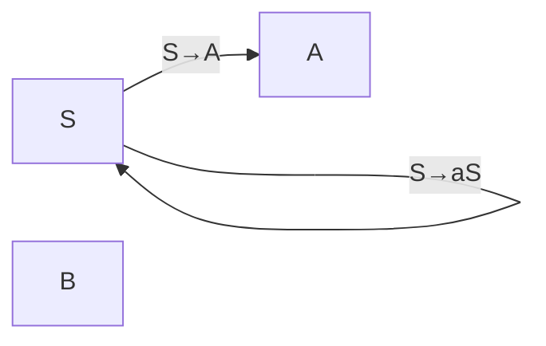
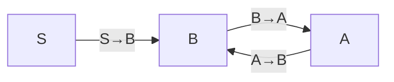

> [!Note] 💡 Notation Conventions
> Throughout this note the following conventions are fixed:
> - $G = (V, T, S, P)$ — a CFG where $V$ = set of **variables** (nonterminals), $T$ = set of **terminals**, $S \in V$ = **start variable**, $P$ = set of **productions**.
> - $\lambda$ — the **empty string**.
> - $\Sigma^*$ — the set of all strings over an alphabet $\Sigma$.
> - $\Rightarrow$ — **one-step derivation**; $\Rightarrow^*$ — **zero-or-more-step derivation**.
> - $V^*$, $(V \cup T)^*$ — Kleene closure of the respective set.
> - $\hat{G} = (\hat{V}, \hat{T}, S, \hat{P})$ — the **transformed grammar** produced by a procedure.
> - CNF = **Chomsky Normal Form**; GNF = **Greibach Normal Form**.
## 📑 Overview

Unrestricted CFGs can contain **useless productions**, **$\lambda$-productions**, and **unit-productions** that complicate parsing and proofs. This topic covers:
1. Removing each type of undesirable production.
2. Converting any CFG into **CNF** or **GNF**.

> [!Note] 💡 Scope Restriction
> Throughout this lecture, $\lambda \notin L(G)$ is assumed (i.e., the grammar does not generate the empty string). Any CFL $L$ containing $\lambda$ can be handled by writing $L = L_1 \cup \{\lambda\}$ where $L_1 = L - \{\lambda\}$, building a grammar $G_1$ for $L_1$, then adding a fresh start variable $S_0$ with $S_0 \to S \mid \lambda$.

---

## 1. Useful Substitution Rule

> [!Theorem] 📌 Theorem 6.1 — Substitution Rule
> Let $G = (V, T, S, P)$ be a CFG containing production $A \to x_1 B x_2$ (where $A \neq B$ are variables). Let $B \to y_1 \mid y_2 \mid \cdots \mid y_n$ be **all** $B$-productions.
>
> Form $\hat{G}$ by:
> - **Deleting** $A \to x_1 B x_2$ from $P$.
> - **Adding** $A \to x_1 y_1 x_2 \mid x_1 y_2 x_2 \mid \cdots \mid x_1 y_n x_2$.
>
> Then $L(\hat{G}) = L(G)$.

This rule is used throughout simplification and normal-form conversions to **inline** one variable's productions into another.

---

## 2. Removing Useless Productions

### 2.1 Definitions

> [!Definition] 📖 Definition 6.1 — Useful / Useless Variable
> A variable $A \in V$ is **useful** if and only if there exists at least one $w \in L(G)$ such that:
> $$S \Rightarrow^* x A y \Rightarrow^* w, \quad x, y \in (V \cup T)^*$$
> A variable that is **not** useful is called **useless**. A production is **useless** if it involves any useless variable.

A variable can be useless for two independent reasons:

> [!Property] ⚙️ Two Cases of Uselessness
> **Case 1 (Non-terminating):** $A$ cannot derive any terminal string, i.e., $A \not\Rightarrow^* w$ for any $w \in T^*$.
>
> **Case 2 (Unreachable):** $A$ cannot be reached from $S$, i.e., $S \not\Rightarrow^* x A y$ for any $x, y$.

### 2.2 Procedure

> [!Property] ⚙️ Correct Order for Removing Useless Productions
> **1.** First remove Case-1 variables (non-terminating).
> **2.** Then remove Case-2 variables (unreachable).
>
> **⚠️ Order matters.** Doing Case 2 before Case 1 may leave behind Case-2 useless variables after Case-1 removal (see the counter-example below).

**Detecting Case 1** — iteratively mark variables that can produce a terminal string:
- Mark $A$ if $A \to w \in T^*$ directly.
- Mark $B$ if $B \to A_1 A_2 \cdots A_n$ and all $A_i$ are already marked.
- Remove all unmarked variables and their productions.

**Detecting Case 2** — draw a **dependency graph**:
- Vertices = variables.
- Edge $C \to D$ iff there is a production $C \to \cdots D \cdots$.
- A variable is reachable iff there is a directed path from $S$ to it. Remove unreachable vertices and their productions.

> [!Theorem] 📌 Theorem 6.2
> For any CFG $G$, there exists an equivalent $\hat{G}$ containing no useless variables or productions.

---

## 3. Removing $\lambda$-Productions

> [!Definition] 📖 Definition 6.2 — $\lambda$-Production & Nullable Variable
> A production $A \to \lambda$ is called a **$\lambda$-production**.
> A variable $A$ is **nullable** if $A \Rightarrow^* \lambda$.

> [!Theorem] 📌 Theorem 6.3
> Let $G$ be a CFG with $\lambda \notin L(G)$. Then there exists an equivalent grammar with **no $\lambda$-productions**.

### Procedure: Remove $\lambda$-Productions

**S1) Find the nullable set $V_N$:**
- **1.** For every production $A \to \lambda$, add $A$ to $V_N$.
- **2.** Repeat: if $B \to A_1 A_2 \cdots A_n$ and all $A_i \in V_N$, add $B$ to $V_N$. Continue until no new variable is added.

**S2) Construct $\hat{P}$:**
For every production $A \to x_1 x_2 \cdots x_m$ ($m \geq 1$, $x_i \in V \cup T$):
- Add to $\hat{P}$ the original production **and** all productions obtained by independently replacing each nullable $x_i$ with $\lambda$ (i.e., deleting it), in all non-empty subsets of nullable positions.
- **Exception:** if all $x_i$ are nullable, do **not** add $A \to \lambda$.

---

## 4. Removing Unit-Productions

> [!Definition] 📖 Definition 6.3 — Unit-Production
> A production $A \to B$ where $A, B \in V$ is called a **unit-production**.

> [!Theorem] 📌 Theorem 6.4
> For any CFG $G$ without $\lambda$-productions, there exists an equivalent $\hat{G}$ with **no unit-productions**.

### Procedure: Remove Unit-Productions

**S1)** Put all **non-unit** productions of $P$ into $\hat{P}$.

**S2)** Build the **dependency graph** for unit-productions: edge $(A, B)$ iff $A \to B \in P$. Find all pairs $(A, B)$ such that $A \Rightarrow^* B$ (i.e., $B$ is reachable from $A$ by a walk).

**S3)** For each such pair $(A, B)$: if $B \to y_1 \mid y_2 \mid \cdots \mid y_n$ are the non-unit productions of $B$, add $A \to y_1 \mid \cdots \mid y_n$ to $\hat{P}$.

---

## 5. Full Simplification

> [!Theorem] 📌 Theorem 6.5
> Let $L$ be a CFL not containing $\lambda$. Then there exists a CFG generating $L$ that has **no useless productions, no $\lambda$-productions, and no unit-productions**.

> [!Property] ⚙️ Simplification Order
> Apply the three removal steps in this order:
> **1.** Remove $\lambda$-productions.
> **2.** Remove unit-productions.
> **3.** Remove useless productions (Case 1 then Case 2).

---

## 6. Chomsky Normal Form (CNF)

> [!Definition] 📖 Definition 6.4 — Chomsky Normal Form
> A CFG is in **Chomsky Normal Form** (CNF) if every production has one of the forms:
> $$A \to BC \qquad \text{or} \qquad A \to a$$
> where $A, B, C \in V$ and $a \in T$.

> [!Theorem] 📌 Theorem 6.6
> For any CFG $G$ with $\lambda \notin L(G)$, there exists an equivalent grammar $\hat{G}$ in CNF.

### Procedure: G2GChomsky

*Precondition: $G$ has no $\lambda$-, unit-, or useless productions.*

**S1)** For each production $A \to a$ (single terminal), add it directly to $\hat{P}$.

**S2)** For each production $A \to x_1 x_2 \cdots x_n$ with $n \geq 2$:
- Introduce a new variable $B_a$ for each terminal $a \in T$.
- Replace each terminal $x_i = a$ with $B_a$, and each variable stays as-is. This gives:
$$A \to C_1 C_2 \cdots C_n, \quad B_a \to a$$
where $C_i = x_i$ if $x_i \in V$, else $C_i = B_{x_i}$.
- Productions of length exactly $n = 2$ are already CNF; add them to $\hat{P}$.

**S3)** For $n > 2$, introduce fresh variables $D_1, D_2, \ldots$ to binarize:
$$A \to C_1 D_1,\quad D_1 \to C_2 D_2,\quad \ldots,\quad D_{n-3} \to C_{n-2} D_{n-2},\quad D_{n-2} \to C_{n-1} C_n$$

---

## 7. Greibach Normal Form (GNF)

> [!Definition] 📖 Definition 6.5 — Greibach Normal Form
> A CFG is in **Greibach Normal Form** (GNF) if every production has the form:
> $$A \to a\, x, \quad a \in T,\; x \in V^*$$
> i.e., every right-hand side **starts with a terminal** followed by zero or more variables.

> [!Note] 💡 GNF vs. s-grammar
> An s-grammar also requires $A \to ax$ form, but additionally restricts each pair $(A, a)$ to appear at most once in $P$. GNF has **no such restriction**, giving it full CFL generality.

> [!Theorem] 📌 Theorem 6.7
> For any CFG $G$ with $\lambda \notin L(G)$, there exists an equivalent grammar $\hat{G}$ in GNF.

**Key technique:** Use the **Substitution Rule (Theorem 6.1)** to inline productions until every right-hand side begins with a terminal. For productions mixing terminals with variables mid-string, introduce terminal-proxy variables ($B_a \to a$) as in CNF, then substitute.

---

## 📘 Examples & Applications

### Example 1 — Substitution Rule

**Using:** Theorem 6.1 (substitution rule)

Given $G = (\{A, B\}, \{a,b,c\}, A, P)$:
$$A \to a \mid aaA \mid abBc, \qquad B \to abbA \mid b$$

Substitute all $B$-productions into the production $A \to abBc$:
$$A \to a \mid aaA \mid ab(abbA)c \mid ab(b)c$$
$$= a \mid aaA \mid ababbAc \mid abbc$$

The string $aaabbc$ can now be derived in $\hat{G}$ via:
$$A \Rightarrow aaA \Rightarrow aaabbc$$
instead of the 3-step derivation in $G$.

---

### Example 2 — Removing Useless Productions (Full Worked)

**Using:** Definition 6.1, Case 1 (non-terminating), Case 2 (unreachable), dependency graph

Given $G$ with $V = \{S, A, B, C\}$, $T = \{a, b\}$:
$$S \to aS \mid A \mid C, \quad A \to a, \quad B \to aa, \quad C \to aCb$$

**Step 1 — Case 1:** Which variables can derive a terminal string?
- $A \to a$ ✓, $B \to aa$ ✓, $S \to A \to a$ ✓.
- $C \to aCb$: right-hand side always contains $C$; $C$ cannot escape. ✗

Remove $C$ and all productions involving $C$. Grammar $G_1$:
$$S \to aS \mid A, \quad A \to a, \quad B \to aa$$

**Step 2 — Case 2:** Draw the dependency graph for $G_1$:

$B$ has no incoming edge from $S$. It is unreachable.

Remove $B$ and $B \to aa$. Final grammar $\hat{G}$: $\hat{V} = \{S, A\}$, $\hat{T} = \{a\}$:
$$S \to aS \mid A, \quad A \to a$$

> [!Warning] ⚠️ Order Counter-Example
> Grammar: $S \to aSb \mid ab \mid A$, $A \to aAB$, $B \to b$.
> - Case 2 first: no variable is unreachable (both $A$ and $B$ reachable from $S$). No change.
> - Case 1: $A \to aAB$ — $A$ can only grow; $A$ is non-terminating. Remove productions 3, 4. New grammar: $S \to aSb \mid ab$, $B \to b$.
> - Now $B$ is **unreachable** (Case 2 leftovers) — but we already ran Case 2 first. Had we done Case 1 → Case 2 in the correct order, $B$ would be caught in the second Case-2 pass.
> **Lesson:** always do Case 1 before Case 2.

---

### Example 3 — Removing $\lambda$-Productions

**Using:** Theorem 6.3, nullable set $V_N$

Given:
$$S \to ABaC, \quad A \to BC, \quad B \to b \mid \lambda, \quad C \to D \mid \lambda, \quad D \to d$$

**S1)** Find $V_N$:
- $B \to \lambda$ ✓ → $B \in V_N$.
- $C \to \lambda$ ✓ → $C \in V_N$.
- $A \to BC$, both $B, C \in V_N$ → $A \in V_N$.
- $S \to ABaC$: $a \notin V_N$ so $S$ is not nullable.

$V_N = \{A, B, C\}$.

**S2)** Generate $\hat{P}$ by substituting $\lambda$ for nullable positions:

For $S \to ABaC$ (nullable positions: $A$ at pos 1, $B$ at pos 2, $C$ at pos 4 — $a$ is a terminal, not nullable):

| Omitted nullables | Resulting production |
|---|---|
| none | $S \to ABaC$ |
| $A$ | $S \to BaC$ |
| $B$ | $S \to AaC$ |
| $C$ | $S \to ABa$ |
| $A, B$ | $S \to aC$ |
| $A, C$ | $S \to Ba$ |
| $B, C$ | $S \to Aa$ |
| $A, B, C$ | $S \to a$ |

For $A \to BC$ (both nullable): $A \to BC \mid B \mid C$ (not $A \to \lambda$).

For $B \to b$: $B \to b$ (no nullable positions).

For $C \to D$: $C \to D$ (not nullable — $D$ is not in $V_N$).

Final $\hat{P}$:
$$S \to ABaC \mid BaC \mid AaC \mid ABa \mid aC \mid Ba \mid Aa \mid a$$
$$A \to BC \mid B \mid C$$
$$B \to b$$
$$C \to D$$
$$D \to d$$

---

### Example 4 — Removing Unit-Productions

**Using:** Definition 6.3, Theorem 6.4, dependency graph

Given:
$$S \to Aa \mid B, \quad B \to A \mid bb, \quad A \to a \mid bc \mid B$$

**S1)** Non-unit productions into $\hat{P}$:
$$S \to Aa, \quad B \to bb, \quad A \to a \mid bc$$

**S2)** Unit-production dependency graph:

Reachability:
- $S \Rightarrow^* B$ (direct), $S \Rightarrow^* A$ (via $B$).
- $A \Rightarrow^* B$ (direct), $B \Rightarrow^* A$ (direct).

**S3)** Add non-unit productions of each reachable target:

| Pair | Non-unit productions of target | New rules for source |
|---|---|---|
| $S \Rightarrow^* A$ | $a \mid bc$ | $S \to a \mid bc$ |
| $S \Rightarrow^* B$ | $bb$ | $S \to bb$ |
| $A \Rightarrow^* B$ | $bb$ | $A \to bb$ |
| $B \Rightarrow^* A$ | $a \mid bc$ | $B \to a \mid bc$ |

Final $\hat{P}$:
$$S \to Aa \mid a \mid bc \mid bb$$
$$A \to a \mid bc \mid bb$$
$$B \to bb \mid a \mid bc$$

---

### Example 5 — Converting to CNF (Full Worked)

**Using:** Theorem 6.6, G2GChomsky procedure

Given (already simplified):
$$S \to a \mid ABa, \quad A \to aab, \quad B \to b \mid Ac$$

**S1)** Single-terminal productions go directly to $\hat{P}$:
$$S \to a, \quad B \to b$$

**S2)** Introduce terminal proxies $B_a \to a$, $B_b \to b$, $B_c \to c$.

Replace terminals in long productions:
$$S \to AB_a \quad (\text{wait — } S \to ABa \text{ has length 3, handle in S3})$$

Rewrite all $n \geq 2$ productions using proxies:
- $S \to A\,B\,B_a$ (length 3 → S3)
- $A \to B_a B_a B_b$ (length 3 → S3)
- $B \to A B_c$ (length 2, already CNF ✓)

Add $B_a \to a$, $B_b \to b$, $B_c \to c$ to $\hat{P}$.

**S3)** Binarize length-3 productions with fresh variables $D_1$, $D_2$:

$S \to A\,B\,B_a$: introduce $D_1$:
$$S \to A D_1, \quad D_1 \to B B_a$$

$A \to B_a\,B_a\,B_b$: introduce $D_2$:
$$A \to B_a D_2, \quad D_2 \to B_a B_b$$

Final $\hat{P}$ in CNF:
$$S \to a \mid A D_1$$
$$B \to b \mid A B_c$$
$$D_1 \to B B_a$$
$$A \to B_a D_2$$
$$D_2 \to B_a B_b$$
$$B_a \to a, \quad B_b \to b, \quad B_c \to c$$

---

### Example 6 — Converting to GNF (via Substitution)

**Using:** Definition 6.5, Theorem 6.1

**Case A — via inline substitution:**

Given:
$$S \to AB, \quad A \to aA \mid bB \mid b, \quad B \to b$$

$S \to AB$ does not start with a terminal. Apply Theorem 6.1: substitute $A$-productions into $S \to AB$:
$$S \to aAB \mid bBB \mid bB$$

All right-hand sides now start with a terminal. Result in GNF:
$$S \to aAB \mid bBB \mid bB, \quad A \to aA \mid bB \mid b, \quad B \to b$$

**Case B — via terminal proxies:**

Given: $S \to abSb \mid aa$

Introduce $A \to a$ and $B \to b$. Replace internal terminals:
$$S \to aBSB \mid aA, \quad A \to a, \quad B \to b$$

Every production now has form $A \to a\,x$ with $x \in V^*$. ✓

---

## 🗂️ Summary

- **Substitution Rule (Thm 6.1):** Replace $A \to x_1 B x_2$ by inlining all $B$-productions; language preserved.

- **Useless variable (Def 6.1):** Either cannot derive a terminal string (Case 1) or is unreachable from $S$ (Case 2).

- **Removal order:** Case 1 **then** Case 2. Reversing may leave residual Case-2 useless variables.

- **Dependency graph:** Vertices = variables; edge $(C \to D)$ iff production $C \to \cdots D \cdots$ exists. Used for both useless-variable detection and unit-production closure.

- **$\lambda$-production removal (Thm 6.3):** Compute nullable set $V_N$ iteratively, then generate all non-empty subsets of nullable-position replacements for every production.

- **Unit-production removal (Thm 6.4):** Keep non-unit productions; for each $A \Rightarrow^* B$ (via unit chain), copy all non-unit productions of $B$ to $A$.

- **Full simplification order (Thm 6.5):** $\lambda$-removal → unit-removal → useless-removal (Case 1 then Case 2).

- **CNF (Def 6.4):** All productions of the form $A \to BC$ or $A \to a$.
  - Replace terminals in long RHS with proxy variables $B_a \to a$.
  - Binarize length-$n$ ($n > 2$) productions with fresh variables $D_i$.

- **GNF (Def 6.5):** All productions of the form $A \to ax$ ($a \in T$, $x \in V^*$).
  - Use substitution rule to push a terminal to the front of every RHS.
  - Use terminal-proxy variables for productions where a terminal is buried mid-string.

- **Existence theorems:** Every CFL ($\lambda$-free) has a grammar in CNF (Thm 6.6) and in GNF (Thm 6.7).
