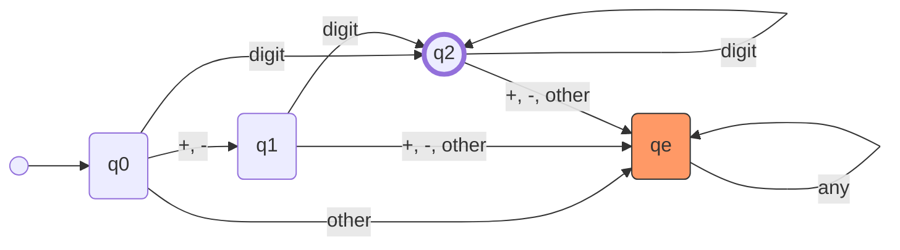

# Theoretical Computer Science: Introduction & Fundamentals

Theory of Computation encompasses three primary areas: 
1. **Formal Language Theory**: Focuses on languages (sets of strings) and grammars (rules for generating strings).
2. **Automata Theory**: Studies abstract models for computing processes to characterize what is "computable".
3. **Complexity Theory**: Analyzes the inherent difficulty of problems (time/space resources) and intractable problems.

---

## 1. Alphabets and Strings

> [!Definition] 📚 Alphabet ($\Sigma$)
> An alphabet is a finite, non-empty set of symbols. 
> *Examples*: Binary $\Sigma = \{0, 1\}$, Lowercase $\Sigma = \{a, b, c, \dots, z\}$.

> [!Definition] 🔤 String (Word)
> A string or word is a finite sequence of symbols chosen from an alphabet $\Sigma$. 
> * The **empty string** is denoted by $\lambda$ (or sometimes $\epsilon$).

### String Properties & Operators
* **Length ($|w|$)**: The number of (non-$\lambda$) characters in the string $w$. For the empty string, $|\lambda| = 0$.
* **Concatenation ($wv$)**: Joining string $w$ and string $v$ together. 
  * Identity: $\lambda w = w \lambda = w$.
  * Length rule: $|wv| = |w| + |v|$.
* **Reverse ($w^R$)**: Writing the symbols of string $w$ in reverse order.
* **Power ($w^n$)**: Repeating string $w$ exactly $n$ times ($w^n = w \cdot w \dots w$). Note that $w^0 = \lambda$.

> [!Note] ✂️ String Parts
> * **Substring**: Any string of consecutive symbols within $w$.
> * **Prefix**: Consecutive symbols at the head (start) of the string.
> * **Suffix**: Consecutive symbols at the tail (end) of the string.

### Sets of Strings
* **$\Sigma^k$**: The set of all strings of length exactly $k$.
* **$\Sigma^*$ (Kleene Star)**: The set of strings obtained by concatenating zero or more symbols from $\Sigma$. It always contains $\lambda$.
* **$\Sigma^+$ (Positive Closure)**: $\Sigma^*$ excluding $\lambda$ ($\Sigma^+ = \Sigma^* \setminus \{\lambda\}$). 

---

## 2. Formal Languages

> [!Definition] 🌐 Language ($L$)
> A language $L$ is defined as a subset of $\Sigma^*$. A string within a language $L$ is called a **sentence** of $L$. Languages can be finite or infinite.

### Operations on Languages
Given languages $L, L_1, L_2$ over $\Sigma$:
* **Complement**: $\overline{L} = \Sigma^* - L$.
* **Reverse**: $L^R = \{w^R : w \in L\}$.
* **Concatenation**: $L_1 L_2 = \{xy : x \in L_1, y \in L_2\}$.
* **Power**: $L^n$ is $L$ concatenated with itself $n$ times ($L^0 = \{\lambda\}$, $L^1 = L$).
* **Star-Closure**: $L^* = L^0 \cup L^1 \cup L^2 \dots$.
* **Positive Closure**: $L^+ = L^1 \cup L^2 \dots$.

---

## 3. Grammars

> [!Definition] 📜 Grammar ($G$)
> A grammar $G$ is a powerful tool for describing languages via rules. It is defined as a quadruple $G = (V, T, S, P)$ where:
> * **$V$**: A finite set of variables (nonterminal symbols).
> * **$T$**: A finite set of terminal symbols ($V$ and $T$ are disjoint).
> * **$S$**: The start variable ($S \in V$).
> * **$P$**: A finite set of productions (rules).

### Productions and Derivations
A production takes the form $x \to y$, meaning $x$ can be replaced by $y$.
* **Derivation ($\Rightarrow$)**: If $w = uxv$ and $x \to y$ is a rule, we can derive $z = uyv$, written as $w \Rightarrow z$.
* **Multi-step Derivation ($\Rightarrow^*$ or $\Rightarrow^+$)**: $w_1 \Rightarrow^* w_n$ means $w_1$ derives $w_n$ in zero or more steps. $w_1 \Rightarrow^+ w_n$ implies at least one step was taken.

> [!Theorem] 🗣️ Language Generated by a Grammar
> For a grammar $G = (V, T, S, P)$, the language generated is:
> $$L(G) = \{w \in T^* : S \Rightarrow^* w\}$$.
> The intermediate strings containing variables and terminals during the derivation are called **sentential forms**.

> [!abstract] Grammar $G = (V, T, S, P)$ for C Integers
> - **Variables (V):** $\{\langle \text{integer} \rangle, \langle \text{sign} \rangle, \langle \text{digits} \rangle, \langle \text{digit} \rangle\}$ 
> - **Terminals (T):** $\{0, 1, 2, 3, 4, 5, 6, 7, 8, 9, +, -\}$ 
> - **Start Variable (S):** $\langle \text{integer} \rangle$ 
> - **Productions (P):** 
> $$
> \begin{aligned}
> \langle \text{integer} \rangle &\rightarrow \langle \text{sign} \rangle \langle \text{digits} \rangle \mid \langle \text{digits} \rangle \\
> \langle \text{sign} \rangle &\rightarrow + \mid - \\
> \langle \text{digits} \rangle &\rightarrow \langle \text{digit} \rangle \langle \text{digits} \rangle \mid \langle \text{digit} \rangle \\
> \langle \text{digit} \rangle &\rightarrow 0 \mid 1 \mid 2 \mid 3 \mid 4 \mid 5 \mid 6 \mid 7 \mid 8 \mid 9
> \end{aligned}
> $$
---

## 4. Automata

> [!Definition] 🤖 Automaton
> An automaton is an abstract model of a digital computer that performs automatic computations on an input following a set of states/configurations.

### Components of an Automaton
1. **Input File**: A sequence of symbols read left-to-right.
2. **Storage**: Unlimited cells capable of holding symbols; can be read and changed.
3. **Control Unit**: Operates in one of a finite number of internal states and dictates state changes.
4. **Output**: The automaton can produce an output.

### Configurations and Types
* **Transition Function**: Determines the next internal state based on the current state, input symbol, and storage.
* **Configuration**: The collective state of the control unit, input file, and storage at a given time.
* **Move**: The transition from one configuration to the next.
* **Deterministic vs Nondeterministic**: Deterministic means every move is uniquely predictable from the current configuration. Nondeterministic allows for multiple possible actions/moves at a given point.
* **Accepter vs Transducer**: An *accepter* outputs a simple "yes" or "no" (accepts or rejects a string). A *transducer* outputs strings of symbols.

*Example of an Accepter for Integer:*

---

## 📘 Examples & Applications

> [!Example] Example 1: Language Complement
> **Using:** Formal Languages & Complement Operations ($\overline{L}$)
> Let $\Sigma = \{a, b\}$ and $L = \{aa, bb\}$. Use set notation to describe $\overline{L}$.
> 
> **Step-by-step Solution:**
> 1. The universal set of all possible strings over the alphabet $\Sigma = \{a, b\}$ is the Kleene Star, $\Sigma^*$.
> 2. The complement of $L$, denoted as $\overline{L}$, is the set of all strings in $\Sigma^*$ that are *not* in $L$.
> 3. Formally: $\overline{L} = \Sigma^* \setminus \{aa, bb\}$.
> 4. Grouped by string lengths ($|w|$):
>    * Length 0: $\lambda$
>    * Length 1: $a, b$
>    * Length 2: $ab, ba$ (excluding $aa$ and $bb$)
>    * Length $\ge 3$: Any string of length 3 or more.
> 
> **Final Answer:**
> $$\overline{L} = \{\lambda, a, b, ab, ba\} \cup \{w \in \{a, b\}^* : |w| \ge 3\}$$

> [!Example] Example 2: Grammar Construction by String Properties
> **Using:** Formal Grammars $G = (V, T, S, P)$
> Find grammars for $\Sigma = \{a, b\}$ that generate the indicated sets.
> 
> **(a) All strings with exactly one $a$:**
> Let $S$ be the start variable and $B$ generate sequences of $b$'s.
> * $S \to B a B$
> * $B \to b B \mid \lambda$
> *Argument:* $B$ generates $\{b\}^*$. The start variable $S$ places exactly one $a$ between two $B$ variables. Since $a$ is not in the production for $B$, exactly one $a$ is generated.
> 
> **(b) All strings with at least one $a$:**
> Let $X$ be a variable that generates any string in $\Sigma^*$.
> * $S \to X a X$
> * $X \to a X \mid b X \mid \lambda$
> *Argument:* $X$ generates $(a \mid b)^*$. The production rule for $S$ forces the inclusion of at least one $a$ in the center of two $X$ components.
> 
> **(c) All strings with no more than three $a$'s:**
> We use variables as states to track the count of $a$'s.
> * $S \to b S \mid a A \mid \lambda$  (0 $a$'s encountered)
> * $A \to b A \mid a B \mid \lambda$  (1 $a$ encountered)
> * $B \to b B \mid a C \mid \lambda$  (2 $a$'s encountered)
> * $C \to b C \mid \lambda$           (3 $a$'s encountered)
> *Argument:* Transitions to the next variable only occur when an $a$ is generated. Variable $C$ has no production rule for $a$, capping the maximum $a$'s at 3.
>
> **(d) All strings with at least three $a$'s:**
> * $S \to X a X a X a X$
> * $X \to a X \mid b X \mid \lambda$
> *Argument:* $S$ explicitly hardcodes three terminal $a$'s. The universal generator $X$ can produce zero or more additional symbols, guaranteeing $\ge 3$ occurrences of $a$.

## 📘 Exercise 14: Grammar Construction

> [!Example] Problem 14 (a)
> **Target:** $L_1 = \{a^n b^m : n \ge 0, m > n\}$
> **Using:** Recursive matching and extra terminal generation.
> 
> **Concept:** The string must have more $b$'s than $a$'s, and all $a$'s come before $b$'s. We can think of this as $a^n b^n$ followed by $b^k$ where $k \ge 1$.
> **Productions:**
> $S \to aSb \mid B$
> $B \to bB \mid b$
> **Argument:** $S$ generates matching pairs of $a$'s and $b$'s (the $a^n b^n$ part). When it stops, it transitions to $B$, which guarantees the addition of at least one more $b$ (the $b^k$ part, where $k \ge 1$). Thus, $m = n + k > n$.

> [!Example] Problem 14 (b)
> **Target:** $L_2 = \{a^n b^{2n} : n \ge 0\}$
> **Using:** Asymmetric recursive matching.
>
> **Concept:** For every $1$ occurrence of $a$, there must be exactly $2$ occurrences of $b$. Since $n \ge 0$, the empty string $\lambda$ is included.
> **Productions:**
> $S \to aSbb \mid \lambda$
> **Argument:** Every time the rule is applied, one $a$ is placed on the left, and two $b$'s are placed on the right, maintaining the $1:2$ ratio perfectly.

> [!Example] Problem 14 (c)
> **Target:** $L_3 = \{a^{n+2} b^n : n \ge 1\}$
> **Using:** Hardcoded prefixes.
>
> **Concept:** We need exactly $n$ pairs of $a$'s and $b$'s, but strictly preceded by two extra $a$'s. Also, $n \ge 1$, so the shortest string is $a^3 b^1$.
> **Productions:**
> $S \to aaA$
> $A \to aAb \mid ab$
> **Argument:** $S$ hardcodes the initial $a^2$. Then it hands off to $A$, which generates $a^n b^n$ for $n \ge 1$ by having a base case of $ab$ instead of $\lambda$.

> [!Example] Problem 14 (d)
> **Target:** $L_4 = \{a^n b^{n-3} : n \ge 3\}$
> **Using:** Hardcoded prefixes and variable substitution.
>
> **Concept:** Let $k = n - 3$. Since $n \ge 3$, $k \ge 0$. We can rewrite the language as $\{a^{k+3} b^k : k \ge 0\}$, which is exactly $a^3$ followed by $a^k b^k$.
> **Productions:**
> $S \to aaaA$
> $A \to aAb \mid \lambda$
> **Argument:** $S$ forces the 3 extra $a$'s. $A$ acts as the balanced $a^k b^k$ generator with a base case of $\lambda$ (since $k$ can be 0).

---

### Language Operations ($L_1$ and $L_2$)

For parts (e) through (h), we will reuse the start variables and rules from (a) and (b):
* **Grammar for $L_1$:** $S_1 \to aS_1b \mid B_1$ and $B_1 \to bB_1 \mid b$
* **Grammar for $L_2$:** $S_2 \to aS_2bb \mid \lambda$

> [!Example] Problem 14 (e)
> **Target:** $L_1 L_2$ (Concatenation)
> **Productions:**
> $S \to S_1 S_2$
> *(Plus the rules for $S_1, B_1, S_2$ listed above)*
> **Argument:** The new start variable $S$ forces the derivation of a valid string from $L_1$ followed immediately by a valid string from $L_2$.

> [!Example] Problem 14 (f)
> **Target:** $L_1 \cup L_2$ (Union)
> **Productions:**
> $S \to S_1 \mid S_2$
> *(Plus the rules for $S_1, B_1, S_2$)*
> **Argument:** The start variable branches. It nondeterministically chooses to generate a string entirely from $L_1$ or entirely from $L_2$.

> [!Example] Problem 14 (g)
> **Target:** $L_1^3$ (Power)
> **Productions:**
> $S \to S_1 S_1 S_1$
> *(Plus the rules for $S_1, B_1$)*
> **Argument:** $L_1^3$ means $L_1 L_1 L_1$. The start variable enforces the concatenation of three separate strings generated by $L_1$.

> [!Example] Problem 14 (h)
> **Target:** $L_1^*$ (Kleene Star)
> **Productions:**
> $S \to S_1 S \mid \lambda$
> *(Plus the rules for $S_1, B_1$)*
> **Argument:** This recursive rule allows $L_1$ to be concatenated with itself zero ($\lambda$) or more times.

> [!Example] Problem 14 (i)
> **Target:** $L_1 - \overline{L_4}$ (Set Difference)
> **Using:** Set Theory Logic
> 
> **Concept:** By set theory definition, $A - B = A \cap \overline{B}$. 
> Therefore, $L_1 - \overline{L_4} = L_1 \cap \overline{\overline{L_4}} = L_1 \cap L_4$.
> * For a string to be in $L_1$, the number of $b$'s ($m$) must be strictly greater than $a$'s ($n$): $m > n$.
> * For a string to be in $L_4$, the number of $b$'s must be exactly $n - 3$.
> * If a string is in both, then $n - 3 > n$. Subtracting $n$ from both sides gives $-3 > 0$, which is mathematically impossible.
> 
> Because the conditions are mutually exclusive, $L_1 \cap L_4 = \emptyset$ (the empty set).
> **Productions:**
> $S \to S$
> **Argument:** To generate an empty language, we create a grammar that can never derive a string of terminals. The rule $S \to S$ will loop forever and never resolve.

