# Chapter 2: Finite Automata

> [!Note] 💡 Notation Conventions
> Throughout this note the following conventions are standardised:
> - $Q$ = finite set of states; $\Sigma$ = input alphabet; $\delta$ = transition function; $q_0$ = initial state; $F$ = set of final (accepting) states.
> - $\lambda$ = the **empty string** (zero symbols).
> - $\Sigma^*$ = the set of **all** strings over $\Sigma$, including $\lambda$.
> - $2^Q$ = the **power set** of $Q$ (set of all subsets of $Q$).
> - $\delta^*$ = the **extended transition function** (takes a full string, not a single symbol).
> - DFA = Deterministic Finite Accepter; NFA = Nondeterministic Finite Accepter.
> - In Mermaid graphs: double-circle states are final; `[*]` marks the initial arrow; edge labels are input symbols ($\lambda$ = epsilon/lambda transition).

---

## 📑 Table of Contents

1. [[#1. Deterministic Finite Accepters (DFA)]]
   - [[#1.1 Definition]]
   - [[#1.2 DFA Operation]]
   - [[#1.3 Transition Graph]]
   - [[#1.4 Extended Transition Function δ*]]
   - [[#1.5 Language Accepted by a DFA]]
   - [[#1.6 Trap States]]
   - [[#1.7 Transition Table]]
   - [[#1.8 Regular Languages]]
2. [[#2. Nondeterministic Finite Accepters (NFA)]]
   - [[#2.1 Definition]]
   - [[#2.2 Key Differences from DFA]]
   - [[#2.3 Extended Transition Function for NFA (No λ-transitions)]]
   - [[#2.4 Lambda-Closure and Move (With λ-transitions)]]
   - [[#2.5 Language Accepted by an NFA]]
3. [[#3. Equivalence Between DFA and NFA]]
   - [[#3.1 Definition of Equivalence]]
   - [[#3.2 Theorem — Every NFA has an Equivalent DFA]]
   - [[#3.3 Algorithm nfa-to-dfa (Subset Construction)]]
4. [[#4. Reduction of the Number of States]]
   - [[#4.1 Inaccessible States]]
   - [[#4.2 Indistinguishable States]]
   - [[#4.3 Algorithm mark()]]
   - [[#4.4 Algorithm reduce()]]
   - [[#4.5 Minimality Theorem]]
5. [[#📘 Examples & Applications]]
6. [[#🗂️ Summary]]

---

## 1. Deterministic Finite Accepters (DFA)

### 1.1 Definition

> [!Definition] 📖 Definition 2.1 — Deterministic Finite Accepter (DFA)
> A **deterministic finite accepter (DFA)** is a quintuple:
> $$M = (Q,\; \Sigma,\; \delta,\; q_0,\; F)$$
> where:
> - $Q$ is a finite set of **internal states**,
> - $\Sigma$ is a finite set of symbols called the **input alphabet**,
> - $\delta : Q \times \Sigma \to Q$ is the **transition function** — maps every (state, symbol) pair to **exactly one** next state,
> - $q_0 \in Q$ is the **initial state**,
> - $F \subseteq Q$ is the set of **final (accepting) states**.

---

### 1.2 DFA Operation

> [!Note] 💡 How a DFA Processes Input
> **1.** Start in state $q_0$ with the read head on the **leftmost** symbol of the input string.
> **2.** The head moves **left to right only**, consuming **one symbol per step**.
> **3.** At each step: current state + current symbol → unique next state via $\delta$.
> **4.** When all input is consumed:
> - Current state $\in F$ → string **accepted**.
> - Current state $\notin F$ → string **rejected**.

---

### 1.3 Transition Graph

> [!Note] 💡 Transition Graph Conventions
> - **Vertices** = states (single circle). Final states = **double circle**.
> - **Edges** = transitions; edge from $q_i$ to $q_j$ labelled $a$ means $\delta(q_i, a) = q_j$.
> - **Initial state**: unlabelled incoming arrow (from nowhere).
> - **Self-loop**: state transitions to itself on a given symbol.

---

### 1.4 Extended Transition Function δ*

> [!Definition] 📖 Extended Transition Function $\delta^*$
> $\delta^* : Q \times \Sigma^* \to Q$ extends $\delta$ to accept a **full string** as its second argument.
>
> **Recursive definition:**
> $$\delta^*(q,\; \lambda) = q$$
> $$\delta^*(q,\; wa) = \delta\!\bigl(\delta^*(q,\; w),\; a\bigr) \qquad \forall\; q \in Q,\; w \in \Sigma^*,\; a \in \Sigma$$
>
> **Reading:** to process $wa$, first process prefix $w$ to reach an intermediate state, then apply $\delta$ for the final symbol $a$.

> [!Example] 📘 Quick Illustration
> If $\delta(q_0, a) = q_1$ and $\delta(q_1, b) = q_2$, then:
> $$\delta^*(q_0,\; ab) = \delta(\delta^*(q_0, a),\; b) = \delta(q_1,\; b) = q_2$$

---

### 1.5 Language Accepted by a DFA

> [!Definition] 📖 Definition 2.2 — Language of a DFA
> $$L(M) = \{\, w \in \Sigma^* : \delta^*(q_0, w) \in F \,\}$$
> The complement (rejected strings) within $\Sigma^*$:
> $$\overline{L(M)} = \{\, w \in \Sigma^* : \delta^*(q_0, w) \notin F \,\}$$

---

### 1.6 Trap States

> [!Definition] 📖 Trap State (Dead State)
> A **trap state** is a state from which **no final state is reachable**. Once entered, all future transitions stay within the trap. The automaton can never accept after entering a trap state.
> - Can be final or non-final.
> - Multiple states can form a "trap group."
> - Used to make a DFA **complete** (transition defined for every symbol from every state).

**Example** — DFA for $L = \{a^n b : n \geq 0\}$ (zero or more $a$'s then exactly one $b$). $q_2$ is the trap state:

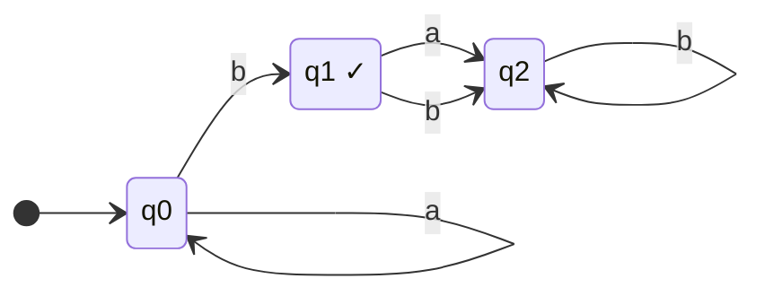

---

### 1.7 Transition Table

> [!Note] 💡 Transition Table Format
> Rows = states (mark initial with $\to$, finals with $*$). Columns = input symbols. Cells = $\delta(q, a)$.
>
> For the DFA above ($L = \{a^n b : n \geq 0\}$, alphabet $\{a,b\}$):
>
> | | $a$ | $b$ |
> |---|---|---|
> | $\to q_0$ | $q_0$ | $q_1$ |
> | $*\; q_1$ | $q_2$ | $q_2$ |
> | $q_2$ | $q_2$ | $q_2$ |

---

### 1.8 Regular Languages

> [!Definition] 📖 Definition 2.3 — Regular Language
> A language $L$ is **regular** if and only if there exists a DFA $M$ such that $L = L(M)$.

> [!Note] 💡 Proving Regularity
> To prove $L$ is regular: **construct** a DFA $M$ with $L(M) = L$. Existence of such a DFA is both necessary and sufficient.

**Example** — $L = \{awa : w \in \{a,b\}^*\}$ (strings starting and ending with $a$). The DFA below witnesses regularity:

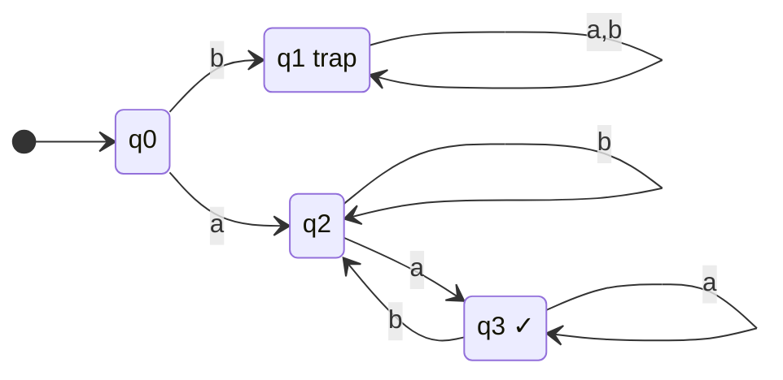

$q_1$ = trap for strings starting with $b$. $q_3$ = final (last symbol was $a$, started with $a$).

---

## 2. Nondeterministic Finite Accepters (NFA)

### 2.1 Definition

> [!Definition] 📖 Definition 2.4 — Nondeterministic Finite Accepter (NFA)
> An **NFA** is a quintuple:
> $$M = (Q,\; \Sigma,\; \delta,\; q_0,\; F)$$
> where $Q$, $\Sigma$, $q_0$, $F$ are as in a DFA, but the transition function is:
> $$\delta : Q \times (\Sigma \cup \{\lambda\}) \to 2^Q$$
> The output of $\delta$ is a **subset** of $Q$ — possibly empty, possibly containing many states.

---

### 2.2 Key Differences from DFA

> [!Property] ⚙️ NFA vs DFA
> **1. Multiple next states:** $\delta(q, a)$ can return $\{q_0, q_2\}$ — the NFA is simultaneously in both.
> **2. Lambda-transitions:** $\delta(q, \lambda)$ moves to new states **without consuming** any input.
> **3. Dead configuration:** $\delta(q, a) = \emptyset$ — that path dies, others may continue.
> **4. Acceptance:** a string is accepted if **at least one** path ends in a final state.

> [!Warning] ⚠️ Common Mistake
> $\delta(q, a) = \emptyset$ does **not** reject the whole string — only that particular path fails. Other parallel paths may still succeed.

**Example NFA** — with a $\lambda$-transition, alphabet $\{0,1\}$:

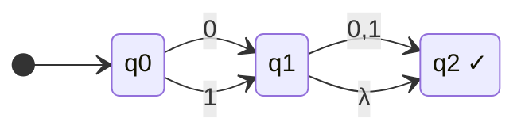

---

### 2.3 Extended Transition Function for NFA (No λ-transitions)

> [!Definition] 📖 Extended $\delta^*$ — Case 1: No λ-transitions
> $$\delta^*(q,\; \lambda) = \{q\}$$
> $$\delta^*(q,\; wa) = \bigcup_{p\; \in\; \delta^*(q,\; w)} \delta(p,\; a)$$
>
> Applied to a set $T \subseteq Q$:
> $$\delta(T,\; a) = \bigcup_{q \in T} \delta(q,\; a)$$

---

### 2.4 Lambda-Closure and Move (With λ-transitions)

> [!Definition] 📖 λ-closure and move
>
> $$\text{move}(T,\; a) = \bigcup_{q \in T} \delta(q,\; a)$$
>
> $$\lambda\text{-closure}(q) = \text{all states reachable from } q \text{ by zero or more } \lambda\text{-transitions (including } q \text{ itself)}$$
>
> $$\lambda\text{-closure}(T) = \bigcup_{q \in T} \lambda\text{-closure}(q)$$

> [!Definition] 📖 Extended $\delta^*$ — Case 2: With λ-transitions
> $$\delta^*(q,\; a) = \lambda\text{-closure}\!\Bigl(\text{move}\!\bigl(\lambda\text{-closure}(q),\; a\bigr)\Bigr)$$
>
> **Three-step recipe:**
> **1.** Compute $\lambda\text{-closure}(q)$ — follow all $\lambda$-arrows recursively from $q$.
> **2.** Apply $\text{move}(\cdot, a)$ — from every state in that closure, take the $a$-transition.
> **3.** Compute $\lambda\text{-closure}$ of the resulting set — follow $\lambda$-arrows again.

---

### 2.5 Language Accepted by an NFA

> [!Definition] 📖 Definition 2.6 — Language of an NFA
> $$L(M) = \{\, w \in \Sigma^* : \delta^*(q_0,\; w) \cap F \neq \emptyset \,\}$$
> A string $w$ is accepted iff there is **at least one** walk labelled $w$ from $q_0$ to some vertex in $F$.

**Example** — NFA accepting $L = \{(10)^n : n \geq 0\}$. $q_0$ is both initial and final (accepts $\lambda$, i.e. $n=0$):

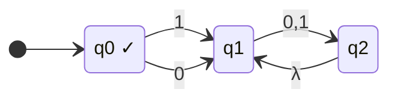

The $\lambda$-back-edge from $q_2$ to $q_1$ allows $10$ to repeat arbitrarily many times.

---

## 3. Equivalence Between DFA and NFA

### 3.1 Definition of Equivalence

> [!Definition] 📖 Definition 2.7 — Equivalent Finite Accepters
> Two finite accepters $M_1$ and $M_2$ are **equivalent** if:
> $$L(M_1) = L(M_2)$$

---

### 3.2 Theorem — Every NFA has an Equivalent DFA

> [!Theorem] 📌 Theorem 2.2
> Let $L = L(M_N)$ for NFA $M_N = (Q_N, \Sigma, \delta_N, q_0, F_N)$.
> Then there exists a DFA $M_D = (Q_D, \Sigma, \delta_D, \hat{q}_0, F_D)$ such that $L = L(M_D)$.

> [!Note] 💡 Key Correspondence
> - Each **DFA state** = a **subset** of NFA states (subset / powerset construction).
> - A DFA state is **final** iff its subset contains $\geq 1$ NFA final state.
> - Worst case: NFA with $n$ states → DFA with up to $2^n$ states.

**Equivalent DFA for $L = \{(10)^n : n \geq 0\}$** (compare with the NFA above):

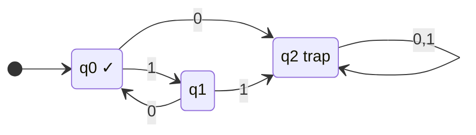

---

### 3.3 Algorithm nfa-to-dfa (Subset Construction)

> [!Definition] 📖 Algorithm: nfa-to-dfa
> **Input:** NFA $M_N = (Q_N, \Sigma, \delta_N, q_0, F_N)$
> **Output:** Transition graph of equivalent DFA $M_D$
>
> **1.** Initial DFA vertex = $\delta_N^*(q_0, \lambda) = \lambda\text{-closure}(q_0)$. Mark as **initial**.
> **2.** Repeat steps 3–6 until no edges are missing.
> **3.** Take any vertex $\{q_i, \ldots, q_k\}$ with no outgoing edge for some $a \in \Sigma$.
> **4.** Compute:
> $$\delta_N^*(\{q_i, \ldots, q_k\},\; a) = \bigcup_{j} \delta_N^*(q_j, a) = \{q_l, \ldots, q_n\}$$
> **5.** Create vertex $\{q_l, \ldots, q_n\}$ if it does not exist.
> **6.** Add edge $\{q_i,\ldots,q_k\} \xrightarrow{a} \{q_l,\ldots,q_n\}$.
> **7.** Every DFA state containing any $q_f \in F_N$ is a **final state**.

> [!Warning] ⚠️ The Empty Set State
> $\emptyset$ is a valid DFA state (dead/trap). Include it with self-loops on all symbols if any transition leads to it.

---

## 4. Reduction of the Number of States

### 4.1 Inaccessible States

> [!Definition] 📖 Inaccessible State
> A state is **inaccessible** if it cannot be reached from $q_0$ by any string in $\Sigma^*$.
> - Inaccessible states can be **removed** (with all their transitions) without changing $L(M)$.
> - Detection: enumerate all paths from $q_0$; any state not on any path is inaccessible.

---

### 4.2 Indistinguishable States

> [!Definition] 📖 Definition 2.8 — Indistinguishable States
> States $p$ and $q$ are **indistinguishable** if for **all** $w \in \Sigma^*$:
> $$\delta^*(p, w) \in F \iff \delta^*(q, w) \in F$$
>
> States $p$ and $q$ are **distinguishable** by string $w$ if exactly one of $\delta^*(p,w)$, $\delta^*(q,w)$ is in $F$.

> [!Property] ⚙️ Indistinguishability is an Equivalence Relation
> Reflexive, symmetric, and transitive. It **partitions** $Q$ into equivalence classes — all states in one class can be **merged** into a single state without changing $L(M)$.

---

### 4.3 Algorithm mark()

> [!Definition] 📖 Algorithm: mark()
> **Input:** All $\binom{|Q|}{2}$ pairs $(p,q)$ from a **complete** DFA (inaccessible states already removed).
> **Output:** All distinguishable pairs marked.
>
> **1.** For every pair $(p,q)$: if exactly one $\in F$, **mark $(p,q)$ distinguishable**.
> **2.** Repeat until no new markings:
>    - For every **unmarked** pair $(p,q)$ and every $a \in \Sigma$:
>    - Let $p_a = \delta(p,a)$, $q_a = \delta(q,a)$.
>    - If $(p_a, q_a)$ is already marked → **mark $(p,q)$**.
>
> Pairs **not marked** at termination are indistinguishable.

> [!Theorem] 📌 Theorem 2.3 — Correctness of mark()
> `mark()` terminates and correctly finds all distinguishable pairs. States $q_i$, $q_j$ are distinguishable by a string of length $n$ iff $\exists\, a \in \Sigma$ with $\delta(q_i,a) = q_k$, $\delta(q_j,a) = q_l$, and $q_k$, $q_l$ distinguishable by a string of length $n-1$.

---

### 4.4 Algorithm reduce()

> [!Definition] 📖 Algorithm: reduce()
> Given DFA $M = (Q, \Sigma, \delta, q_0, F)$, construct minimal $\hat{M} = (\hat{Q}, \Sigma, \hat{\delta}, \hat{q}_0, \hat{F})$:
>
> **1.** Run `mark()` → equivalence classes of indistinguishable states, e.g. $\{q_i, q_j, \ldots, q_k\}$.
> **2.** Create one state labelled $ij\ldots k$ in $\hat{M}$ per class.
> **3.** For each $\delta(q_r, a) = q_p$ in $M$: if $q_r \in \{q_i,\ldots,q_k\}$ and $q_p \in \{q_l,\ldots,q_n\}$, add $\hat{\delta}(ij\ldots k,\; a) = lm\ldots n$.
> **4.** $\hat{q}_0$ = class containing $q_0$.
> **5.** $\hat{F}$ = all classes containing at least one $q_f \in F$.

---

### 4.5 Minimality Theorem

> [!Theorem] 📌 Theorem 2.4 — Minimality of reduce()
> For any DFA $M$, `reduce()` yields $\hat{M}$ such that $L(M) = L(\hat{M})$, and $\hat{M}$ is **minimal** — no DFA with fewer states accepts $L(M)$.

---

## 📘 Examples & Applications

---

### Example 1 — Tracing a DFA Step by Step

**Using:** DFA definition, transition function $\delta$, extended $\delta^*$, acceptance.

**Setup:** $M = (\{q_0, q_1, q_2\},\; \{0,1\},\; \delta,\; q_0,\; \{q_1\})$

| | $0$ | $1$ |
|---|---|---|
| $\to q_0$ | $q_0$ | $q_1$ |
| $*\; q_1$ | $q_0$ | $q_2$ |
| $q_2$ | $q_2$ | $q_1$ |

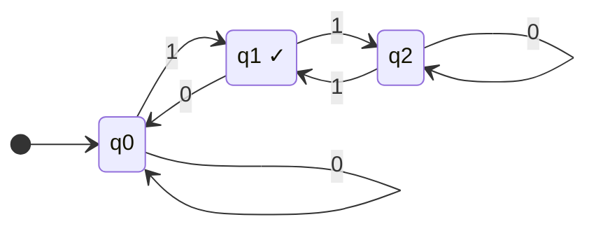

**Question:** Is $w = 0001$ accepted? Which of $100$, $101$, $0111$ are accepted?

**Solution — tracing $w = 0001$:**

| Step | State before | Symbol | State after |
|---|---|---|---|
| 1 | $q_0$ | $0$ | $q_0$ |
| 2 | $q_0$ | $0$ | $q_0$ |
| 3 | $q_0$ | $0$ | $q_0$ |
| 4 | $q_0$ | $1$ | $q_1$ |

Final state $q_1 \in F$ → **ACCEPTED** ✓

**Additional strings:**

$w = 100$: $q_0 \xrightarrow{1} q_1 \xrightarrow{0} q_0 \xrightarrow{0} q_0$. Final $q_0 \notin F$ → **REJECTED**

$w = 101$: $q_0 \xrightarrow{1} q_1 \xrightarrow{0} q_0 \xrightarrow{1} q_1$. Final $q_1 \in F$ → **ACCEPTED** ✓

$w = 0111$: $q_0 \xrightarrow{0} q_0 \xrightarrow{1} q_1 \xrightarrow{1} q_2 \xrightarrow{1} q_1$. Final $q_1 \in F$ → **ACCEPTED** ✓

---

### Example 2 — Computing δ* for an NFA (No λ-transitions)

**Using:** NFA extended $\delta^*$ (Case 1), set-union.

**Setup:** NFA with $Q = \{q_0, q_1, q_2\}$, $\Sigma = \{0,1\}$, $F = \{q_2\}$:

| | $0$ | $1$ |
|---|---|---|
| $\to q_0$ | $\{q_0, q_1\}$ | $\{q_0\}$ |
| $q_1$ | $\emptyset$ | $\{q_2\}$ |
| $*\; q_2$ | $\emptyset$ | $\emptyset$ |

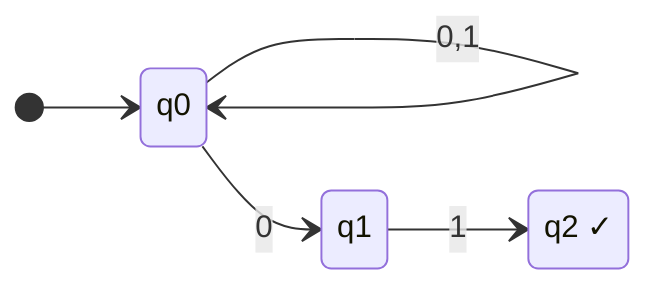

**Question:** Compute $\delta^*(q_0,\; 00101)$ and determine acceptance.

**Solution:**

$$\delta^*(q_0,\; \lambda) = \{q_0\}$$

$$\delta^*(q_0,\; 0) = \delta(q_0, 0) = \{q_0, q_1\}$$

$$\delta^*(q_0,\; 00) = \delta(q_0, 0) \cup \delta(q_1, 0) = \{q_0,q_1\} \cup \emptyset = \{q_0, q_1\}$$

$$\delta^*(q_0,\; 001) = \delta(q_0, 1) \cup \delta(q_1, 1) = \{q_0\} \cup \{q_2\} = \{q_0, q_2\}$$

$$\delta^*(q_0,\; 0010) = \delta(q_0, 0) \cup \delta(q_2, 0) = \{q_0,q_1\} \cup \emptyset = \{q_0, q_1\}$$

$$\delta^*(q_0,\; 00101) = \delta(q_0, 1) \cup \delta(q_1, 1) = \{q_0\} \cup \{q_2\} = \{q_0, q_2\}$$

$\{q_0, q_2\} \cap \{q_2\} = \{q_2\} \neq \emptyset$ → **ACCEPTED** ✓

---

### Example 3 — Computing δ* with λ-transitions

**Using:** $\lambda$-closure, move, extended $\delta^*$ (Case 2).

**Setup:** NFA with $Q = \{q_0, q_1, q_2, q_3, q_4, q_5\}$, $\Sigma = \{a\}$:

| | $a$ | $\lambda$ |
|---|---|---|
| $q_0$ | $\{q_4\}$ | $\{q_1\}$ |
| $q_1$ | $\{q_0, q_3\}$ | $\{q_2\}$ |
| $q_2$ | $\emptyset$ | $\emptyset$ |
| $q_3$ | $\emptyset$ | $\emptyset$ |
| $q_4$ | $\emptyset$ | $\{q_5\}$ |
| $q_5$ | $\emptyset$ | $\emptyset$ |

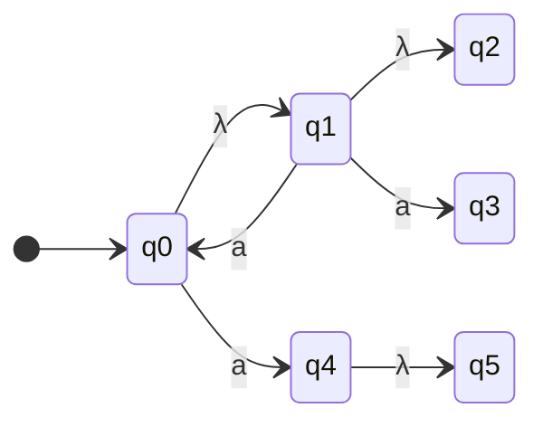

**Question:** Compute $\delta^*(q_0,\; a)$.

**Solution:**

$$\delta^*(q_0, a) = \lambda\text{-closure}\bigl(\text{move}(\lambda\text{-closure}(q_0),\; a)\bigr)$$

**Step 1 — $\lambda\text{-closure}(q_0)$:**
$q_0 \xrightarrow{\lambda} q_1 \xrightarrow{\lambda} q_2$; no further $\lambda$-moves.
$$\lambda\text{-closure}(q_0) = \{q_0, q_1, q_2\}$$

**Step 2 — $\text{move}(\{q_0, q_1, q_2\},\; a)$:**
$$\delta(q_0, a) = \{q_4\},\quad \delta(q_1, a) = \{q_0, q_3\},\quad \delta(q_2, a) = \emptyset$$
$$\text{move} = \{q_0, q_3, q_4\}$$

**Step 3 — $\lambda\text{-closure}(\{q_0, q_3, q_4\})$:**
- $q_0 \xrightarrow{\lambda} q_1 \xrightarrow{\lambda} q_2$
- $q_3$: no $\lambda$-moves
- $q_4 \xrightarrow{\lambda} q_5$
$$\lambda\text{-closure}(\{q_0,q_3,q_4\}) = \{q_0,q_1,q_2,q_3,q_4,q_5\}$$

$$\boxed{\delta^*(q_0, a) = \{q_0, q_1, q_2, q_3, q_4, q_5\}}$$

---

### Example 4 — NFA to DFA Conversion (Subset Construction)

**Using:** Algorithm nfa-to-dfa, $\lambda$-closure, subset states, final state identification.

**Setup:** NFA with $Q_N = \{q_0, q_1, q_2\}$, $\Sigma = \{a, b\}$, $F_N = \{q_1\}$:

| | $a$ | $b$ | $\lambda$ |
|---|---|---|---|
| $\to q_0$ | $q_1$ | — | — |
| $*\; q_1$ | $q_1$ | — | $q_2$ |
| $q_2$ | — | $q_0$ | — |

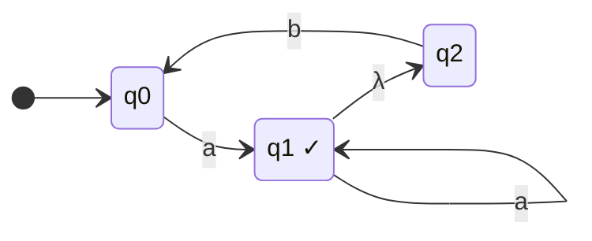

**Solution — subset construction:**

**Initial DFA state:**
$$\lambda\text{-closure}(q_0) = \{q_0\}$$

**From $\{q_0\}$:**
- On $a$: $\text{move}(\{q_0\},a) = \{q_1\}$; $\lambda\text{-cl}(\{q_1\}) = \{q_1,q_2\}$
- On $b$: $\text{move}(\{q_0\},b) = \emptyset$; $\lambda\text{-cl}(\emptyset) = \emptyset$

**From $\{q_1, q_2\}$:**
- On $a$: $\text{move}(\{q_1,q_2\},a) = \{q_1\}$; $\lambda\text{-cl}(\{q_1\}) = \{q_1,q_2\}$
- On $b$: $\text{move}(\{q_1,q_2\},b) = \{q_0\}$; $\lambda\text{-cl}(\{q_0\}) = \{q_0\}$

**From $\emptyset$:** stays $\emptyset$ on all symbols (trap).

**DFA transition table:**

| DFA State | $a$ | $b$ | Final? |
|---|---|---|---|
| $\to \{q_0\}$ | $\{q_1,q_2\}$ | $\emptyset$ | No |
| $*\;\{q_1,q_2\}$ | $\{q_1,q_2\}$ | $\{q_0\}$ | **Yes** ($q_1 \in F_N$) |
| $\emptyset$ | $\emptyset$ | $\emptyset$ | No |

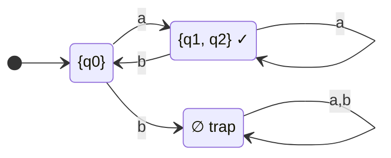

---

### Example 5 — DFA State Reduction

**Using:** Algorithms mark() and reduce(), equivalence classes, minimisation.

**Setup:** DFA with $Q = \{q_0,q_1,q_2,q_3,q_4\}$, $\Sigma = \{0,1\}$, $F = \{q_4\}$:

| | $0$ | $1$ |
|---|---|---|
| $\to q_0$ | $q_1$ | $q_3$ |
| $q_1$ | $q_2$ | $q_4$ |
| $q_2$ | $q_1$ | $q_4$ |
| $q_3$ | $q_2$ | $q_4$ |
| $*\; q_4$ | $q_4$ | $q_4$ |

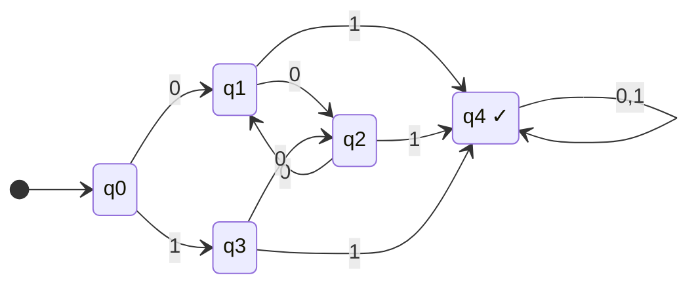

**Step 1 — Inaccessible states:** All states reachable from $q_0$ — none removed.

**Step 2 — Initial marking** ($q_4 \in F$, all others $\notin F$):

Mark: $(q_0,q_4)$✓, $(q_1,q_4)$✓, $(q_2,q_4)$✓, $(q_3,q_4)$✓.

Remaining unmarked pairs: $(q_0,q_1)$, $(q_0,q_2)$, $(q_0,q_3)$, $(q_1,q_2)$, $(q_1,q_3)$, $(q_2,q_3)$.

**Step 3 — Iterative marking:**

| Pair | On $0$ | On $1$ | Outcome |
|---|---|---|---|
| $(q_0,q_1)$ | $(q_1,q_2)$ — unmarked | $(q_3,q_4)$ — **marked** | **Mark** ✓ |
| $(q_0,q_2)$ | $(q_1,q_1)$ — same | $(q_3,q_4)$ — **marked** | **Mark** ✓ |
| $(q_0,q_3)$ | $(q_1,q_2)$ — unmarked | $(q_3,q_4)$ — **marked** | **Mark** ✓ |
| $(q_1,q_2)$ | $(q_2,q_1)$ = same pair | $(q_4,q_4)$ — not marked | **Not marked** |
| $(q_1,q_3)$ | $(q_2,q_2)$ — same | $(q_4,q_4)$ — not marked | **Not marked** |
| $(q_2,q_3)$ | $(q_1,q_2)$ — unmarked | $(q_4,q_4)$ — not marked | **Not marked** |

**Equivalence classes:**
$$[q_0] = \{q_0\},\qquad [q_{123}] = \{q_1,q_2,q_3\},\qquad [q_4] = \{q_4\}$$

**Step 4 — Reduced DFA** (labels: $A = \{q_0\}$, $B = \{q_1,q_2,q_3\}$, $C = \{q_4\}$):

| | $0$ | $1$ |
|---|---|---|
| $\to A$ | $B$ | $B$ |
| $B$ | $B$ | $C$ |
| $*\; C$ | $C$ | $C$ |

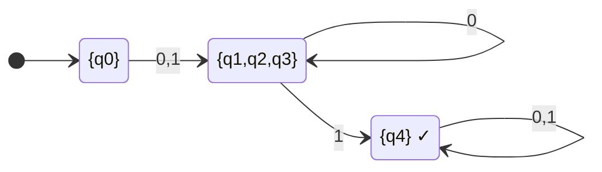

**5-state DFA → 3-state minimal DFA** ✓

---

### Example 6 — Exam-Style Combined Problem

**Using:** DFA construction, regularity, state minimality check.

**Question:** Construct a DFA accepting all strings over $\{0,1\}$ **except** those containing the substring $001$. Verify minimality.

**Solution — DFA Construction:**

States track the longest suffix seen so far that is a prefix of $001$:

| State | Meaning |
|---|---|
| $q_\lambda$ | No progress toward $001$ |
| $q_0$ | Longest matching suffix is $0$ |
| $q_{00}$ | Longest matching suffix is $00$ |
| $q_{001}$ | Substring $001$ has been seen — **trap, non-final** |

All states except $q_{001}$ are final:

| | $0$ | $1$ |
|---|---|---|
| $\to *\; q_\lambda$ | $q_0$ | $q_\lambda$ |
| $*\; q_0$ | $q_{00}$ | $q_\lambda$ |
| $*\; q_{00}$ | $q_{00}$ | $q_{001}$ |
| $q_{001}$ | $q_{001}$ | $q_{001}$ |

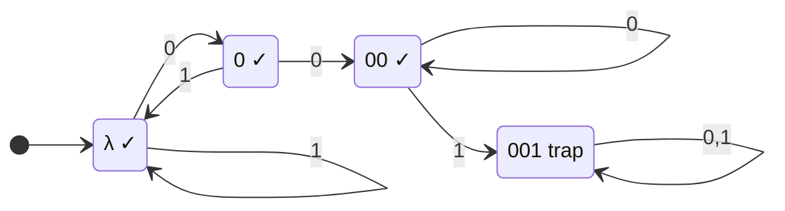

**Minimality check via mark():**

- Initial: mark all pairs $(q_{001}, x)$ for $x \in \{q_\lambda, q_0, q_{00}\}$ — one final, one not.
- $(q_{00}, q_\lambda)$ on $1$: $\delta(q_{00},1) = q_{001}$, $\delta(q_\lambda,1) = q_\lambda$ → $(q_{001},q_\lambda)$ marked → **mark** $(q_{00},q_\lambda)$ ✓
- $(q_{00}, q_0)$ on $1$: gives $(q_{001},q_\lambda)$ marked → **mark** $(q_{00},q_0)$ ✓
- $(q_\lambda, q_0)$ on $0$: gives $(q_0,q_{00})$ — check this pair on $1$: gives $(q_\lambda,q_{001})$ marked → **mark** $(q_0,q_{00})$ ✓ → back-propagate: **mark** $(q_\lambda,q_0)$ ✓

All pairs distinguishable → **no merges possible** → DFA is already **minimal** with 4 states ✓.

---

## 🗂️ Summary

### DFA — Key Facts
- Defined by $(Q, \Sigma, \delta, q_0, F)$; $\delta : Q \times \Sigma \to Q$ — exactly **one** next state always.
- $L(M) = \{w \in \Sigma^* : \delta^*(q_0, w) \in F\}$.
- $\delta^*(q, \lambda) = q$; $\;\delta^*(q, wa) = \delta(\delta^*(q,w), a)$.
- **Trap state:** state from which $F$ is unreachable; used to make $\delta$ total.
- $L$ is **regular** $\iff$ some DFA $M$ has $L(M) = L$.

### NFA — Key Facts
- $\delta : Q \times (\Sigma \cup \{\lambda\}) \to 2^Q$ — **set** of next states; $\lambda$-transitions allowed.
- $L(M) = \{w : \delta^*(q_0, w) \cap F \neq \emptyset\}$ — accepted if **any** path succeeds.
- $\delta(q, a) = \emptyset$ = dead configuration (that path only fails).
- **With $\lambda$-transitions:** $\delta^*(q, a) = \lambda\text{-cl}(\text{move}(\lambda\text{-cl}(q), a))$.

### DFA ↔ NFA Equivalence
- Every DFA is trivially an NFA. Every NFA has an equivalent DFA (Theorem 2.2).
- Conversion: **subset construction** — DFA states = subsets of NFA states.
- DFA final states = subsets containing $\geq 1$ NFA final state.
- Worst-case blowup: $n$ NFA states → up to $2^n$ DFA states.

### State Minimisation
- **Step 0:** Remove inaccessible states.
- **`mark()`:** Iteratively mark distinguishable pairs; seed with pairs straddling $F$ / $\overline{F}$.
- **`reduce()`:** Merge indistinguishable states — one equivalence class = one state.
- Result is the **unique minimal DFA** for $L(M)$ (Theorem 2.4).

### Quick Reference Formulas

| Concept | Formula |
|---|---|
| DFA acceptance | $L(M) = \{w \in \Sigma^* : \delta^*(q_0, w) \in F\}$ |
| NFA acceptance | $L(M) = \{w \in \Sigma^* : \delta^*(q_0, w) \cap F \neq \emptyset\}$ |
| DFA $\delta^*$ | $\delta^*(q, wa) = \delta(\delta^*(q, w),\; a)$ |
| NFA $\delta^*$ with $\lambda$ | $\delta^*(q, a) = \lambda\text{-cl}(\text{move}(\lambda\text{-cl}(q),\; a))$ |
| NFA→DFA transition | $\hat{\delta}(S, a) = \lambda\text{-cl}\!\left(\displaystyle\bigcup_{q \in S} \delta(q, a)\right)$ |
| Distinguishable states | $\exists\, w \in \Sigma^* : \delta^*(p,w) \in F \oplus \delta^*(q,w) \in F$ |
