## PROBLEM 1A — Build NFA from a Regular Expression (Thompson's Construction)

### What you're doing
You convert a regular expression into a diagram of states and arrows, following mechanical rules for each RE operator.

### Atomic building blocks

**Single symbol `a`:**

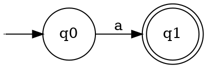

**Union `r1 + r2`** — "either r1 or r2":

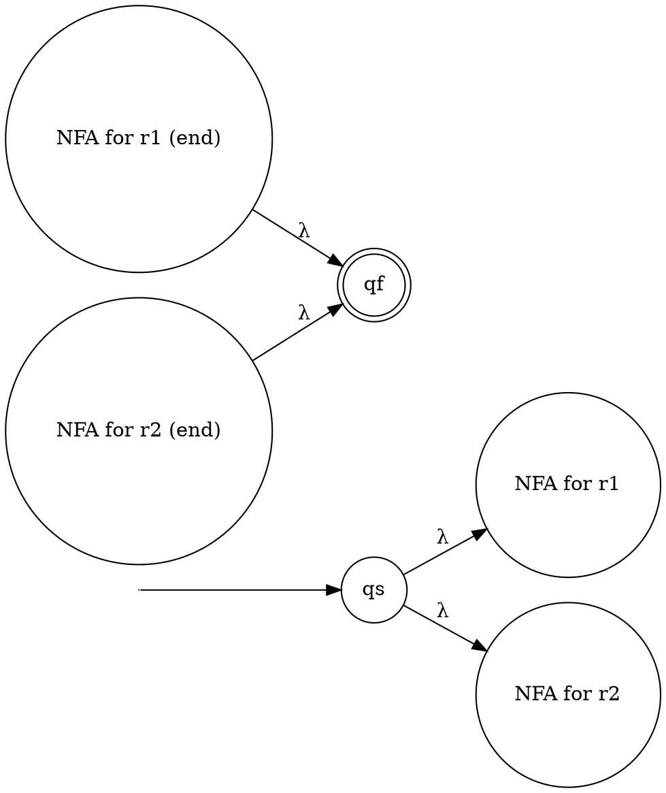

**Concatenation `r1r2`** — "r1 then r2":

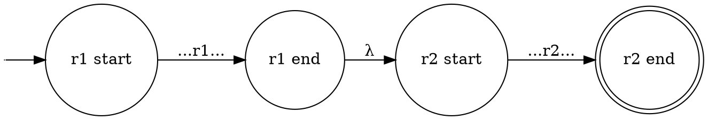

**Star `r*`** — "zero or more r":

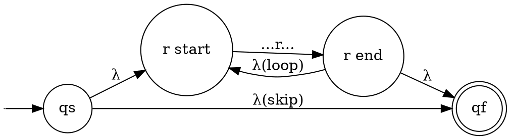

### Step-by-step procedure

```
Step 1. Parse the RE — identify the outermost operator
        Priority: star (*) first, then concatenation, then union (+)
Step 2. Recursively build NFA for each sub-expression
Step 3. Combine using the matching rule above
Step 4. Number all states q0, q1, q2, ...
Step 5. Mark the one start state (→) and one final state (double circle)
```

> [!warning] Operator priority (most to least binding)
> `*`  >  concatenation  >  `+`
> So `ab*+c` parses as `(a(b*))+c`, NOT `a(b*+c)`

## QUICK SANITY CHECK — Thompson NFA Node Count

### The Fast Counting Formula
Before drawing your NFA, calculate the exact number of nodes (states) it *should* have. Every symbol and operator adds a predictable number of states in a strict Thompson construction.

#  **N = 2 * (S + U + K)**

**Where:**
* **S (Symbols):** Total count of terminal characters (e.g., `a`, `b`).
* **U (Unions):** Total count of `+` operators.
* **K (Kleene Stars):** Total count of `*` operators.
* *(Note: Concatenations add 0 new states).*
---
> [!note] Practical note
> The worked examples below sometimes merge adjacent states (e.g., the end of one atom with the start of the next in concatenation, or use a flat multi-way union instead of nested binary unions). As a result, the drawn NFA may have **fewer** states than the strict formula predicts. The formula gives the maximum / strict-Thompson count — use it as an upper bound, not an exact target.
---

### ✏️ Fully Worked Example: r1 = b(ab + b)* + a\*b

**Parse the structure first:**

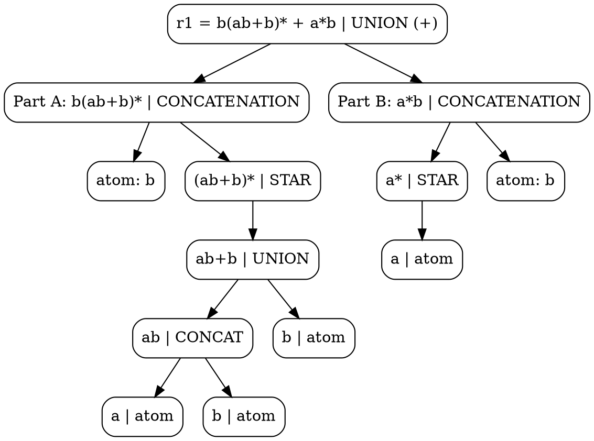

**Build Part A bottom-up:**

1. NFA for `b` (states 0–1):

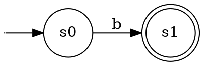

2. NFA for `ab+b` (UNION, states 2–8):

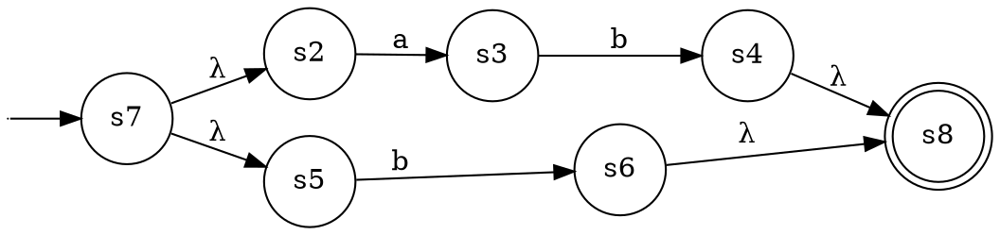

3. STAR `(ab+b)*` — wrap the union NFA (states 9–10):

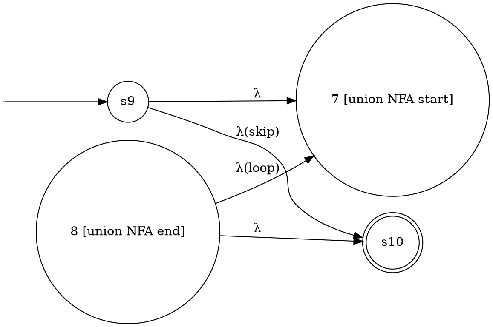

4. CONCATENATE `b · (ab+b)*` — connect state 1 → state 9 via λ:

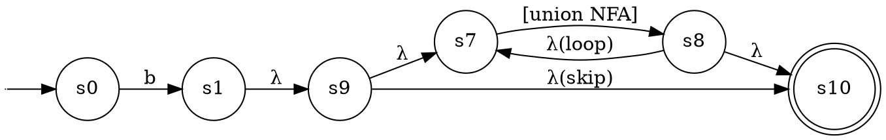

**Build Part B: `a*b`**

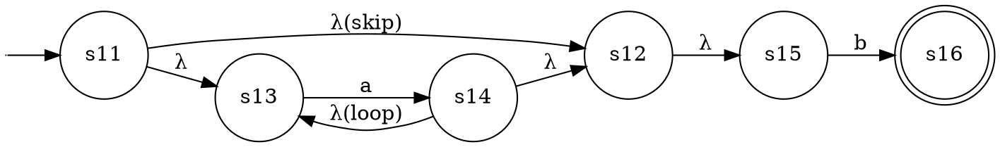

**Final UNION of Part A and Part B (states 17–18):**

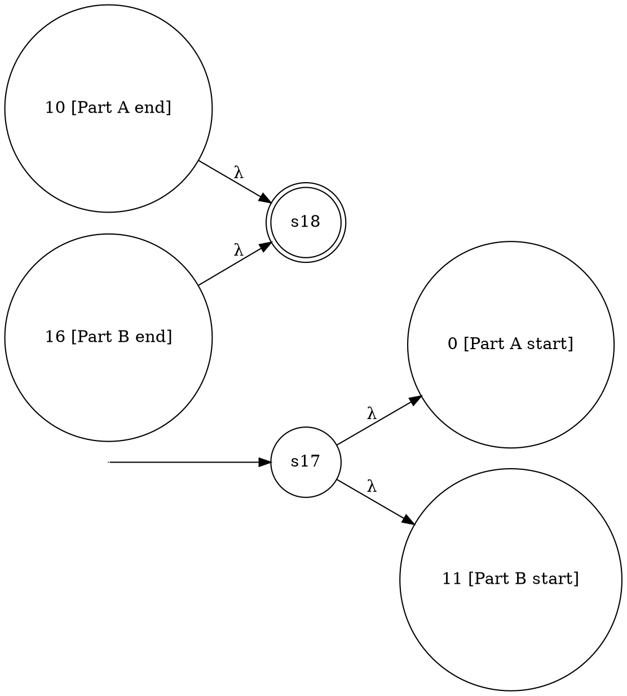

---

### ✏️ Fully Worked Example: r2 = b + a\* + b\*a\*

**Parse structure:**

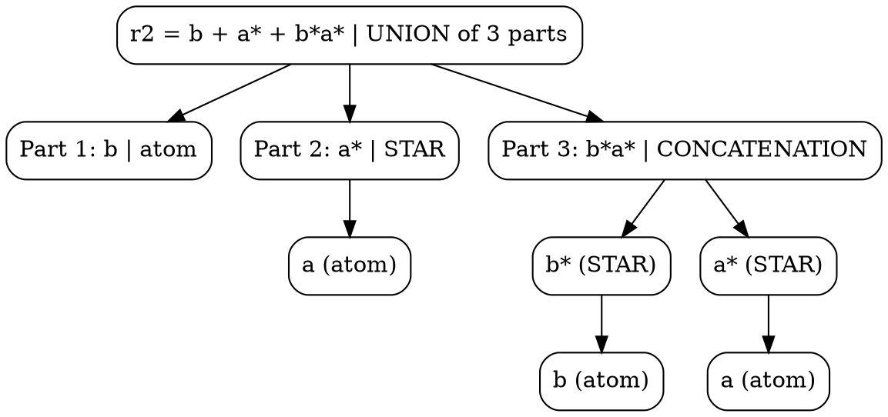

**Final UNION (new start=14, new final=15):**

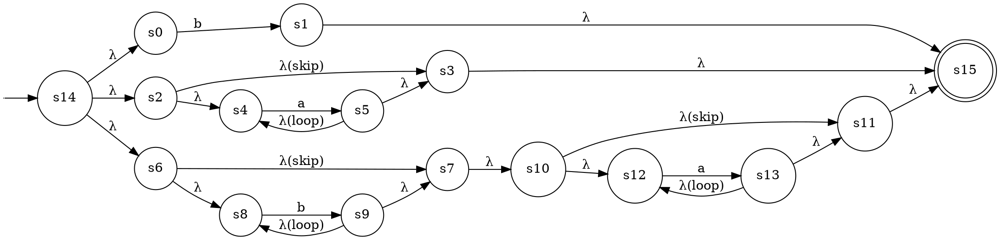

---

## PROBLEM 1B — Improve the NFA (Optimal Transition Graph / OTG)

### What you're doing
The Thompson NFA is bloated with λ-transitions. The OTG is the equivalent NFA with no λ-transitions and minimal states. You get there via **subset construction with λ-closure**.

### Key concept: λ-closure

`λ-closure(q)` = the set of ALL states you can reach from q using ONLY λ-arrows (including q itself).

### Step-by-step procedure

```
Step 1. Compute λ-closure of the start state → this is your NEW start state (a set)

Step 2. For that new state (set S) and each symbol a:
        MOVE(S, a) = all states reachable by one 'a' arrow from any state in S
        Then take λ-closure(MOVE(S, a)) → this is a new state

Step 3. Repeat Step 2 for every newly discovered state until no new states appear

Step 4. A state is FINAL if it contains any original final state

Step 5. Draw the result — states are sets, but rename them q0, q1, ... for neatness
```

> [!tip] Shortcut for the exam
> You do NOT need to mechanically compute all subsets. Look at the Thompson NFA and ask: "what can I reach from the start without reading anything?" Then trace real symbols. The answer key always gives a small clean graph — aim for 3–5 states.

---
---

## PROBLEM 2 — Find Regular Expression from Automaton (State Elimination)

### What you're doing
You eliminate states one by one, labelling edges with regular expressions, until only start and final remain.

### The formula
When you eliminate state `q`:

$$\text{new edge } i \to j = r_{iq} \cdot (r_{qq})^* \cdot r_{qj}$$

### Step-by-step procedure

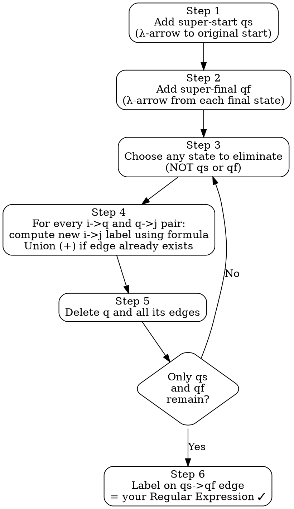

> [!tip] Eliminate states with **no self-loop** first — the formula simplifies to `r_iq · r_qj` (no star needed).

---

### ✏️ Fully Worked Example (mock exam Q2)

**The automaton:**

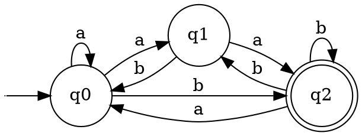

**After adding qs and qf:**

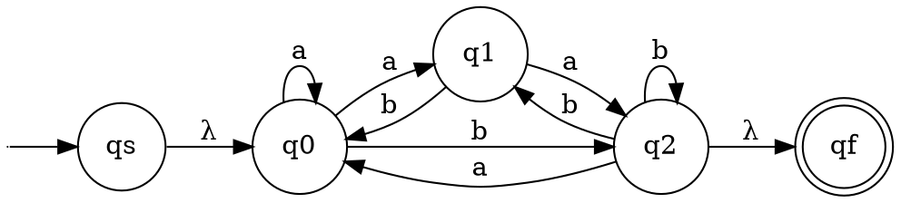

**Eliminate q1** (no self-loop — eliminate first to keep algebra simple):

Incoming edges to q1: `q0 --a--> q1`, `q2 --b--> q1`
Outgoing edges from q1: `q1 --a--> q2`, `q1 --b--> q0`

Compute new edges for every (i, j) pair where i→q1 and q1→j:

| i | j | r_iq1 | r_q1j | new label | existing edge? | combined |
|---|---|--------|--------|-----------|----------------|----------|
| q0 | q2 | a | a | aa | b | **b+aa** |
| q0 | q0 | a | b | ab | a | **a+ab** |
| q2 | q2 | b | a | ba | b | **b+ba** |
| q2 | q0 | b | b | bb | a | **a+bb** |

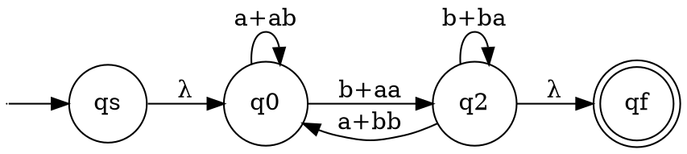

**Eliminate q0** (self-loop = `a+ab`):

Incoming edges to q0: `qs --λ--> q0`, `q2 --a+bb--> q0`
Outgoing edges from q0: `q0 --a+ab--> q0` (self-loop), `q0 --b+aa--> q2`

For each i→q0 and q0→j (excluding j=q0 since it is being eliminated):

- **(qs, q2):** `λ · (a+ab)* · (b+aa)` = **`(a+ab)*(b+aa)`**
- **(q2, q2):** `(a+bb) · (a+ab)* · (b+aa)` → combined with existing self-loop `b+ba`:
  **`b+ba + (a+bb)(a+ab)*(b+aa)`**

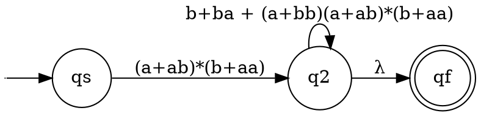

**Eliminate q2** (self-loop = `b+ba + (a+bb)(a+ab)*(b+aa)`):

Only remaining pair is (qs, qf):

`r_qs,q2 · (r_q2,q2)* · r_q2,qf`

= `(a+ab)*(b+aa) · (b+ba + (a+bb)(a+ab)*(b+aa))* · λ`

= `(a+ab)*(b+aa) (b+ba + (a+bb)(a+ab)*(b+aa))*`

```
RE = (a+ab)*(b+aa) (b+ba + (a+bb)(a+ab)*(b+aa))*
```

---

## PROBLEM 3 — Is This Grammar Ambiguous?

### Step-by-step procedure

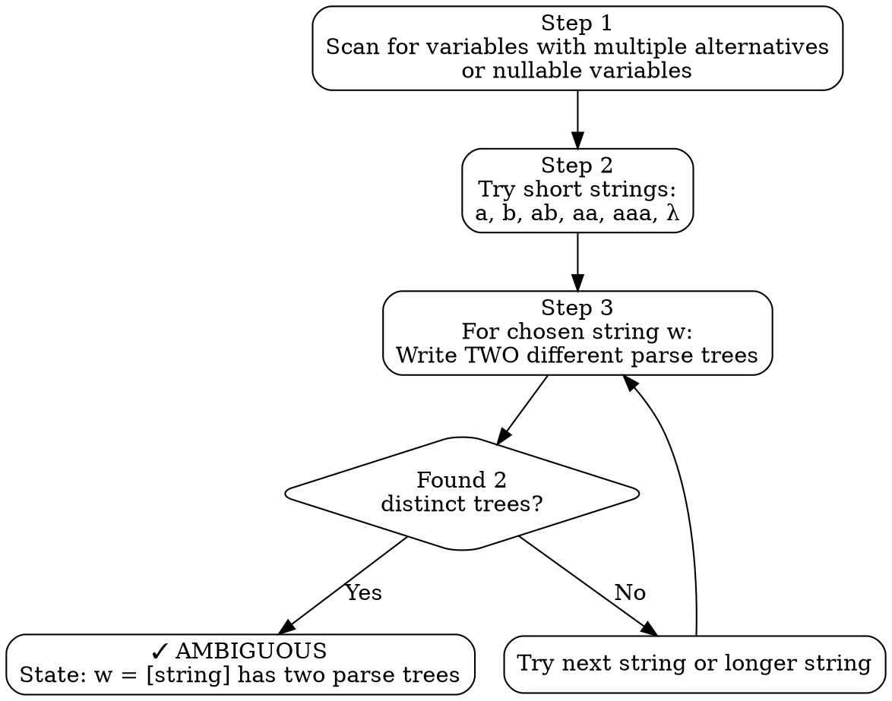

---

### ✏️ Fully Worked Example (mock exam Q3)

**Grammar:**
```
S → aSSa | A | B | ab
A → aB | b
B → aD | a | λ
D → a | aB
```
**Witness string: w = `aaa`**

**Parse Tree 1** (via `S → A`):

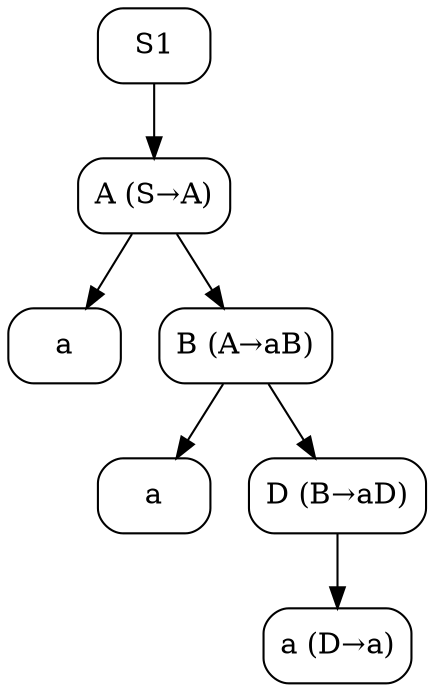

Derivation: S ⇒ A ⇒ aB ⇒ aaD ⇒ **aaa** ✓

**Parse Tree 2** (via `S → B`):

```dot
digraph G {
    rankdir=TB;
    node [shape=box, style=rounded];
    S2;
    B2 [label="B (S→B)"];
    a4 [label="a"];
    D2 [label="D (B→aD)"];
    a5 [label="a"];
    B3 [label="B (D→aB)"];
    a6 [label="a (B→a)"];
    S2 -> B2;
    B2 -> a4;
    B2 -> D2;
    D2 -> a5;
    D2 -> B3;
    B3 -> a6;
}
```

Derivation: S ⇒ B ⇒ aD ⇒ aaB ⇒ **aaa** ✓

**Conclusion: G is ambiguous** — `w = aaa` has two distinct parse trees.

---

## Q4 — RLG to LLG (The Double-Reversal Hack)

### The Shortcut Algorithm

The professor bypasses the LLG arrow-reading rule. **Read an RLG from the reversed NFA, then reverse the strings.**

```
S1: Draw the NFA using empty circles for intermediate states
    (no formal variables for multiple terminals).

S2: Reverse the NFA (swap start↔final, flip all arrows).

S3: Read a RIGHT-LINEAR grammar directly from the reversed NFA.
    Skip through empty circles and concatenate their labels.
    e.g. F --b--> (·) --a--> A  →  F → baA

S4: Reverse the strings in each production to get the LLG.
    e.g. F → baA  becomes  F → Aab
         F → bB   becomes  F → Bb
```

```dot
digraph G {
    rankdir=LR;
    node [shape=box, style=rounded];
    A [label="S1\nDraw NFA\n(empty circles\nfor multi-terminal)"];
    B [label="S2\nReverse NFA\n(swap start↔final)"];
    C [label="S3\nRead RLG from\nreversed NFA"];
    D [label="S4\nReverse strings\n→ LLG ✓"];
    A -> B; B -> C; C -> D;
}
```

> **Quick check:** After S4, every production should have the form `X → Yα` or `X → α` (variable first, then terminals). If a terminal appears before a variable, you reversed wrong.

### ✏️ Worked Example

**Given RLG:**
```
S → abS | bA | aC
A → aB | ab
B → b
C → aA
```

**S1 — Draw NFA** (anonymous empty circles for multi-terminal productions):

```dot
digraph G {
    rankdir=LR;
    node [shape=point, width=0];
    start;
    node [shape=circle];
    S; A; B; C;
    node [shape=doublecircle];
    F;
    node [shape=circle, style=dashed, label="", width=0.35, height=0.35];
    i1; i2;
    start -> S;
    S -> i1 [label="a"];
    i1 -> S [label="b"];
    S -> A  [label="b"];
    S -> C  [label="a"];
    A -> B  [label="a"];
    A -> i2 [label="a"];
    i2 -> F [label="b"];
    B -> F  [label="b"];
    C -> A  [label="a"];
}
```

> S→abS creates the loop S→i1→S. A→ab and B→b both feed into the implicit final state F.

**S2 — Reverse the NFA** (swap: F becomes start, S becomes final; flip all arrows):

Original edges reversed (flip direction, keep label):
- i1 --a--> S,  S --b--> i1,  A --b--> S,  C --a--> S
- B --a--> A,  i2 --a--> A,  F --b--> i2,  F --b--> B,  A --a--> C

```dot
digraph G {
    rankdir=LR;
    node [shape=point, width=0];
    start;
    node [shape=circle];
    F; A; B; C;
    node [shape=doublecircle];
    S;
    node [shape=circle, style=dashed, label="", width=0.35, height=0.35];
    i1; i2;

    start -> F;
    F -> i2 [label="b"];
    F -> B  [label="b"];
    i2 -> A [label="a"];
    B -> A  [label="a"];
    A -> S  [label="b"];
    A -> C  [label="a"];
    C -> S  [label="a"];
    S -> i1 [label="b"];
    i1 -> S [label="a"];
}
```

**S3 — Read RLG from reversed NFA** (skip through dashed empty circles, concatenating labels):

| From | Path through reversed NFA | RLG Production |
|------|--------------------------|----------------|
| F (start) | F --b--> (i2) --a--> A | F → baA |
| F | F --b--> B | F → bB |
| A | A --b--> S | A → bS |
| A | A --a--> C | A → aC |
| B | B --a--> A | B → aA |
| C | C --a--> S | C → aS |
| S | S --b--> (i1) --a--> S | S → baS |

**S4 — Reverse the strings → LLG:**

For each production `X → α`, reverse the RHS string `α` (terminals + variable):

| Phase 3 RLG | Reverse RHS | LLG Production |
|-------------|-------------|----------------|
| F → baA | "baA" → "Aab" | **F → Aab** |
| F → bB | "bB" → "Bb" | **F → Bb** |
| A → bS | "bS" → "Sb" | **A → Sb** |
| A → aC | "aC" → "Ca" | **A → Ca** |
| B → aA | "aA" → "Aa" | **B → Aa** |
| C → aS | "aS" → "Sa" | **C → Sa** |
| S → baS | "baS" → "Sab" | **S → Sab** |
`
**Final Left-Linear Grammar G_L** (start variable = F):

```
F → Aab | Bb
A → Sb | Ca
B → Aa
C → Sa
S → Sab | lambda
```
---

## PROBLEM 5 — Is It an s-grammar?

### Definition

A CFG is an **s-grammar** if and only if **BOTH** conditions hold:
1. Every production `A → aα` — **starts with a terminal**
2. For each pair `(A, a)`, there is **at most one** production

### Decision procedure

```dot
digraph G {
    rankdir=TB;
    node [shape=box, style=rounded];
    A [label="For each variable A,\nlist the first symbol of each production"];
    B [shape=diamond, label="Any production\nstarts with a\nnon-terminal or λ?"];
    C [label="× FAILS condition 1\nNOT an s-grammar\n(cite the offending production)"];
    D [shape=diamond, label="Any (variable, terminal)\npair appears in\n2+ productions?"];
    E [label="× FAILS condition 2\nNOT an s-grammar\n(cite the duplicate pair)"];
    F [label="✓ IS an s-grammar"];
    A -> B;
    B -> C [label="Yes"];
    B -> D [label="No"];
    D -> E [label="Yes"];
    D -> F [label="No"];
}
```

---

### ✏️ Worked Examples (mock exam Q5)

**a) S → aBD | bC | aD; B → a; C → bD | b; D → b**

| Variable | Productions | First symbols | Verdict |
|---|---|---|---|
| S | aBD, bC, aD | a, b, **a** | ❌ (S,a) twice |
| B | a | a | ✓ |
| C | bD, b | **b, b** | ❌ (C,b) twice |
| D | b | b | ✓ |

**→ NOT an s-grammar** — (S,a) and (C,b) both duplicated.

**b) S → aS | B; B → a**

| Variable | Productions | First symbols | Verdict |
|---|---|---|---|
| S | aS, **B** | a, **B** ← variable! | ❌ condition 1 |
| B | a | a | ✓ |

**→ NOT an s-grammar** — `S → B` starts with a variable.

**c) S → bAB | aB; A → aA | b**

| Variable | Productions | First symbols | Verdict |
|---|---|---|---|
| S | bAB, aB | b, a | ✓ |
| A | aA, b | a, b | ✓ |

**→ IS an s-grammar** ✓ — Pairs: (S,b), (S,a), (A,a), (A,b) each unique.

**d) S → c | cDD | bAD; A → aD | b; D → b**

| Variable | Productions | First symbols | Verdict |
|---|---|---|---|
| S | c, cDD, bAD | **c, c**, b | ❌ (S,c) twice |
| A | aD, b | a, b | ✓ |
| D | b | b | ✓ |

**→ NOT an s-grammar** — (S,c) appears for both `S → c` and `S → cDD`.

---

## PROBLEM 6A — Simplify a CFG (λ → unit → useless, in that order)

### The three passes — mandatory order

```dot
digraph G {
    rankdir=LR;
    node [shape=box, style=rounded];
    G [label="Original\nGrammar G"];
    P1 [label="Pass 1\nRemove λ-productions"];
    P2 [label="Pass 2\nRemove unit productions\n(A → B)"];
    P3 [label="Pass 3\nRemove useless productions"];
    Gp [label="Simplified\nGrammar G'"];
    G -> P1;
    P1 -> P2;
    P2 -> P3;
    P3 -> Gp;
}
```

### Pass 1: Remove λ-productions

```dot
digraph G {
    rankdir=TB;
    node [shape=box, style=rounded];
    A [label="Round 1: Mark X nullable if X → λ exists"];
    B [label="Round 2: Mark X nullable if X → Y1Y2...Yn\nand ALL Yi already marked nullable"];
    C [shape=diamond, label="Any new\nnullables\nfound?"];
    D [label="For each production, generate new productions\nby removing each subset of nullable variables"];
    E [label="Delete all X → λ productions\n(keep S → λ only if λ ∈ L(G))"];
    A -> B;
    B -> C;
    C -> B [label="Yes"];
    C -> D [label="No"];
    D -> E;
}
```

### Pass 2: Remove unit productions

```dot
digraph G {
    rankdir=TB;
    node [shape=box, style=rounded];
    A [label="Base unit pairs: (A,A) for all variables"];
    B [label="If (A,B) is a pair and B→C is unit:\nadd (A,C)"];
    C [shape=diamond, label="New pairs\nfound?"];
    D [label="For each unit pair (A,B):\ncopy all non-unit productions of B to A"];
    E [label="Delete all unit productions A → B"];
    A -> B;
    B -> C;
    C -> B [label="Yes"];
    C -> D [label="No"];
    D -> E;
}
```

### Pass 3: Remove useless productions

```dot
digraph G {
    rankdir=LR;
    node [shape=box, style=rounded];
    G1 [label="Mark X 'generating' if\nX → terminal string"];
    G2 [label="Mark X 'generating' if\nX → α where all symbols\nin α are generating/terminal"];
    G3 [label="Remove all non-generating\nvariables and their productions"];
    R1 [label="S is reachable"];
    R2 [label="If A is reachable and A→α:\nmark all variables in α reachable"];
    R3 [label="Remove all non-reachable\nvariables and their productions"];
    G1 -> G2;
    G2 -> G3;
    R1 -> R2;
    R2 -> R3;
}
```

---

### ✏️ Fully Worked Example (mock exam Q6a)

**Original grammar G:**
```
S → aS | A | aBD | c
A → bAD | λ
B → bC | C
C → AcDD | D
D → a | λ
E → b
```

**Pass 1 — Nullable variables:**

```dot
digraph G {
    rankdir=LR;
    node [shape=box, style=rounded];
    R1 [label="Round 1:\nA (A→λ)\nD (D→λ)"];
    R2 [label="Round 2:\nC (C→D, D nullable)\nB (B→C, C nullable)"];
    R3 [label="Round 3:\nS (S→A, A nullable)"];
    DONE [label="Nullable = {A, D, C, B, S}"];
    R1 -> R2;
    R2 -> R3;
    R3 -> DONE;
}
```

**Grammar after Pass 1 (P₁):**
```
S → aS | a | A | aBD | aD | aB | c 
A → bAD | bA | bD | b
B → bC | b | C
C → AcDD | cDD | AcD | Ac | cD | c | D
D → a
E → b
```

**Pass 2 — Unit pairs and resolutions:**

```dot
digraph G {
    rankdir=TB;
    node [shape=box, style=rounded];
    UP [label="Unit productions: S→A, B→C, C→D"];
    PA [label="(S,A): copy A's non-unit productions to S\n→ S gains: bAD, bA, bD, b"];
    PB [label="(B,C): copy C's non-unit productions to B\n→ B gains: AcDD, cDD, AcD, Ac, cD, c"];
    PC [label="(C,D): copy D's non-unit productions to C\n→ C gains: a"];
    PD [label="(B,D) transitive via C→D:\nB gains: a"];
    DEL [label="Delete S→A, B→C, and C→D"];
    UP -> PA;
    UP -> PB;
    UP -> PC;
    PA -> DEL;
    PB -> DEL;
    PC -> DEL;
    PD -> DEL;
}
```

**Grammar after Pass 2 (P₂):**
```
S → aS | a | aBD | aD | aB | c | bAD | bA | bD | b
A → bAD | bA | bD | b
B → bC | b | AcDD | cDD | AcD | Ac | cD | c | a
C → AcDD | cDD | AcD | Ac | cD | c | a
D → a
E → b
```

**Pass 3 — Useless variables:**

```dot
digraph G {
    rankdir=LR;
    node [shape=box, style=rounded];
    GEN [label="All variables generate ✓\n(D→a, E→b, A→b, B→b|a, C→c|a, S→a)"];
    REA [label="Reachable from S:\nS ✓, A ✓, B ✓, C ✓, D ✓"];
    UNREA [label="E is NEVER mentioned\nin any production → NOT reachable"];
    REM [label="Remove E → b"];
    GEN -> REA;
    REA -> UNREA;
    UNREA -> REM;
}
```

**Final simplified grammar G':**
```
S → aS | a | aBD | aD | aB | c | bAD | bA | bD | b 
A → bAD | bA | bD | b
B → bC | b | AcDD | cDD | AcD | Ac | cD | c | a
C → AcDD | cDD | AcD | Ac | cD | c | a
D → a
```

---

## PROBLEM 6B — Convert to Chomsky Normal Form (CNF)

### What you're doing
Every production must be exactly:
- `A → BC` (exactly two non-terminals), OR
- `A → a` (exactly one terminal)

### Step-by-step procedure

```dot
digraph G {
    rankdir=TB;
    node [shape=box, style=rounded];
    A [label="Step 1: For every terminal a appearing in\na RHS of length ≥ 2:\n• Introduce Ba → a\n• Replace a in long RHS with Ba"];
    B [label="Step 2: For every RHS of length ≥ 3:\nchain it into pairs using new variables\nA → X1X2X3X4\nbecomes: A → X1D1, D1 → X2D2, D2 → X3X4"];
    C [label="Step 3: Productions of length 1 (A→a)\nand length 2 (A→BC) are already fine"];
    A -> B;
    B -> C;
}
```
		 
> [!warning]
> `S → a` (length 1, all terminal) is already in CNF — do NOT touch it. Only productions of length ≥ 2 with terminals need modification.

### ✏️ Worked Example (from G')

```dot
digraph G {
    rankdir=LR;
    node [shape=box, style=rounded];
    TERM [label="Step 1: Terminal variables\nBa → a\nBb → b\nBc → c"];
    EX1 [label="S → aS (len 2, terminal a):\nreplace a → Ba: S → BaS ✓"];
    EX2 [label="S → aBD (len 3):\nS → BaBD → chain:\nS → BaD1, D1 → BD"];
    EX3 [label="B → AcDD (len 4):\nB → ABcDD → chain:\nB → AD3, D3 → BcD4, D4 → DD"];
    EX4 [label="B → cDD (len 3):\nB → BcDD → chain:\nB → BcD4, D4 → DD"];
    TERM -> EX1;
    TERM -> EX2;
    TERM -> EX3;
    TERM -> EX4;
}
```

**Step 1 — Replace terminals in RHS of length ≥ 2:**

Every `a`, `b`, `c` inside a multi-symbol RHS becomes `Ba`, `Bb`, `Bc`. Add `Ba → a`, `Bb → b`, `Bc → c`.

```
S → BaS | a | BaBD | BaD | BaB | c | BbAD | BbA | BbD | b 
A → BbAD | BbA | BbD | b
B → BbC | b | ABcDD | BcDD | ABcD | ABc | BcD | c | a
C → ABcDD | BcDD | ABcD | ABc | BcD | c | a
D → a
Ba → a    Bb → b    Bc → c
```

**Step 2 — Chain RHS of length ≥ 3 into pairs:**

| Original RHS | Length | Chain variables | Result |
|---|---|---|---|
| `BaBD` (S) | 3 | D1 → BD | S → BaD1 |
| `BbAD` (S, A) | 3 | D2 → AD | S → BbD2, A → BbD2 |
| `ABcDD` (B, C) | 4 | D3 → BcD4, D4 → DD | B → AD3, C → AD3 |
| `BcDD` (B, C) | 3 | D4 → DD | B → BcD4, C → BcD4 |
| `ABcD` (B, C) | 3 | D6 → BcD | B → AD6, C → AD6 |

**Step 3 — Check:** Every RHS is either a single terminal (`a`, `b`, `c`), two non-terminals, or `λ` (S only). ✓

**Final CNF grammar:**

```
Ba → a
Bb → b
Bc → c
D  → a

S  → BaS | BaD1 | BaD | BaB | BbD2 | BbA | BbD | a | b | c
A  → BbD2 | BbA | BbD | b
B  → BbC | AD3 | BcD4 | AD6 | ABc | BcD | b | c | a
C  → AD3 | BcD4 | AD6 | ABc | BcD | c | a

D1 → BD
D2 → AD
D3 → BcD4
D4 → DD
D6 → BcD
```

> [!tip] 37 productions total. Every RHS is exactly `A → BC` or `A → a` (plus `S → λ`). Chain variables D1–D6 are single-use helpers — they carry no linguistic meaning, only structural.

---

## PROBLEM 6C — Convert to Greibach Normal Form (GNF)

### What you're doing
Every production must start with a terminal:
- `A → a` ✓
- `A → aBC` ✓
- `A → AB` ✗ (starts with non-terminal — not allowed)

### Step-by-step procedure

```dot
digraph G {
    rankdir=TB;
    node [shape=box, style=rounded];
    A0 [label="Step 0 (if λ ∈ L(G)):\nIntroduce new start X.\nX → S | λ.\nX never appears on any RHS."];
    A [label="Step 1: Replace any terminal\nappearing beyond position 1\nwith a new single-char variable\n(E → c, etc.)."];
    B [label="Step 2: For every production starting\nwith a non-terminal:\nA → Bα and B → b1β1 | b2β2 | ...\nSubstitute: A → b1β1α | b2β2α | ..."];
    C [shape=diamond, label="Every RHS\nstarts with\na terminal?"];
    D [label="Step 3: Handle left recursion if needed:\nA → Aα | β becomes:\nA → β A'\nA' → α A' | α"];
    DONE [label="✓ Grammar is in GNF"];
    A0 -> A;
    A -> B;
    B -> C;
    C -> B [label="No"];
    C -> D [label="Yes"];
    D -> DONE;
}
```

---

### ✏️ Worked Example (from G')

Start from G' (Problem 6A). Note: during simplification, `S → λ` was removed, but `λ ∈ L(G)` is true — the language still contains the empty string. We restore it in Step 0.

```
S → aS | a | aBD | aD | aB | c | bAD | bA | bD | b
A → bAD | bA | bD | b
B → bC | b | AcDD | cDD | AcD | Ac | cD | c | a
C → AcDD | cDD | AcD | Ac | cD | c | a
D → a
```

**Step 1 — Replace terminals beyond position 1:** The terminal `c` appears at position 2 in `AcDD`, `AcD`, `Ac`. Introduce `E → c` and replace those occurrences:

```
S → aS | a | aBD | aD | aB | c | bAD | bA | bD | b
A → bAD | bA | bD | b
B → bC | b | AEDD | cDD | AED | AE | cD | c | a
C → AEDD | cDD | AED | AE | cD | c | a
D → a
E → c
```

All variables are single uppercase letters. ✓

**Step 2 — Substitute non-terminal starters:** B and C still have productions starting with A (`AEDD`, `AED`, `AE`). Substitute `A → bAD | bA | bD | b` into each:

B → AEDD  ⇒  B → **bAD**EDD | **bA**EDD | **bD**EDD | **b**EDD
B → AED   ⇒  B → **bAD**ED  | **bA**ED  | **bD**ED  | **b**ED
B → AE    ⇒  B → **bAD**E   | **bA**E   | **bD**E   | **b**E

Same substitution applies to C.

**Step 3 — Check:** All RHS start with exactly one terminal (a, b, or c). Every symbol after is a single-char variable. ✓ No left recursion. ✓

**Final GNF grammar:**

```
S → aS | a | aBD | aD | aB | c | bAD | bA | bD | b
A → bAD | bA | bD | b
B → bC | b | bADEDD | bAEDD | bDEDD | bEDD | bADED | bAED | bDED | bED | bADE | bAE | bDE | bE | cDD | cD | c | a
C → bADEDD | bAEDD | bDEDD | bEDD | bADED | bAED | bDED | bED | bADE | bAE | bDE | bE | cDD | cD | c | a
D → a
E → c
```

---

## PROBLEM 6D — Build NPDA from GNF Grammar

### What you're doing

Given a GNF grammar, mechanically write the NPDA. It always has exactly **3 states**.

### The fixed template (memorise this)

dot

```dot
digraph G {
    rankdir=LR;
    node [shape=point, width=0];
    start;
    node [shape=circle];
    q0; q1;
    node [shape=doublecircle];
    q2;
    start -> q0;
    q0 -> q1 [label="λ, Z / SZ\n(push start variable)"];
    q1 -> q1 [label="a, A / α  (for each rule A → aα)\nλ, A / λ  (for each rule A → λ)"];
    q1 -> q2 [label="λ, Z / λ\n(stack empty → accept)"];
}
```

The rule is always: **one δ line per grammar production**.

- `A → aα` becomes `δ(q₁, a, A) = (q₁, α)`
- `A → λ` becomes `δ(q₁, λ, A) = (q₁, λ)`

> [!warning] Stack push order `δ(q₁, a, A) = (q₁, YZ)` means **Y is on top**. Write left-to-right as in the grammar production.

> [!note] If λ ∈ L(G) Just add `δ(q₁, λ, S) = (q₁, λ)` as one extra line for S. No new variable needed.

---

### ✏️ Fully Worked Example (mock exam Q6d)

**GNF Grammar** (from Problem 6C):

```
S → aS | a | aBD | aD | aB | c | bAD | bA | bD | b
A → bAD | bA | bD | b
B → bC | b | bADEDD | bAEDD | bDEDD | bEDD | bADED | bAED | bDED | bED | bADE | bAE | bDE | bE | cDD | cD | c | a
C → bADEDD | bAEDD | bDEDD | bEDD | bADED | bAED | bDED | bED | bADE | bAE | bDE | bE | cDD | cD | c | a
D → a
E → c
```

**Transition function** — one line per GNF production (grouped by variable):

```
δ(q₀, λ, Z)  = (q₁, SZ)       ← push start variable S onto stack

── S ──
δ(q₁, λ, S)  = (q₁, λ)        ← S → λ     (λ ∈ L(G), so accept empty string)
δ(q₁, a, S)  = (q₁, S)        ← S → aS
δ(q₁, a, S)  = (q₁, λ)        ← S → a
δ(q₁, a, S)  = (q₁, BD)       ← S → aBD
δ(q₁, a, S)  = (q₁, D)        ← S → aD
δ(q₁, a, S)  = (q₁, B)        ← S → aB
δ(q₁, b, S)  = (q₁, AD)       ← S → bAD
δ(q₁, b, S)  = (q₁, A)        ← S → bA
δ(q₁, b, S)  = (q₁, D)        ← S → bD
δ(q₁, b, S)  = (q₁, λ)        ← S → b
δ(q₁, c, S)  = (q₁, λ)        ← S → c

── A ──
δ(q₁, b, A)  = (q₁, AD)       ← A → bAD
δ(q₁, b, A)  = (q₁, A)        ← A → bA
δ(q₁, b, A)  = (q₁, D)        ← A → bD
δ(q₁, b, A)  = (q₁, λ)        ← A → b

── B ──
δ(q₁, b, B)  = (q₁, C)        ← B → bC
δ(q₁, b, B)  = (q₁, λ)        ← B → b
δ(q₁, b, B)  = (q₁, ADEDD)    ← B → bADEDD
δ(q₁, b, B)  = (q₁, AEDD)     ← B → bAEDD
δ(q₁, b, B)  = (q₁, DEDD)     ← B → bDEDD
δ(q₁, b, B)  = (q₁, EDD)      ← B → bEDD
δ(q₁, b, B)  = (q₁, ADED)     ← B → bADED
δ(q₁, b, B)  = (q₁, AED)      ← B → bAED
δ(q₁, b, B)  = (q₁, DED)      ← B → bDED
δ(q₁, b, B)  = (q₁, ED)       ← B → bED
δ(q₁, b, B)  = (q₁, ADE)      ← B → bADE
δ(q₁, b, B)  = (q₁, AE)       ← B → bAE
δ(q₁, b, B)  = (q₁, DE)       ← B → bDE
δ(q₁, b, B)  = (q₁, E)        ← B → bE
δ(q₁, c, B)  = (q₁, DD)       ← B → cDD
δ(q₁, c, B)  = (q₁, D)        ← B → cD
δ(q₁, c, B)  = (q₁, λ)        ← B → c
δ(q₁, a, B)  = (q₁, λ)        ← B → a

── C ──
δ(q₁, b, C)  = (q₁, ADEDD)    ← C → bADEDD
δ(q₁, b, C)  = (q₁, AEDD)     ← C → bAEDD
δ(q₁, b, C)  = (q₁, DEDD)     ← C → bDEDD
δ(q₁, b, C)  = (q₁, EDD)      ← C → bEDD
δ(q₁, b, C)  = (q₁, ADED)     ← C → bADED
δ(q₁, b, C)  = (q₁, AED)      ← C → bAED
δ(q₁, b, C)  = (q₁, DED)      ← C → bDED
δ(q₁, b, C)  = (q₁, ED)       ← C → bED
δ(q₁, b, C)  = (q₁, ADE)      ← C → bADE
δ(q₁, b, C)  = (q₁, AE)       ← C → bAE
δ(q₁, b, C)  = (q₁, DE)       ← C → bDE
δ(q₁, b, C)  = (q₁, E)        ← C → bE
δ(q₁, c, C)  = (q₁, DD)       ← C → cDD
δ(q₁, c, C)  = (q₁, D)        ← C → cD
δ(q₁, c, C)  = (q₁, λ)        ← C → c
δ(q₁, a, C)  = (q₁, λ)        ← C → a

── E ──
δ(q₁, c, E)  = (q₁, λ)        ← E → c

── D ──
δ(q₁, a, D)  = (q₁, λ)        ← D → a

δ(q₁, λ, Z)  = (q₂, λ)        ← empty stack → accept (always last)
```

**Trace — input `"c"` (accepted):**

|Step|Input left|State|Stack|Rule fired|
|---|---|---|---|---|
|1|c|q₀|Z|δ(q₀, λ, Z) = (q₁, SZ)|
|2|c|q₁|SZ|δ(q₁, c, S) = (q₁, λ) — S → c|
|3|ε|q₁|Z|δ(q₁, λ, Z) = (q₂, λ) — empty stack|
|4|ε|q₂|∅|**ACCEPT ✓**|

**Trace — input `""` / λ (accepted):**

|Step|Input left|State|Stack|Rule fired|
|---|---|---|---|---|
|1|ε|q₀|Z|δ(q₀, λ, Z) = (q₁, SZ)|
|2|ε|q₁|SZ|δ(q₁, λ, S) = (q₁, λ) — S → λ|
|3|ε|q₁|Z|δ(q₁, λ, Z) = (q₂, λ) — empty stack|
|4|ε|q₂|∅|**ACCEPT ✓**|

---

## QUICK REFERENCE — One-Line Summaries

| Problem | What to do | Key thing to remember |
|---|---|---|
| **1A** NFA from RE | Bottom-up: atom → concat → union → star | Star adds back-loop AND skip-λ |
| **1B** Improve NFA | Compute λ-closure of each state, run subset construction | Start state = λ-closure(q₀) |
| **2** RE from automaton | State elimination: kill one state at a time | Formula: `r_iq · (r_qq)* · r_qj` |
| **3** Ambiguity | Find 1 string with 2 parse trees | Try "a", "aa", "aaa" first |
| **4** RLG→NFA→LLG | Variables=states → reverse arrows → re-read as LLG | Variable goes LEFT in LLG |
| **5** s-grammar | Check: starts with terminal AND no duplicate (Var, terminal) pairs | A→B (unit) instantly fails |
| **6a** Simplify | λ-nullable → unit pairs → useless (ALWAYS this order) | S stays if S was nullable |
| **6b** CNF | Bₐ for each terminal in long RHS; chain vars for length ≥ 3 | A→a and A→BC are the only legal forms |
| **6c** GNF | Substitute until every RHS starts with terminal | A→Bα: replace using B's productions; remove left recursion if needed |
| **6d** NPDA | 3-state template; one δ line per GNF production | δ(q₀,λ,Z)=(q₁,SZ) always first |

---

## COMMON EXAM MISTAKES

> [!warning] Do NOT make these mistakes
> 1. **λ-closure is transitive** — if q→p via λ and p→r via λ, then r is in λ-closure(q). Keep chaining.
> 2. **Nullable propagation** — if D→λ and C→D (unit), then C is nullable. Unit steps count.
> 3. **Unit pair closure** — if (S,A) and (A,B) are unit pairs, then (S,B) is also a unit pair.
> 4. **s-grammar with units** — `A → B` (unit production) automatically fails s-grammar (B is not a terminal).
> 5. **State elimination self-loop** — if no self-loop exists on the eliminated state, the term `(r_qq)*` simplifies to `λ` (since the only way to go from q to q is to take no transition at all). Effectively: just omit the star, write `r_iq · r_qj` directly.
> 6. **LLG direction** — `A → aB` (RLG) reverses to `B → Aa` (LLG), NOT `B → aA`.
> 7. **CNF terminal rule** — `A → a` (single terminal) is ALREADY in CNF. Don't introduce Bₐ for it — only for terminals inside longer productions.
> 8. **NPDA stack push order** — `δ(q₁, a, A) = (q₁, XY)` means X is top of stack. Write the string left-to-right as it appears in the grammar production.
> 9. **GNF substitution direction** — substitute FROM the variable that starts the RHS INTO the production. A → Bα: look up B's productions, substitute each in.
> 10. **Simplification order** — MUST be λ first, then unit, then useless. Doing unit before λ will give wrong results.
