# TCS Exam Cheatsheet — Zero to Full Marks

> [!info] How to use
> Each section = one problem type. Read the **procedure box** first, then follow the **worked example** step by step. Every step you write on paper is shown explicitly.

---

## NOTATION REFERENCE

| Symbol | Meaning |
|---|---|
| `→` | start state arrow |
| `(q)` | regular state |
| `((q))` | final state (double circle) |
| `--a-->` | transition on symbol `a` |
| `λ` | empty string (epsilon) |
| `r*` | zero or more repetitions of r |
| `r+` | one or more repetitions of r |
| `r1 + r2` | union (either r1 or r2) |
| `r1r2` | concatenation (r1 then r2) |
| `δ(q, a, X) = (p, α)` | NPDA: in state q, reading a, with X on top of stack → go to p, replace X with α |

---

## PROBLEM 1A — Build NFA from a Regular Expression (Thompson's Construction)

### What you're doing
You convert a regular expression into a diagram of states and arrows, following mechanical rules for each RE operator.

### Atomic building blocks

**Single symbol `a`:**

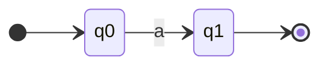

**Union `r1 + r2`** — "either r1 or r2":

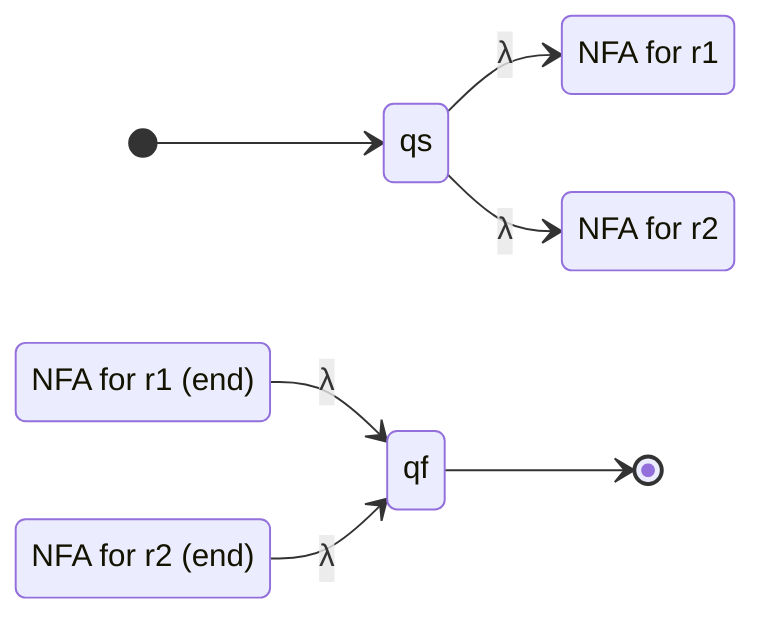

**Concatenation `r1r2`** — "r1 then r2":

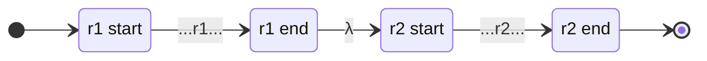

**Star `r*`** — "zero or more r":

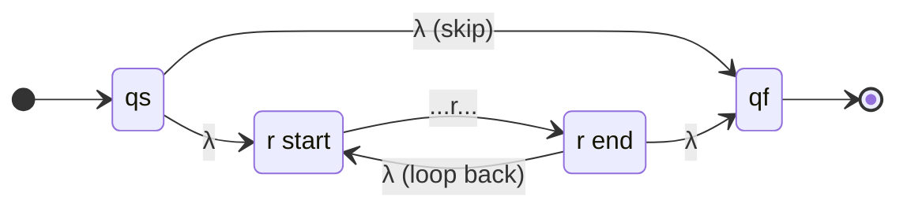

### Step-by-step procedure

```
Step 1. Parse the RE — identify the outermost operator
        Priority: star (*) first, then concatenation, then union (+)
Step 2. Recursively build NFA for each sub-expression
Step 3. Combine using the matching rule above
Step 4. Number all states q0, q1, q2, ...
Step 5. Mark the one start state (→) and one final state (double circle)
```

> [!warning] Operator priority (most to least binding)
> `*`  >  concatenation  >  `+`
> So `ab*+c` parses as `(a(b*))+c`, NOT `(ab)*(+c)`

---

### ✏️ Fully Worked Example: r1 = b(ab + b)* + a\*b

**Parse the structure first:**

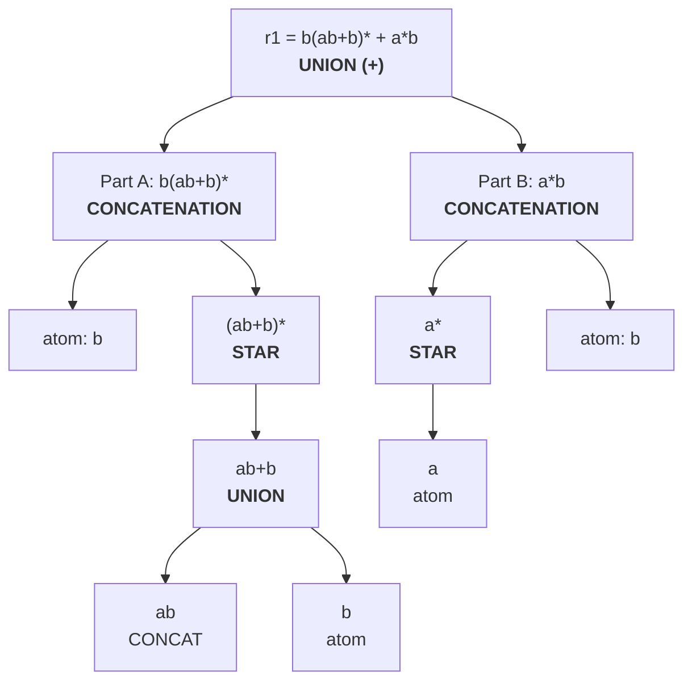

**Build Part A bottom-up:**

1. NFA for `b` (states 0–1):

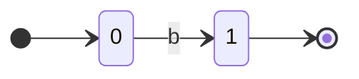

2. NFA for `ab+b` (UNION, states 2–8):

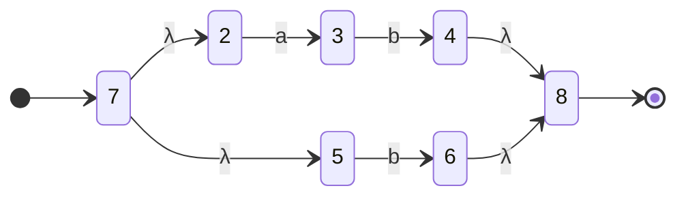

3. STAR `(ab+b)*` — wrap the union NFA (states 9–10):

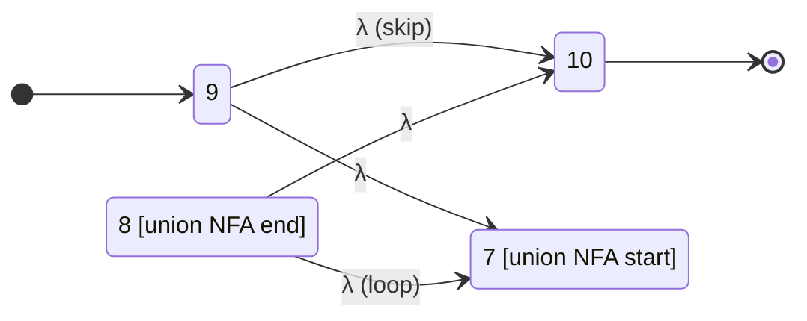

4. CONCATENATE `b · (ab+b)*` — connect state 1 → state 9 via λ:

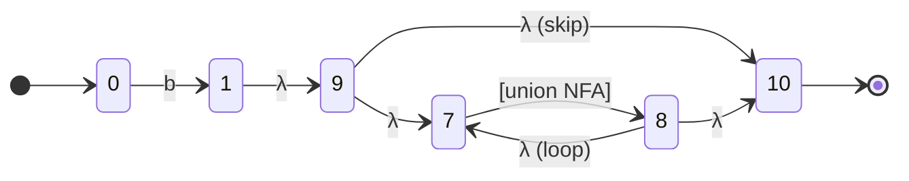

**Build Part B: `a*b`**

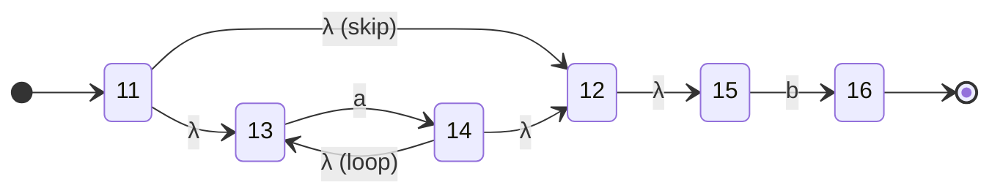

**Final UNION of Part A and Part B (states 17–18):**

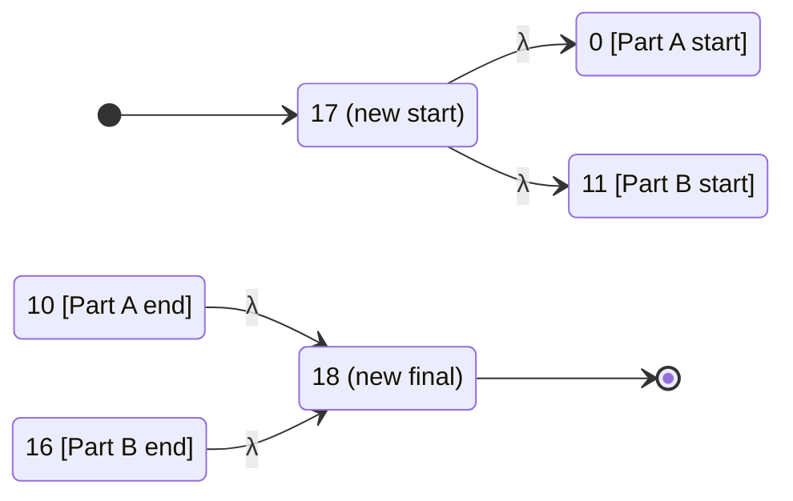

---

### ✏️ Fully Worked Example: r2 = b + a\* + b\*a\*

**Parse structure:**

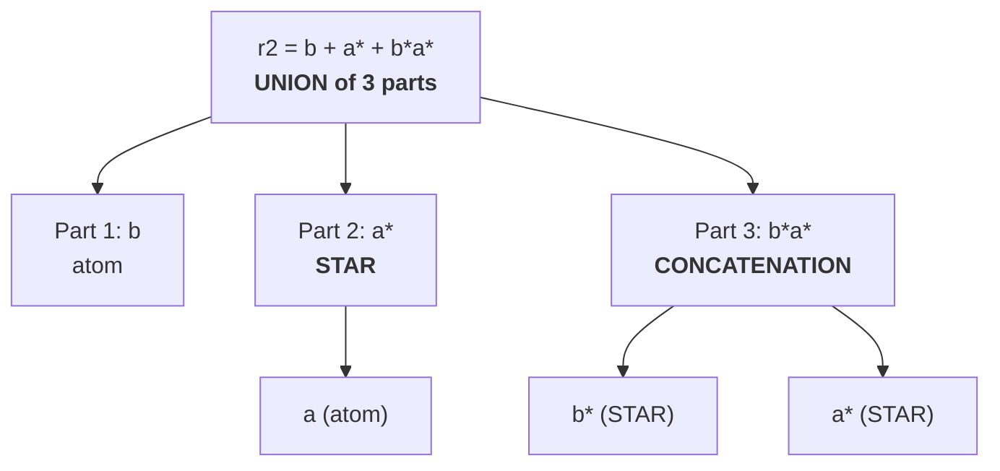

**Final UNION (new start=14, new final=15):**

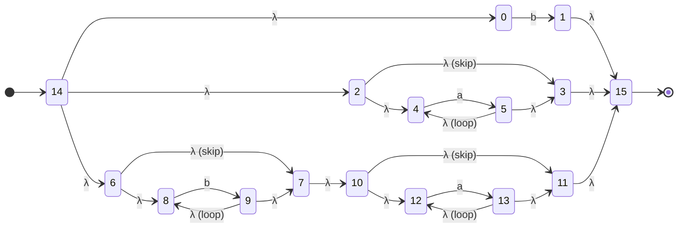

---

## PROBLEM 1B — Improve the NFA (Optimal Transition Graph / OTG)

### What you're doing
The Thompson NFA is bloated with λ-transitions. The OTG is the equivalent NFA/DFA with no λ-transitions and minimal states. You get there via **subset construction with λ-closure**.

### Key concept: λ-closure

`λ-closure(q)` = the set of ALL states you can reach from q using ONLY λ-arrows (including q itself).

### Step-by-step procedure

```
Step 1. Compute λ-closure of the start state → this is your NEW start state (a set)

Step 2. For that new state (set S) and each symbol a:
        MOVE(S, a) = all states reachable by one 'a' arrow from any state in S
        Then take λ-closure(MOVE(S, a)) → this is a new state

Step 3. Repeat Step 2 for every newly discovered state until no new states appear

Step 4. A state is FINAL if it contains any original final state

Step 5. Draw the result — states are sets, but rename them q0, q1, ... for neatness
```

> [!tip] Shortcut for the exam
> You do NOT need to mechanically compute all subsets. Look at the Thompson NFA and ask: "what can I reach from the start without reading anything?" Then trace real symbols. The answer key always gives a small clean graph — aim for 3–5 states.

---

### ✏️ Worked Example: OTG for r1 = b(ab+b)\* + a\*b

**Optimal TG (4 states):**

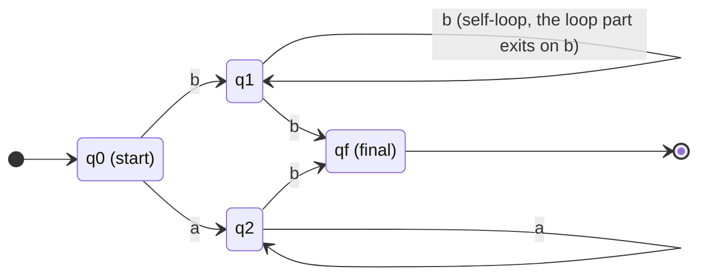

> [!note]
> q1 has self-loops on both `a` and `b` because `(ab+b)*` can consume any mix of a's and b's. It reaches final on any `b` that exits the loop.

---

### ✏️ Worked Example: OTG for r2 = b + a\* + b\*a\*

**Insight:** `a*` accepts λ, and `b*a*` accepts λ — so the start state is immediately final.

**Optimal TG (3 states):**

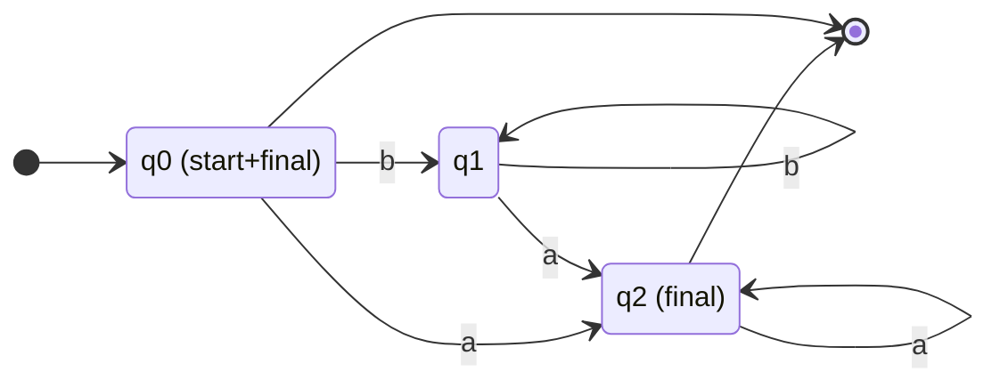

---

## PROBLEM 2 — Find Regular Expression from Automaton (State Elimination)

### What you're doing
You eliminate states one by one, labelling edges with regular expressions, until only start and final remain.

### The formula
When you eliminate state `q`:

$$\text{new edge } i \to j = r_{iq} \cdot (r_{qq})^* \cdot r_{qj}$$

### Step-by-step procedure

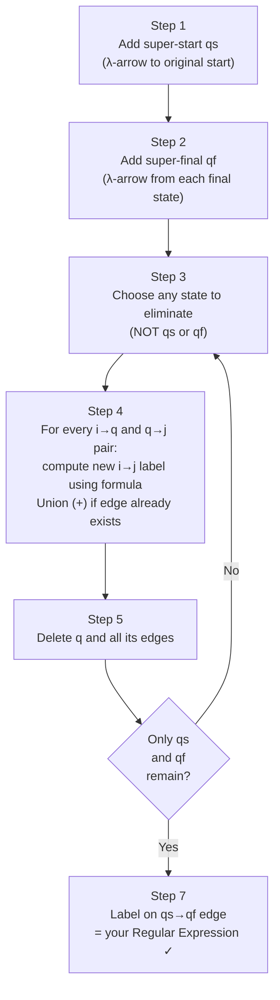

> [!tip] Eliminate states with **no self-loop** first — the formula simplifies to `r_iq · r_qj` (no star needed).

---

### ✏️ Fully Worked Example (mock exam Q2)

**The automaton:**

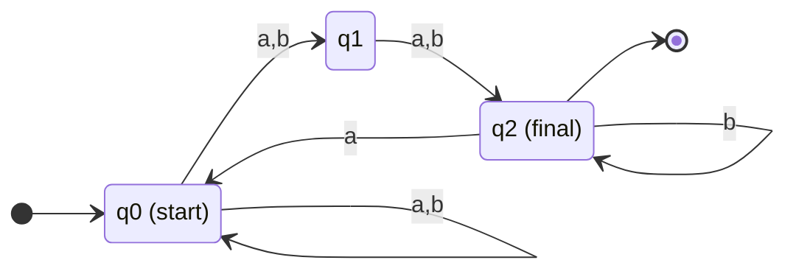

**After adding qs and qf (edge labels combined):**

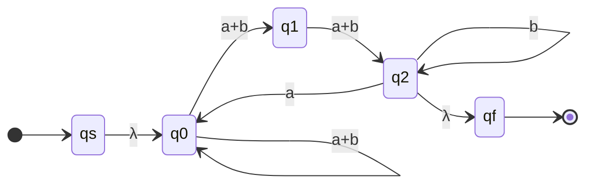

**Eliminate q1 (no self-loop):**
New edge q0 → q2 = `(a+b)(a+b)`

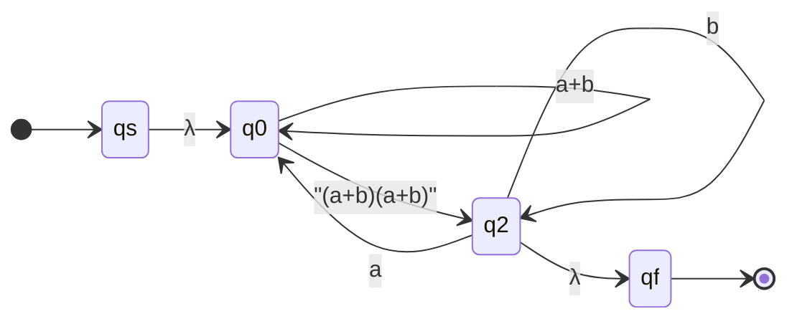

**Eliminate q0 (self-loop = `a+b`):**
- `qs → q2`: `λ · (a+b)* · (a+b)(a+b)` = `(a+b)*(a+b)(a+b)`
- `q2 → q2` new: `a · (a+b)* · (a+b)(a+b)` → combined self-loop: `b + a(a+b)*(a+b)(a+b)`

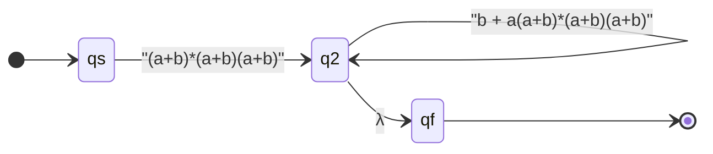

**Eliminate q2:**

$$r = (a+b)^*(a+b)^2 \cdot \Big(b + a(a+b)^*(a+b)^2\Big)^*$$

---

## PROBLEM 3 — Is This Grammar Ambiguous?

### Step-by-step procedure

```mermaid
flowchart TD
    A["Step 1<br/>Scan for variables with multiple alternatives<br/>or nullable variables"]
    B["Step 2<br/>Try short strings:<br/>a, b, ab, aa, aaa, λ"]
    C["Step 3<br/>For chosen string w:<br/>Write TWO different parse trees"]
    D{"Found 2<br/>distinct trees?"}
    E["✅ AMBIGUOUS<br/>State: w = [string] has two parse trees"]
    F["Try next string or longer string"]

    A --> B --> C --> D
    D -- Yes --> E
    D -- No --> F --> C
```

---

### ✏️ Fully Worked Example (mock exam Q3)

**Grammar:**
```
S → aSSa | A | B | ab
A → aB | b
B → aD | a | λ
D → a | aB
```
**Witness string: w = `aaa`**

**Parse Tree 1** (via `S → A`):

```mermaid
graph TD
    S1["S"] --> A1["A  (S→A)"]
    A1 --> a1["a"] & B1["B  (A→aB)"]
    B1 --> a2["a"] & D1["D  (B→aD)"]
    D1 --> a3["a  (D→a)"]
```

Derivation: S ⇒ A ⇒ aB ⇒ aaD ⇒ **aaa** ✓

**Parse Tree 2** (via `S → B`):

```mermaid
graph TD
    S2["S"] --> B2["B  (S→B)"]
    B2 --> a4["a"] & D2["D  (B→aD)"]
    D2 --> a5["a"] & B3["B  (D→aB)"]
    B3 --> a6["a  (B→a)"]
```

Derivation: S ⇒ B ⇒ aD ⇒ aaB ⇒ **aaa** ✓

**Conclusion: L(G) is ambiguous** — `w = aaa` has two distinct parse trees.

---

## PROBLEM 4 — RLG ↔ NFA ↔ LLG

### Key grammar rules

| Grammar type | Production form | Example |
|---|---|---|
| Right Linear | `A → aB` or `A → a` or `A → λ` | `S → abA`, `A → b` |
| Left Linear | `A → Ba` or `A → a` or `A → λ` | `S → Aab`, `A → b` |

### Overview of the three phases

```mermaid
flowchart LR
    RLG["Right Linear<br/>Grammar G_R"] -->|"Phase 1<br/>Variables=States<br/>Productions=Arrows"| NFA["NFA S₁"]
    NFA -->|"Phase 2<br/>Swap start↔final<br/>Reverse all arrows"| RNFA["Reversed<br/>NFA S₂"]
    RNFA -->|"Phase 3<br/>Read arrows as<br/>Left Linear rules"| LLG["Left Linear<br/>Grammar G_L"]
```

### Phase 1: RLG → NFA (translation rules)

```mermaid
flowchart LR
    subgraph "Production"
        P1["A → aB"]
        P2["A → a"]
        P3["A → λ"]
        P4["A → abB"]
    end
    subgraph "NFA Arrow"
        R1["A --a--> B"]
        R2["A --a--> F  (final state)"]
        R3["A becomes a final state"]
        R4["A --a--> (new) --b--> B"]
    end
    P1 --> R1
    P2 --> R2
    P3 --> R3
    P4 --> R4
```

### Phase 2: Reverse the NFA

```mermaid
flowchart LR
    subgraph "Original NFA S₁"
        OS["→ Old Start"] 
        OF["Old Final ◎"]
        OS -->|"a"| OF
    end
    subgraph "Reversed NFA S₂"
        NS["→ New Start<br/>(was old final)"]
        NF["New Final ◎<br/>(was old start)"]
        NF -->|"a"| NS
    end
    OF -.->|"becomes"| NS
    OS -.->|"becomes"| NF
```

---

### ✏️ Fully Worked Example (mock exam Q4)

**Phase 1 — NFA from G_R:**

```mermaid
stateDiagram-v2
    direction LR
    [*] --> S
    S --> A : b
    S --> T : a
    T --> S : b
    S --> C : a
    A --> B : a
    A --> U : a
    B --> F : b
    U --> F : b
    C --> A : a
    F --> [*]

    state "S (start)" as S
    state "T" as T
    state "A" as A
    state "B" as B
    state "C" as C
    state "U" as U
    state "F (final)" as F
```

**Phase 2 — Reversed NFA S₂** (swap start↔final, flip all arrows):

```mermaid
stateDiagram-v2
    direction LR
    [*] --> F
    F --> B : b
    F --> U : b
    B --> A : a
    U --> A : a
    A --> S : b
    A --> C : a
    C --> S : a
    T --> S : b
    S --> T : a
    S --> [*]

    state "F (new start)" as F
    state "S (new final)" as S
```

**Phase 3 — Read as Left Linear Grammar G_L:**

- `F → b` (new start, terminal only)
- `B → Fb` ... read reversed arrows as `X → Ya` means seeing `Y --a--> X`
- Final LLG (F is start variable):

```
F → bb | b | aA      (start variable)
B → Fa
A → bS | aC
C → aS
S → baS
```

---

## PROBLEM 5 — Is It an s-grammar?

### Definition

A CFG is an **s-grammar** if and only if **BOTH** conditions hold:
1. Every production `A → aα` — **starts with a terminal**
2. For each pair `(A, a)`, there is **at most one** production

### Decision procedure

```mermaid
flowchart TD
    A["For each variable A,<br/>list the first symbol of each production"]
    B{"Any production<br/>starts with a<br/>non-terminal or λ?"}
    C["❌ FAILS condition 1<br/>NOT an s-grammar<br/>(cite the offending production)"]
    D{"Any (variable, terminal)<br/>pair appears in<br/>2+ productions?"}
    E["❌ FAILS condition 2<br/>NOT an s-grammar<br/>(cite the duplicate pair)"]
    F["✅ IS an s-grammar"]

    A --> B
    B -- Yes --> C
    B -- No --> D
    D -- Yes --> E
    D -- No --> F
```

---

### ✏️ Worked Examples (mock exam Q5)

**a) S → aBD | bC | aD; B → a; C → bD | b; D → b**

| Variable | Productions | First symbols | Verdict |
|---|---|---|---|
| S | aBD, bC, aD | a, b, **a** | ❌ (S,a) twice |
| B | a | a | ✓ |
| C | bD, b | **b, b** | ❌ (C,b) twice |
| D | b | b | ✓ |

**→ NOT an s-grammar** — (S,a) and (C,b) both duplicated.

**b) S → aS | B; B → a**

| Variable | Productions | First symbols | Verdict |
|---|---|---|---|
| S | aS, **B** | a, **B** ← variable! | ❌ condition 1 |
| B | a | a | ✓ |

**→ NOT an s-grammar** — `S → B` starts with a variable.

**c) S → bAB | aB; A → aA | b**

| Variable | Productions | First symbols | Verdict |
|---|---|---|---|
| S | bAB, aB | b, a | ✓ |
| A | aA, b | a, b | ✓ |

**→ IS an s-grammar** ✓ — Pairs: (S,b), (S,a), (A,a), (A,b) each unique.

**d) S → c | cDD | bAD; A → aD | b; D → b**

| Variable | Productions | First symbols | Verdict |
|---|---|---|---|
| S | c, cDD, bAD | **c, c**, b | ❌ (S,c) twice |
| A | aD, b | a, b | ✓ |
| D | b | b | ✓ |

**→ NOT an s-grammar** — (S,c) appears for both `S → c` and `S → cDD`.

---

## PROBLEM 6A — Simplify a CFG (λ → unit → useless, in that order)

### The three passes — mandatory order

```mermaid
flowchart LR
    G["Original<br/>Grammar G"]
    P1["Pass 1<br/>Remove λ-productions"]
    P2["Pass 2<br/>Remove unit productions<br/>(A → B)"]
    P3["Pass 3<br/>Remove useless productions"]
    Gp["Simplified<br/>Grammar G'"]

    G --> P1 --> P2 --> P3 --> Gp

    style P1 fill:#fef3c7
    style P2 fill:#dbeafe
    style P3 fill:#dcfce7
```

### Pass 1: Remove λ-productions

```mermaid
flowchart TD
    A["Round 1: Mark X nullable if X → λ exists"]
    B["Round 2: Mark X nullable if X → Y₁Y₂…Yₙ<br/>and ALL Yᵢ already marked nullable"]
    C{"Any new<br/>nullables<br/>found?"}
    D["For each production, generate new productions<br/>by removing each subset of nullable variables"]
    E["Delete all X → λ productions<br/>(keep S → λ only if λ ∈ L(G))"]

    A --> B --> C
    C -- Yes --> B
    C -- No --> D --> E
```

### Pass 2: Remove unit productions

```mermaid
flowchart TD
    A["Base unit pairs: (A,A) for all variables"]
    B["If (A,B) is a pair and B→C is unit:<br/>add (A,C)"]
    C{"New pairs<br/>found?"}
    D["For each unit pair (A,B):<br/>copy all non-unit productions of B to A"]
    E["Delete all unit productions A → B"]

    A --> B --> C
    C -- Yes --> B
    C -- No --> D --> E
```

### Pass 3: Remove useless productions

```mermaid
flowchart LR
    subgraph "Case 1: Non-generating"
        G1["Mark X 'generating' if<br/>X → terminal string"]
        G2["Mark X 'generating' if<br/>X → α where all symbols<br/>in α are generating/terminal"]
        G3["Remove all non-generating<br/>variables and their productions"]
        G1 --> G2 --> G3
    end
    subgraph "Case 2: Non-reachable"
        R1["S is reachable"]
        R2["If A is reachable and A→α:<br/>mark all variables in α reachable"]
        R3["Remove all non-reachable<br/>variables and their productions"]
        R1 --> R2 --> R3
    end
```

---

### ✏️ Fully Worked Example (mock exam Q6a)

**Original grammar G:**
```
S → aS | A | aBD | c
A → bAD | λ
B → bC | C
C → AcDD | D
D → a | λ
E → b
```

**Pass 1 — Nullable variables:**

```mermaid
graph LR
    R1["Round 1:<br/>A (A→λ)<br/>D (D→λ)"]
    R2["Round 2:<br/>C (C→D, D nullable)<br/>B (B→C, C nullable)"]
    R3["Round 3:<br/>S (S→A, A nullable)"]
    R1 --> R2 --> R3
    R3 --> DONE["Nullable = {A, D, C, B, S}"]
```

**Grammar after Pass 1 (P₁):**
```
S → aS | a | A | aBD | aD | aB | c
A → bAD | bA | bD | b
B → bC | b | C
C → AcDD | cDD | AcD | Ac | cD | c
D → a
E → b
```

**Pass 2 — Unit pairs and resolutions:**

```mermaid
graph TD
    UP["Unit productions: S→A, B→C"]
    PA["(S,A): copy A's non-unit productions to S<br/>→ S gains: bAD, bA, bD, b"]
    PB["(B,C): copy C's non-unit productions to B<br/>→ B gains: AcDD, cDD, AcD, Ac, cD, c"]
    DEL["Delete S→A and B→C"]
    UP --> PA & PB --> DEL
```

**Grammar after Pass 2 (P₂):**
```
S → aS | a | aBD | aD | aB | c | bAD | bA | bD | b
A → bAD | bA | bD | b
B → bC | b | AcDD | cDD | AcD | Ac | cD | c
C → AcDD | cDD | AcD | Ac | cD | c
D → a
E → b
```

**Pass 3 — Useless variables:**

```mermaid
graph LR
    GEN["All variables generate ✓<br/>(D→a, E→b, A→b, B→b, C→c, S→a)"]
    REA["Reachable from S:<br/>S ✓, A ✓, B ✓, C ✓, D ✓"]
    UNREA["E is NEVER mentioned<br/>in any production → NOT reachable"]
    REM["Remove E → b"]
    GEN --> REA --> UNREA --> REM
```

**Final simplified grammar G':**
```
S → aS | a | aBD | aD | aB | c | bAD | bA | bD | b
A → bAD | bA | bD | b
B → bC | b | AcDD | cDD | AcD | Ac | cD | c
C → AcDD | cDD | AcD | Ac | cD | c
D → a
```

---

## PROBLEM 6B — Convert to Chomsky Normal Form (CNF)

### What you're doing
Every production must be exactly:
- `A → BC` (exactly two non-terminals), OR
- `A → a` (exactly one terminal)

### Step-by-step procedure

```mermaid
flowchart TD
    A["Step 1: For every terminal 'a' appearing in<br/>a RHS of length ≥ 2:<br/>• Introduce Bₐ → a<br/>• Replace 'a' in long RHS with Bₐ"]
    B["Step 2: For every RHS of length ≥ 3:<br/>chain it into pairs using new variables<br/>A → X₁X₂X₃X₄<br/>  becomes: A → X₁D₁<br/>           D₁ → X₂D₂<br/>           D₂ → X₃X₄"]
    C["Step 3: Productions of length 1 (A→a)<br/>and length 2 (A→BC) are already fine"]

    A --> B --> C
```

> [!warning]
> `S → a` (length 1, all terminal) is already in CNF — do NOT touch it. Only productions of length ≥ 2 with terminals need modification.

### ✏️ Worked Example (from G')

```mermaid
graph TD
    TERM["Introduce terminal variables:<br/>Bₐ → a<br/>Bb → b<br/>Bc → c"]
    EX1["S → aS (length 2 with terminal):<br/>replace a → S → BₐS ✓"]
    EX2["S → aBD (length 3):<br/>S → BₐBD → introduce D₁→BD<br/>⟹ S → BₐD₁, D₁ → BD"]
    EX3["A → bAD (length 3):<br/>A → BbAD → introduce D₂→AD<br/>⟹ A → BbD₂, D₂ → AD"]
    EX4["B → AcDD (length 4):<br/>B → ABcDD → chain:<br/>B → AD₃, D₃ → BcD₄, D₄ → DD"]
    TERM --> EX1 & EX2 & EX3 & EX4
```

---

## PROBLEM 6C — Convert to Greibach Normal Form (GNF)

### What you're doing
Every production must start with a terminal:
- `A → a` ✓
- `A → aBC` ✓
- `A → AB` ✗ (starts with non-terminal — not allowed)

### Step-by-step procedure

```mermaid
flowchart TD
    A["Step 1: Start from simplified grammar G'"]
    B["Step 2: For every production starting<br/>with a non-terminal:<br/>A → Bα and B → b₁β₁ | b₂β₂ | …<br/>Substitute: A → b₁β₁α | b₂β₂α | …"]
    C{"Every RHS<br/>starts with<br/>a terminal?"}
    D["Step 3: Handle left recursion if needed:<br/>A → Aα | β  becomes:<br/>A → βA'<br/>A' → αA' | α"]
    DONE["✅ Grammar is in GNF"]

    A --> B --> C
    C -- No --> B
    C -- Yes --> D --> DONE
```

---

## PROBLEM 6D — Build NPDA from GNF Grammar

### What you're doing
Given a GNF grammar, mechanically write the NPDA. It always has exactly **3 states**.

### The fixed template (memorise this)

```mermaid
stateDiagram-v2
    direction LR
    [*] --> q0
    q0 --> q1 : λ, Z / SZ<br/>(push start variable)
    q1 --> q1 : a, A / α<br/>(for each rule A→aα)
    q1 --> q2 : λ, Z / λ<br/>(stack empty → accept)
    q2 --> [*]

    state "q₀ (start)" as q0
    state "q₁ (working)" as q1
    state "q₂ (final)" as q2
```

> [!warning] Stack push order
> `δ(q₁, a, A) = (q₁, XY)` means **X is on top**. Write left-to-right as in the grammar production.

---

### ✏️ Fully Worked Example (mock exam Q6d)

**GNF Grammar:**
```
S → aA | bBD | c
A → a
B → bD
D → a
```

**NPDA transition diagram:**

```mermaid
stateDiagram-v2
    direction LR
    [*] --> q0
    q0 --> q1 : "λ, Z/SZ"
    q1 --> q1 : "a, S/A"
    q1 --> q1 : "b, S/BD"
    q1 --> q1 : "c, S/λ"
    q1 --> q1 : "a, A/λ"
    q1 --> q1 : "b, B/D"
    q1 --> q1 : "a, D/λ"
    q1 --> q2 : "λ, Z/λ"
    q2 --> [*]

    state "q₀" as q0
    state "q₁" as q1
    state "q₂ (final)" as q2
```

**Transition function:**
```
δ(q₀, λ, Z)  = (q₁, SZ)     ← always first

δ(q₁, a, S)  = (q₁, A)      ← S → aA
δ(q₁, b, S)  = (q₁, BD)     ← S → bBD  (B on top)
δ(q₁, c, S)  = (q₁, λ)      ← S → c

δ(q₁, a, A)  = (q₁, λ)      ← A → a
δ(q₁, b, B)  = (q₁, D)      ← B → bD
δ(q₁, a, D)  = (q₁, λ)      ← D → a

δ(q₁, λ, Z)  = (q₂, λ)      ← always last
```

**Trace — input `"c"` (accepted):**

```mermaid
sequenceDiagram
    participant Input
    participant State
    participant Stack

    Note over State,Stack: Initial
    State->>Stack: q₀, Z
    Note over State,Stack: δ(q₀,λ,Z)=(q₁,SZ)
    State->>Stack: q₁, SZ
    Input->>State: read 'c'
    Note over State,Stack: δ(q₁,c,S)=(q₁,λ) → pop S
    State->>Stack: q₁, Z
    Note over State,Stack: δ(q₁,λ,Z)=(q₂,λ) → ACCEPT ✓
    State->>Stack: q₂, ∅
```

---

## QUICK REFERENCE — One-Line Summaries

| Problem | What to do | Key thing to remember |
|---|---|---|
| **1A** NFA from RE | Bottom-up: atom → concat → union → star | Star adds back-loop AND skip-λ |
| **1B** Improve NFA | Compute λ-closure of each state, run subset construction | Start state = λ-closure(q₀) |
| **2** RE from automaton | State elimination: kill one state at a time | Formula: `r_iq · (r_qq)* · r_qj` |
| **3** Ambiguity | Find 1 string with 2 parse trees | Try "a", "aa", "aaa" first |
| **4** RLG→NFA→LLG | Variables=states → reverse arrows → re-read as LLG | Variable goes LEFT in LLG |
| **5** s-grammar | Check: starts with terminal AND no duplicate (Var, terminal) pairs | A→B (unit) instantly fails |
| **6a** Simplify | λ-nullable → unit pairs → useless (ALWAYS this order) | S stays if S was nullable |
| **6b** CNF | Bₐ for each terminal in long RHS; chain vars for length ≥ 3 | A→a and A→BC are the only legal forms |
| **6c** GNF | Substitute until every RHS starts with terminal | A→Bα: replace using B's productions |
| **6d** NPDA | 3-state template; one δ line per GNF production | δ(q₀,λ,Z)=(q₁,SZ) always first |

---

## COMMON EXAM MISTAKES

> [!warning] Do NOT make these mistakes
> 1. **λ-closure is transitive** — if q→p via λ and p→r via λ, then r is in λ-closure(q). Keep chaining.
> 2. **Nullable propagation** — if D→λ and C→D (unit), then C is nullable. Unit steps count.
> 3. **Unit pair closure** — if (S,A) and (A,B) are unit pairs, then (S,B) is also a unit pair.
> 4. **s-grammar with units** — `A → B` (unit production) automatically fails s-grammar (B is not a terminal).
> 5. **State elimination self-loop** — if no self-loop exists on the eliminated state, use `r* = λ* = λ` — i.e., just omit the star, write `r_iq · r_qj` directly.
> 6. **LLG direction** — `A → aB` (RLG) reverses to `B → Aa` (LLG), NOT `B → aA`.
> 7. **CNF terminal rule** — `A → a` (single terminal) is ALREADY in CNF. Don't introduce Bₐ for it — only for terminals inside longer productions.
> 8. **NPDA stack push order** — `δ(q₁, a, A) = (q₁, XY)` means X is top of stack. Write the string left-to-right as it appears in the grammar production.
> 9. **GNF substitution direction** — substitute FROM the variable that starts the RHS INTO the production. A → Bα: look up B's productions, substitute each in.
> 10. **Simplification order** — MUST be λ first, then unit, then useless. Doing unit before λ will give wrong results.
